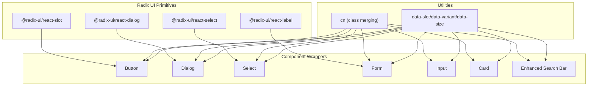
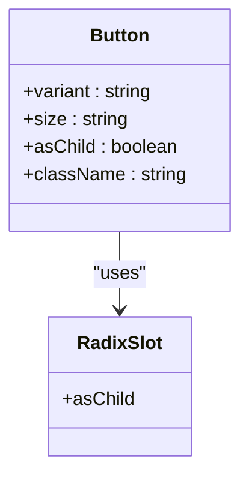
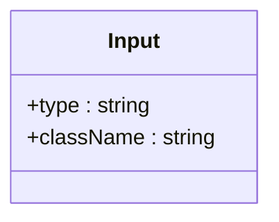
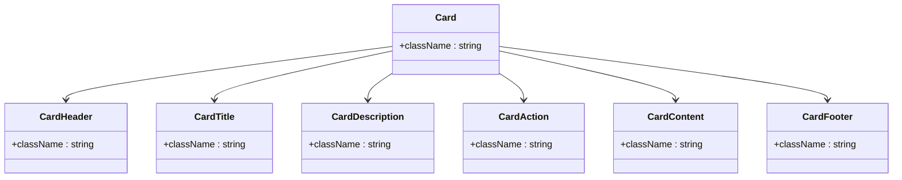
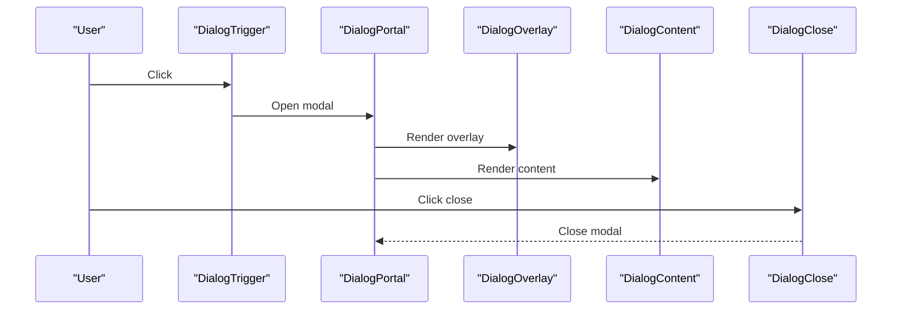
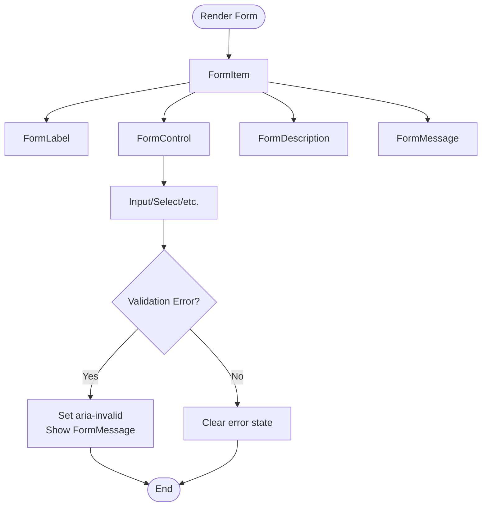
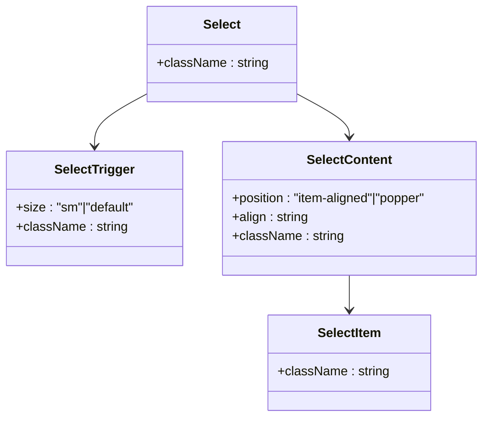
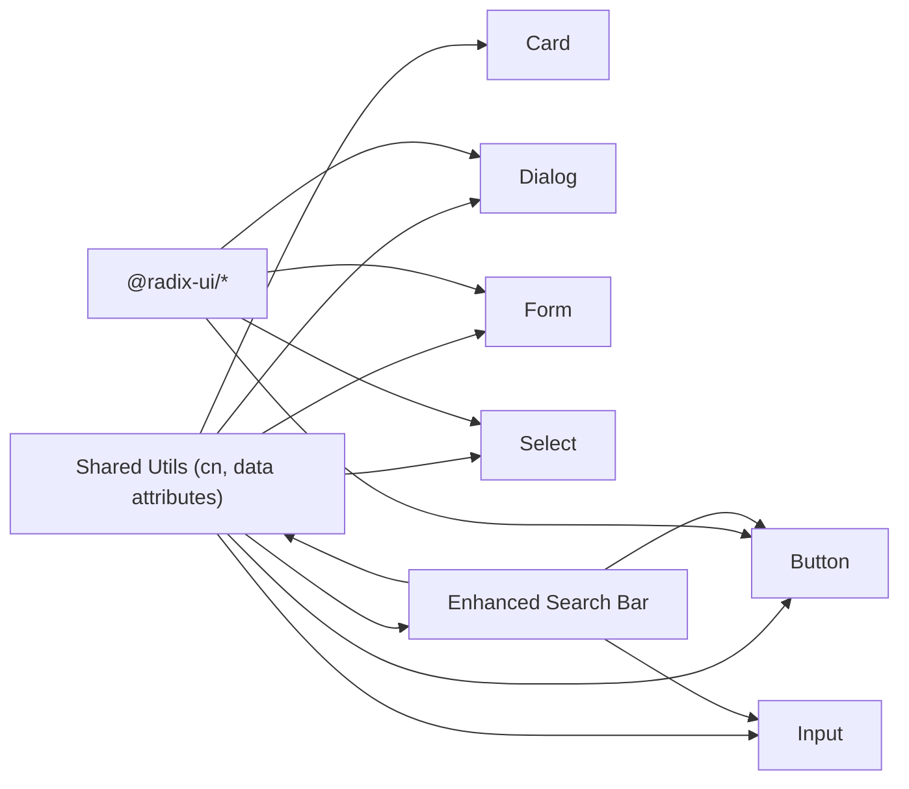

# Shared UI Components

<cite>
**Referenced Files in This Document**
- [admin/src/components/ui/button.tsx](file://admin/src/components/ui/button.tsx)
- [web/src/components/ui/button.tsx](file://web/src/components/ui/button.tsx)
- [landing/src/components/ui/button.tsx](file://landing/src/components/ui/button.tsx)
- [admin/src/components/ui/input.tsx](file://admin/src/components/ui/input.tsx)
- [web/src/components/ui/input.tsx](file://web/src/components/ui/input.tsx)
- [admin/src/components/ui/card.tsx](file://admin/src/components/ui/card.tsx)
- [web/src/components/ui/card.tsx](file://web/src/components/ui/card.tsx)
- [landing/src/components/ui/card.tsx](file://landing/src/components/ui/card.tsx)
- [admin/src/components/ui/dialog.tsx](file://admin/src/components/ui/dialog.tsx)
- [web/src/components/ui/dialog.tsx](file://web/src/components/ui/dialog.tsx)
- [admin/src/components/ui/form.tsx](file://admin/src/components/ui/form.tsx)
- [web/src/components/ui/form.tsx](file://web/src/components/ui/form.tsx)
- [admin/src/components/ui/select.tsx](file://admin/src/components/ui/select.tsx)
- [web/src/components/ui/select.tsx](file://web/src/components/ui/select.tsx)
- [admin/src/components/ui/textarea.tsx](file://admin/src/components/ui/textarea.tsx)
- [web/src/components/ui/textarea.tsx](file://web/src/components/ui/textarea.tsx)
- [admin/src/components/ui/badge.tsx](file://admin/src/components/ui/badge.tsx)
- [web/src/components/ui/badge.tsx](file://web/src/components/ui/badge.tsx)
- [admin/src/components/ui/avatar.tsx](file://admin/src/components/ui/avatar.tsx)
- [web/src/components/ui/avatar.tsx](file://web/src/components/ui/avatar.tsx)
- [admin/src/components/ui/separator.tsx](file://admin/src/components/ui/separator.tsx)
- [web/src/components/ui/separator.tsx](file://web/src/components/ui/separator.tsx)
- [admin/src/components/ui/switch.tsx](file://admin/src/components/ui/switch.tsx)
- [web/src/components/ui/switch.tsx](file://web/src/components/ui/switch.tsx)
- [admin/src/components/ui/progress.tsx](file://admin/src/components/ui/progress.tsx)
- [web/src/components/ui/progress.tsx](file://web/src/components/ui/progress.tsx)
- [admin/src/components/ui/table.tsx](file://admin/src/components/ui/table.tsx)
- [web/src/components/ui/table.tsx](file://web/src/components/ui/table.tsx)
- [admin/src/components/ui/pagination.tsx](file://admin/src/components/ui/pagination.tsx)
- [web/src/components/ui/pagination.tsx](file://web/src/components/ui/pagination.tsx)
- [admin/src/components/ui/hover-card.tsx](file://admin/src/components/ui/hover-card.tsx)
- [web/src/components/ui/hover-card.tsx](file://web/src/components/ui/hover-card.tsx)
- [admin/src/components/ui/popover.tsx](file://admin/src/components/ui/popover.tsx)
- [web/src/components/ui/popover.tsx](file://web/src/components/ui/popover.tsx)
- [admin/src/components/ui/dropdown-menu.tsx](file://admin/src/components/ui/dropdown-menu.tsx)
- [web/src/components/ui/dropdown-menu.tsx](file://web/src/components/ui/dropdown-menu.tsx)
- [admin/src/components/ui/chart.tsx](file://admin/src/components/ui/chart.tsx)
- [web/src/components/ui/chart.tsx](file://web/src/components/ui/chart.tsx)
- [admin/src/components/ui/skeleton.tsx](file://admin/src/components/ui/skeleton.tsx)
- [web/src/components/ui/skeleton.tsx](file://web/src/components/ui/skeleton.tsx)
- [admin/src/components/ui/toast.tsx](file://admin/src/components/ui/toast.tsx)
- [web/src/components/ui/toast.tsx](file://web/src/components/ui/toast.tsx)
- [admin/src/components/ui/toaster.tsx](file://admin/src/components/ui/toaster.tsx)
- [web/src/components/ui/toaster.tsx](file://web/src/components/ui/toaster.tsx)
- [admin/src/components/ui/accordion.tsx](file://admin/src/components/ui/accordion.tsx)
- [web/src/components/ui/accordion.tsx](file://web/src/components/ui/accordion.tsx)
- [admin/src/components/ui/calendar.tsx](file://admin/src/components/ui/calendar.tsx)
- [web/src/components/ui/calendar.tsx](file://web/src/components/ui/calendar.tsx)
- [admin/src/components/ui/alert-dialog.tsx](file://admin/src/components/ui/alert-dialog.tsx)
- [web/src/components/ui/alert-dialog.tsx](file://web/src/components/ui/alert-dialog.tsx)
- [admin/src/components/ui/drawer.tsx](file://admin/src/components/ui/drawer.tsx)
- [web/src/components/ui/drawer.tsx](file://web/src/components/ui/drawer.tsx)
- [admin/src/components/ui/tooltip.tsx](file://admin/src/components/ui/tooltip.tsx)
- [web/src/components/ui/tooltip.tsx](file://web/src/components/ui/tooltip.tsx)
- [admin/src/components/ui/spinner.tsx](file://admin/src/components/ui/spinner.tsx)
- [web/src/components/ui/spinner.tsx](file://web/src/components/ui/spinner.tsx)
- [admin/src/components/ui/checkbox.tsx](file://admin/src/components/ui/checkbox.tsx)
- [web/src/components/ui/checkbox.tsx](file://web/src/components/ui/checkbox.tsx)
- [admin/src/components/ui/radio-group.tsx](file://admin/src/components/ui/radio-group.tsx)
- [web/src/components/ui/radio-group.tsx](file://web/src/components/ui/radio-group.tsx)
- [admin/src/components/ui/field.tsx](file://admin/src/components/ui/field.tsx)
- [web/src/components/ui/field.tsx](file://web/src/components/ui/field.tsx)
- [admin/src/components/ui/button-group.tsx](file://admin/src/components/ui/button-group.tsx)
- [web/src/components/ui/button-group.tsx](file://web/src/components/ui/button-group.tsx)
- [admin/src/components/ui/FileInput.tsx](file://admin/src/components/ui/FileInput.tsx)
- [web/src/components/ui/FileInput.tsx](file://web/src/components/ui/FileInput.tsx)
- [admin/src/components/ui/input-otp.tsx](file://admin/src/components/ui/input-otp.tsx)
- [web/src/components/ui/input-otp.tsx](file://web/src/components/ui/input-otp.tsx)
- [admin/src/components/ui/label.tsx](file://admin/src/components/ui/label.tsx)
- [web/src/components/ui/label.tsx](file://web/src/components/ui/label.tsx)
- [admin/src/lib/utils.ts](file://admin/src/lib/utils.ts)
- [web/src/lib/utils.ts](file://web/src/lib/utils.ts)
- [landing/src/lib/utils.ts](file://landing/src/lib/utils.ts)
- [admin/src/constants/styles.ts](file://admin/src/constants/styles.ts)
- [web/src/constants/styles.ts](file://web/src/constants/styles.ts)
- [landing/src/constants/styles.ts](file://landing/src/constants/styles.ts)
- [web/src/app/(root)/(app)/page.tsx](file://web/src/app/(root)/(app)/page.tsx)
- [admin/src/pages/BannedWordsPage.tsx](file://admin/src/pages/BannedWordsPage.tsx)
</cite>

## Update Summary
**Changes Made**
- Enhanced search bar component documentation with improved styling patterns
- Added detailed analysis of responsive padding and visual feedback improvements
- Updated focus states documentation with group-focus-within patterns
- Expanded styling examples with practical implementation details
- Added comprehensive examples of search bar integration across applications

## Table of Contents
1. [Introduction](#introduction)
2. [Project Structure](#project-structure)
3. [Core Components](#core-components)
4. [Architecture Overview](#architecture-overview)
5. [Detailed Component Analysis](#detailed-component-analysis)
6. [Enhanced Search Bar Component](#enhanced-search-bar-component)
7. [Dependency Analysis](#dependency-analysis)
8. [Performance Considerations](#performance-considerations)
9. [Troubleshooting Guide](#troubleshooting-guide)
10. [Conclusion](#conclusion)
11. [Appendices](#appendices)

## Introduction
This document describes the shared UI component library used across the admin, web, and landing frontend applications. It explains how Radix UI primitives are integrated, how custom components are built, and how styling is standardized via Tailwind classes and shared utilities. It covers form components, input controls, buttons, cards, dialogs, and other reusable elements, detailing props, customization options, theming support, accessibility, responsiveness, and cross-application consistency. It also provides usage examples, integration guidelines, and best practices for extending the component library.

**Updated** Enhanced documentation now includes comprehensive coverage of the improved search bar component with advanced styling patterns and responsive design features.

## Project Structure
The UI components are organized under each application's components directory, grouped by feature and UI concerns. Each application defines its own variants and styling patterns while sharing common building blocks and utilities.

```mermaid
graph TB
subgraph "Admin"
A_btn["Button"]
A_input["Input"]
A_card["Card"]
A_dialog["Dialog"]
A_form["Form"]
A_select["Select"]
A_search["Enhanced Search Bar"]
end
subgraph "Web"
W_btn["Button"]
W_input["Input"]
W_card["Card"]
W_dialog["Dialog"]
W_form["Form"]
W_select["Select"]
W_search["Enhanced Search Bar"]
end
subgraph "Landing"
L_btn["Button"]
L_input["Input"]
L_card["Card"]
L_dialog["Dialog"]
L_form["Form"]
L_select["Select"]
end
U_utils["Shared Utilities"]
S_styles["Shared Styles"]
A_btn --- U_utils
W_btn --- U_utils
L_btn --- U_utils
A_input --- U_utils
W_input --- U_utils
L_input --- U_utils
A_card --- U_utils
W_card --- U_utils
L_card --- U_utils
A_dialog --- U_utils
W_dialog --- U_utils
L_dialog --- U_utils
A_form --- U_utils
W_form --- U_utils
L_form --- U_utils
A_select --- U_utils
W_select --- U_utils
L_select --- U_utils
A_search --- U_utils
W_search --- U_utils
A_search --- S_styles
W_search --- S_styles
```



**Diagram sources**
- [admin/src/components/ui/button.tsx](file://admin/src/components/ui/button.tsx#L1-L58)
- [web/src/components/ui/button.tsx](file://web/src/components/ui/button.tsx#L1-L68)
- [landing/src/components/ui/button.tsx](file://landing/src/components/ui/button.tsx#L1-L62)
- [admin/src/components/ui/input.tsx](file://admin/src/components/ui/input.tsx#L1-L23)
- [web/src/components/ui/input.tsx](file://web/src/components/ui/input.tsx#L1-L22)
- [admin/src/components/ui/card.tsx](file://admin/src/components/ui/card.tsx#L1-L77)
- [web/src/components/ui/card.tsx](file://web/src/components/ui/card.tsx#L1-L93)
- [landing/src/components/ui/card.tsx](file://landing/src/components/ui/card.tsx#L1-L93)
- [admin/src/components/ui/dialog.tsx](file://admin/src/components/ui/dialog.tsx#L1-L121)
- [web/src/components/ui/dialog.tsx](file://web/src/components/ui/dialog.tsx#L1-L159)
- [admin/src/components/ui/form.tsx](file://admin/src/components/ui/form.tsx#L1-L177)
- [web/src/components/ui/form.tsx](file://web/src/components/ui/form.tsx#L1-L169)
- [admin/src/components/ui/select.tsx](file://admin/src/components/ui/select.tsx#L1-L158)
- [web/src/components/ui/select.tsx](file://web/src/components/ui/select.tsx#L1-L191)
- [web/src/app/(root)/(app)/page.tsx](file://web/src/app/(root)/(app)/page.tsx#L119-L149)
- [admin/src/pages/BannedWordsPage.tsx](file://admin/src/pages/BannedWordsPage.tsx#L190-L203)

**Section sources**
- [admin/src/components/ui/button.tsx](file://admin/src/components/ui/button.tsx#L1-L58)
- [web/src/components/ui/button.tsx](file://web/src/components/ui/button.tsx#L1-L68)
- [landing/src/components/ui/button.tsx](file://landing/src/components/ui/button.tsx#L1-L62)
- [admin/src/components/ui/input.tsx](file://admin/src/components/ui/input.tsx#L1-L23)
- [web/src/components/ui/input.tsx](file://web/src/components/ui/input.tsx#L1-L22)
- [admin/src/components/ui/card.tsx](file://admin/src/components/ui/card.tsx#L1-L77)
- [web/src/components/ui/card.tsx](file://web/src/components/ui/card.tsx#L1-L93)
- [landing/src/components/ui/card.tsx](file://landing/src/components/ui/card.tsx#L1-L93)
- [admin/src/components/ui/dialog.tsx](file://admin/src/components/ui/dialog.tsx#L1-L121)
- [web/src/components/ui/dialog.tsx](file://web/src/components/ui/dialog.tsx#L1-L159)
- [admin/src/components/ui/form.tsx](file://admin/src/components/ui/form.tsx#L1-L177)
- [web/src/components/ui/form.tsx](file://web/src/components/ui/form.tsx#L1-L169)
- [admin/src/components/ui/select.tsx](file://admin/src/components/ui/select.tsx#L1-L158)
- [web/src/components/ui/select.tsx](file://web/src/components/ui/select.tsx#L1-L191)

## Core Components
This section summarizes the most commonly used components and their responsibilities.

- Buttons: Provide consistent interaction affordances with variant and size options, integrating Radix UI slots for composition.
- Inputs: Standardized text inputs with focus states, invalid states, and responsive sizing.
- Cards: Semantic containers for grouping content with header, title, description, action, content, and footer slots.
- Dialogs: Modal overlays leveraging Radix UI with optional close buttons and responsive layouts.
- Forms: A form system built on react-hook-form with accessible labels, descriptions, and messages.
- Select: A customizable dropdown with trigger, content, items, separators, and scroll buttons.
- **Search Bars**: Enhanced input components with integrated icons, responsive padding, focus states, and visual feedback indicators.

**Updated** Added comprehensive coverage of the enhanced search bar component with improved styling patterns and responsive design features.

**Section sources**
- [admin/src/components/ui/button.tsx](file://admin/src/components/ui/button.tsx#L37-L57)
- [web/src/components/ui/button.tsx](file://web/src/components/ui/button.tsx#L41-L67)
- [landing/src/components/ui/button.tsx](file://landing/src/components/ui/button.tsx#L40-L61)
- [admin/src/components/ui/input.tsx](file://admin/src/components/ui/input.tsx#L5-L22)
- [web/src/components/ui/input.tsx](file://web/src/components/ui/input.tsx#L5-L21)
- [admin/src/components/ui/card.tsx](file://admin/src/components/ui/card.tsx#L5-L76)
- [web/src/components/ui/card.tsx](file://web/src/components/ui/card.tsx#L5-L92)
- [landing/src/components/ui/card.tsx](file://landing/src/components/ui/card.tsx#L5-L92)
- [admin/src/components/ui/dialog.tsx](file://admin/src/components/ui/dialog.tsx#L7-L120)
- [web/src/components/ui/dialog.tsx](file://web/src/components/ui/dialog.tsx#L10-L158)
- [admin/src/components/ui/form.tsx](file://admin/src/components/ui/form.tsx#L16-L176)
- [web/src/components/ui/form.tsx](file://web/src/components/ui/form.tsx#L19-L168)
- [admin/src/components/ui/select.tsx](file://admin/src/components/ui/select.tsx#L7-L157)
- [web/src/components/ui/select.tsx](file://web/src/components/ui/select.tsx#L9-L190)

## Architecture Overview
The component library follows a pattern:
- Each application defines its own component variants and styling tokens.
- Shared utilities (cn, data attributes) unify styling and accessibility.
- Radix UI primitives are wrapped to add consistent styling and accessibility.



**Diagram sources**
- [admin/src/components/ui/button.tsx](file://admin/src/components/ui/button.tsx#L1-L58)
- [web/src/components/ui/button.tsx](file://web/src/components/ui/button.tsx#L1-L68)
- [admin/src/components/ui/dialog.tsx](file://admin/src/components/ui/dialog.tsx#L1-L121)
- [web/src/components/ui/dialog.tsx](file://web/src/components/ui/dialog.tsx#L1-L159)
- [admin/src/components/ui/select.tsx](file://admin/src/components/ui/select.tsx#L1-L158)
- [web/src/components/ui/select.tsx](file://web/src/components/ui/select.tsx#L1-L191)
- [admin/src/components/ui/form.tsx](file://admin/src/components/ui/form.tsx#L1-L177)
- [web/src/components/ui/form.tsx](file://web/src/components/ui/form.tsx#L1-L169)
- [admin/src/components/ui/input.tsx](file://admin/src/components/ui/input.tsx#L1-L23)
- [web/src/components/ui/input.tsx](file://web/src/components/ui/input.tsx#L1-L22)
- [admin/src/components/ui/card.tsx](file://admin/src/components/ui/card.tsx#L1-L77)
- [web/src/components/ui/card.tsx](file://web/src/components/ui/card.tsx#L1-L93)

## Detailed Component Analysis

### Buttons
- Purpose: Unified interaction element with variants (default, destructive, outline, secondary, ghost, link) and sizes (default, sm, lg, icon, plus app-specific sizes).
- Props:
  - variant: string
  - size: string
  - asChild: boolean (compose with Radix Slot)
  - Additional button attributes
- Accessibility: Focus-visible rings, disabled states, and aria-invalid integration for form contexts.
- Theming: Uses Tailwind classes and data attributes for slot/variant/size targeting.



**Diagram sources**
- [admin/src/components/ui/button.tsx](file://admin/src/components/ui/button.tsx#L37-L57)
- [web/src/components/ui/button.tsx](file://web/src/components/ui/button.tsx#L41-L67)
- [landing/src/components/ui/button.tsx](file://landing/src/components/ui/button.tsx#L40-L61)

**Section sources**
- [admin/src/components/ui/button.tsx](file://admin/src/components/ui/button.tsx#L7-L57)
- [web/src/components/ui/button.tsx](file://web/src/components/ui/button.tsx#L7-L67)
- [landing/src/components/ui/button.tsx](file://landing/src/components/ui/button.tsx#L7-L61)

### Inputs
- Purpose: Text inputs with consistent focus, disabled, and invalid states.
- Props:
  - type: string
  - Additional input attributes
- Accessibility: Focus-visible borders and rings; aria-invalid integration for form contexts.



**Diagram sources**
- [admin/src/components/ui/input.tsx](file://admin/src/components/ui/input.tsx#L5-L22)
- [web/src/components/ui/input.tsx](file://web/src/components/ui/input.tsx#L5-L21)

**Section sources**
- [admin/src/components/ui/input.tsx](file://admin/src/components/ui/input.tsx#L5-L22)
- [web/src/components/ui/input.tsx](file://web/src/components/ui/input.tsx#L5-L21)

### Cards
- Purpose: Semantic containers with header, title, description, action, content, and footer.
- Props:
  - className: string
  - Additional div attributes
- Accessibility: No explicit ARIA roles; relies on semantic HTML.



**Diagram sources**
- [admin/src/components/ui/card.tsx](file://admin/src/components/ui/card.tsx#L5-L76)
- [web/src/components/ui/card.tsx](file://web/src/components/ui/card.tsx#L5-L92)
- [landing/src/components/ui/card.tsx](file://landing/src/components/ui/card.tsx#L5-L92)

**Section sources**
- [admin/src/components/ui/card.tsx](file://admin/src/components/ui/card.tsx#L5-L76)
- [web/src/components/ui/card.tsx](file://web/src/components/ui/card.tsx#L5-L92)
- [landing/src/components/ui/card.tsx](file://landing/src/components/ui/card.tsx#L5-L92)

### Dialogs
- Purpose: Modal overlays with optional close button and responsive layout.
- Props:
  - showCloseButton: boolean (web only)
  - Additional Radix Dialog attributes
- Accessibility: Overlay animation, portal rendering, close button with screen reader label.



**Diagram sources**
- [admin/src/components/ui/dialog.tsx](file://admin/src/components/ui/dialog.tsx#L7-L120)
- [web/src/components/ui/dialog.tsx](file://web/src/components/ui/dialog.tsx#L10-L158)

**Section sources**
- [admin/src/components/ui/dialog.tsx](file://admin/src/components/ui/dialog.tsx#L15-L120)
- [web/src/components/ui/dialog.tsx](file://web/src/components/ui/dialog.tsx#L34-L158)

### Forms
- Purpose: Form system built on react-hook-form with accessible labels, descriptions, and messages.
- Key exports:
  - Form, FormItem, FormLabel, FormControl, FormDescription, FormMessage, FormField, useFormField
- Accessibility: Proper aria-describedby and aria-invalid integration.



**Diagram sources**
- [admin/src/components/ui/form.tsx](file://admin/src/components/ui/form.tsx#L16-L176)
- [web/src/components/ui/form.tsx](file://web/src/components/ui/form.tsx#L19-L168)

**Section sources**
- [admin/src/components/ui/form.tsx](file://admin/src/components/ui/form.tsx#L16-L176)
- [web/src/components/ui/form.tsx](file://web/src/components/ui/form.tsx#L19-L168)

### Select
- Purpose: Dropdown with trigger, content, items, separators, and scroll buttons.
- Props:
  - size: "sm" | "default" (web only)
  - position: "item-aligned" | "popper" (web only)
  - align: alignment option (web only)
- Accessibility: Keyboard navigation, focus management, and indicator for selected item.



**Diagram sources**
- [admin/src/components/ui/select.tsx](file://admin/src/components/ui/select.tsx#L7-L157)
- [web/src/components/ui/select.tsx](file://web/src/components/ui/select.tsx#L9-L190)

**Section sources**
- [admin/src/components/ui/select.tsx](file://admin/src/components/ui/select.tsx#L13-L157)
- [web/src/components/ui/select.tsx](file://web/src/components/ui/select.tsx#L27-L190)

### Additional Reusable Elements
- Badge, Avatar, Separator, Switch, Progress, Table, Pagination, Hover Card, Popover, Dropdown Menu, Chart, Skeleton, Toast, Toaster, Accordion, Calendar, Alert Dialog, Drawer, Tooltip, Spinner, Checkbox, Radio Group, Field, Button Group, FileInput, Input OTP, Label.

These components follow similar patterns: wrapping Radix UI primitives, applying consistent Tailwind classes, exposing props for customization, and ensuring accessibility and responsive behavior.

**Section sources**
- [admin/src/components/ui/badge.tsx](file://admin/src/components/ui/badge.tsx)
- [web/src/components/ui/badge.tsx](file://web/src/components/ui/badge.tsx)
- [admin/src/components/ui/avatar.tsx](file://admin/src/components/ui/avatar.tsx)
- [web/src/components/ui/avatar.tsx](file://web/src/components/ui/avatar.tsx)
- [admin/src/components/ui/separator.tsx](file://admin/src/components/ui/separator.tsx)
- [web/src/components/ui/separator.tsx](file://web/src/components/ui/separator.tsx)
- [admin/src/components/ui/switch.tsx](file://admin/src/components/ui/switch.tsx)
- [web/src/components/ui/switch.tsx](file://web/src/components/ui/switch.tsx)
- [admin/src/components/ui/progress.tsx](file://admin/src/components/ui/progress.tsx)
- [web/src/components/ui/progress.tsx](file://web/src/components/ui/progress.tsx)
- [admin/src/components/ui/table.tsx](file://admin/src/components/ui/table.tsx)
- [web/src/components/ui/table.tsx](file://web/src/components/ui/table.tsx)
- [admin/src/components/ui/pagination.tsx](file://admin/src/components/ui/pagination.tsx)
- [web/src/components/ui/pagination.tsx](file://web/src/components/ui/pagination.tsx)
- [admin/src/components/ui/hover-card.tsx](file://admin/src/components/ui/hover-card.tsx)
- [web/src/components/ui/hover-card.tsx](file://web/src/components/ui/hover-card.tsx)
- [admin/src/components/ui/popover.tsx](file://admin/src/components/ui/popover.tsx)
- [web/src/components/ui/popover.tsx](file://web/src/components/ui/popover.tsx)
- [admin/src/components/ui/dropdown-menu.tsx](file://admin/src/components/ui/dropdown-menu.tsx)
- [web/src/components/ui/dropdown-menu.tsx](file://web/src/components/ui/dropdown-menu.tsx)
- [admin/src/components/ui/chart.tsx](file://admin/src/components/ui/chart.tsx)
- [web/src/components/ui/chart.tsx](file://web/src/components/ui/chart.tsx)
- [admin/src/components/ui/skeleton.tsx](file://admin/src/components/ui/skeleton.tsx)
- [web/src/components/ui/skeleton.tsx](file://web/src/components/ui/skeleton.tsx)
- [admin/src/components/ui/toast.tsx](file://admin/src/components/ui/toast.tsx)
- [web/src/components/ui/toast.tsx](file://web/src/components/ui/toast.tsx)
- [admin/src/components/ui/toaster.tsx](file://admin/src/components/ui/toaster.tsx)
- [web/src/components/ui/toaster.tsx](file://web/src/components/ui/toaster.tsx)
- [admin/src/components/ui/accordion.tsx](file://admin/src/components/ui/accordion.tsx)
- [web/src/components/ui/accordion.tsx](file://web/src/components/ui/accordion.tsx)
- [admin/src/components/ui/calendar.tsx](file://admin/src/components/ui/calendar.tsx)
- [web/src/components/ui/calendar.tsx](file://web/src/components/ui/calendar.tsx)
- [admin/src/components/ui/alert-dialog.tsx](file://admin/src/components/ui/alert-dialog.tsx)
- [web/src/components/ui/alert-dialog.tsx](file://web/src/components/ui/alert-dialog.tsx)
- [admin/src/components/ui/drawer.tsx](file://admin/src/components/ui/drawer.tsx)
- [web/src/components/ui/drawer.tsx](file://web/src/components/ui/drawer.tsx)
- [admin/src/components/ui/tooltip.tsx](file://admin/src/components/ui/tooltip.tsx)
- [web/src/components/ui/tooltip.tsx](file://web/src/components/ui/tooltip.tsx)
- [admin/src/components/ui/spinner.tsx](file://admin/src/components/ui/spinner.tsx)
- [web/src/components/ui/spinner.tsx](file://web/src/components/ui/spinner.tsx)
- [admin/src/components/ui/checkbox.tsx](file://admin/src/components/ui/checkbox.tsx)
- [web/src/components/ui/checkbox.tsx](file://web/src/components/ui/checkbox.tsx)
- [admin/src/components/ui/radio-group.tsx](file://admin/src/components/ui/radio-group.tsx)
- [web/src/components/ui/radio-group.tsx](file://web/src/components/ui/radio-group.tsx)
- [admin/src/components/ui/field.tsx](file://admin/src/components/ui/field.tsx)
- [web/src/components/ui/field.tsx](file://web/src/components/ui/field.tsx)
- [admin/src/components/ui/button-group.tsx](file://admin/src/components/ui/button-group.tsx)
- [web/src/components/ui/button-group.tsx](file://web/src/components/ui/button-group.tsx)
- [admin/src/components/ui/FileInput.tsx](file://admin/src/components/ui/FileInput.tsx)
- [web/src/components/ui/FileInput.tsx](file://web/src/components/ui/FileInput.tsx)
- [admin/src/components/ui/input-otp.tsx](file://admin/src/components/ui/input-otp.tsx)
- [web/src/components/ui/input-otp.tsx](file://web/src/components/ui/input-otp.tsx)
- [admin/src/components/ui/label.tsx](file://admin/src/components/ui/label.tsx)
- [web/src/components/ui/label.tsx](file://web/src/components/ui/label.tsx)

## Enhanced Search Bar Component

**Updated** The search bar component has been significantly enhanced with improved styling, focus states, responsive padding, and better visual feedback.

### Purpose
The enhanced search bar provides a modern, accessible search interface with integrated visual feedback, responsive design, and consistent styling across applications.

### Key Features
- **Integrated Icon System**: Search icon positioned absolutely within the input container with dynamic color transitions on focus
- **Responsive Padding**: Adaptive padding calculations (left: 42px, right: 12px) for optimal touch targets and visual balance
- **Enhanced Focus States**: Dynamic border and ring effects with group-focus-within utilities for seamless transitions
- **Visual Feedback Indicators**: Loading spinners and clear buttons with hover states and smooth animations
- **Accessibility Compliance**: Proper ARIA attributes and keyboard navigation support

### Implementation Details

#### Web Application Search Bar
The main search bar in the web application demonstrates advanced styling patterns:

```typescript
// Search Icon with Dynamic Focus States
<Search className="absolute left-3.5 top-1/2 -translate-y-1/2 w-[18px] h-[18px] text-zinc-400 group-focus-within:text-zinc-900 dark:group-focus-within:text-zinc-100 transition-colors" />

// Enhanced Input with Responsive Styling
<input
  type="text"
  value={searchQuery}
  onChange={(e) => setSearchQuery(e.target.value)}
  placeholder="Search posts..."
  className="w-full pl-[42px] pr-12 py-2.5 bg-zinc-200/50 hover:bg-zinc-200/50 focus:bg-zinc-200/40 dark:bg-zinc-800/50 dark:hover:bg-zinc-800/50 dark:focus:bg-zinc-800/40 border border-transparent focus:border-zinc-300 dark:focus:border-zinc-700 rounded-full text-[15px] text-zinc-900 dark:text-zinc-100 placeholder:text-zinc-500 focus:outline-none focus:ring-4 focus:ring-zinc-900/5 dark:focus:ring-white/5 transition-all shadow-sm"
/>
```

#### Admin Panel Search Bar
The admin panel implements a more compact search interface:

```typescript
<div className="relative flex-1 max-w-sm">
  <Search className="absolute left-2.5 top-2.5 h-4 w-4 text-zinc-400" />
  <Input
    placeholder="Search words..."
    className="pl-8 border-zinc-800 bg-zinc-800 text-zinc-100 focus:border-zinc-200 focus-visible:ring-zinc-200"
    value={search}
    onChange={(e) => setSearch(e.target.value)}
  />
</div>
```

### Styling Patterns and Techniques

#### Group Focus Within Pattern
The enhanced search bar utilizes the `group-focus-within` utility for coordinated visual feedback:

```css
.group-focus-within:text-zinc-900 dark:group-focus-within:text-zinc-100
```

This creates a cascading effect where the search icon changes color when the parent container receives focus.

#### Responsive Padding System
The search bar implements a sophisticated padding system:
- Left padding: `pl-[42px]` (icon + spacing)
- Right padding: `pr-12` (clear button + spacing)
- Vertical padding: `py-2.5` for comfortable touch targets

#### Dynamic Background Transitions
The search bar features layered background states:
- Default: `bg-zinc-200/50` (light mode) / `dark:bg-zinc-800/50` (dark mode)
- Hover: `hover:bg-zinc-200/50` / `dark:hover:bg-zinc-800/50`
- Focus: `focus:bg-zinc-200/40` / `dark:focus:bg-zinc-800/40`

#### Focus Ring System
Enhanced focus indication with layered ring effects:
- Primary ring: `focus:ring-4 focus:ring-zinc-900/5` (light mode)
- Dark mode ring: `dark:focus:ring-white/5`
- Transition effects for smooth state changes

### Visual Feedback Components

#### Loading Indicator
Animated spinner appears during search operations:
```html
<div className="w-[18px] h-[18px] mr-2 border-[2.5px] border-zinc-300 border-t-zinc-600 rounded-full animate-spin" />
```

#### Clear Button
Interactive clear button with hover states:
```html
<button
  type="button"
  onClick={clearSearch}
  className="p-1.5 text-zinc-400 hover:text-zinc-600 dark:hover:text-zinc-200 hover:bg-zinc-200/50 dark:hover:bg-zinc-800/50 rounded-full transition-colors"
>
  <X className="w-4 h-4" />
</button>
```

### Props and Customization Options

#### Core Props
- `searchQuery`: Current search term (string)
- `onSearch`: Callback for search submission (function)
- `onClear`: Callback for clearing search (function)
- `isSearching`: Loading state indicator (boolean)

#### Styling Props
- `className`: Additional CSS classes for customization
- `placeholder`: Search placeholder text
- `disabled`: Disabled state support

### Accessibility Features
- Proper ARIA attributes for screen readers
- Keyboard navigation support
- Focus management for modal contexts
- Color contrast compliance across themes
- Animated transitions for motion sensitivity

### Integration Examples

#### Basic Integration
```typescript
const SearchBar = () => {
  const [searchQuery, setSearchQuery] = useState("");
  
  const handleSearch = (e: React.FormEvent) => {
    e.preventDefault();
    // Handle search logic
  };
  
  return (
    <form onSubmit={handleSearch} className="relative max-w-2xl mx-auto">
      <div className="relative group">
        <Search className="absolute left-3.5 top-1/2 -translate-y-1/2 w-[18px] h-[18px] text-zinc-400 group-focus-within:text-zinc-900 dark:group-focus-within:text-zinc-100 transition-colors" />
        <input
          type="text"
          value={searchQuery}
          onChange={(e) => setSearchQuery(e.target.value)}
          placeholder="Search posts..."
          className="w-full pl-[42px] pr-12 py-2.5 bg-zinc-200/50 hover:bg-zinc-200/50 focus:bg-zinc-200/40 dark:bg-zinc-800/50 dark:hover:bg-zinc-800/50 dark:focus:bg-zinc-800/40 border border-transparent focus:border-zinc-300 dark:focus:border-zinc-700 rounded-full text-[15px] text-zinc-900 dark:text-zinc-100 placeholder:text-zinc-500 focus:outline-none focus:ring-4 focus:ring-zinc-900/5 dark:focus:ring-white/5 transition-all shadow-sm"
        />
      </div>
    </form>
  );
};
```

#### Advanced Integration with State Management
```typescript
const EnhancedSearchBar = ({ 
  onSearch, 
  onClear, 
  initialQuery = "" 
}: SearchBarProps) => {
  const [searchQuery, setSearchQuery] = useState(initialQuery);
  const [isSearching, setIsSearching] = useState(false);
  
  const handleSubmit = async (e: React.FormEvent) => {
    e.preventDefault();
    if (searchQuery.trim()) {
      setIsSearching(true);
      await onSearch(searchQuery.trim());
      setIsSearching(false);
    }
  };
  
  const handleClear = () => {
    setSearchQuery("");
    onClear?.();
  };
  
  return (
    <form onSubmit={handleSubmit} className="relative">
      <div className="relative group">
        <Search className="absolute left-3.5 top-1/2 -translate-y-1/2 w-[18px] h-[18px] text-zinc-400 group-focus-within:text-zinc-900 dark:group-focus-within:text-zinc-100 transition-colors" />
        <input
          type="text"
          value={searchQuery}
          onChange={(e) => setSearchQuery(e.target.value)}
          placeholder="Search posts..."
          className="w-full pl-[42px] pr-12 py-2.5 bg-zinc-200/50 hover:bg-zinc-200/50 focus:bg-zinc-200/40 dark:bg-zinc-800/50 dark:hover:bg-zinc-800/50 dark:focus:bg-zinc-800/40 border border-transparent focus:border-zinc-300 dark:focus:border-zinc-700 rounded-full text-[15px] text-zinc-900 dark:text-zinc-100 placeholder:text-zinc-500 focus:outline-none focus:ring-4 focus:ring-zinc-900/5 dark:focus:ring-white/5 transition-all shadow-sm"
        />
        <div className="absolute right-2 top-1/2 -translate-y-1/2 flex items-center gap-1">
          {isSearching && (
            <div className="w-[18px] h-[18px] mr-2 border-[2.5px] border-zinc-300 border-t-zinc-600 rounded-full animate-spin" />
          )}
          {searchQuery && (
            <button
              type="button"
              onClick={handleClear}
              className="p-1.5 text-zinc-400 hover:text-zinc-600 dark:hover:text-zinc-200 hover:bg-zinc-200/50 dark:hover:bg-zinc-800/50 rounded-full transition-colors"
            >
              <X className="w-4 h-4" />
            </button>
          )}
        </div>
      </div>
    </form>
  );
};
```

**Section sources**
- [web/src/app/(root)/(app)/page.tsx](file://web/src/app/(root)/(app)/page.tsx#L119-L149)
- [admin/src/pages/BannedWordsPage.tsx](file://admin/src/pages/BannedWordsPage.tsx#L190-L203)
- [web/src/constants/styles.ts](file://web/src/constants/styles.ts#L1-L3)
- [admin/src/constants/styles.ts](file://admin/src/constants/styles.ts#L1-L2)

## Dependency Analysis
- Radix UI dependencies are used across components for accessible primitives.
- Shared utilities (cn, data attributes) unify styling and composition.
- Application-specific styles and variants are applied per app.
- **Enhanced search bar** components utilize advanced Tailwind utilities including group-focus-within and responsive design patterns.



**Diagram sources**
- [admin/src/components/ui/button.tsx](file://admin/src/components/ui/button.tsx#L1-L58)
- [web/src/components/ui/button.tsx](file://web/src/components/ui/button.tsx#L1-L68)
- [admin/src/components/ui/dialog.tsx](file://admin/src/components/ui/dialog.tsx#L1-L121)
- [web/src/components/ui/dialog.tsx](file://web/src/components/ui/dialog.tsx#L1-L159)
- [admin/src/components/ui/select.tsx](file://admin/src/components/ui/select.tsx#L1-L158)
- [web/src/components/ui/select.tsx](file://web/src/components/ui/select.tsx#L1-L191)
- [admin/src/components/ui/form.tsx](file://admin/src/components/ui/form.tsx#L1-L177)
- [web/src/components/ui/form.tsx](file://web/src/components/ui/form.tsx#L1-L169)
- [web/src/app/(root)/(app)/page.tsx](file://web/src/app/(root)/(app)/page.tsx#L119-L149)

**Section sources**
- [admin/src/components/ui/button.tsx](file://admin/src/components/ui/button.tsx#L1-L58)
- [web/src/components/ui/button.tsx](file://web/src/components/ui/button.tsx#L1-L68)
- [admin/src/components/ui/dialog.tsx](file://admin/src/components/ui/dialog.tsx#L1-L121)
- [web/src/components/ui/dialog.tsx](file://web/src/components/ui/dialog.tsx#L1-L159)
- [admin/src/components/ui/select.tsx](file://admin/src/components/ui/select.tsx#L1-L158)
- [web/src/components/ui/select.tsx](file://web/src/components/ui/select.tsx#L1-L191)
- [admin/src/components/ui/form.tsx](file://admin/src/components/ui/form.tsx#L1-L177)
- [web/src/components/ui/form.tsx](file://web/src/components/ui/form.tsx#L1-L169)

## Performance Considerations
- Prefer forwardRef and memoization for frequently re-rendered components.
- Use data attributes for targeted styling to avoid expensive class computations.
- Keep animation classes minimal and scoped to transitions.
- Defer heavy computations inside event handlers; leverage controlled components for form inputs.
- **Enhanced search bar** performance considerations include optimized focus state transitions and efficient icon rendering.

## Troubleshooting Guide
- If a component does not render correctly:
  - Verify className merging via the shared cn utility.
  - Ensure data-slot/data-variant/data-size attributes match expected selectors.
- If focus rings or invalid states appear incorrectly:
  - Confirm focus-visible and aria-invalid classes are applied consistently.
- If dialogs or selects misbehave:
  - Check Radix Portal rendering and open/close state classes.
  - Validate viewport and scroll button positioning.
- **Enhanced search bar issues**:
  - Verify group-focus-within utilities are properly applied.
  - Check responsive padding calculations for different screen sizes.
  - Ensure loading indicators animate smoothly without blocking interactions.

**Section sources**
- [admin/src/lib/utils.ts](file://admin/src/lib/utils.ts)
- [web/src/lib/utils.ts](file://web/src/lib/utils.ts)
- [landing/src/lib/utils.ts](file://landing/src/lib/utils.ts)

## Conclusion
The shared UI component library leverages Radix UI primitives and Tailwind utilities to deliver consistent, accessible, and responsive components across applications. By centralizing styling and composition patterns, teams can maintain cross-application consistency while allowing app-specific variants and enhancements. **The enhanced search bar component demonstrates the evolution toward more sophisticated UI patterns with improved accessibility, responsive design, and visual feedback systems.**

## Appendices

### Usage Examples and Integration Guidelines
- Import components from the application's ui directory.
- Wrap inputs and controls with the Form system for accessibility and validation.
- Use data-slot attributes to target components in global styles.
- Extend variants and sizes thoughtfully to preserve consistency.
- **Enhanced search bar**: Leverage group-focus-within utilities for coordinated visual feedback and implement responsive padding for optimal user experience.

### Best Practices for Extending the Library
- Always wrap Radix UI components to add Tailwind classes and data attributes.
- Expose a small set of props for customization; favor composition over complex branching.
- Maintain consistent focus and invalid states across inputs and controls.
- Add responsive utilities and ensure mobile-first defaults.
- Document props and accessibility features for each component.
- **Enhanced search bar**: Implement proper focus management, consider accessibility implications of visual feedback, and ensure consistent styling across light and dark themes.

### Advanced Styling Patterns
- **Group Focus Within**: Use `group-focus-within` for coordinated state changes across related elements.
- **Responsive Padding**: Implement adaptive padding calculations for optimal touch targets.
- **Layered Background States**: Utilize multiple background layers for smooth state transitions.
- **Dynamic Focus Rings**: Combine multiple ring effects for enhanced visual feedback.
- **Loading Animations**: Implement smooth loading indicators with proper accessibility support.