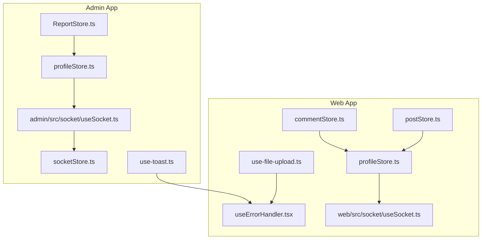
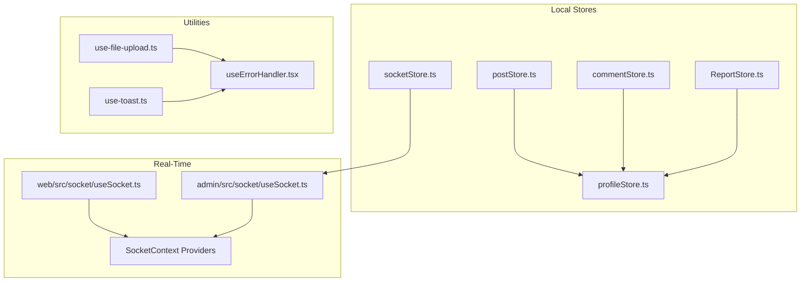
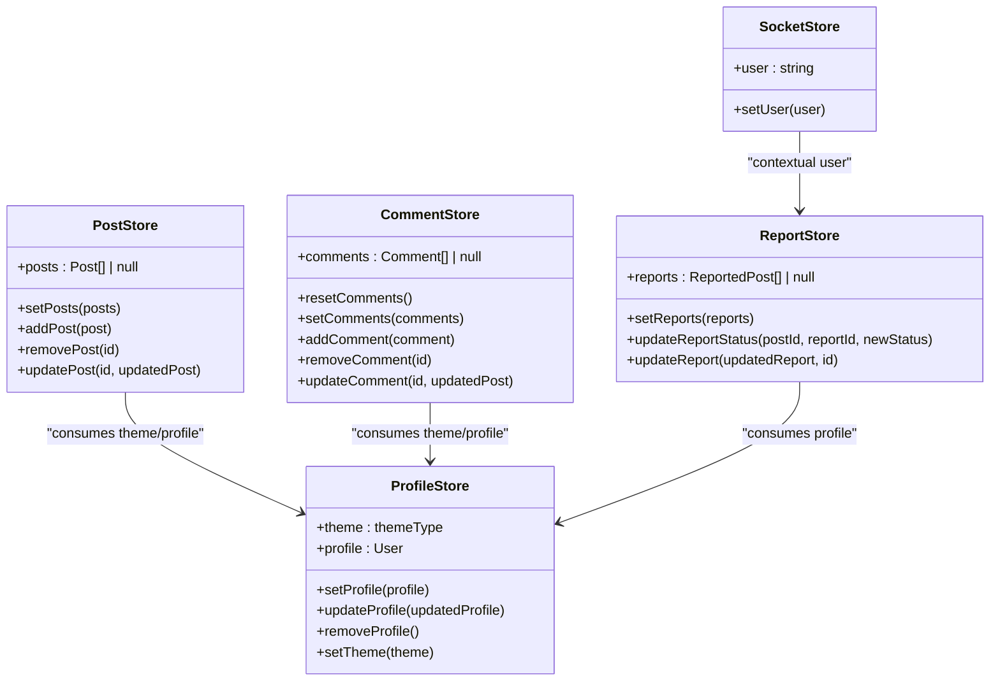
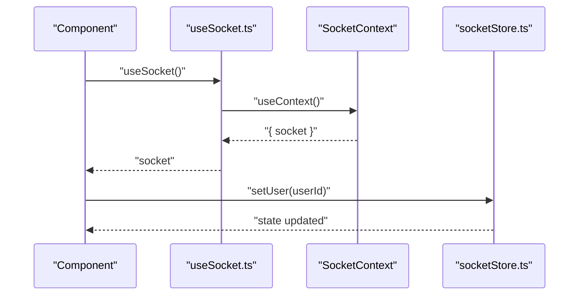
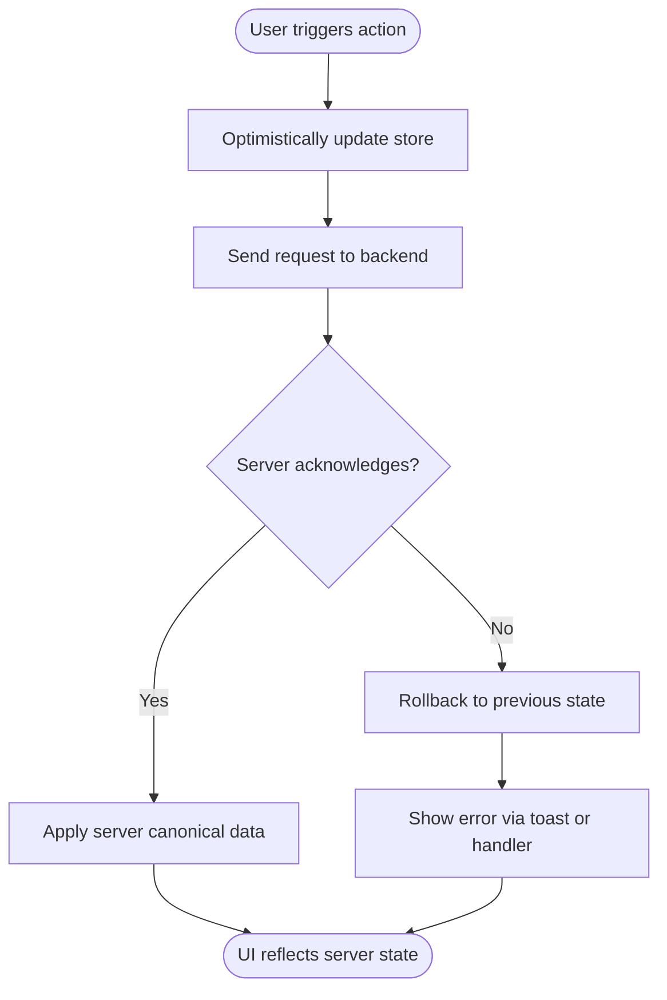
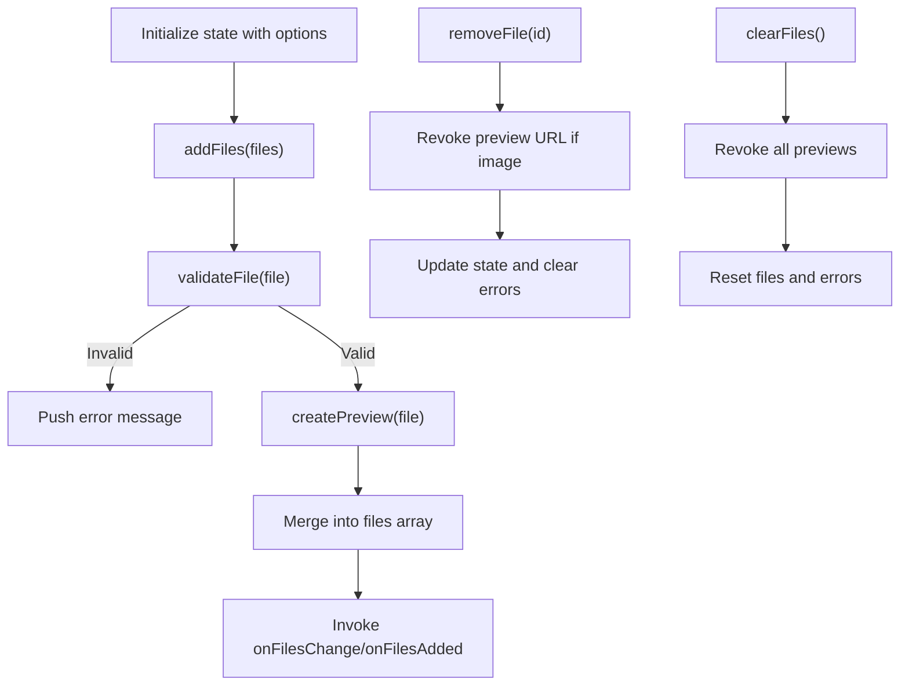
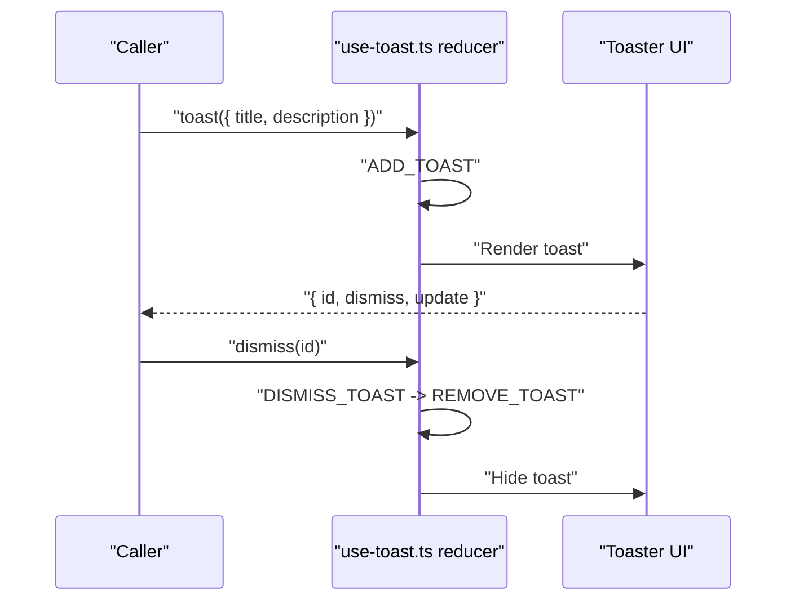
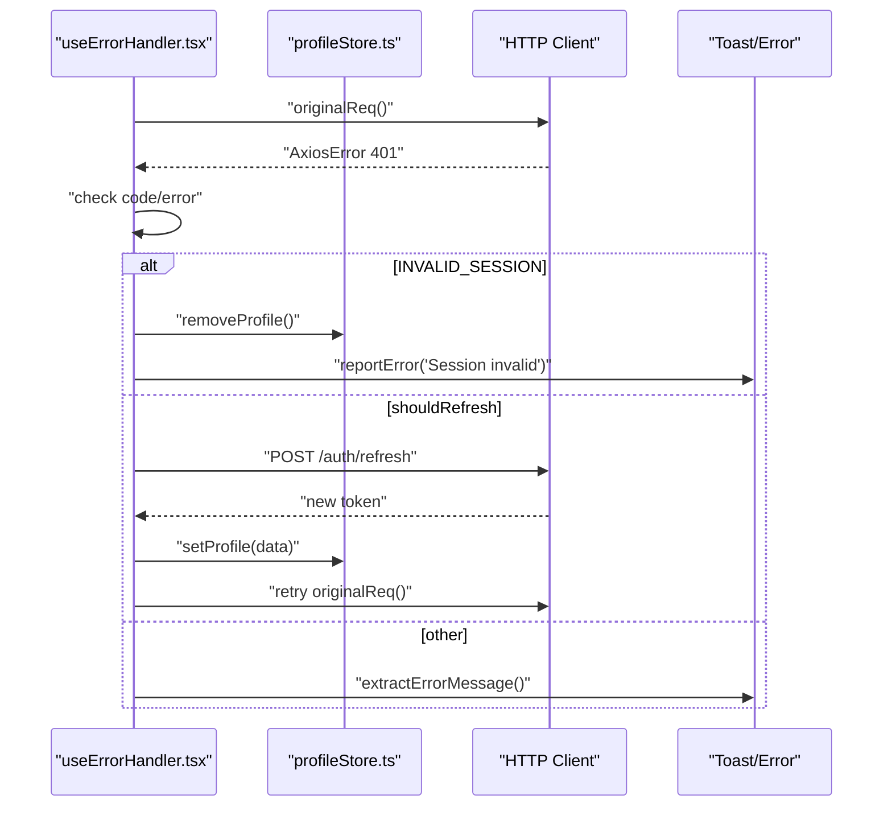
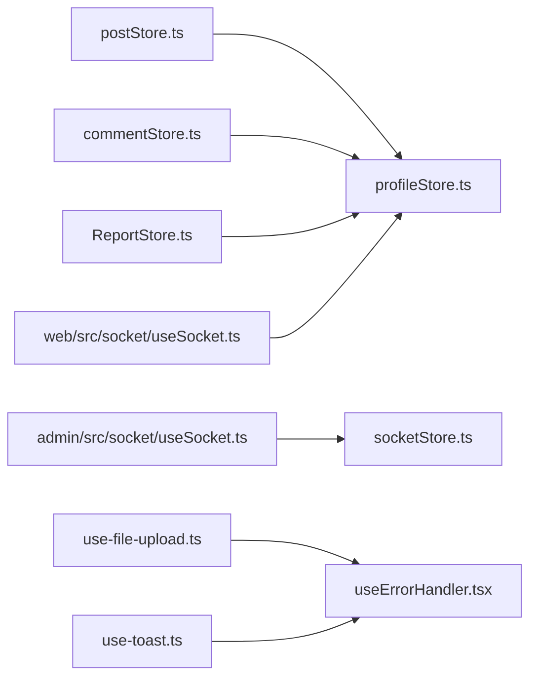

# State Management

<cite>
**Referenced Files in This Document**
- [web/src/store/postStore.ts](file://web/src/store/postStore.ts)
- [web/src/store/commentStore.ts](file://web/src/store/commentStore.ts)
- [web/src/store/profileStore.ts](file://web/src/store/profileStore.ts)
- [admin/src/store/socketStore.ts](file://admin/src/store/socketStore.ts)
- [admin/src/store/ReportStore.ts](file://admin/src/store/ReportStore.ts)
- [admin/src/store/profileStore.ts](file://admin/src/store/profileStore.ts)
- [web/src/hooks/use-file-upload.ts](file://web/src/hooks/use-file-upload.ts)
- [admin/src/hooks/use-toast.ts](file://admin/src/hooks/use-toast.ts)
- [web/src/hooks/useErrorHandler.tsx](file://web/src/hooks/useErrorHandler.tsx)
- [web/src/socket/useSocket.ts](file://web/src/socket/useSocket.ts)
- [admin/src/socket/useSocket.ts](file://admin/src/socket/useSocket.ts)
</cite>

## Table of Contents
1. [Introduction](#introduction)
2. [Project Structure](#project-structure)
3. [Core Components](#core-components)
4. [Architecture Overview](#architecture-overview)
5. [Detailed Component Analysis](#detailed-component-analysis)
6. [Dependency Analysis](#dependency-analysis)
7. [Performance Considerations](#performance-considerations)
8. [Troubleshooting Guide](#troubleshooting-guide)
9. [Conclusion](#conclusion)

## Introduction
This document explains the state management architecture across the frontend applications in this repository. It focuses on Zustand stores, state slice organization, cross-component state sharing, real-time synchronization via Socket.IO, optimistic updates, conflict resolution, file upload state management, toast notifications, error state handling, store composition patterns, middleware integration, and performance optimizations. The goal is to help developers understand how state flows through the system and how to maintain consistency and reliability.

## Project Structure
The state management spans three primary frontend apps:
- Web application (Next.js): central state for posts, comments, and user profile.
- Admin application (Next.js): specialized state for reports and socket-related user context.
- Shared utilities: file upload hook, toast system, and error handler.

**Diagram sources**
- [web/src/store/postStore.ts](file://web/src/store/postStore.ts#L1-L30)
- [web/src/store/commentStore.ts](file://web/src/store/commentStore.ts#L1-L34)
- [web/src/store/profileStore.ts](file://web/src/store/profileStore.ts#L1-L45)
- [web/src/hooks/use-file-upload.ts](file://web/src/hooks/use-file-upload.ts#L1-L414)
- [web/src/hooks/useErrorHandler.tsx](file://web/src/hooks/useErrorHandler.tsx#L1-L170)
- [web/src/socket/useSocket.ts](file://web/src/socket/useSocket.ts#L1-L9)
- [admin/src/store/ReportStore.ts](file://admin/src/store/ReportStore.ts#L1-L43)
- [admin/src/store/profileStore.ts](file://admin/src/store/profileStore.ts#L1-L39)
- [admin/src/socket/useSocket.ts](file://admin/src/socket/useSocket.ts#L1-L13)
- [admin/src/store/socketStore.ts](file://admin/src/store/socketStore.ts#L1-L14)
- [admin/src/hooks/use-toast.ts](file://admin/src/hooks/use-toast.ts#L1-L195)

**Section sources**
- [web/src/store/postStore.ts](file://web/src/store/postStore.ts#L1-L30)
- [web/src/store/commentStore.ts](file://web/src/store/commentStore.ts#L1-L34)
- [web/src/store/profileStore.ts](file://web/src/store/profileStore.ts#L1-L45)
- [admin/src/store/ReportStore.ts](file://admin/src/store/ReportStore.ts#L1-L43)
- [admin/src/store/profileStore.ts](file://admin/src/store/profileStore.ts#L1-L39)
- [admin/src/store/socketStore.ts](file://admin/src/store/socketStore.ts#L1-L14)
- [web/src/hooks/use-file-upload.ts](file://web/src/hooks/use-file-upload.ts#L1-L414)
- [admin/src/hooks/use-toast.ts](file://admin/src/hooks/use-toast.ts#L1-L195)
- [web/src/hooks/useErrorHandler.tsx](file://web/src/hooks/useErrorHandler.tsx#L1-L170)
- [web/src/socket/useSocket.ts](file://web/src/socket/useSocket.ts#L1-L9)
- [admin/src/socket/useSocket.ts](file://admin/src/socket/useSocket.ts#L1-L13)

## Core Components
- Zustand stores
  - Web: postStore, commentStore, profileStore.
  - Admin: ReportStore, profileStore, socketStore.
- Real-time integration
  - Socket hooks provide access to Socket.IO contexts.
- Utilities
  - File upload hook encapsulates drag-and-drop, validation, previews, and cleanup.
  - Toast system manages non-blocking notifications with queueing and dismissal.
  - Error handler centralizes authentication refresh, moderation messaging, and user feedback.

Key patterns:
- Slice-per-concern stores with minimal reducers.
- Cross-component sharing via direct store imports and React hooks.
- Real-time updates via Socket.IO context and event-driven store updates.
- Optimistic updates with conflict resolution on server acknowledgment.

**Section sources**
- [web/src/store/postStore.ts](file://web/src/store/postStore.ts#L1-L30)
- [web/src/store/commentStore.ts](file://web/src/store/commentStore.ts#L1-L34)
- [web/src/store/profileStore.ts](file://web/src/store/profileStore.ts#L1-L45)
- [admin/src/store/ReportStore.ts](file://admin/src/store/ReportStore.ts#L1-L43)
- [admin/src/store/profileStore.ts](file://admin/src/store/profileStore.ts#L1-L39)
- [admin/src/store/socketStore.ts](file://admin/src/store/socketStore.ts#L1-L14)
- [web/src/hooks/use-file-upload.ts](file://web/src/hooks/use-file-upload.ts#L1-L414)
- [admin/src/hooks/use-toast.ts](file://admin/src/hooks/use-toast.ts#L1-L195)
- [web/src/hooks/useErrorHandler.tsx](file://web/src/hooks/useErrorHandler.tsx#L1-L170)
- [web/src/socket/useSocket.ts](file://web/src/socket/useSocket.ts#L1-L9)
- [admin/src/socket/useSocket.ts](file://admin/src/socket/useSocket.ts#L1-L13)

## Architecture Overview
The state architecture combines local stores with real-time synchronization and centralized utilities.

**Diagram sources**
- [web/src/store/postStore.ts](file://web/src/store/postStore.ts#L1-L30)
- [web/src/store/commentStore.ts](file://web/src/store/commentStore.ts#L1-L34)
- [web/src/store/profileStore.ts](file://web/src/store/profileStore.ts#L1-L45)
- [admin/src/store/ReportStore.ts](file://admin/src/store/ReportStore.ts#L1-L43)
- [admin/src/store/socketStore.ts](file://admin/src/store/socketStore.ts#L1-L14)
- [web/src/socket/useSocket.ts](file://web/src/socket/useSocket.ts#L1-L9)
- [admin/src/socket/useSocket.ts](file://admin/src/socket/useSocket.ts#L1-L13)
- [web/src/hooks/use-file-upload.ts](file://web/src/hooks/use-file-upload.ts#L1-L414)
- [admin/src/hooks/use-toast.ts](file://admin/src/hooks/use-toast.ts#L1-L195)
- [web/src/hooks/useErrorHandler.tsx](file://web/src/hooks/useErrorHandler.tsx#L1-L170)

## Detailed Component Analysis

### Zustand Stores: Organization and Patterns
- Web postStore
  - Manages a list of posts with setters for bulk replacement, add, remove, and update by id.
  - Typical usage: fetch posts, append new posts optimistically, update votes/comments counts, and remove deleted posts.
- Web commentStore
  - Manages comments with reset, set, add, remove, and update by id.
  - Typical usage: load comments per post, add new comments optimistically, and update edited comments.
- Web profileStore
  - Tracks theme and user profile; persists theme to localStorage and applies DOM attributes.
  - Typical usage: initialize theme, update profile fields, and clear profile on logout.
- Admin ReportStore
  - Holds reported items and nested reports with setters and status updates.
  - Typical usage: mark reports as resolved/ignored/pending and update report metadata.
- Admin socketStore
  - Minimal runtime user identifier for socket context.
  - Typical usage: propagate current user to socket events.

**Diagram sources**
- [web/src/store/postStore.ts](file://web/src/store/postStore.ts#L1-L30)
- [web/src/store/commentStore.ts](file://web/src/store/commentStore.ts#L1-L34)
- [web/src/store/profileStore.ts](file://web/src/store/profileStore.ts#L1-L45)
- [admin/src/store/ReportStore.ts](file://admin/src/store/ReportStore.ts#L1-L43)
- [admin/src/store/socketStore.ts](file://admin/src/store/socketStore.ts#L1-L14)

**Section sources**
- [web/src/store/postStore.ts](file://web/src/store/postStore.ts#L1-L30)
- [web/src/store/commentStore.ts](file://web/src/store/commentStore.ts#L1-L34)
- [web/src/store/profileStore.ts](file://web/src/store/profileStore.ts#L1-L45)
- [admin/src/store/ReportStore.ts](file://admin/src/store/ReportStore.ts#L1-L43)
- [admin/src/store/socketStore.ts](file://admin/src/store/socketStore.ts#L1-L14)

### Real-Time State Synchronization with Socket.IO
- Socket hooks
  - Both apps expose a useSocket hook to consume a SocketContext provider.
  - Admin’s hook enforces provider presence with an explicit error.
- Socket store
  - Admin maintains a lightweight user identity slice to coordinate socket events.
- Typical flow
  - Subscribe to room/topic on mount.
  - On incoming events, update stores optimistically first, then reconcile on acknowledgment.
  - On disconnect/reconnect, rehydrate state from server.

**Diagram sources**
- [web/src/socket/useSocket.ts](file://web/src/socket/useSocket.ts#L1-L9)
- [admin/src/socket/useSocket.ts](file://admin/src/socket/useSocket.ts#L1-L13)
- [admin/src/store/socketStore.ts](file://admin/src/store/socketStore.ts#L1-L14)

**Section sources**
- [web/src/socket/useSocket.ts](file://web/src/socket/useSocket.ts#L1-L9)
- [admin/src/socket/useSocket.ts](file://admin/src/socket/useSocket.ts#L1-L13)
- [admin/src/store/socketStore.ts](file://admin/src/store/socketStore.ts#L1-L14)

### Optimistic Updates and Conflict Resolution
- Optimistic pattern
  - UI updates immediately upon user action (e.g., add comment, vote).
  - Server mutation initiated asynchronously.
- Conflict resolution
  - On acknowledgment, reconcile client state with server-provided canonical data.
  - If server rejects, rollback to last known good state and surface error.

[No sources needed since this diagram shows conceptual workflow, not actual code structure]

### File Upload State Management
- Responsibilities
  - Validate file types and sizes.
  - Generate previews for images.
  - Manage drag-and-drop state and input refs.
  - Track errors and provide callbacks for lifecycle events.
  - Cleanup object URLs on unmount or removal.
- Composition
  - Returns a tuple of state and actions for imperative control.
  - Integrates with error handler for user feedback on failures.

**Diagram sources**
- [web/src/hooks/use-file-upload.ts](file://web/src/hooks/use-file-upload.ts#L1-L414)

**Section sources**
- [web/src/hooks/use-file-upload.ts](file://web/src/hooks/use-file-upload.ts#L1-L414)

### Toast Notification Handling
- Design
  - Centralized reducer-based toast manager with immutable updates.
  - Queue limits and delayed removal for non-intrusive UX.
- Integration
  - Web app uses a higher-level toast library for imperative notifications.
  - Admin app uses a custom reducer-based toast system with strict queueing.

**Diagram sources**
- [admin/src/hooks/use-toast.ts](file://admin/src/hooks/use-toast.ts#L1-L195)

**Section sources**
- [admin/src/hooks/use-toast.ts](file://admin/src/hooks/use-toast.ts#L1-L195)

### Error State Management
- Responsibilities
  - Intercept unauthorized responses, refresh tokens, and retry requests.
  - Extract moderation-specific messages and present user-friendly guidance.
  - Persist user profile changes and clear on session invalidity.
- Integration
  - Consumes profile store to update and clear user data.
  - Uses toast or setError to surface messages.

**Diagram sources**
- [web/src/hooks/useErrorHandler.tsx](file://web/src/hooks/useErrorHandler.tsx#L1-L170)
- [web/src/store/profileStore.ts](file://web/src/store/profileStore.ts#L1-L45)

**Section sources**
- [web/src/hooks/useErrorHandler.tsx](file://web/src/hooks/useErrorHandler.tsx#L1-L170)
- [web/src/store/profileStore.ts](file://web/src/store/profileStore.ts#L1-L45)

## Dependency Analysis
- Store-to-store dependencies
  - Web postStore and commentStore depend on profileStore for theme and user context.
  - Admin ReportStore depends on profileStore for administrative context.
- Real-time dependencies
  - Socket hooks depend on SocketContext providers.
  - Admin socketStore depends on useSocket to propagate user identity.
- Utility dependencies
  - File upload hook integrates with error handler for user feedback.
  - Toast systems integrate with error handler for consistent messaging.

**Diagram sources**
- [web/src/store/postStore.ts](file://web/src/store/postStore.ts#L1-L30)
- [web/src/store/commentStore.ts](file://web/src/store/commentStore.ts#L1-L34)
- [web/src/store/profileStore.ts](file://web/src/store/profileStore.ts#L1-L45)
- [admin/src/store/ReportStore.ts](file://admin/src/store/ReportStore.ts#L1-L43)
- [admin/src/socket/useSocket.ts](file://admin/src/socket/useSocket.ts#L1-L13)
- [admin/src/store/socketStore.ts](file://admin/src/store/socketStore.ts#L1-L14)
- [web/src/socket/useSocket.ts](file://web/src/socket/useSocket.ts#L1-L9)
- [web/src/hooks/use-file-upload.ts](file://web/src/hooks/use-file-upload.ts#L1-L414)
- [admin/src/hooks/use-toast.ts](file://admin/src/hooks/use-toast.ts#L1-L195)
- [web/src/hooks/useErrorHandler.tsx](file://web/src/hooks/useErrorHandler.tsx#L1-L170)

**Section sources**
- [web/src/store/postStore.ts](file://web/src/store/postStore.ts#L1-L30)
- [web/src/store/commentStore.ts](file://web/src/store/commentStore.ts#L1-L34)
- [web/src/store/profileStore.ts](file://web/src/store/profileStore.ts#L1-L45)
- [admin/src/store/ReportStore.ts](file://admin/src/store/ReportStore.ts#L1-L43)
- [admin/src/socket/useSocket.ts](file://admin/src/socket/useSocket.ts#L1-L13)
- [admin/src/store/socketStore.ts](file://admin/src/store/socketStore.ts#L1-L14)
- [web/src/socket/useSocket.ts](file://web/src/socket/useSocket.ts#L1-L9)
- [web/src/hooks/use-file-upload.ts](file://web/src/hooks/use-file-upload.ts#L1-L414)
- [admin/src/hooks/use-toast.ts](file://admin/src/hooks/use-toast.ts#L1-L195)
- [web/src/hooks/useErrorHandler.tsx](file://web/src/hooks/useErrorHandler.tsx#L1-L170)

## Performance Considerations
- Minimize re-renders
  - Keep slices granular; avoid monolithic stores.
  - Select only necessary parts of state in components.
- Efficient updates
  - Prefer functional updates to avoid stale closures.
  - Batch updates when possible to reduce intermediate renders.
- Real-time efficiency
  - Debounce or throttle frequent socket events.
  - Use selective reconciliation to minimize full-state replays.
- Memory hygiene
  - Revoke object URLs after image previews are no longer needed.
  - Clear timeouts and subscriptions on unmount.
- Caching and normalization
  - Normalize entities by id; store arrays of ids for referential equality.
  - Cache expensive computations (e.g., derived lists) with memoization.
- Middleware and logging
  - Introduce a Zustand middleware for logging and tracing store mutations.
  - Use middleware to enforce immutability and invariant checks during development.

[No sources needed since this section provides general guidance]

## Troubleshooting Guide
- Unauthorized errors
  - Ensure refresh flow is invoked only once and retries original request.
  - Clear profile on invalid session and prompt re-authentication.
- Toast not dismissing
  - Verify queue limits and delayed removal timers are not conflicting.
  - Confirm onOpenChange handlers are wired correctly.
- File upload issues
  - Check accept patterns and maxSize thresholds.
  - Ensure object URLs are revoked on removal/unmount.
- Socket state drift
  - Reconcile optimistic updates on acknowledgment.
  - Validate user identity propagation via socketStore.
- Theme persistence
  - Confirm localStorage writes and DOM attribute updates occur on setTheme.

**Section sources**
- [web/src/hooks/useErrorHandler.tsx](file://web/src/hooks/useErrorHandler.tsx#L1-L170)
- [admin/src/hooks/use-toast.ts](file://admin/src/hooks/use-toast.ts#L1-L195)
- [web/src/hooks/use-file-upload.ts](file://web/src/hooks/use-file-upload.ts#L1-L414)
- [admin/src/store/socketStore.ts](file://admin/src/store/socketStore.ts#L1-L14)
- [web/src/store/profileStore.ts](file://web/src/store/profileStore.ts#L1-L45)

## Conclusion
The state management architecture leverages Zustand for concise, composable stores, Socket.IO for real-time synchronization, and shared utilities for file uploads, toasts, and error handling. By applying optimistic updates, conflict resolution, and performance-conscious patterns, the system remains responsive and reliable. Adopting normalization, caching, and middleware-based observability will further improve maintainability and debuggability.