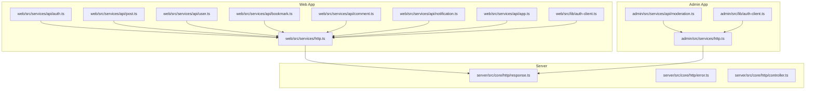
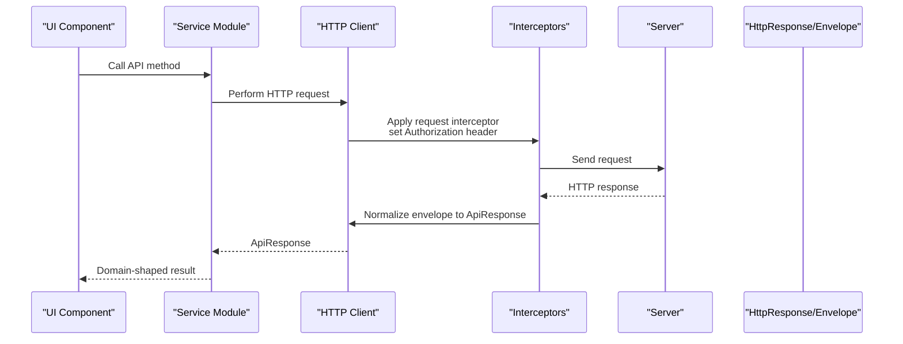
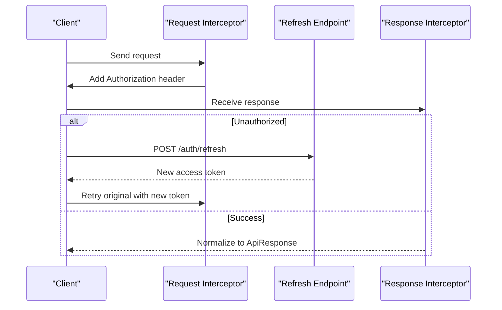
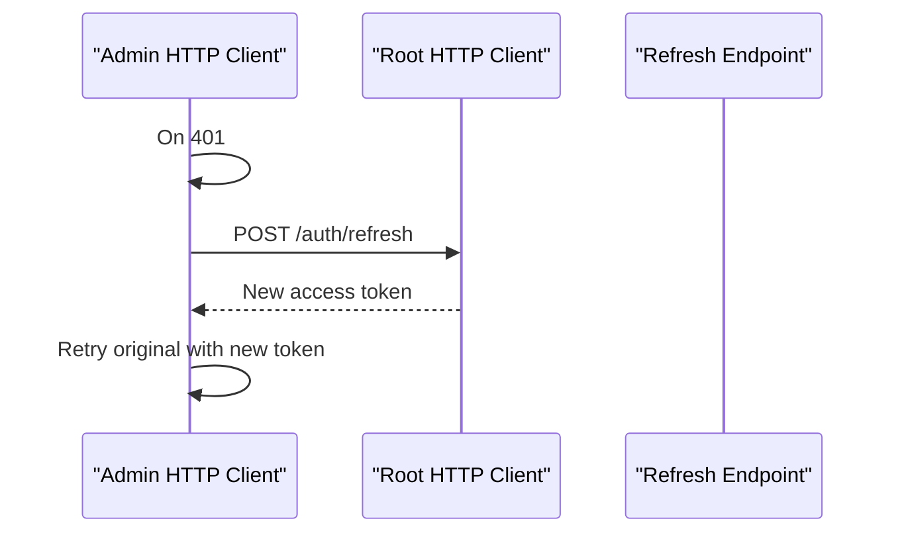
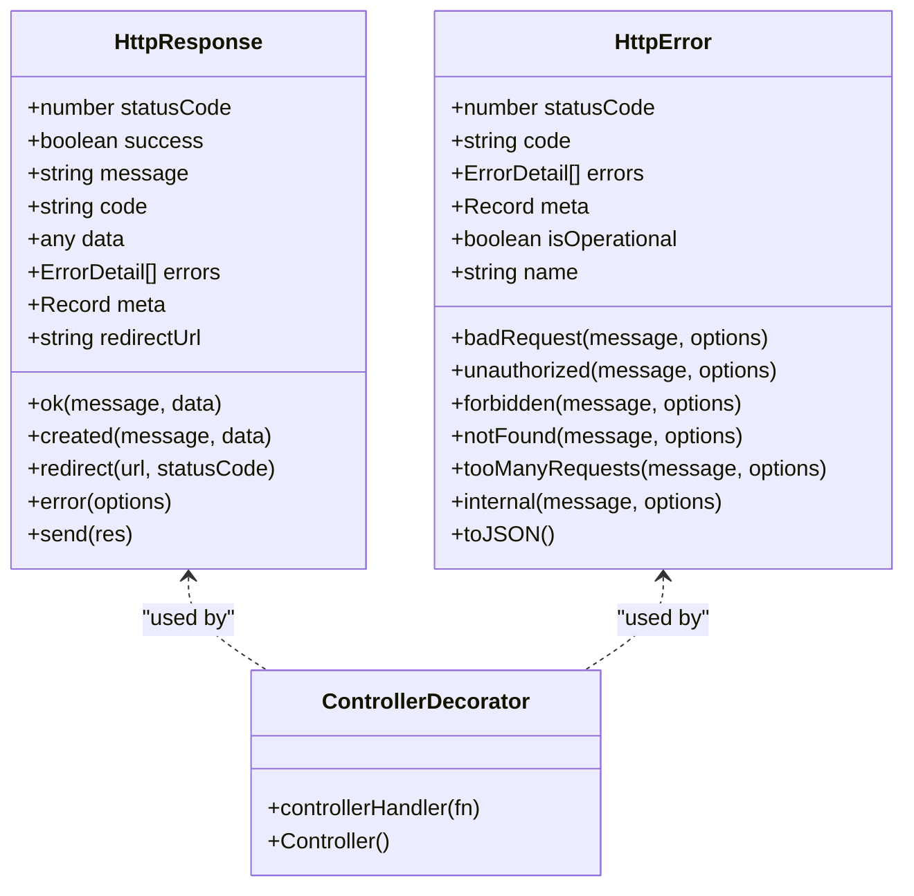
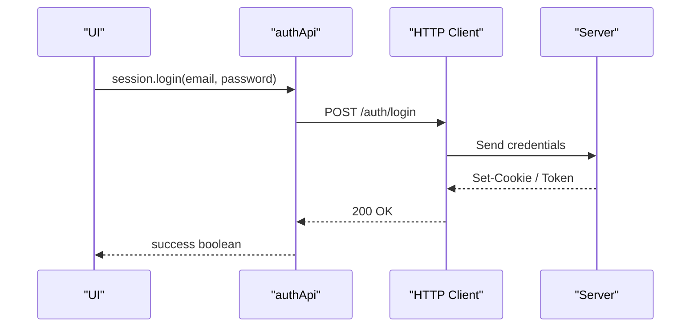
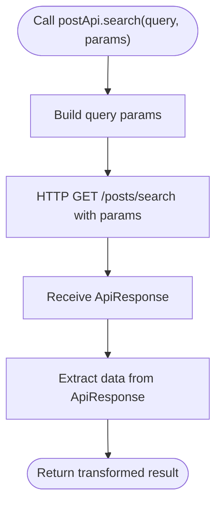
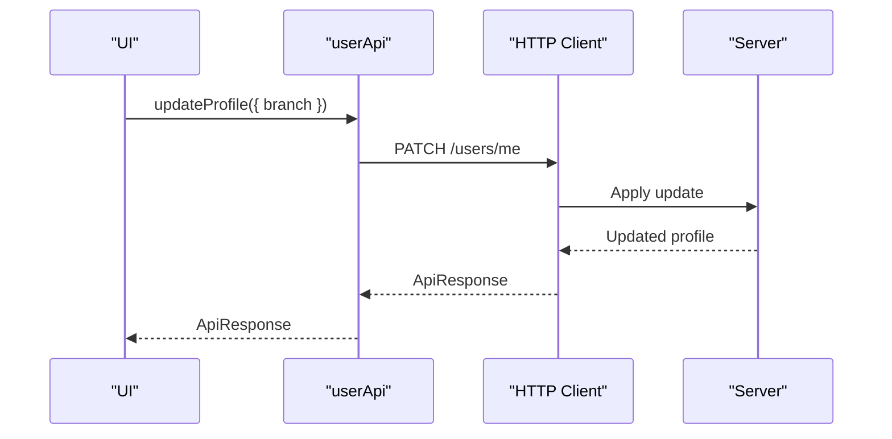
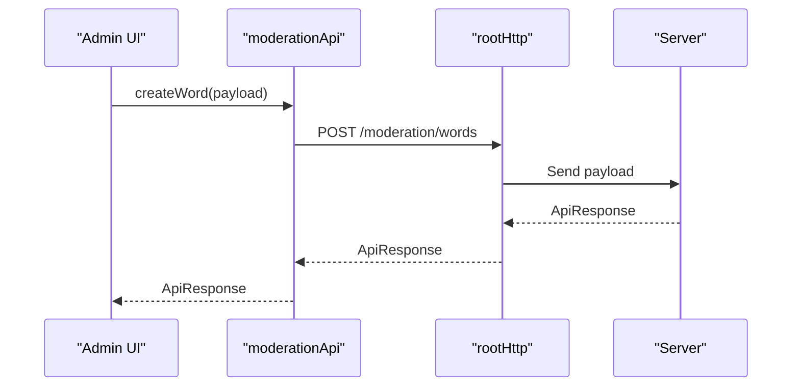
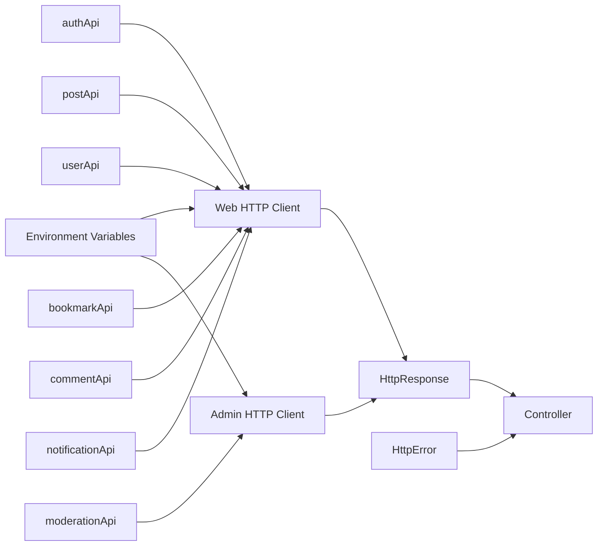

# API Integration

<cite>
**Referenced Files in This Document**
- [web/src/services/http.ts](file://web/src/services/http.ts)
- [admin/src/services/http.ts](file://admin/src/services/http.ts)
- [server/src/core/http/response.ts](file://server/src/core/http/response.ts)
- [server/src/core/http/error.ts](file://server/src/core/http/error.ts)
- [server/src/core/http/controller.ts](file://server/src/core/http/controller.ts)
- [web/src/services/api/auth.ts](file://web/src/services/api/auth.ts)
- [web/src/services/api/post.ts](file://web/src/services/api/post.ts)
- [web/src/services/api/user.ts](file://web/src/services/api/user.ts)
- [web/src/services/api/bookmark.ts](file://web/src/services/api/bookmark.ts)
- [web/src/services/api/comment.ts](file://web/src/services/api/comment.ts)
- [web/src/services/api/notification.ts](file://web/src/services/api/notification.ts)
- [admin/src/services/api/moderation.ts](file://admin/src/services/api/moderation.ts)
- [web/src/lib/auth-client.ts](file://web/src/lib/auth-client.ts)
- [admin/src/lib/auth-client.ts](file://admin/src/lib/auth-client.ts)
- [web/src/services/api/app.ts](file://web/src/services/api/app.ts)
</cite>

## Table of Contents
1. [Introduction](#introduction)
2. [Project Structure](#project-structure)
3. [Core Components](#core-components)
4. [Architecture Overview](#architecture-overview)
5. [Detailed Component Analysis](#detailed-component-analysis)
6. [Dependency Analysis](#dependency-analysis)
7. [Performance Considerations](#performance-considerations)
8. [Troubleshooting Guide](#troubleshooting-guide)
9. [Conclusion](#conclusion)
10. [Appendices](#appendices)

## Introduction
This document explains the API integration patterns and service layer implementation across the frontend web application, the admin application, and the backend server. It covers HTTP client configuration, request and response handling, error management, authentication headers, interceptors, response normalization, and service module patterns for authentication, posts, users, bookmarks, comments, notifications, and moderation. It also outlines caching strategies, retry mechanisms, and best practices for maintaining a clean service layer architecture.

## Project Structure
The API integration spans three primary areas:
- Frontend Web Application: centralized HTTP client with interceptors, typed API service modules, and authentication client.
- Admin Application: separate HTTP client for admin endpoints and a root client for cross-origin calls, with interceptors and response normalization.
- Backend Server: standardized HTTP response envelope and error handling utilities, controllers, and middleware.

**Diagram sources**
- [web/src/services/http.ts](file://web/src/services/http.ts#L1-L135)
- [admin/src/services/http.ts](file://admin/src/services/http.ts#L1-L154)
- [server/src/core/http/response.ts](file://server/src/core/http/response.ts#L1-L101)
- [web/src/services/api/auth.ts](file://web/src/services/api/auth.ts#L1-L156)
- [web/src/services/api/post.ts](file://web/src/services/api/post.ts#L1-L68)
- [web/src/services/api/user.ts](file://web/src/services/api/user.ts#L1-L26)
- [web/src/services/api/bookmark.ts](file://web/src/services/api/bookmark.ts#L1-L14)
- [web/src/services/api/comment.ts](file://web/src/services/api/comment.ts#L1-L24)
- [web/src/services/api/notification.ts](file://web/src/services/api/notification.ts#L1-L11)
- [admin/src/services/api/moderation.ts](file://admin/src/services/api/moderation.ts#L1-L49)
- [web/src/lib/auth-client.ts](file://web/src/lib/auth-client.ts#L1-L20)
- [admin/src/lib/auth-client.ts](file://admin/src/lib/auth-client.ts#L1-L11)

**Section sources**
- [web/src/services/http.ts](file://web/src/services/http.ts#L1-L135)
- [admin/src/services/http.ts](file://admin/src/services/http.ts#L1-L154)
- [server/src/core/http/response.ts](file://server/src/core/http/response.ts#L1-L101)
- [server/src/core/http/error.ts](file://server/src/core/http/error.ts#L1-L131)
- [server/src/core/http/controller.ts](file://server/src/core/http/controller.ts#L1-L80)

## Core Components
- Web HTTP Client
  - Base URL configured from environment variables.
  - Credential handling enabled for cookie-based sessions.
  - Request interceptor adds Authorization header when present.
  - Response interceptor normalizes backend envelope to a unified API response shape.
  - Centralized 401 handling with token refresh, queued retry, and callback hooks for success/failure.
  - Access token getter and refresh callbacks are injected at runtime.

- Admin HTTP Client
  - Two clients: admin-specific base and a root base derived from admin base.
  - Shared interceptor pipeline for access tokens and response normalization.
  - 401 handling identical to the web client but uses the root client for refresh.

- Server HTTP Utilities
  - HttpResponse: a typed envelope for successful and error responses, with convenience constructors and a send method.
  - HttpError: a structured error class with status code, error code, optional details, metadata, and operational flag.
  - Controller decorator/handler: ensures controllers return HttpResponse instances and dispatch them to Express.

**Section sources**
- [web/src/services/http.ts](file://web/src/services/http.ts#L1-L135)
- [admin/src/services/http.ts](file://admin/src/services/http.ts#L1-L154)
- [server/src/core/http/response.ts](file://server/src/core/http/response.ts#L1-L101)
- [server/src/core/http/error.ts](file://server/src/core/http/error.ts#L1-L131)
- [server/src/core/http/controller.ts](file://server/src/core/http/controller.ts#L1-L80)

## Architecture Overview
The API integration follows a layered pattern:
- Presentation Layer (React apps) invokes service modules.
- Service Modules encapsulate endpoint calls and transform raw responses into domain-friendly shapes.
- HTTP Clients provide interceptors, normalization, and authentication.
- Backend Server responds with a consistent envelope and standardized error handling.

**Diagram sources**
- [web/src/services/http.ts](file://web/src/services/http.ts#L10-L134)
- [server/src/core/http/response.ts](file://server/src/core/http/response.ts#L84-L97)

## Detailed Component Analysis

### Web HTTP Client and Interceptors
- Configuration
  - Base URL from environment variable.
  - Credentials enabled for session cookies.
- Request Interceptor
  - Reads access token via injected getter and sets Authorization header if absent.
- Response Interceptor
  - Normalizes backend envelope to a unified ApiResponse shape.
- 401 Handling
  - Prevents infinite retry loops with a retry flag.
  - Queues concurrent requests while refreshing.
  - Uses a dedicated refresh endpoint and updates Authorization header.
  - Invokes success/failure callbacks after refresh completion.
- Token Refresh Flow
  - Uses a POST to the server’s refresh endpoint.
  - Updates queued requests with the new token and retries originals.

**Diagram sources**
- [web/src/services/http.ts](file://web/src/services/http.ts#L10-L111)

**Section sources**
- [web/src/services/http.ts](file://web/src/services/http.ts#L1-L135)

### Admin HTTP Client and Interceptors
- Dual Clients
  - Admin base for admin endpoints.
  - Root base for cross-origin or shared endpoints.
- Interceptors
  - Same access token injection and response normalization.
- 401 Handling
  - Uses root client to refresh tokens and propagate to queued requests.

**Diagram sources**
- [admin/src/services/http.ts](file://admin/src/services/http.ts#L97-L150)

**Section sources**
- [admin/src/services/http.ts](file://admin/src/services/http.ts#L1-L154)

### Server HTTP Response and Error Handling
- HttpResponse
  - Provides constructors for OK, Created, Redirect, and Error.
  - Sends JSON with a consistent envelope and handles redirects.
- HttpError
  - Factory methods for common HTTP errors.
  - Serializable JSON representation suitable for transport.
- Controller Decorator/Handler
  - Ensures controller methods return HttpResponse and dispatch them to Express.

**Diagram sources**
- [server/src/core/http/response.ts](file://server/src/core/http/response.ts#L4-L98)
- [server/src/core/http/error.ts](file://server/src/core/http/error.ts#L9-L109)
- [server/src/core/http/controller.ts](file://server/src/core/http/controller.ts#L13-L79)

**Section sources**
- [server/src/core/http/response.ts](file://server/src/core/http/response.ts#L1-L101)
- [server/src/core/http/error.ts](file://server/src/core/http/error.ts#L1-L131)
- [server/src/core/http/controller.ts](file://server/src/core/http/controller.ts#L1-L80)

### Authentication Services
- Web Auth Service
  - Fetch current user profile.
  - OTP lifecycle: send, verify, login variants, deletion variants.
  - Password management: check status, set with optional current password.
  - Reset password: initialize and finalize flows.
  - OAuth setup placeholder for registration.
  - Registration: initialize and finalize flows.
  - Onboarding completion.
  - Account deletion.
  - Session management: login, refresh, logout, logout-all.
- Admin Auth Client
  - Better Auth client configured with admin plugin and optional Google One Tap.

**Diagram sources**
- [web/src/services/api/auth.ts](file://web/src/services/api/auth.ts#L134-L154)
- [web/src/services/http.ts](file://web/src/services/http.ts#L10-L19)

**Section sources**
- [web/src/services/api/auth.ts](file://web/src/services/api/auth.ts#L1-L156)
- [web/src/lib/auth-client.ts](file://web/src/lib/auth-client.ts#L1-L20)
- [admin/src/lib/auth-client.ts](file://admin/src/lib/auth-client.ts#L1-L11)

### Social and Content Services
- Posts
  - List with filters and sorting.
  - Search with pagination.
  - Get by college or by ID.
  - Increment views.
  - Create, update, delete.
  - Trending posts.
  - Get posts by user.
- Comments
  - Fetch by post.
  - Create with optional parent comment.
  - Update and delete.
- Bookmarks
  - List current user’s bookmarks.
  - Create and remove.
- Notifications
  - List unread notifications.
  - Mark multiple as seen.

**Diagram sources**
- [web/src/services/api/post.ts](file://web/src/services/api/post.ts#L17-L18)

**Section sources**
- [web/src/services/api/post.ts](file://web/src/services/api/post.ts#L1-L68)
- [web/src/services/api/comment.ts](file://web/src/services/api/comment.ts#L1-L24)
- [web/src/services/api/bookmark.ts](file://web/src/services/api/bookmark.ts#L1-L14)
- [web/src/services/api/notification.ts](file://web/src/services/api/notification.ts#L1-L11)

### User Management Services
- Retrieve current profile and accept terms.
- Update profile branch.
- Block/unblock users and list blocked users.

**Diagram sources**
- [web/src/services/api/user.ts](file://web/src/services/api/user.ts#L13-L14)

**Section sources**
- [web/src/services/api/user.ts](file://web/src/services/api/user.ts#L1-L26)

### Administrative Functions
- Moderation
  - Retrieve moderation configuration.
  - List banned words.
  - Create, update, and delete banned words.
  - Uses root HTTP client for cross-origin refresh scenarios.

**Diagram sources**
- [admin/src/services/api/moderation.ts](file://admin/src/services/api/moderation.ts#L34-L36)
- [admin/src/services/http.ts](file://admin/src/services/http.ts#L16-L19)

**Section sources**
- [admin/src/services/api/moderation.ts](file://admin/src/services/api/moderation.ts#L1-L49)
- [admin/src/services/http.ts](file://admin/src/services/http.ts#L1-L154)

### Health and Readiness Checks
- Web app exposes a readiness check endpoint by resolving the origin of the configured API base URL and hitting a readiness probe.

**Section sources**
- [web/src/services/api/app.ts](file://web/src/services/api/app.ts#L1-L11)

## Dependency Analysis
- Frontend HTTP clients depend on environment configuration and inject access tokens via interceptors.
- Service modules depend on HTTP clients and expose domain-focused APIs.
- Backend depends on HttpResponse and HttpError for consistent responses and errors.
- Controllers depend on HttpResponse to ensure standardized dispatch.

**Diagram sources**
- [web/src/services/http.ts](file://web/src/services/http.ts#L5-L8)
- [admin/src/services/http.ts](file://admin/src/services/http.ts#L8-L19)
- [server/src/core/http/response.ts](file://server/src/core/http/response.ts#L4-L32)
- [server/src/core/http/error.ts](file://server/src/core/http/error.ts#L9-L39)
- [server/src/core/http/controller.ts](file://server/src/core/http/controller.ts#L13-L23)

**Section sources**
- [web/src/services/http.ts](file://web/src/services/http.ts#L1-L135)
- [admin/src/services/http.ts](file://admin/src/services/http.ts#L1-L154)
- [server/src/core/http/response.ts](file://server/src/core/http/response.ts#L1-L101)
- [server/src/core/http/error.ts](file://server/src/core/http/error.ts#L1-L131)
- [server/src/core/http/controller.ts](file://server/src/core/http/controller.ts#L1-L80)

## Performance Considerations
- Interceptor-based normalization reduces boilerplate and centralizes error handling.
- Queued retry on 401 prevents redundant refreshes and improves reliability under concurrency.
- Using AbortSignal and timeouts in service methods enables cancellation and responsiveness.
- Prefer pagination parameters (page, limit) for list endpoints to avoid large payloads.
- Cache invalidation strategies should align with backend cache keys to prevent stale reads.

[No sources needed since this section provides general guidance]

## Troubleshooting Guide
- 401 Unauthorized
  - Verify access token presence and expiration.
  - Ensure refresh endpoint is reachable and returns a new token.
  - Confirm interceptors are attached and Authorization header is set.
- Response Parsing
  - Confirm response normalization is applied and data is extracted from the envelope.
- Error Serialization
  - Use HttpError factory methods to produce consistent error envelopes.
- Token Refresh Callbacks
  - Ensure success and failure callbacks are registered to update global state and handle logout on failure.

**Section sources**
- [web/src/services/http.ts](file://web/src/services/http.ts#L56-L111)
- [admin/src/services/http.ts](file://admin/src/services/http.ts#L97-L150)
- [server/src/core/http/error.ts](file://server/src/core/http/error.ts#L77-L108)
- [server/src/core/http/response.ts](file://server/src/core/http/response.ts#L84-L97)

## Conclusion
The API integration architecture emphasizes a clean separation of concerns: HTTP clients manage transport and authentication, service modules encapsulate domain logic, and the server enforces a consistent response and error envelope. Interceptors, normalization, and robust 401 handling improve reliability and developer ergonomics. Following these patterns ensures maintainable, testable, and scalable integrations across the web and admin applications.

[No sources needed since this section summarizes without analyzing specific files]

## Appendices

### API Service Patterns and Best Practices
- Keep service methods focused on a single responsibility.
- Use typed payloads and responses to reduce runtime errors.
- Centralize environment configuration and base URLs.
- Prefer domain-friendly return values from services; keep HTTP specifics internal.
- Use AbortSignal and timeouts to control long-running requests.
- Implement cache keys and invalidation strategies aligned with backend cache keys.
- Document endpoint contracts and error codes for consumers.

[No sources needed since this section provides general guidance]