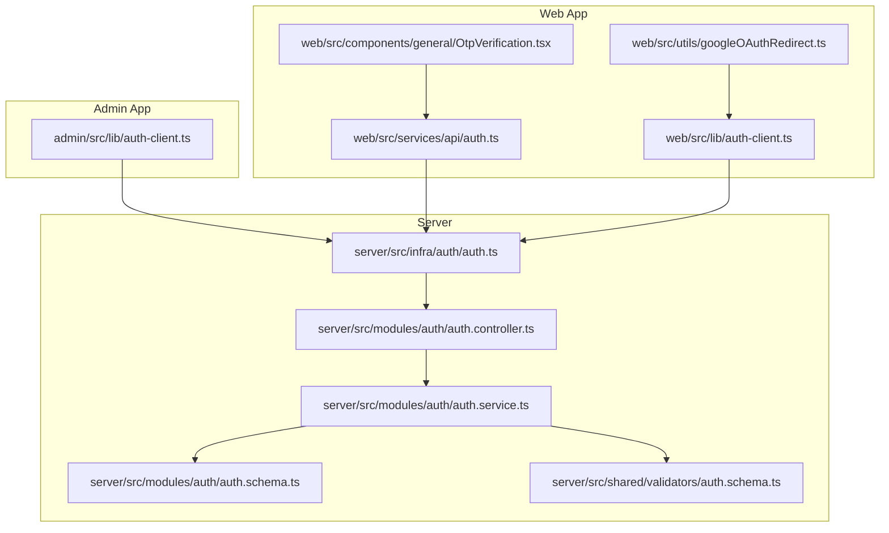
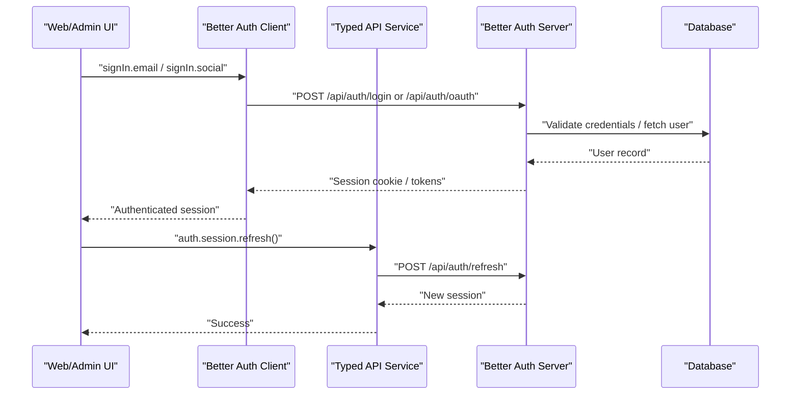
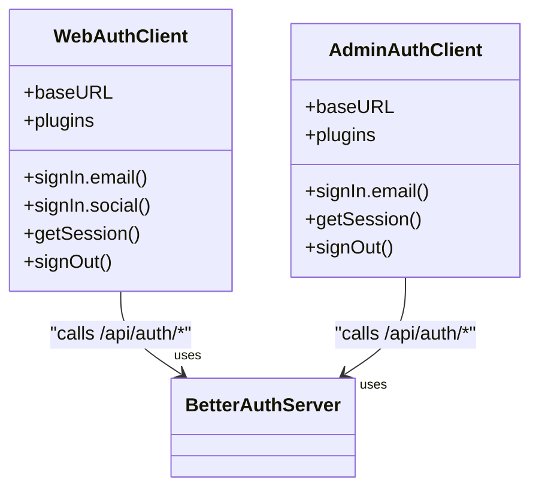
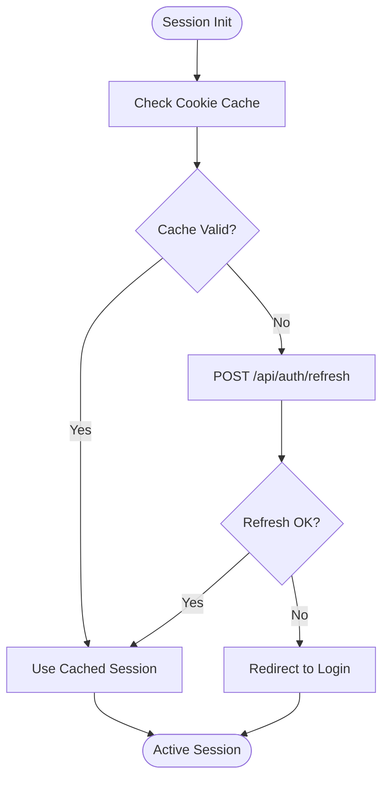
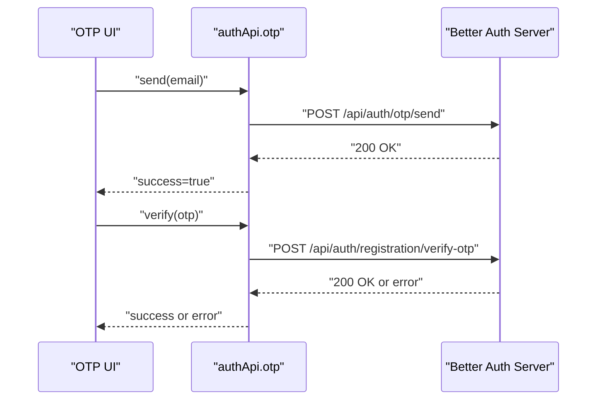
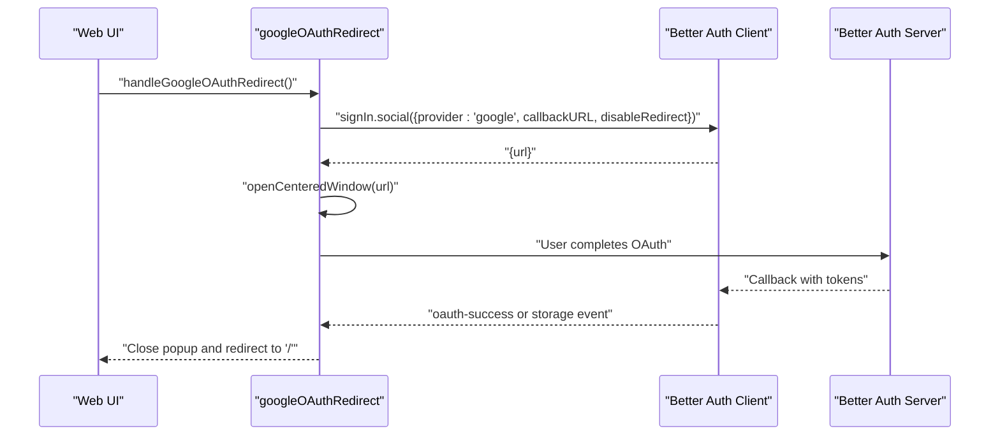
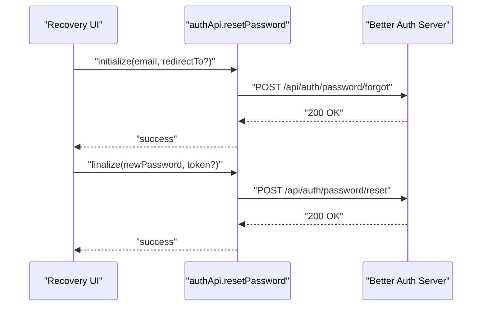
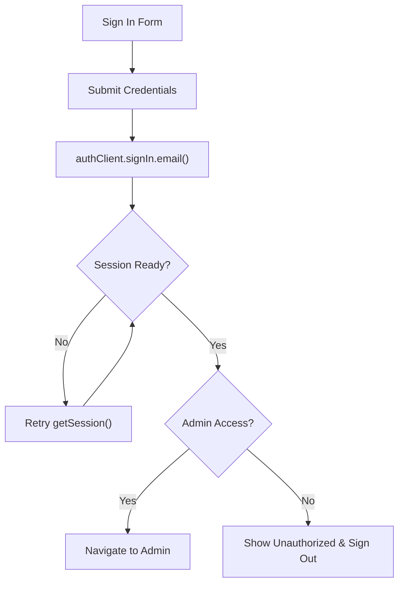
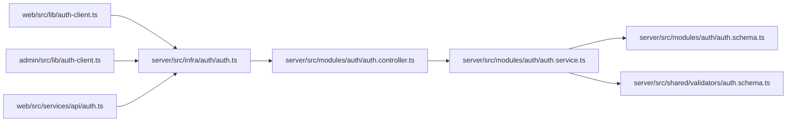

# Authentication Integration

<cite>
**Referenced Files in This Document**
- [web/src/lib/auth-client.ts](file://web/src/lib/auth-client.ts)
- [admin/src/lib/auth-client.ts](file://admin/src/lib/auth-client.ts)
- [web/src/services/api/auth.ts](file://web/src/services/api/auth.ts)
- [server/src/infra/auth/auth.ts](file://server/src/infra/auth/auth.ts)
- [web/src/components/general/OtpVerification.tsx](file://web/src/components/general/OtpVerification.tsx)
- [web/src/utils/googleOAuthRedirect.ts](file://web/src/utils/googleOAuthRedirect.ts)
- [admin/src/pages/SignInPage.tsx](file://admin/src/pages/SignInPage.tsx)
- [server/src/modules/auth/auth.controller.ts](file://server/src/modules/auth/auth.controller.ts)
- [server/src/modules/auth/auth.service.ts](file://server/src/modules/auth/auth.service.ts)
- [server/src/modules/auth/auth.schema.ts](file://server/src/modules/auth/auth.schema.ts)
- [server/src/shared/validators/auth.schema.ts](file://server/src/shared/validators/auth.schema.ts)
</cite>

## Table of Contents
1. [Introduction](#introduction)
2. [Project Structure](#project-structure)
3. [Core Components](#core-components)
4. [Architecture Overview](#architecture-overview)
5. [Detailed Component Analysis](#detailed-component-analysis)
6. [Dependency Analysis](#dependency-analysis)
7. [Performance Considerations](#performance-considerations)
8. [Troubleshooting Guide](#troubleshooting-guide)
9. [Conclusion](#conclusion)

## Introduction
This document explains the authentication integration across the web application, focusing on the authentication client implementation, token/session management, OTP verification flow, OAuth with Google, password recovery, state management, protected routing, error handling, and UX patterns. It also covers security considerations, token refresh mechanisms, and backend integration via Better Auth.

## Project Structure
Authentication spans three layers:
- Frontend clients: Web and Admin apps each configure a Better Auth client pointing to the backend `/api/auth` endpoint.
- Backend service: Better Auth configured with database adapter, email/password, social providers (Google), session caching, and plugins (two-factor, admin).
- Shared UI and utilities: OTP verification component, Google OAuth redirect utility, and typed API service wrappers.

**Diagram sources**
- [web/src/lib/auth-client.ts](file://web/src/lib/auth-client.ts#L1-L20)
- [admin/src/lib/auth-client.ts](file://admin/src/lib/auth-client.ts#L1-L11)
- [web/src/services/api/auth.ts](file://web/src/services/api/auth.ts#L1-L156)
- [web/src/components/general/OtpVerification.tsx](file://web/src/components/general/OtpVerification.tsx#L1-L140)
- [web/src/utils/googleOAuthRedirect.ts](file://web/src/utils/googleOAuthRedirect.ts#L1-L95)
- [server/src/infra/auth/auth.ts](file://server/src/infra/auth/auth.ts#L1-L85)
- [server/src/modules/auth/auth.controller.ts](file://server/src/modules/auth/auth.controller.ts)
- [server/src/modules/auth/auth.service.ts](file://server/src/modules/auth/auth.service.ts)
- [server/src/modules/auth/auth.schema.ts](file://server/src/modules/auth/auth.schema.ts)
- [server/src/shared/validators/auth.schema.ts](file://server/src/shared/validators/auth.schema.ts)

**Section sources**
- [web/src/lib/auth-client.ts](file://web/src/lib/auth-client.ts#L1-L20)
- [admin/src/lib/auth-client.ts](file://admin/src/lib/auth-client.ts#L1-L11)
- [server/src/infra/auth/auth.ts](file://server/src/infra/auth/auth.ts#L1-L85)

## Core Components
- Authentication client (Web): Initializes Better Auth with base URL and plugins including admin, inferred fields, and Google One Tap.
- Authentication client (Admin): Initializes Better Auth with admin and inferred fields plugins.
- Typed API service: Provides strongly-typed wrappers for registration, OTP, password reset, OAuth setup, sessions, and onboarding.
- OTP verification component: Reusable UI for OTP input, resend, countdown, and validation messaging.
- Google OAuth redirect utility: Handles popup-based OAuth with event listeners and fallback navigation.
- Backend Better Auth: Configured with database adapter, email/password with verification, Google OAuth, session caching, cookies, and plugins.

**Section sources**
- [web/src/lib/auth-client.ts](file://web/src/lib/auth-client.ts#L9-L19)
- [admin/src/lib/auth-client.ts](file://admin/src/lib/auth-client.ts#L4-L10)
- [web/src/services/api/auth.ts](file://web/src/services/api/auth.ts#L12-L155)
- [web/src/components/general/OtpVerification.tsx](file://web/src/components/general/OtpVerification.tsx#L11-L28)
- [web/src/utils/googleOAuthRedirect.ts](file://web/src/utils/googleOAuthRedirect.ts#L6-L20)
- [server/src/infra/auth/auth.ts](file://server/src/infra/auth/auth.ts#L11-L84)

## Architecture Overview
The frontend clients delegate authentication operations to Better Auth, which communicates with the backend. The backend enforces policies (email verification, password reset behavior, session caching, and cookie attributes) and exposes REST endpoints consumed by the frontend API service.

**Diagram sources**
- [web/src/lib/auth-client.ts](file://web/src/lib/auth-client.ts#L9-L19)
- [web/src/services/api/auth.ts](file://web/src/services/api/auth.ts#L134-L145)
- [server/src/infra/auth/auth.ts](file://server/src/infra/auth/auth.ts#L11-L84)

## Detailed Component Analysis

### Authentication Client Implementation
- Web client:
  - Base URL targets `/api/auth`.
  - Plugins: admin, inferred fields, Google One Tap with popup UX mode.
  - Exposes sign-in/sign-out, session management, and social providers.
- Admin client:
  - Base URL targets `/api/auth`.
  - Plugins: admin, inferred fields.
  - Tailored for administrative access flows.

**Diagram sources**
- [web/src/lib/auth-client.ts](file://web/src/lib/auth-client.ts#L9-L19)
- [admin/src/lib/auth-client.ts](file://admin/src/lib/auth-client.ts#L4-L10)

**Section sources**
- [web/src/lib/auth-client.ts](file://web/src/lib/auth-client.ts#L9-L19)
- [admin/src/lib/auth-client.ts](file://admin/src/lib/auth-client.ts#L4-L10)

### Token Management and Session Handling
- Session caching:
  - Cookie cache enabled with JWE strategy and stateless refresh.
  - Max age configured for 7 days.
- Cookie attributes:
  - SameSite, secure, and httpOnly adjusted per environment.
  - Cross-subdomain cookies enabled.
- Refresh mechanism:
  - Frontend calls `auth.session.refresh()` to renew session.
- Logout:
  - Supports logout and logout-all endpoints.

**Diagram sources**
- [server/src/infra/auth/auth.ts](file://server/src/infra/auth/auth.ts#L61-L68)
- [web/src/services/api/auth.ts](file://web/src/services/api/auth.ts#L142-L145)

**Section sources**
- [server/src/infra/auth/auth.ts](file://server/src/infra/auth/auth.ts#L61-L78)
- [web/src/services/api/auth.ts](file://web/src/services/api/auth.ts#L134-L153)

### OTP Verification Flow
- Endpoints:
  - Send OTP for registration, deletion, and login.
  - Verify OTP for registration and deletion.
- Frontend component:
  - InputOTP with six slots, resend logic, countdown, attempt limits, and validation messaging.
  - Controlled via props for email, OTP value, callbacks, loading states, and attempt counters.
- UX pattern:
  - Clear messaging for resend availability, invalid OTP, and max attempts.
  - Disabled input during cooldown or after max attempts.

**Diagram sources**
- [web/src/services/api/auth.ts](file://web/src/services/api/auth.ts#L18-L60)
- [web/src/components/general/OtpVerification.tsx](file://web/src/components/general/OtpVerification.tsx#L30-L139)

**Section sources**
- [web/src/services/api/auth.ts](file://web/src/services/api/auth.ts#L18-L60)
- [web/src/components/general/OtpVerification.tsx](file://web/src/components/general/OtpVerification.tsx#L30-L139)

### OAuth Integration with Google
- Frontend:
  - Better Auth client configured with Google One Tap client ID.
  - Utility opens a centered popup to the OAuth URL and listens for storage or message events to detect success and close the popup.
- Backend:
  - Better Auth configured with Google OAuth client ID and secret.
  - Cookie strategy stores account data post-OAuth.
- Fallback:
  - If popup fails, redirects to OAuth URL.

**Diagram sources**
- [web/src/utils/googleOAuthRedirect.ts](file://web/src/utils/googleOAuthRedirect.ts#L6-L39)
- [web/src/lib/auth-client.ts](file://web/src/lib/auth-client.ts#L14-L17)
- [server/src/infra/auth/auth.ts](file://server/src/infra/auth/auth.ts#L55-L60)

**Section sources**
- [web/src/utils/googleOAuthRedirect.ts](file://web/src/utils/googleOAuthRedirect.ts#L6-L95)
- [web/src/lib/auth-client.ts](file://web/src/lib/auth-client.ts#L14-L17)
- [server/src/infra/auth/auth.ts](file://server/src/infra/auth/auth.ts#L55-L60)

### Password Recovery Mechanisms
- Initialize reset:
  - Calls `/api/auth/password/forgot` with email and optional redirect.
- Finalize reset:
  - Calls `/api/auth/password/reset` with new password and optional token.
- Backend behavior:
  - Sends reset email via mail service.
  - On successful reset, auto-verifies email if not verified.

**Diagram sources**
- [web/src/services/api/auth.ts](file://web/src/services/api/auth.ts#L75-L90)
- [server/src/infra/auth/auth.ts](file://server/src/infra/auth/auth.ts#L38-L53)

**Section sources**
- [web/src/services/api/auth.ts](file://web/src/services/api/auth.ts#L62-L90)
- [server/src/infra/auth/auth.ts](file://server/src/infra/auth/auth.ts#L38-L53)

### Authentication State Management and Protected Routes
- State management:
  - Better Auth manages session state and cookies.
  - Frontend waits briefly for session readiness after sign-in before navigating.
- Protected routes:
  - Admin sign-in page checks role and restricts unauthorized users.
- UX:
  - Loading states, error toasts, and delayed session reads improve reliability.

**Diagram sources**
- [admin/src/pages/SignInPage.tsx](file://admin/src/pages/SignInPage.tsx#L38-L78)

**Section sources**
- [admin/src/pages/SignInPage.tsx](file://admin/src/pages/SignInPage.tsx#L24-L78)

### Form Validation and User Experience Patterns
- Zod schemas validate email and password length.
- Real-time error rendering with react-hook-form.
- Password visibility toggle with warning toast.
- OTP component provides resend, countdown, invalid OTP, and max attempts messaging.
- Consistent button states (loading, disabled) and clear feedback.

**Section sources**
- [admin/src/pages/SignInPage.tsx](file://admin/src/pages/SignInPage.tsx#L15-L18)
- [admin/src/pages/SignInPage.tsx](file://admin/src/pages/SignInPage.tsx#L80-L129)
- [web/src/components/general/OtpVerification.tsx](file://web/src/components/general/OtpVerification.tsx#L47-L139)

### Security Considerations
- Cookie security:
  - HttpOnly, Secure, SameSite adjustments per environment.
  - Cross-subdomain cookies enabled.
- Session caching:
  - JWE strategy and stateless refresh reduce server state.
- Email verification:
  - Require email verification for email/password.
- OAuth:
  - Client secrets configured on backend; popup UX reduces phishing risks.
- Rate limiting and RBAC:
  - Middleware and RBAC modules present in server for additional protections.

**Section sources**
- [server/src/infra/auth/auth.ts](file://server/src/infra/auth/auth.ts#L70-L78)
- [server/src/infra/middlewares/rate-limit.middleware.ts](file://server/src/core/middlewares/rate-limit.middleware.ts)
- [server/src/core/security/rbac.ts](file://server/src/core/security/rbac.ts)

## Dependency Analysis
- Frontend depends on Better Auth client for authentication operations.
- Typed API service abstracts HTTP calls to `/api/auth` endpoints.
- Backend Better Auth integrates with database adapter and mail service.
- Controllers and services orchestrate domain logic with validated schemas.

**Diagram sources**
- [web/src/lib/auth-client.ts](file://web/src/lib/auth-client.ts#L9-L19)
- [admin/src/lib/auth-client.ts](file://admin/src/lib/auth-client.ts#L4-L10)
- [web/src/services/api/auth.ts](file://web/src/services/api/auth.ts#L1-L156)
- [server/src/infra/auth/auth.ts](file://server/src/infra/auth/auth.ts#L1-L85)
- [server/src/modules/auth/auth.controller.ts](file://server/src/modules/auth/auth.controller.ts)
- [server/src/modules/auth/auth.service.ts](file://server/src/modules/auth/auth.service.ts)
- [server/src/modules/auth/auth.schema.ts](file://server/src/modules/auth/auth.schema.ts)
- [server/src/shared/validators/auth.schema.ts](file://server/src/shared/validators/auth.schema.ts)

**Section sources**
- [web/src/lib/auth-client.ts](file://web/src/lib/auth-client.ts#L9-L19)
- [admin/src/lib/auth-client.ts](file://admin/src/lib/auth-client.ts#L4-L10)
- [web/src/services/api/auth.ts](file://web/src/services/api/auth.ts#L1-L156)
- [server/src/infra/auth/auth.ts](file://server/src/infra/auth/auth.ts#L1-L85)

## Performance Considerations
- Stateless refresh reduces server-side session storage overhead.
- Cookie cache with JWE minimizes round trips and server load.
- Popup-based OAuth avoids full-page redirects, improving perceived performance.
- Debounce resend requests and limit OTP attempts to prevent abuse.

## Troubleshooting Guide
- Session not ready after sign-in:
  - The admin sign-in flow retries retrieving the session before navigation.
- OAuth popup blocked:
  - Utility falls back to direct navigation if popup fails.
- Invalid OTP or max attempts:
  - UI disables input and shows appropriate messages.
- Password reset not received:
  - Confirm email delivery and backend mail service configuration.
- CORS or origin mismatches:
  - Verify trusted origins and base URL configuration in Better Auth.

**Section sources**
- [admin/src/pages/SignInPage.tsx](file://admin/src/pages/SignInPage.tsx#L52-L58)
- [web/src/utils/googleOAuthRedirect.ts](file://web/src/utils/googleOAuthRedirect.ts#L33-L36)
- [web/src/components/general/OtpVerification.tsx](file://web/src/components/general/OtpVerification.tsx#L112-L122)
- [server/src/infra/auth/auth.ts](file://server/src/infra/auth/auth.ts#L15-L15)

## Conclusion
The authentication integration leverages Better Auth on the backend with dedicated frontend clients for Web and Admin. Strong typing, reusable UI components, robust session caching, and clear UX patterns deliver a secure and reliable experience. The design supports OTP verification, Google OAuth, password recovery, and protected routing while maintaining strong security defaults.