# Component Library

<cite>
**Referenced Files in This Document**
- [admin/src/components/ui/button.tsx](file://admin/src/components/ui/button.tsx)
- [admin/src/components/ui/input.tsx](file://admin/src/components/ui/input.tsx)
- [admin/src/components/ui/form.tsx](file://admin/src/components/ui/form.tsx)
- [admin/src/components/ui/card.tsx](file://admin/src/components/ui/card.tsx)
- [admin/src/components/ui/avatar.tsx](file://admin/src/components/ui/avatar.tsx)
- [admin/src/components/ui/dialog.tsx](file://admin/src/components/ui/dialog.tsx)
- [admin/src/components/ui/select.tsx](file://admin/src/components/ui/select.tsx)
- [admin/src/components/ui/textarea.tsx](file://admin/src/components/ui/textarea.tsx)
- [admin/src/components/ui/badge.tsx](file://admin/src/components/ui/badge.tsx)
- [admin/src/components/ui/label.tsx](file://admin/src/components/ui/label.tsx)
- [admin/src/components/ui/table.tsx](file://admin/src/components/ui/table.tsx)
- [admin/src/components/ui/pagination.tsx](file://admin/src/components/ui/pagination.tsx)
- [admin/src/components/ui/switch.tsx](file://admin/src/components/ui/switch.tsx)
- [admin/src/components/ui/progress.tsx](file://admin/src/components/ui/progress.tsx)
- [admin/src/components/ui/skeleton.tsx](file://admin/src/components/ui/skeleton.tsx)
</cite>

## Table of Contents
1. [Introduction](#introduction)
2. [Project Structure](#project-structure)
3. [Core Components](#core-components)
4. [Architecture Overview](#architecture-overview)
5. [Detailed Component Analysis](#detailed-component-analysis)
6. [Dependency Analysis](#dependency-analysis)
7. [Performance Considerations](#performance-considerations)
8. [Troubleshooting Guide](#troubleshooting-guide)
9. [Conclusion](#conclusion)
10. [Appendices](#appendices)

## Introduction
This document describes the custom component library built with Radix UI primitives and Tailwind CSS. It focuses on foundational components such as Button, Input, Form, Card, and Avatar, and expands to include related interactive and layout components like Dialog, Select, Textarea, Badge, Label, Table, Pagination, Switch, Progress, and Skeleton. For each component, we document props, variants, composition patterns, styling approaches, accessibility features, and customization options. We also explain how these components integrate with themes and responsive design patterns and provide usage examples and best practices for consistent UI development.

## Project Structure
The component library is organized under the admin application’s UI module. Each component is a self-contained React forward-ref wrapper around a Radix UI primitive or a native element, styled with Tailwind utility classes and composed via a shared cn utility. Variants are defined using class-variance-authority to keep styles declarative and centralized.

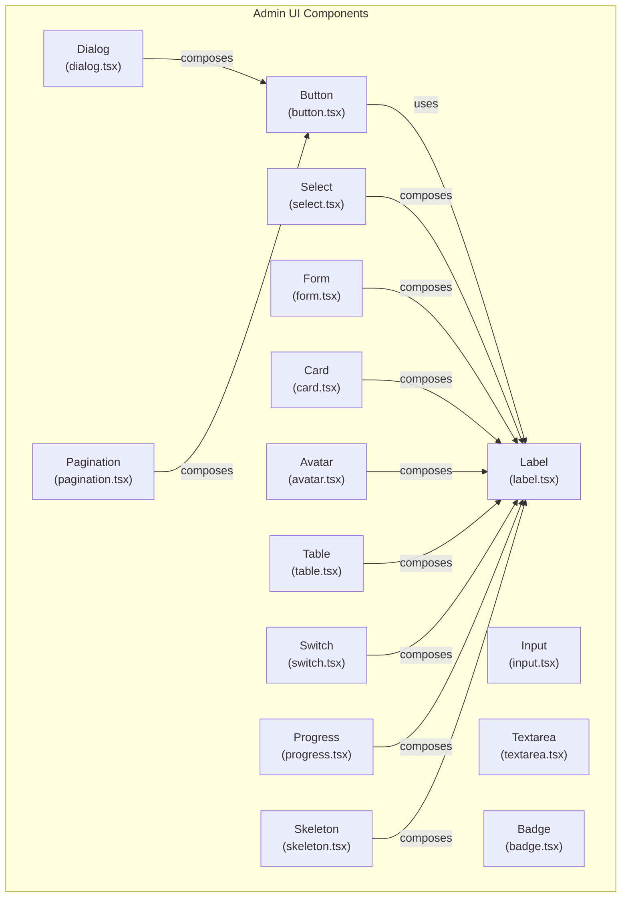

**Diagram sources**
- [admin/src/components/ui/button.tsx](file://admin/src/components/ui/button.tsx#L1-L58)
- [admin/src/components/ui/input.tsx](file://admin/src/components/ui/input.tsx#L1-L23)
- [admin/src/components/ui/textarea.tsx](file://admin/src/components/ui/textarea.tsx#L1-L23)
- [admin/src/components/ui/label.tsx](file://admin/src/components/ui/label.tsx#L1-L27)
- [admin/src/components/ui/badge.tsx](file://admin/src/components/ui/badge.tsx#L1-L37)
- [admin/src/components/ui/card.tsx](file://admin/src/components/ui/card.tsx#L1-L77)
- [admin/src/components/ui/avatar.tsx](file://admin/src/components/ui/avatar.tsx#L1-L49)
- [admin/src/components/ui/dialog.tsx](file://admin/src/components/ui/dialog.tsx#L1-L121)
- [admin/src/components/ui/select.tsx](file://admin/src/components/ui/select.tsx#L1-L158)
- [admin/src/components/ui/form.tsx](file://admin/src/components/ui/form.tsx#L1-L177)
- [admin/src/components/ui/table.tsx](file://admin/src/components/ui/table.tsx#L1-L121)
- [admin/src/components/ui/pagination.tsx](file://admin/src/components/ui/pagination.tsx#L1-L118)
- [admin/src/components/ui/switch.tsx](file://admin/src/components/ui/switch.tsx#L1-L30)
- [admin/src/components/ui/progress.tsx](file://admin/src/components/ui/progress.tsx#L1-L27)
- [admin/src/components/ui/skeleton.tsx](file://admin/src/components/ui/skeleton.tsx#L1-L16)

**Section sources**
- [admin/src/components/ui/button.tsx](file://admin/src/components/ui/button.tsx#L1-L58)
- [admin/src/components/ui/input.tsx](file://admin/src/components/ui/input.tsx#L1-L23)
- [admin/src/components/ui/form.tsx](file://admin/src/components/ui/form.tsx#L1-L177)

## Core Components
This section documents the foundational components and their capabilities.

- Button
  - Purpose: Primary action trigger with consistent spacing, focus states, and variants.
  - Props:
    - variant: default | destructive | outline | secondary | ghost | link
    - size: default | sm | lg | icon
    - asChild: wrap children in a Radix Slot to preserve semantics
    - Inherits standard button attributes
  - Accessibility: Focus-visible outline, ring focus styles, disabled state handling.
  - Composition: Uses class-variance-authority for variants and cn for merging classes.
  - Usage pattern: Prefer asChild when nesting inside links or semantic wrappers.

- Input
  - Purpose: Single-line text input with consistent padding, focus ring, and placeholder styling.
  - Props: type, className, and standard input attributes.
  - Accessibility: Focus ring, disabled state, placeholder color.
  - Composition: Tailwind classes define base styles; className merges overrides.

- Form
  - Purpose: Integration with react-hook-form using Radix UI contexts and slots.
  - Composition primitives:
    - Form: Provider wrapping useFormContext
    - FormField: Controller wrapper with name context
    - FormItem: Container with generated id context
    - FormLabel: Label bound to field id with error-aware styling
    - FormControl: Slot proxying child refs and ARIA attributes
    - FormDescription: Helper text container
    - FormMessage: Error message display with dynamic content
  - Accessibility: ARIA-describedby, aria-invalid, and generated ids ensure screen reader compatibility.

- Card
  - Purpose: Content container with header, title, description, content, and footer slots.
  - Props: className and standard div attributes for each slot.
  - Composition: Each slot is a forwardRef component to maintain semantic structure.

- Avatar
  - Purpose: User identity with image and fallback visuals.
  - Slots:
    - Avatar: Root container
    - AvatarImage: Image with aspect-square sizing
    - AvatarFallback: Placeholder when image is missing
  - Accessibility: Inherits Radix semantics; ensure alt text on images when applicable.

**Section sources**
- [admin/src/components/ui/button.tsx](file://admin/src/components/ui/button.tsx#L37-L58)
- [admin/src/components/ui/input.tsx](file://admin/src/components/ui/input.tsx#L5-L23)
- [admin/src/components/ui/form.tsx](file://admin/src/components/ui/form.tsx#L16-L177)
- [admin/src/components/ui/card.tsx](file://admin/src/components/ui/card.tsx#L5-L77)
- [admin/src/components/ui/avatar.tsx](file://admin/src/components/ui/avatar.tsx#L6-L49)

## Architecture Overview
The component library follows a layered pattern:
- Primitive layer: Radix UI primitives for accessibility and behavior.
- Styling layer: Tailwind utility classes and class-variance-authority for variants.
- Composition layer: Forward-ref wrappers and context providers for form integration.
- Export layer: Clean component APIs with consistent prop interfaces.

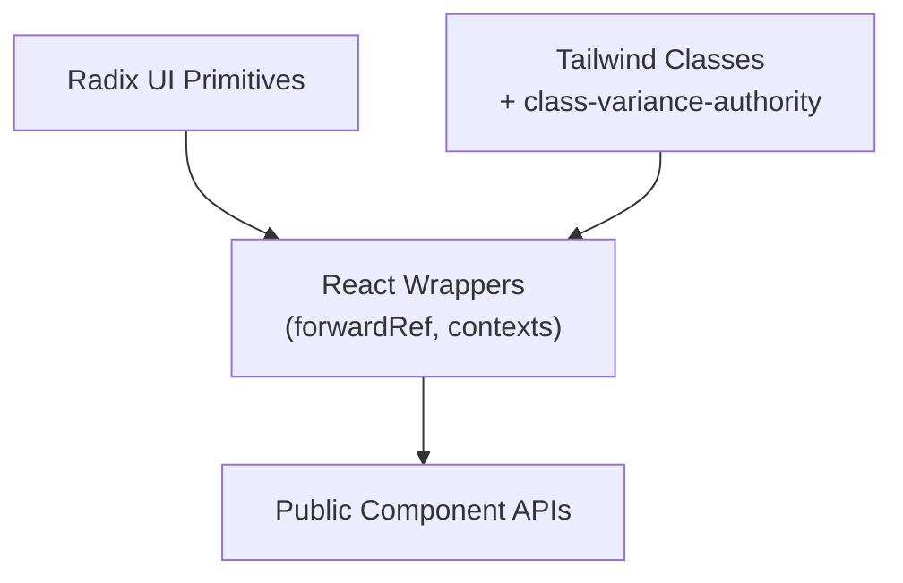

[No sources needed since this diagram shows conceptual workflow, not actual code structure]

## Detailed Component Analysis

### Button
- Variants and sizes are defined centrally and applied via class-variance-authority.
- asChild enables composition with semantic anchors or buttons while preserving accessibility.
- Focus and disabled states are handled consistently across variants.

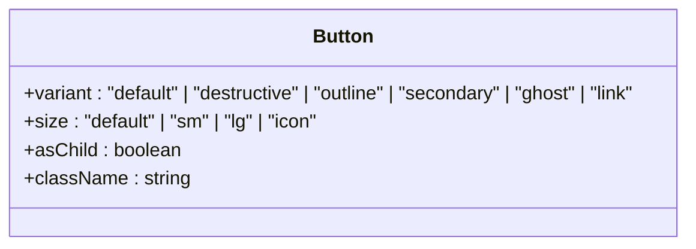

**Diagram sources**
- [admin/src/components/ui/button.tsx](file://admin/src/components/ui/button.tsx#L7-L35)

**Section sources**
- [admin/src/components/ui/button.tsx](file://admin/src/components/ui/button.tsx#L37-L58)

### Input
- Base styling ensures consistent height, padding, focus ring, and disabled state.
- Supports standard input attributes; className merges with defaults.

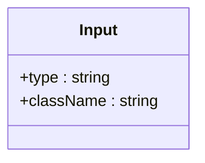

**Diagram sources**
- [admin/src/components/ui/input.tsx](file://admin/src/components/ui/input.tsx#L5-L23)

**Section sources**
- [admin/src/components/ui/input.tsx](file://admin/src/components/ui/input.tsx#L5-L23)

### Form
- Provides a cohesive form ecosystem integrating react-hook-form with Radix UI.
- useFormField centralizes access to ids, error state, and field metadata.
- Accessibility attributes are automatically wired for labels, controls, and messages.

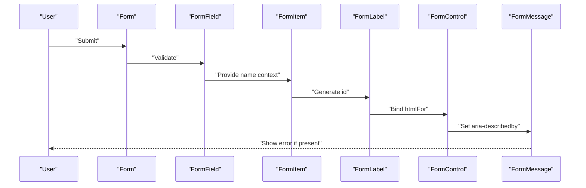

**Diagram sources**
- [admin/src/components/ui/form.tsx](file://admin/src/components/ui/form.tsx#L16-L177)

**Section sources**
- [admin/src/components/ui/form.tsx](file://admin/src/components/ui/form.tsx#L16-L177)

### Card
- Composable layout with header, title, description, content, and footer slots.
- Maintains consistent spacing and typography via Tailwind classes.

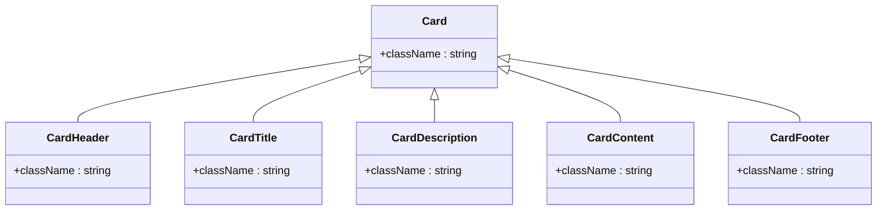

**Diagram sources**
- [admin/src/components/ui/card.tsx](file://admin/src/components/ui/card.tsx#L5-L77)

**Section sources**
- [admin/src/components/ui/card.tsx](file://admin/src/components/ui/card.tsx#L5-L77)

### Avatar
- Encapsulates Radix Avatar with consistent sizing and fallback visuals.

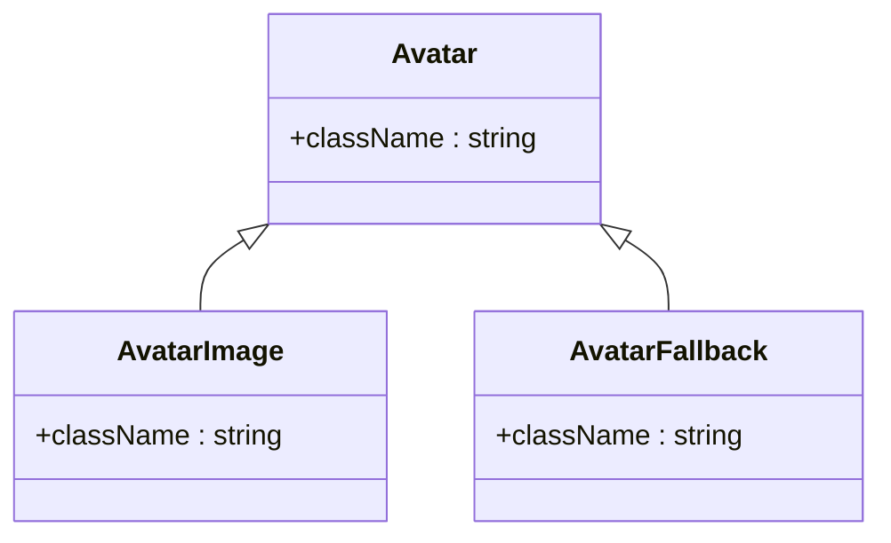

**Diagram sources**
- [admin/src/components/ui/avatar.tsx](file://admin/src/components/ui/avatar.tsx#L6-L49)

**Section sources**
- [admin/src/components/ui/avatar.tsx](file://admin/src/components/ui/avatar.tsx#L6-L49)

### Dialog
- Composed from Radix Dialog primitives with overlay animation and close button.
- Portal rendering ensures proper stacking and focus management.

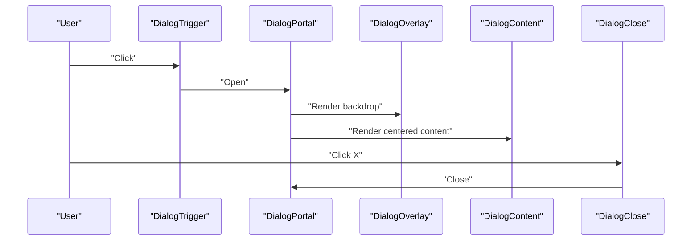

**Diagram sources**
- [admin/src/components/ui/dialog.tsx](file://admin/src/components/ui/dialog.tsx#L7-L121)

**Section sources**
- [admin/src/components/ui/dialog.tsx](file://admin/src/components/ui/dialog.tsx#L7-L121)

### Select
- Composite component with trigger, content, viewport, and item rendering.
- Supports scrollable content and indicator visuals.

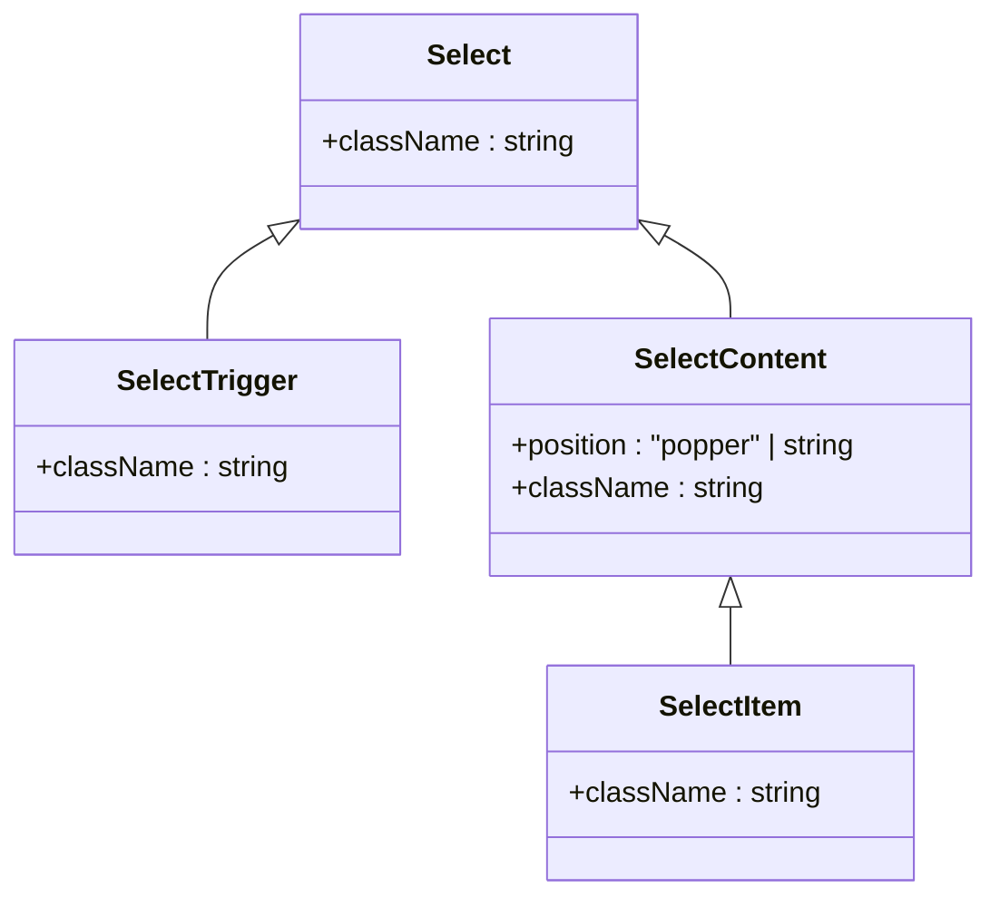

**Diagram sources**
- [admin/src/components/ui/select.tsx](file://admin/src/components/ui/select.tsx#L7-L158)

**Section sources**
- [admin/src/components/ui/select.tsx](file://admin/src/components/ui/select.tsx#L7-L158)

### Textarea
- Multi-line text area with consistent focus ring and placeholder styling.

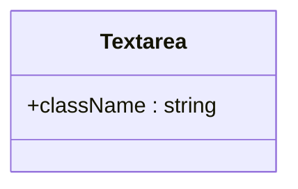

**Diagram sources**
- [admin/src/components/ui/textarea.tsx](file://admin/src/components/ui/textarea.tsx#L5-L23)

**Section sources**
- [admin/src/components/ui/textarea.tsx](file://admin/src/components/ui/textarea.tsx#L5-L23)

### Badge
- Lightweight indicator with variant-driven styling.

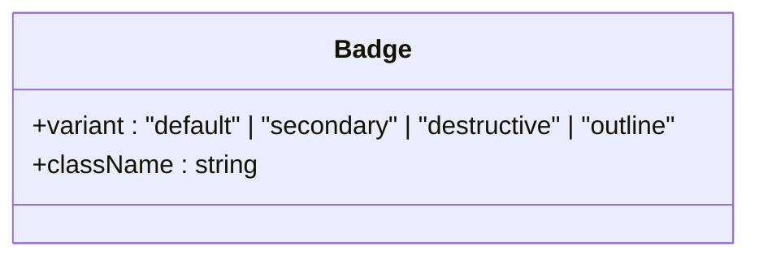

**Diagram sources**
- [admin/src/components/ui/badge.tsx](file://admin/src/components/ui/badge.tsx#L6-L37)

**Section sources**
- [admin/src/components/ui/badge.tsx](file://admin/src/components/ui/badge.tsx#L6-L37)

### Label
- Styled label for form inputs with peer-disabled handling.

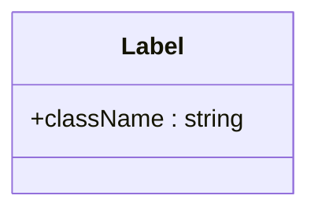

**Diagram sources**
- [admin/src/components/ui/label.tsx](file://admin/src/components/ui/label.tsx#L9-L27)

**Section sources**
- [admin/src/components/ui/label.tsx](file://admin/src/components/ui/label.tsx#L9-L27)

### Table
- Scrollable table wrapper with semantic row, head, cell, and caption components.

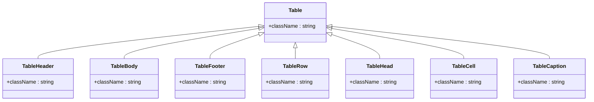

**Diagram sources**
- [admin/src/components/ui/table.tsx](file://admin/src/components/ui/table.tsx#L5-L121)

**Section sources**
- [admin/src/components/ui/table.tsx](file://admin/src/components/ui/table.tsx#L5-L121)

### Pagination
- Navigation links styled via Button variants and size options.

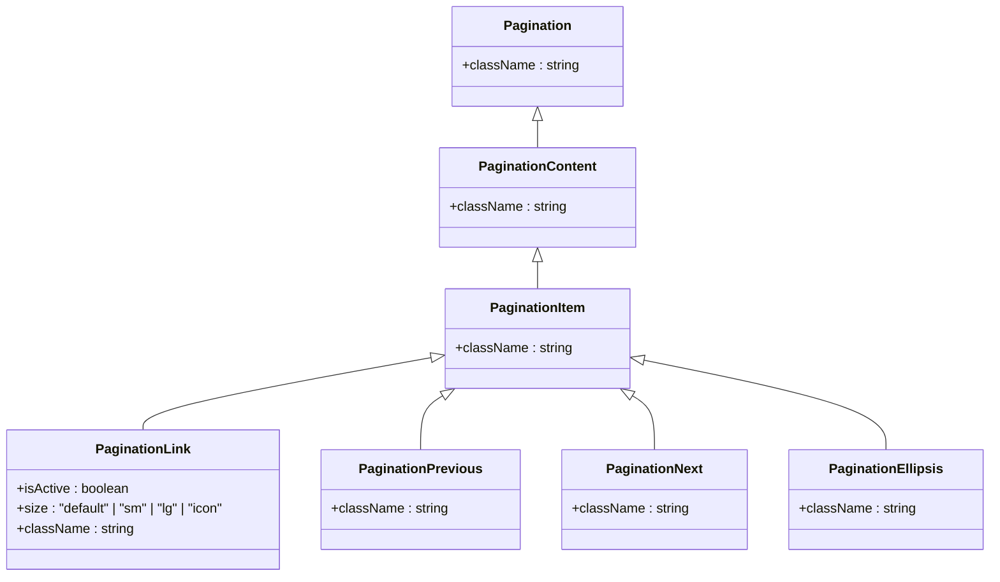

**Diagram sources**
- [admin/src/components/ui/pagination.tsx](file://admin/src/components/ui/pagination.tsx#L7-L118)

**Section sources**
- [admin/src/components/ui/pagination.tsx](file://admin/src/components/ui/pagination.tsx#L7-L118)

### Switch
- Toggle control with checked/unchecked state styling.

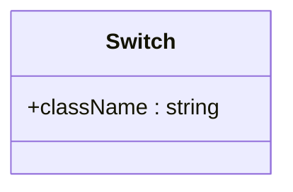

**Diagram sources**
- [admin/src/components/ui/switch.tsx](file://admin/src/components/ui/switch.tsx#L8-L30)

**Section sources**
- [admin/src/components/ui/switch.tsx](file://admin/src/components/ui/switch.tsx#L8-L30)

### Progress
- Progress bar with dynamic width based on value.

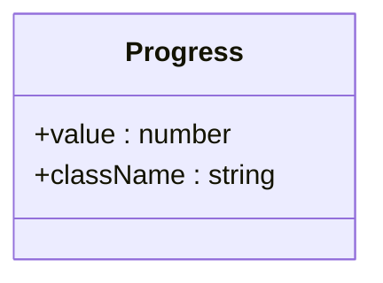

**Diagram sources**
- [admin/src/components/ui/progress.tsx](file://admin/src/components/ui/progress.tsx#L6-L27)

**Section sources**
- [admin/src/components/ui/progress.tsx](file://admin/src/components/ui/progress.tsx#L6-L27)

### Skeleton
- Animated placeholder container for loading states.

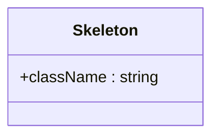

**Diagram sources**
- [admin/src/components/ui/skeleton.tsx](file://admin/src/components/ui/skeleton.tsx#L3-L16)

**Section sources**
- [admin/src/components/ui/skeleton.tsx](file://admin/src/components/ui/skeleton.tsx#L3-L16)

## Dependency Analysis
- Internal dependencies:
  - Button is used by Pagination for link styling.
  - Dialog composes Button for its close control.
  - Select composes Label for accessible labeling.
  - Form composes Label and integrates with react-hook-form.
- External dependencies:
  - Radix UI primitives for accessibility and behavior.
  - class-variance-authority for variant definitions.
  - lucide-react icons for decorative elements.
  - react-hook-form for form state management.

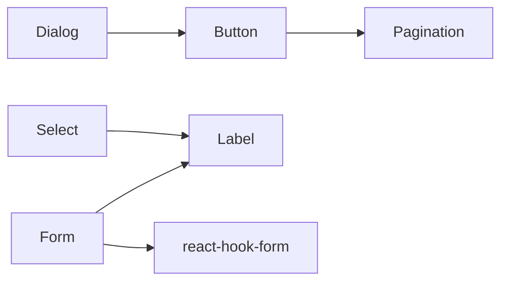

**Diagram sources**
- [admin/src/components/ui/pagination.tsx](file://admin/src/components/ui/pagination.tsx#L5-L118)
- [admin/src/components/ui/dialog.tsx](file://admin/src/components/ui/dialog.tsx#L45-L51)
- [admin/src/components/ui/select.tsx](file://admin/src/components/ui/select.tsx#L100-L110)
- [admin/src/components/ui/form.tsx](file://admin/src/components/ui/form.tsx#L1-L177)

**Section sources**
- [admin/src/components/ui/pagination.tsx](file://admin/src/components/ui/pagination.tsx#L5-L118)
- [admin/src/components/ui/dialog.tsx](file://admin/src/components/ui/dialog.tsx#L45-L51)
- [admin/src/components/ui/select.tsx](file://admin/src/components/ui/select.tsx#L100-L110)
- [admin/src/components/ui/form.tsx](file://admin/src/components/ui/form.tsx#L1-L177)

## Performance Considerations
- Prefer asChild for Button to avoid unnecessary DOM nodes and preserve semantics.
- Use class-variance-authority variants to minimize conditional class concatenation overhead.
- Keep className merges shallow; avoid heavy computations inside render paths.
- For lists and tables, leverage virtualization libraries when datasets grow large.
- Defer heavy computations in controlled components; use react-hook-form’s optimized re-rendering.

[No sources needed since this section provides general guidance]

## Troubleshooting Guide
- Form errors not visible:
  - Ensure FormMessage renders and receives error from useFormField.
  - Verify FormControl sets aria-describedby and aria-invalid correctly.
- Dialog focus issues:
  - Confirm DialogPortal wraps content and that focus trapping is enabled by Radix.
- Select items not selectable:
  - Check SelectItem is rendered within SelectContent and SelectPrimitive.Viewport.
- Button disabled state not applying:
  - Ensure disabled prop is passed and variant classes handle pointer-events and opacity.
- Avatar fallback not showing:
  - Provide AvatarFallback and ensure AvatarImage fails to load or is absent.

**Section sources**
- [admin/src/components/ui/form.tsx](file://admin/src/components/ui/form.tsx#L143-L165)
- [admin/src/components/ui/dialog.tsx](file://admin/src/components/ui/dialog.tsx#L30-L52)
- [admin/src/components/ui/select.tsx](file://admin/src/components/ui/select.tsx#L112-L132)
- [admin/src/components/ui/button.tsx](file://admin/src/components/ui/button.tsx#L43-L55)
- [admin/src/components/ui/avatar.tsx](file://admin/src/components/ui/avatar.tsx#L21-L46)

## Conclusion
The component library leverages Radix UI for robust accessibility and behavior, Tailwind for consistent styling, and class-variance-authority for scalable variants. Components are designed for composability, with clear separation of concerns across primitive, styling, and composition layers. By following the documented patterns and best practices, teams can build consistent, accessible, and maintainable user interfaces across the application.

[No sources needed since this section summarizes without analyzing specific files]

## Appendices
- Theming and customization:
  - Override default classes via className prop on any component.
  - Extend variants using class-variance-authority in local wrappers when needed.
  - Centralize theme tokens in Tailwind configuration and reference them in component classes.
- Responsive design:
  - Use Tailwind responsive prefixes on className to adapt components across breakpoints.
  - Ensure focus rings and paddings remain usable on small screens.
- Accessibility checklist:
  - Always pair labels with controls; use FormLabel and htmlFor where applicable.
  - Provide meaningful aria-describedby and aria-invalid attributes.
  - Ensure keyboard navigation and focus management in composite components (Dialog, Select, Table).
  - Test with screen readers and keyboard-only navigation.

[No sources needed since this section provides general guidance]