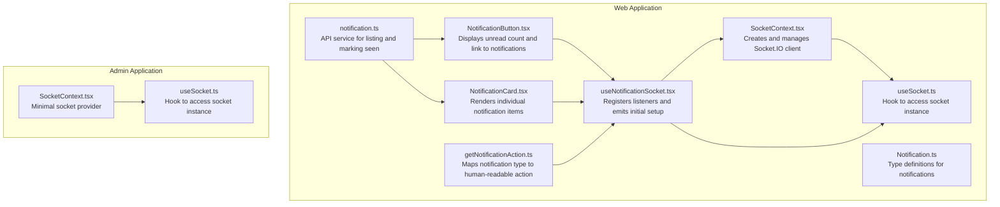
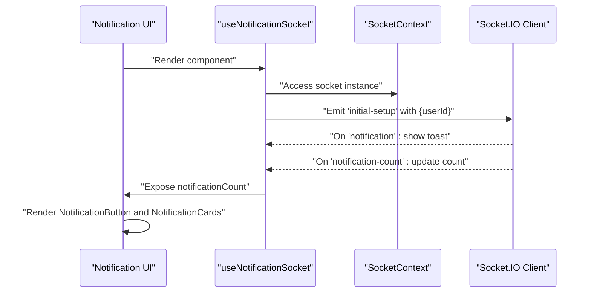
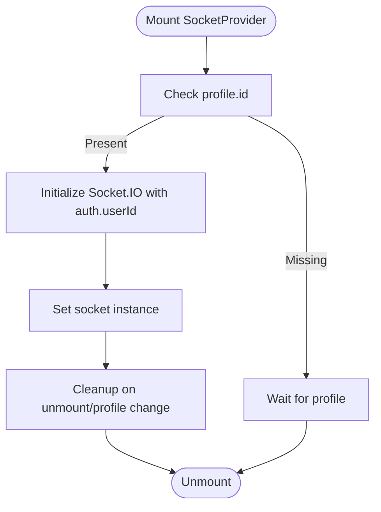
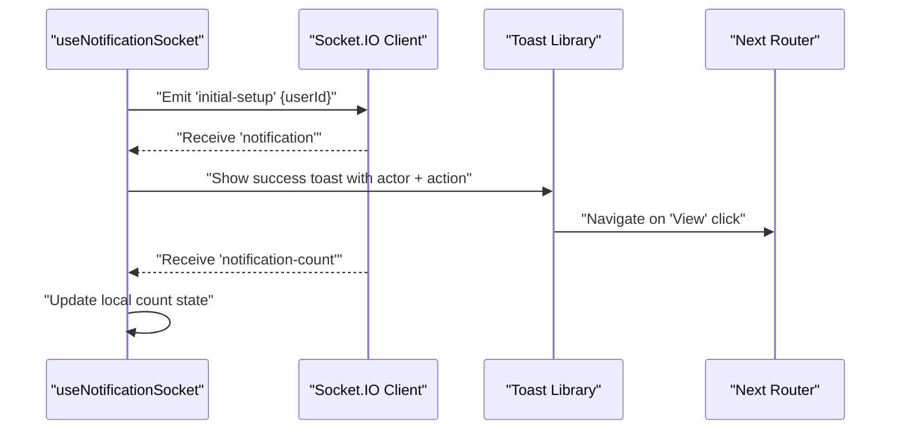
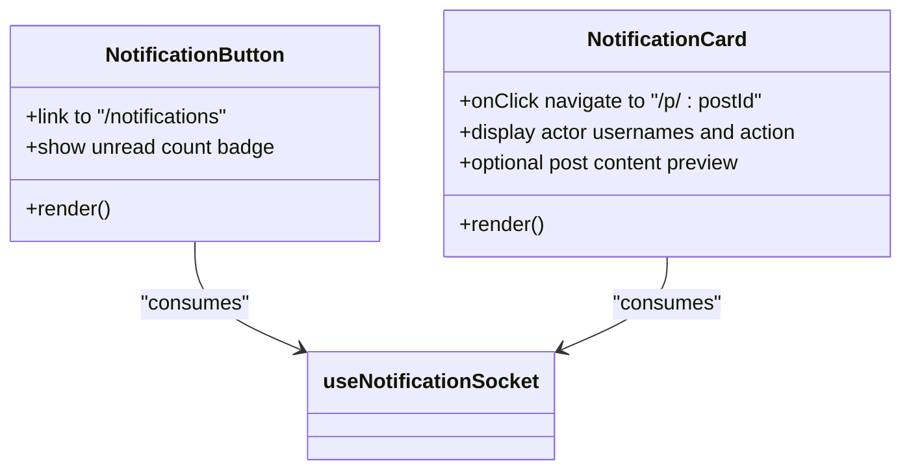
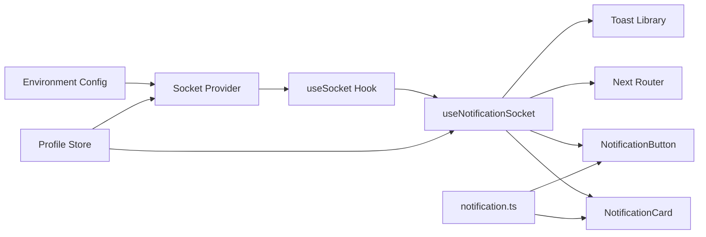

# Real-Time Communication

<cite>
**Referenced Files in This Document**
- [SocketContext.tsx](file://web/src/socket/SocketContext.tsx)
- [useSocket.ts](file://web/src/socket/useSocket.ts)
- [useNotificationSocket.tsx](file://web/src/hooks/useNotificationSocket.tsx)
- [NotificationButton.tsx](file://web/src/components/general/NotificationButton.tsx)
- [NotificationCard.tsx](file://web/src/components/general/NotificationCard.tsx)
- [getNotificationAction.ts](file://web/src/utils/getNotificationAction.ts)
- [Notification.ts](file://web/src/types/Notification.ts)
- [notification.ts](file://web/src/services/api/notification.ts)
- [SocketContext.tsx](file://admin/src/socket/SocketContext.tsx)
- [useSocket.ts](file://admin/src/socket/useSocket.ts)
</cite>

## Table of Contents
1. [Introduction](#introduction)
2. [Project Structure](#project-structure)
3. [Core Components](#core-components)
4. [Architecture Overview](#architecture-overview)
5. [Detailed Component Analysis](#detailed-component-analysis)
6. [Dependency Analysis](#dependency-analysis)
7. [Performance Considerations](#performance-considerations)
8. [Troubleshooting Guide](#troubleshooting-guide)
9. [Conclusion](#conclusion)

## Introduction
This document explains the real-time communication implementation using Socket.IO across the web application. It covers socket connection management, context provider setup, hook-based integration patterns, and the notification system including real-time alerts, notification display components, and user interaction handling. It also documents socket events, message formatting, connection state management, notification action handling, real-time updates for posts and comments, and performance considerations, error handling, reconnection strategies, and debugging approaches for WebSocket connections.

## Project Structure
The real-time features are primarily implemented in the web application under the Next.js frontend. The admin application also includes a minimal socket context and hook for demonstration. The notification system integrates socket-driven real-time updates with UI components and a lightweight API surface for persisted notifications.

**Diagram sources**
- [SocketContext.tsx](file://web/src/socket/SocketContext.tsx#L1-L45)
- [useSocket.ts](file://web/src/socket/useSocket.ts#L1-L9)
- [useNotificationSocket.tsx](file://web/src/hooks/useNotificationSocket.tsx#L1-L54)
- [NotificationButton.tsx](file://web/src/components/general/NotificationButton.tsx#L1-L21)
- [NotificationCard.tsx](file://web/src/components/general/NotificationCard.tsx#L1-L55)
- [getNotificationAction.ts](file://web/src/utils/getNotificationAction.ts#L1-L19)
- [Notification.ts](file://web/src/types/Notification.ts#L1-L22)
- [notification.ts](file://web/src/services/api/notification.ts#L1-L11)
- [SocketContext.tsx](file://admin/src/socket/SocketContext.tsx#L1-L26)
- [useSocket.ts](file://admin/src/socket/useSocket.ts#L1-L13)

**Section sources**
- [SocketContext.tsx](file://web/src/socket/SocketContext.tsx#L1-L45)
- [useSocket.ts](file://web/src/socket/useSocket.ts#L1-L9)
- [useNotificationSocket.tsx](file://web/src/hooks/useNotificationSocket.tsx#L1-L54)
- [NotificationButton.tsx](file://web/src/components/general/NotificationButton.tsx#L1-L21)
- [NotificationCard.tsx](file://web/src/components/general/NotificationCard.tsx#L1-L55)
- [getNotificationAction.ts](file://web/src/utils/getNotificationAction.ts#L1-L19)
- [Notification.ts](file://web/src/types/Notification.ts#L1-L22)
- [notification.ts](file://web/src/services/api/notification.ts#L1-L11)
- [SocketContext.tsx](file://admin/src/socket/SocketContext.tsx#L1-L26)
- [useSocket.ts](file://admin/src/socket/useSocket.ts#L1-L13)

## Core Components
- Socket Provider and Hook (web):
  - Socket provider initializes a Socket.IO client with WebSocket transport and attaches authentication credentials derived from the user’s profile.
  - The provider cleans up the socket on unmount or when the user profile changes.
  - The hook exposes the socket instance to components safely.

- Notification Hook (web):
  - Emits an initial setup event with the authenticated user ID.
  - Registers listeners for real-time notification events and counts.
  - Displays toast notifications with contextual actions and maintains an unread count.

- Notification UI (web):
  - NotificationButton displays the unread count and navigates to the notifications page.
  - NotificationCard renders notification entries with appropriate icons and text based on notification type.

- Types and Utilities (web):
  - Notification type definitions describe fields such as type, seen, receiverId, actor usernames, content, and associated post.
  - Utility maps notification types to human-readable actions for toast messages.

- API Surface (web):
  - Lightweight API service for listing persisted notifications and marking selected ones as seen.

- Minimal Admin Socket (admin):
  - Provides a basic socket context and hook for demonstration purposes.

**Section sources**
- [SocketContext.tsx](file://web/src/socket/SocketContext.tsx#L16-L37)
- [useSocket.ts](file://web/src/socket/useSocket.ts#L4-L6)
- [useNotificationSocket.tsx](file://web/src/hooks/useNotificationSocket.tsx#L20-L44)
- [NotificationButton.tsx](file://web/src/components/general/NotificationButton.tsx#L5-L16)
- [NotificationCard.tsx](file://web/src/components/general/NotificationCard.tsx#L6-L49)
- [getNotificationAction.ts](file://web/src/utils/getNotificationAction.ts#L3-L16)
- [Notification.ts](file://web/src/types/Notification.ts#L10-L21)
- [notification.ts](file://web/src/services/api/notification.ts#L3-L10)
- [SocketContext.tsx](file://admin/src/socket/SocketContext.tsx#L12-L23)
- [useSocket.ts](file://admin/src/socket/useSocket.ts#L4-L9)

## Architecture Overview
The real-time architecture centers around a Socket.IO client initialized in the web application. The client authenticates via a user ID and listens for notification events. The notification hook orchestrates event registration, toast rendering, and unread count updates. The UI components render notifications and provide navigation to relevant content.

**Diagram sources**
- [useNotificationSocket.tsx](file://web/src/hooks/useNotificationSocket.tsx#L20-L44)
- [SocketContext.tsx](file://web/src/socket/SocketContext.tsx#L17-L37)
- [NotificationButton.tsx](file://web/src/components/general/NotificationButton.tsx#L5-L16)
- [NotificationCard.tsx](file://web/src/components/general/NotificationCard.tsx#L6-L49)

## Detailed Component Analysis

### Socket Provider and Hook (web)
- Provider:
  - Initializes the Socket.IO client with WebSocket transport.
  - Uses the server endpoint from environment configuration.
  - Attaches authentication credentials (user ID) when available.
  - Disconnects and resets the socket on unmount or when the user profile changes.

- Hook:
  - Returns the socket instance or null if unavailable.
  - Encourages consumers to guard against missing sockets.

**Diagram sources**
- [SocketContext.tsx](file://web/src/socket/SocketContext.tsx#L17-L37)

**Section sources**
- [SocketContext.tsx](file://web/src/socket/SocketContext.tsx#L16-L37)
- [useSocket.ts](file://web/src/socket/useSocket.ts#L4-L6)

### Notification Hook (web)
- Responsibilities:
  - Emit an initial setup event with the authenticated user ID.
  - Register listeners for real-time events:
    - "notification": Displays a toast with actor and action, includes a "View" action to navigate to the post.
    - "notification-count": Updates the unread count.
  - Unregister listeners on cleanup.
  - Return the current notification count for UI consumption.

- Message Formatting:
  - Uses a utility to convert notification types into readable actions.
  - Toast includes a timed display and a navigation action to the post.

**Diagram sources**
- [useNotificationSocket.tsx](file://web/src/hooks/useNotificationSocket.tsx#L20-L44)
- [getNotificationAction.ts](file://web/src/utils/getNotificationAction.ts#L3-L16)

**Section sources**
- [useNotificationSocket.tsx](file://web/src/hooks/useNotificationSocket.tsx#L9-L50)
- [getNotificationAction.ts](file://web/src/utils/getNotificationAction.ts#L3-L16)

### Notification UI Components (web)
- NotificationButton:
  - Renders a bell icon with an optional unread count badge.
  - Links to the notifications page.

- NotificationCard:
  - Renders a single notification item with:
    - Icon based on notification type.
    - Text summarizing actors and action.
    - Optional post content preview.
    - Click-to-navigate to the post.

**Diagram sources**
- [NotificationButton.tsx](file://web/src/components/general/NotificationButton.tsx#L5-L16)
- [NotificationCard.tsx](file://web/src/components/general/NotificationCard.tsx#L6-L49)

**Section sources**
- [NotificationButton.tsx](file://web/src/components/general/NotificationButton.tsx#L5-L16)
- [NotificationCard.tsx](file://web/src/components/general/NotificationCard.tsx#L6-L49)

### Types and API Surface (web)
- Notification Type:
  - Defines notification fields including type, seen flag, receiverId, actor usernames, content, associated post, and identifiers.

- Notification API:
  - Provides endpoints to list notifications and mark selected ones as seen.

**Section sources**
- [Notification.ts](file://web/src/types/Notification.ts#L10-L21)
- [notification.ts](file://web/src/services/api/notification.ts#L3-L10)

### Minimal Admin Socket (admin)
- Provides a basic socket context and hook for demonstration.
- Initializes a Socket.IO client pointing to the configured server URI with WebSocket transport.

**Section sources**
- [SocketContext.tsx](file://admin/src/socket/SocketContext.tsx#L12-L23)
- [useSocket.ts](file://admin/src/socket/useSocket.ts#L4-L9)

## Dependency Analysis
- Socket Provider depends on:
  - Environment configuration for the server endpoint.
  - Profile store to derive authentication credentials.
  - React lifecycle to manage socket creation and cleanup.

- Notification Hook depends on:
  - Socket context for event registration and emission.
  - Profile store to fetch the authenticated user ID.
  - Toast library for real-time alerts.
  - Router for navigation actions.

- UI Components depend on:
  - Notification hook for state and event-driven updates.
  - Router for navigation.

**Diagram sources**
- [SocketContext.tsx](file://web/src/socket/SocketContext.tsx#L17-L28)
- [useSocket.ts](file://web/src/socket/useSocket.ts#L4-L6)
- [useNotificationSocket.tsx](file://web/src/hooks/useNotificationSocket.tsx#L17-L44)
- [notification.ts](file://web/src/services/api/notification.ts#L3-L10)

**Section sources**
- [SocketContext.tsx](file://web/src/socket/SocketContext.tsx#L17-L37)
- [useSocket.ts](file://web/src/socket/useSocket.ts#L4-L6)
- [useNotificationSocket.tsx](file://web/src/hooks/useNotificationSocket.tsx#L17-L44)
- [notification.ts](file://web/src/services/api/notification.ts#L3-L10)

## Performance Considerations
- Transport Optimization:
  - Enforce WebSocket transport to reduce overhead compared to polling.

- Connection Lifecycle:
  - Initialize the socket only after the user profile is available to avoid unnecessary connections.
  - Clean up the socket on unmount or profile changes to prevent leaks.

- Event Registration:
  - Register and unregister event listeners per component lifecycle to avoid redundant handlers.

- Bundling and Debouncing:
  - Consider batching frequent updates (e.g., multiple votes) to reduce UI churn and network traffic.

- Memory Management:
  - Avoid retaining references to removed components; always clean up listeners.

[No sources needed since this section provides general guidance]

## Troubleshooting Guide
- Socket Initialization Issues:
  - Verify the server endpoint configuration and ensure the environment variable is present.
  - Confirm that the user ID is available before initializing the socket.

- Authentication Failures:
  - Ensure the authentication payload (user ID) is correctly attached during initialization.

- Missing Events:
  - Confirm that the initial setup event is emitted with the correct user ID.
  - Verify listener registration for "notification" and "notification-count".

- Navigation Actions:
  - Ensure the router is available and the post ID is present in the notification payload.

- Debugging Tips:
  - Enable logging in the Socket.IO client to inspect connection and event activity.
  - Inspect the toast library configuration for proper rendering and dismissal behavior.

**Section sources**
- [SocketContext.tsx](file://web/src/socket/SocketContext.tsx#L23-L28)
- [useNotificationSocket.tsx](file://web/src/hooks/useNotificationSocket.tsx#L20-L44)
- [getNotificationAction.ts](file://web/src/utils/getNotificationAction.ts#L3-L16)

## Conclusion
The real-time communication implementation leverages a Socket.IO client integrated via a React context and hook. The notification system uses event-driven updates to display contextual alerts and maintain an unread count, while UI components render actionable notifications and facilitate navigation. The architecture balances simplicity with extensibility, enabling future enhancements such as bundling, reconnection strategies, and expanded event coverage.

[No sources needed since this section summarizes without analyzing specific files]