# Routing Architecture

<cite>
**Referenced Files in This Document**
- [web/src/app/layout.tsx](file://web/src/app/layout.tsx)
- [web/src/app/meta.ts](file://web/src/app/meta.ts)
- [web/src/app/fonts.ts](file://web/src/app/fonts.ts)
- [web/src/app/globals.css](file://web/src/app/globals.css)
- [web/src/app/(root)/layout.tsx](file://web/src/app/(root)/layout.tsx)
- [web/src/app/(root)/(app)/layout.tsx](file://web/src/app/(root)/(app)/layout.tsx)
- [web/src/app/(root)/(app)/page.tsx](file://web/src/app/(root)/(app)/page.tsx)
- [web/src/app/(root)/(app)/college/page.tsx](file://web/src/app/(root)/(app)/college/page.tsx)
- [web/src/app/(root)/(app)/trending/page.tsx](file://web/src/app/(root)/(app)/trending/page.tsx)
- [web/src/app/(root)/(app)/u/profile/page.tsx](file://web/src/app/(root)/(app)/u/profile/page.tsx)
- [web/src/app/(root)/(app)/p/[id]/page.tsx](file://web/src/app/(root)/(app)/p/[id]/page.tsx)
- [web/src/app/(root)/auth/layout.tsx](file://web/src/app/(root)/auth/layout.tsx)
- [web/src/components/general/Post.tsx](file://web/src/components/general/Post.tsx)
</cite>

## Update Summary
**Changes Made**
- Enhanced Feed Page Search Functionality section updated to reflect improved search bar design
- Added details about refined focus management and better user interaction patterns
- Updated search bar styling documentation with new `group-focus-within` and `transition-all` classes
- Improved search experience documentation with enhanced visual feedback mechanisms

## Table of Contents
1. [Introduction](#introduction)
2. [Project Structure](#project-structure)
3. [Core Components](#core-components)
4. [Architecture Overview](#architecture-overview)
5. [Detailed Component Analysis](#detailed-component-analysis)
6. [Dependency Analysis](#dependency-analysis)
7. [Performance Considerations](#performance-considerations)
8. [Troubleshooting Guide](#troubleshooting-guide)
9. [Conclusion](#conclusion)

## Introduction
This document explains the Next.js app router architecture for the web application. It focuses on nested route groups, layout hierarchies, page component organization, authentication routes, social platform routes, utility pages, routing patterns for protected/public routes, dynamic routes, layout composition, metadata management, error handling strategies, route transitions, navigation patterns, and route-based code splitting.

## Project Structure
The routing is organized under the Next.js app directory with nested route groups that define layout boundaries and page rendering. The primary route groups are:
- Root group: defines global root layout and health checks
- App group: defines the main application layout with sidebar, mobile navigation, trending section, and socket provider
- Authentication group: wraps auth-related pages with a back-link layout
- Dynamic route group: handles post detail pages via a catch-all route parameter

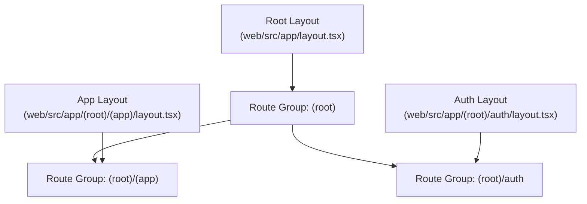

**Diagram sources**
- [web/src/app/layout.tsx](file://web/src/app/layout.tsx#L1-L31)
- [web/src/app/(root)/(app)/layout.tsx](file://web/src/app/(root)/(app)/layout.tsx#L1-L290)
- [web/src/app/(root)/auth/layout.tsx](file://web/src/app/(root)/auth/layout.tsx#L1-L19)

**Section sources**
- [web/src/app/layout.tsx](file://web/src/app/layout.tsx#L1-L31)
- [web/src/app/(root)/(app)/layout.tsx](file://web/src/app/(root)/(app)/layout.tsx#L1-L290)
- [web/src/app/(root)/auth/layout.tsx](file://web/src/app/(root)/auth/layout.tsx#L1-L19)

## Core Components
- Root layout: Provides global HTML wrapper, metadata import, and runtime health check to redirect to a server booting page when the backend is unavailable.
- App layout: Implements a responsive two-pane layout with a persistent sidebar, mobile navigation, trending section, and socket provider. It also conditionally renders session termination UI based on query parameters.
- Auth layout: Wraps authentication pages with a back-to-home link and centered content container.
- Pages:
  - Feed page: Lists posts with optional branch/topic filters and enhanced search functionality with improved search bar design and focus management.
  - College page: Shows posts filtered by the user's college.
  - Trending page: Placeholder page.
  - Profile page: Displays user profile and their posts.
  - Post detail page: Renders a single post, comments tree, and comment creation UI.

**Section sources**
- [web/src/app/layout.tsx](file://web/src/app/layout.tsx#L1-L31)
- [web/src/app/(root)/(app)/layout.tsx](file://web/src/app/(root)/(app)/layout.tsx#L1-L290)
- [web/src/app/(root)/auth/layout.tsx](file://web/src/app/(root)/auth/layout.tsx#L1-L19)
- [web/src/app/(root)/(app)/page.tsx](file://web/src/app/(root)/(app)/page.tsx#L1-L409)
- [web/src/app/(root)/(app)/college/page.tsx](file://web/src/app/(root)/(app)/college/page.tsx#L1-L163)
- [web/src/app/(root)/(app)/trending/page.tsx](file://web/src/app/(root)/(app)/trending/page.tsx#L1-L7)
- [web/src/app/(root)/(app)/u/profile/page.tsx](file://web/src/app/(root)/(app)/u/profile/page.tsx#L1-L324)
- [web/src/app/(root)/(app)/p/[id]/page.tsx](file://web/src/app/(root)/(app)/p/[id]/page.tsx#L1-L253)

## Architecture Overview
The routing architecture leverages Next.js route groups to segment concerns:
- Global root layout sets HTML and metadata and performs a runtime health check.
- App group layout composes the main application UI with navigation, sidebar, and socket context.
- Authentication group isolates auth flows with a dedicated layout.
- Dynamic route group handles post detail pages using a catch-all route parameter.

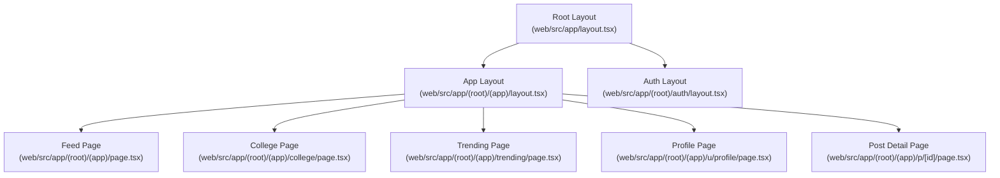

**Diagram sources**
- [web/src/app/layout.tsx](file://web/src/app/layout.tsx#L1-L31)
- [web/src/app/(root)/(app)/layout.tsx](file://web/src/app/(root)/(app)/layout.tsx#L1-L290)
- [web/src/app/(root)/auth/layout.tsx](file://web/src/app/(root)/auth/layout.tsx#L1-L19)
- [web/src/app/(root)/(app)/page.tsx](file://web/src/app/(root)/(app)/page.tsx#L1-L409)
- [web/src/app/(root)/(app)/college/page.tsx](file://web/src/app/(root)/(app)/college/page.tsx#L1-L163)
- [web/src/app/(root)/(app)/trending/page.tsx](file://web/src/app/(root)/(app)/trending/page.tsx#L1-L7)
- [web/src/app/(root)/(app)/u/profile/page.tsx](file://web/src/app/(root)/(app)/u/profile/page.tsx#L1-L324)
- [web/src/app/(root)/(app)/p/[id]/page.tsx](file://web/src/app/(root)/(app)/p/[id]/page.tsx#L1-L253)

## Detailed Component Analysis

### Root Layout and Health Check
- Sets global HTML attributes and imports metadata.
- Performs a runtime health check against the backend and redirects to a server booting page if the service is unavailable.
- Provides a themed toast container for notifications.

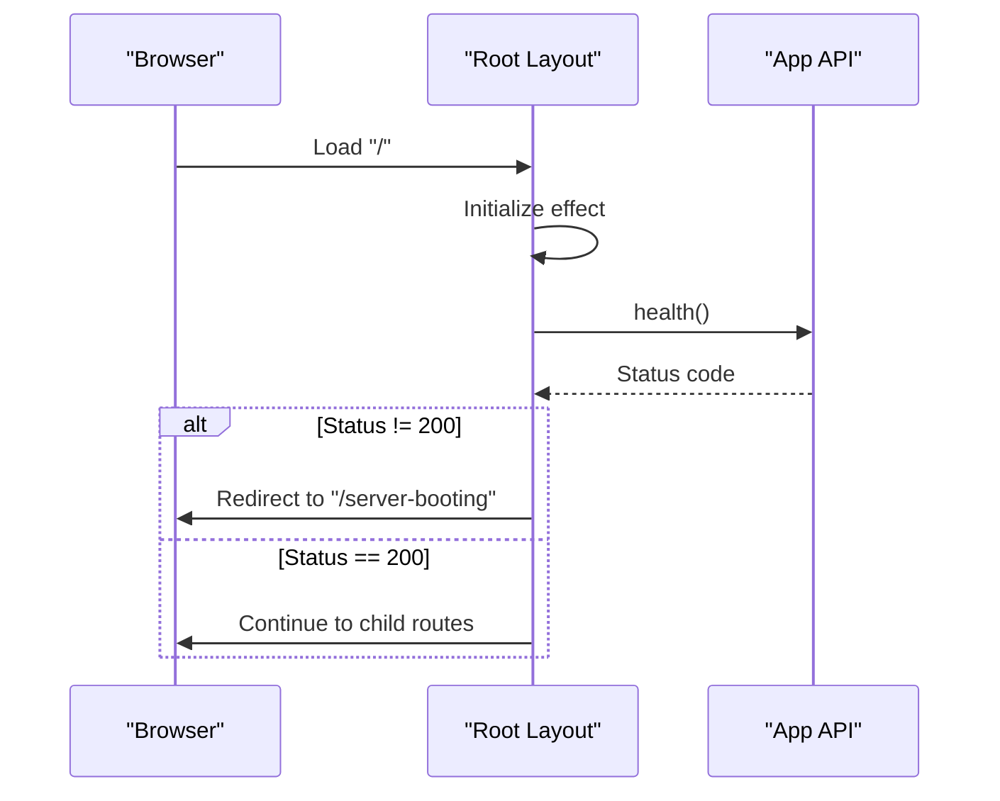

**Diagram sources**
- [web/src/app/layout.tsx](file://web/src/app/layout.tsx#L9-L20)

**Section sources**
- [web/src/app/layout.tsx](file://web/src/app/layout.tsx#L1-L31)

### App Layout Composition
- Responsive two-pane layout with a fixed sidebar and scrollable content area.
- Mobile navigation bar with links to feed, college, trending, and profile.
- Persistent socket provider for real-time updates.
- Conditional rendering of session termination UI based on query parameters.
- Navigation tabs for branches and topics with expand/collapse behavior.

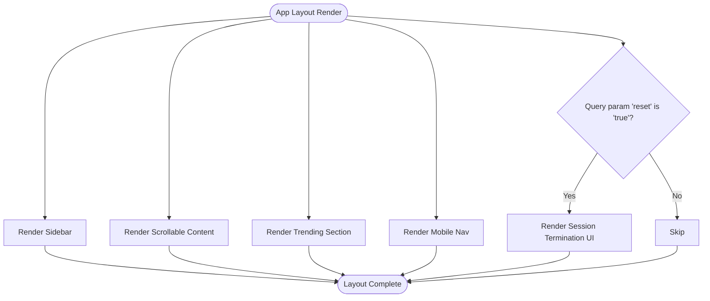

**Diagram sources**
- [web/src/app/(root)/(app)/layout.tsx](file://web/src/app/(root)/(app)/layout.tsx#L23-L55)

**Section sources**
- [web/src/app/(root)/(app)/layout.tsx](file://web/src/app/(root)/(app)/layout.tsx#L1-L290)

### Enhanced Feed Page (Dynamic Filters and Search)
**Updated** Enhanced with improved search bar design, better user interaction patterns, and refined focus management.

- Fetches posts with optional branch and topic filters derived from URL search params.
- Supports live search with debounced network requests and enhanced visual feedback.
- Renders skeleton loaders during initial load and search.
- Clears filters and refetches posts when requested.
- Features enhanced search bar with `group-focus-within` for improved focus management.
- Implements refined styling with `transition-all` and `shadow-sm` classes for better user experience.
- Provides better visual feedback through color transitions and focus states.

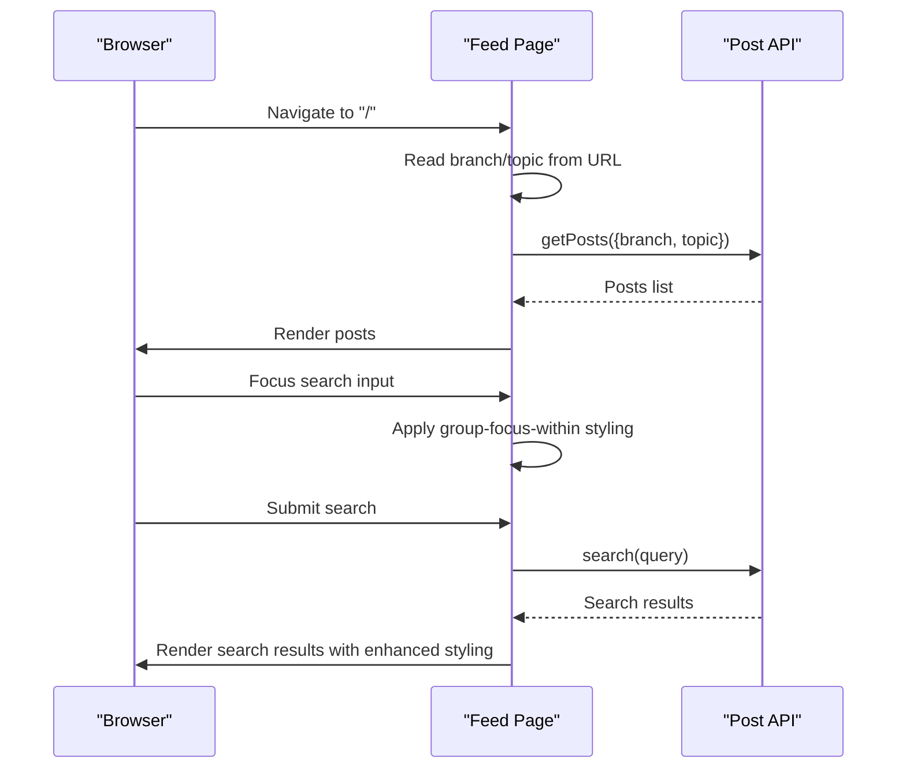

**Diagram sources**
- [web/src/app/(root)/(app)/page.tsx](file://web/src/app/(root)/(app)/page.tsx#L36-L99)
- [web/src/app/(root)/(app)/page.tsx](file://web/src/app/(root)/(app)/page.tsx#L124-L149)

**Section sources**
- [web/src/app/(root)/(app)/page.tsx](file://web/src/app/(root)/(app)/page.tsx#L1-L409)

### College Page (User College Filter)
- Fetches posts filtered by the user's college.
- Handles loading states and renders skeleton loaders while fetching.
- Displays empty state messaging when no posts are found.

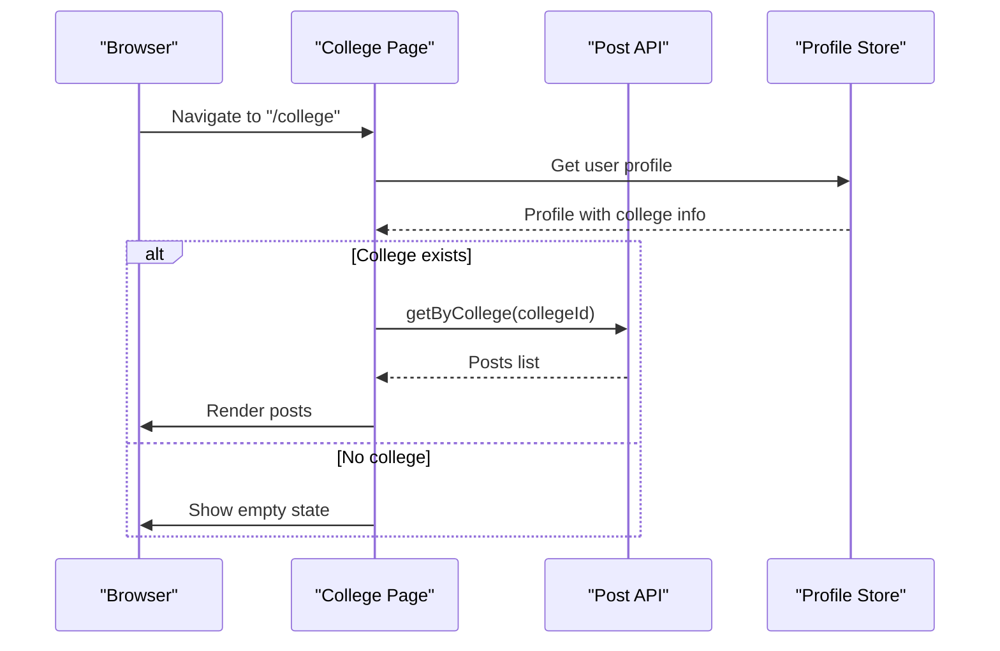

**Diagram sources**
- [web/src/app/(root)/(app)/college/page.tsx](file://web/src/app/(root)/(app)/college/page.tsx#L26-L57)

**Section sources**
- [web/src/app/(root)/(app)/college/page.tsx](file://web/src/app/(root)/(app)/college/page.tsx#L1-L163)

### Profile Page (User Profile and Posts)
- Loads current user profile and posts either from store or via API.
- Provides an editable modal to update branch.
- Renders user avatar, college, branch, karma, and posts.
- Uses skeleton loaders during initial load.

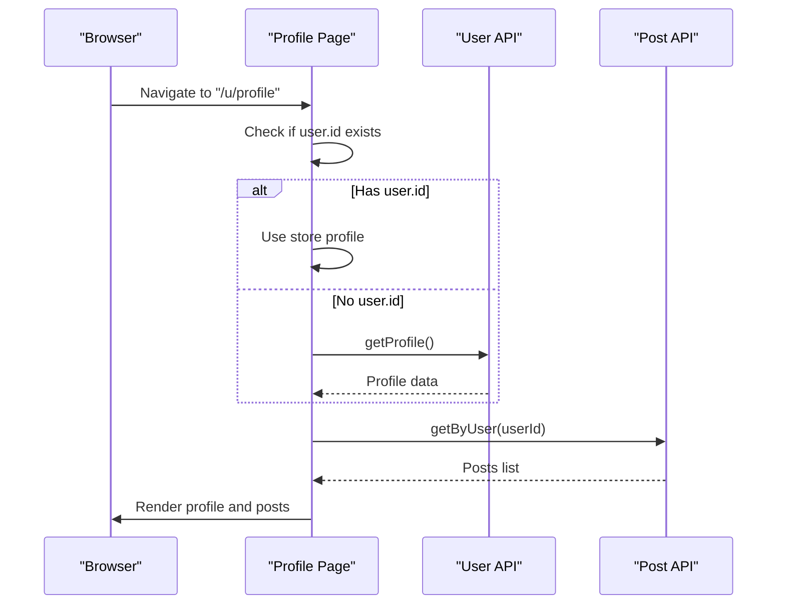

**Diagram sources**
- [web/src/app/(root)/(app)/u/profile/page.tsx](file://web/src/app/(root)/(app)/u/profile/page.tsx#L53-L85)

**Section sources**
- [web/src/app/(root)/(app)/u/profile/page.tsx](file://web/src/app/(root)/(app)/u/profile/page.tsx#L1-L324)

### Post Detail Page (Dynamic Route)
- Resolves post by ID from route parameter.
- Increments view count and fetches comments tree.
- Builds a hierarchical comment tree from flat comment data.
- Navigates to home on invalid or missing IDs.

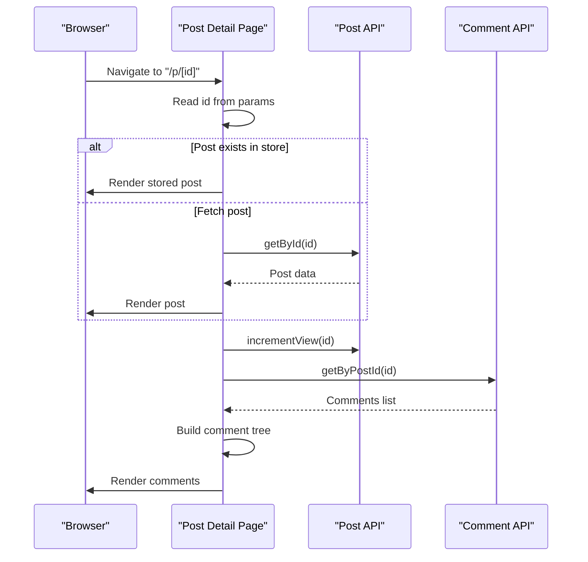

**Diagram sources**
- [web/src/app/(root)/(app)/p/[id]/page.tsx](file://web/src/app/(root)/(app)/p/[id]/page.tsx#L85-L133)

**Section sources**
- [web/src/app/(root)/(app)/p/[id]/page.tsx](file://web/src/app/(root)/(app)/p/[id]/page.tsx#L1-L253)

### Authentication Layout
- Provides a back-to-home link for auth pages.
- Centers auth content in a full-height container.

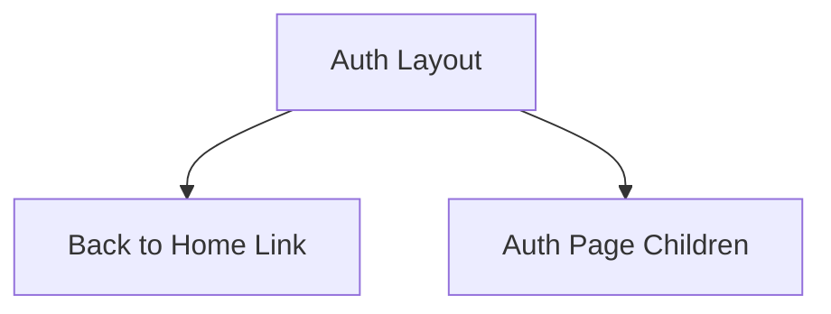

**Diagram sources**
- [web/src/app/(root)/auth/layout.tsx](file://web/src/app/(root)/auth/layout.tsx#L4-L16)

**Section sources**
- [web/src/app/(root)/auth/layout.tsx](file://web/src/app/(root)/auth/layout.tsx#L1-L19)

### Enhanced Search Bar Design and Focus Management
**Updated** The feed page now features an enhanced search bar with improved design and user interaction patterns.

- **Search Bar Container**: Positioned as a sticky element at the top of the feed with z-index for proper layering.
- **Group Focus Management**: Utilizes `group-focus-within` CSS pseudo-class for enhanced visual feedback when the search input is focused.
- **Visual Feedback**: Search icon color transitions from `text-zinc-400` to `text-zinc-900`/`text-zinc-100` based on focus state.
- **Refined Styling**: Input field uses `transition-all` for smooth state changes and `shadow-sm` for subtle elevation effects.
- **Enhanced Ring Effects**: Focus states include `focus:ring-4 focus:ring-zinc-900/5 dark:focus:ring-white/5` for better visual indication.
- **Clear Search Button**: Appears when search query exists with hover states and smooth transitions.
- **Loading States**: Spinner animation appears during search operations with proper sizing and animation properties.
- **Responsive Design**: Search bar adapts to different screen sizes with appropriate padding and spacing.

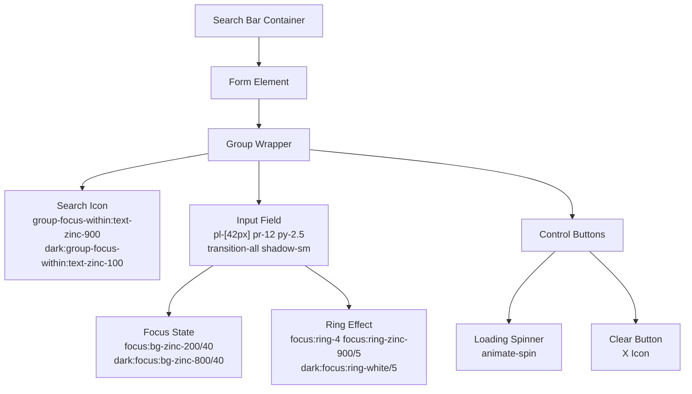

**Diagram sources**
- [web/src/app/(root)/(app)/page.tsx](file://web/src/app/(root)/(app)/page.tsx#L122-L149)

**Section sources**
- [web/src/app/(root)/(app)/page.tsx](file://web/src/app/(root)/(app)/page.tsx#L119-L149)

### Metadata Management
- Global metadata is exported from a dedicated module and imported into the root layout.
- Fonts are configured using Next.js font optimization and a local font.

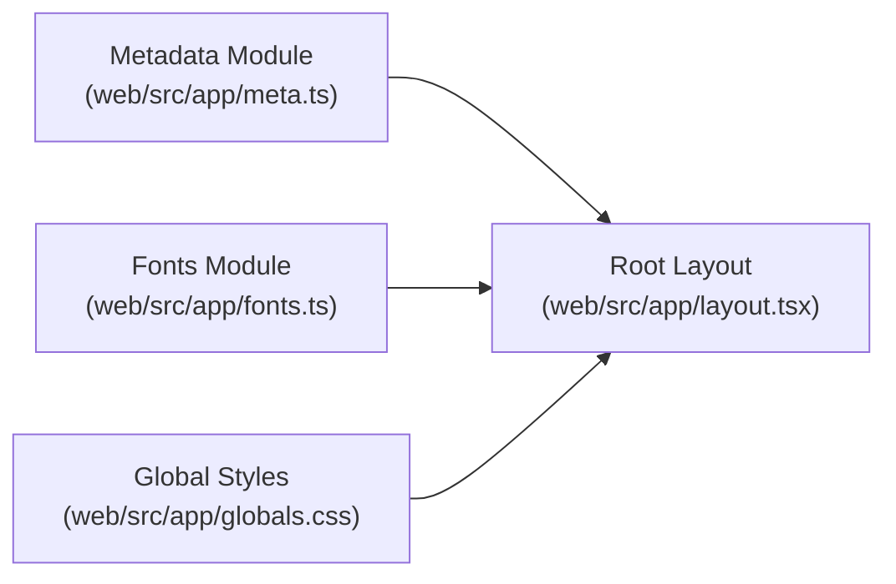

**Diagram sources**
- [web/src/app/meta.ts](file://web/src/app/meta.ts#L1-L7)
- [web/src/app/fonts.ts](file://web/src/app/fonts.ts#L1-L19)
- [web/src/app/globals.css](file://web/src/app/globals.css#L1-L133)
- [web/src/app/layout.tsx](file://web/src/app/layout.tsx#L1-L5)

**Section sources**
- [web/src/app/meta.ts](file://web/src/app/meta.ts#L1-L7)
- [web/src/app/fonts.ts](file://web/src/app/fonts.ts#L1-L19)
- [web/src/app/globals.css](file://web/src/app/globals.css#L1-L133)
- [web/src/app/layout.tsx](file://web/src/app/layout.tsx#L1-L5)

## Dependency Analysis
- Root layout depends on metadata and global styles.
- App layout depends on UI components, stores, and socket context.
- Pages depend on APIs, stores, and utility helpers for rendering and data fetching.
- Auth layout depends on navigation and auth components.

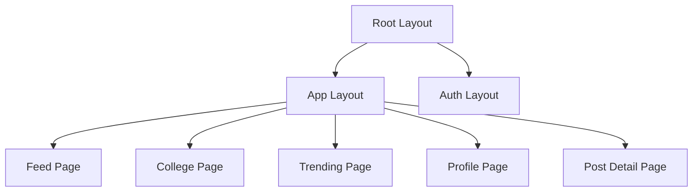

**Diagram sources**
- [web/src/app/layout.tsx](file://web/src/app/layout.tsx#L1-L31)
- [web/src/app/(root)/(app)/layout.tsx](file://web/src/app/(root)/(app)/layout.tsx#L1-L290)
- [web/src/app/(root)/auth/layout.tsx](file://web/src/app/(root)/auth/layout.tsx#L1-L19)
- [web/src/app/(root)/(app)/page.tsx](file://web/src/app/(root)/(app)/page.tsx#L1-L409)
- [web/src/app/(root)/(app)/college/page.tsx](file://web/src/app/(root)/(app)/college/page.tsx#L1-L163)
- [web/src/app/(root)/(app)/trending/page.tsx](file://web/src/app/(root)/(app)/trending/page.tsx#L1-L7)
- [web/src/app/(root)/(app)/u/profile/page.tsx](file://web/src/app/(root)/(app)/u/profile/page.tsx#L1-L324)
- [web/src/app/(root)/(app)/p/[id]/page.tsx](file://web/src/app/(root)/(app)/p/[id]/page.tsx#L1-L253)

**Section sources**
- [web/src/app/layout.tsx](file://web/src/app/layout.tsx#L1-L31)
- [web/src/app/(root)/(app)/layout.tsx](file://web/src/app/(root)/(app)/layout.tsx#L1-L290)
- [web/src/app/(root)/auth/layout.tsx](file://web/src/app/(root)/auth/layout.tsx#L1-L19)
- [web/src/app/(root)/(app)/page.tsx](file://web/src/app/(root)/(app)/page.tsx#L1-L409)
- [web/src/app/(root)/(app)/college/page.tsx](file://web/src/app/(root)/(app)/college/page.tsx#L1-L163)
- [web/src/app/(root)/(app)/trending/page.tsx](file://web/src/app/(root)/(app)/trending/page.tsx#L1-L7)
- [web/src/app/(root)/(app)/u/profile/page.tsx](file://web/src/app/(root)/(app)/u/profile/page.tsx#L1-L324)
- [web/src/app/(root)/(app)/p/[id]/page.tsx](file://web/src/app/(root)/(app)/p/[id]/page.tsx#L1-L253)

## Performance Considerations
- Route-based code splitting: Next.js automatically splits route chunks per page, reducing initial bundle size.
- Suspense boundaries: Used in feed and post detail pages to progressively render content and improve perceived performance.
- Conditional rendering: Sidebar and mobile nav are rendered only when needed to minimize DOM overhead.
- Efficient data fetching: Fetch only required data (e.g., posts by college or user) and leverage caching via stores.
- Optimized search interactions: Debounced search requests and efficient state management for better user experience.

## Troubleshooting Guide
- Backend health failures: Root layout redirects to a server booting page when the backend is unreachable.
- Error handling in pages: Pages use a centralized error handler hook to surface errors and retry failed operations.
- Invalid dynamic routes: Post detail page navigates to home when an ID is missing or invalid.
- Search functionality issues: Enhanced search bar provides better error handling and user feedback for search operations.

**Section sources**
- [web/src/app/layout.tsx](file://web/src/app/layout.tsx#L12-L20)
- [web/src/app/(root)/(app)/page.tsx](file://web/src/app/(root)/(app)/page.tsx#L55-L62)
- [web/src/app/(root)/(app)/p/[id]/page.tsx](file://web/src/app/(root)/(app)/p/[id]/page.tsx#L94-L101)

## Conclusion
The routing architecture organizes the application into clear route groups with distinct layouts and pages. Nested route groups enable modular composition, while dynamic routes support scalable content pages. The enhanced feed page search functionality demonstrates improved user experience through better search bar design, refined focus management, and enhanced visual feedback mechanisms. The design emphasizes responsive navigation, real-time updates, robust error handling, and performance through route-based code splitting and suspense boundaries.