# Social Features

<cite>
**Referenced Files in This Document**
- [web/src/components/general/CreatePost.tsx](file://web/src/components/general/CreatePost.tsx)
- [web/src/components/general/Post.tsx](file://web/src/components/general/Post.tsx)
- [web/src/components/general/CreateComment.tsx](file://web/src/components/general/CreateComment.tsx)
- [web/src/components/general/Comment.tsx](file://web/src/components/general/Comment.tsx)
- [web/src/components/general/EngagementComponent.tsx](file://web/src/components/general/EngagementComponent.tsx)
- [web/src/components/general/TrendingPostSection.tsx](file://web/src/components/general/TrendingPostSection.tsx)
- [web/src/components/general/TrendingPostCard.tsx](file://web/src/components/general/TrendingPostCard.tsx)
- [web/src/store/postStore.ts](file://web/src/store/postStore.ts)
- [web/src/store/commentStore.ts](file://web/src/store/commentStore.ts)
- [web/src/services/api/post.ts](file://web/src/services/api/post.ts)
- [web/src/services/api/comment.ts](file://web/src/services/api/comment.ts)
- [web/src/types/Post.ts](file://web/src/types/Post.ts)
- [web/src/types/Comment.ts](file://web/src/types/Comment.ts)
- [web/src/types/TrendingPost.ts](file://web/src/types/TrendingPost.ts)
- [web/src/utils/moderation.ts](file://web/src/utils/moderation.ts)
</cite>

## Table of Contents
1. [Introduction](#introduction)
2. [Project Structure](#project-structure)
3. [Core Components](#core-components)
4. [Architecture Overview](#architecture-overview)
5. [Detailed Component Analysis](#detailed-component-analysis)
6. [Dependency Analysis](#dependency-analysis)
7. [Performance Considerations](#performance-considerations)
8. [Troubleshooting Guide](#troubleshooting-guide)
9. [Conclusion](#conclusion)

## Introduction
This document explains the social features implementation, covering post creation, display, engagement, comments (including nested replies), trending posts, topic organization, and content discovery. It also documents state management with Zustand stores, API integration patterns, and optimistic updates. The goal is to help developers understand workflows, component composition, and performance strategies for building scalable social experiences.

## Project Structure
The social features live primarily in the web application under the general components, stores, services, and types directories. Key areas:
- Post lifecycle: creation, display, voting, and discovery
- Comments: nested replies, moderation, and editing
- Engagement: upvotes/downvotes, comments count, views, and sharing
- Trending section: fetching and rendering top posts by views
- State management: local stores for posts and comments
- Moderation pipeline: real-time detection and censorship

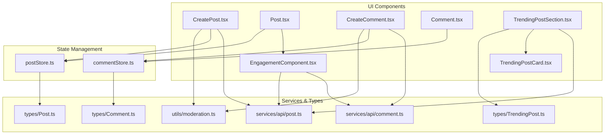

**Diagram sources**
- [web/src/components/general/CreatePost.tsx](file://web/src/components/general/CreatePost.tsx#L1-L409)
- [web/src/components/general/Post.tsx](file://web/src/components/general/Post.tsx#L1-L179)
- [web/src/components/general/CreateComment.tsx](file://web/src/components/general/CreateComment.tsx#L1-L310)
- [web/src/components/general/Comment.tsx](file://web/src/components/general/Comment.tsx#L1-L156)
- [web/src/components/general/EngagementComponent.tsx](file://web/src/components/general/EngagementComponent.tsx#L1-L247)
- [web/src/components/general/TrendingPostSection.tsx](file://web/src/components/general/TrendingPostSection.tsx#L1-L113)
- [web/src/components/general/TrendingPostCard.tsx](file://web/src/components/general/TrendingPostCard.tsx#L1-L45)
- [web/src/store/postStore.ts](file://web/src/store/postStore.ts#L1-L30)
- [web/src/store/commentStore.ts](file://web/src/store/commentStore.ts#L1-L34)
- [web/src/services/api/post.ts](file://web/src/services/api/post.ts#L1-L68)
- [web/src/services/api/comment.ts](file://web/src/services/api/comment.ts#L1-L24)
- [web/src/types/Post.ts](file://web/src/types/Post.ts#L1-L23)
- [web/src/types/Comment.ts](file://web/src/types/Comment.ts#L1-L18)
- [web/src/types/TrendingPost.ts](file://web/src/types/TrendingPost.ts#L1-L7)
- [web/src/utils/moderation.ts](file://web/src/utils/moderation.ts#L1-L671)

**Section sources**
- [web/src/components/general/CreatePost.tsx](file://web/src/components/general/CreatePost.tsx#L1-L409)
- [web/src/components/general/Post.tsx](file://web/src/components/general/Post.tsx#L1-L179)
- [web/src/components/general/CreateComment.tsx](file://web/src/components/general/CreateComment.tsx#L1-L310)
- [web/src/components/general/Comment.tsx](file://web/src/components/general/Comment.tsx#L1-L156)
- [web/src/components/general/EngagementComponent.tsx](file://web/src/components/general/EngagementComponent.tsx#L1-L247)
- [web/src/components/general/TrendingPostSection.tsx](file://web/src/components/general/TrendingPostSection.tsx#L1-L113)
- [web/src/components/general/TrendingPostCard.tsx](file://web/src/components/general/TrendingPostCard.tsx#L1-L45)
- [web/src/store/postStore.ts](file://web/src/store/postStore.ts#L1-L30)
- [web/src/store/commentStore.ts](file://web/src/store/commentStore.ts#L1-L34)
- [web/src/services/api/post.ts](file://web/src/services/api/post.ts#L1-L68)
- [web/src/services/api/comment.ts](file://web/src/services/api/comment.ts#L1-L24)
- [web/src/types/Post.ts](file://web/src/types/Post.ts#L1-L23)
- [web/src/types/Comment.ts](file://web/src/types/Comment.ts#L1-L18)
- [web/src/types/TrendingPost.ts](file://web/src/types/TrendingPost.ts#L1-L7)
- [web/src/utils/moderation.ts](file://web/src/utils/moderation.ts#L1-L671)

## Core Components
- Post creation form with validation, moderation preview, and term acceptance flow
- Post display with metadata, engagement controls, and dropdown actions
- Comment creation/editing with nested replies and moderation preview
- Nested comment renderer with expand/collapse for deep threads
- Engagement component supporting upvote/downvote, comments, views, and share
- Trending section fetching top posts by views and rendering cards
- Zustand stores for posts and comments with optimistic updates
- Moderation utilities for detection, validation, and censorship

**Section sources**
- [web/src/components/general/CreatePost.tsx](file://web/src/components/general/CreatePost.tsx#L1-L409)
- [web/src/components/general/Post.tsx](file://web/src/components/general/Post.tsx#L1-L179)
- [web/src/components/general/CreateComment.tsx](file://web/src/components/general/CreateComment.tsx#L1-L310)
- [web/src/components/general/Comment.tsx](file://web/src/components/general/Comment.tsx#L1-L156)
- [web/src/components/general/EngagementComponent.tsx](file://web/src/components/general/EngagementComponent.tsx#L1-L247)
- [web/src/components/general/TrendingPostSection.tsx](file://web/src/components/general/TrendingPostSection.tsx#L1-L113)
- [web/src/store/postStore.ts](file://web/src/store/postStore.ts#L1-L30)
- [web/src/store/commentStore.ts](file://web/src/store/commentStore.ts#L1-L34)
- [web/src/utils/moderation.ts](file://web/src/utils/moderation.ts#L1-L671)

## Architecture Overview
The social features follow a layered architecture:
- UI components encapsulate presentation and user interactions
- Services abstract HTTP requests to backend APIs
- Stores manage local state for posts/comments
- Utilities provide shared logic (moderation, parsing, helpers)

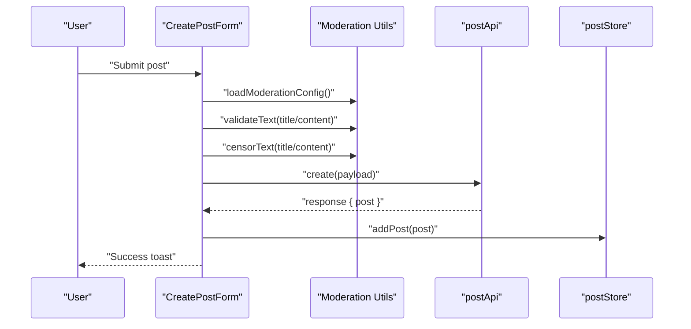

**Diagram sources**
- [web/src/components/general/CreatePost.tsx](file://web/src/components/general/CreatePost.tsx#L163-L219)
- [web/src/utils/moderation.ts](file://web/src/utils/moderation.ts#L430-L484)
- [web/src/services/api/post.ts](file://web/src/services/api/post.ts#L29-L38)
- [web/src/store/postStore.ts](file://web/src/store/postStore.ts#L15-L16)

**Section sources**
- [web/src/components/general/CreatePost.tsx](file://web/src/components/general/CreatePost.tsx#L163-L219)
- [web/src/utils/moderation.ts](file://web/src/utils/moderation.ts#L430-L484)
- [web/src/services/api/post.ts](file://web/src/services/api/post.ts#L29-L38)
- [web/src/store/postStore.ts](file://web/src/store/postStore.ts#L15-L16)

## Detailed Component Analysis

### Post Creation Workflow
- Validation: Zod schema enforces length and topic constraints
- Moderation: Config loaded once; real-time validation and preview; censored content sent to backend
- Terms: On 403 with specific code, prompt to accept terms and retry
- Optimistic updates: Add created post to local store immediately upon success

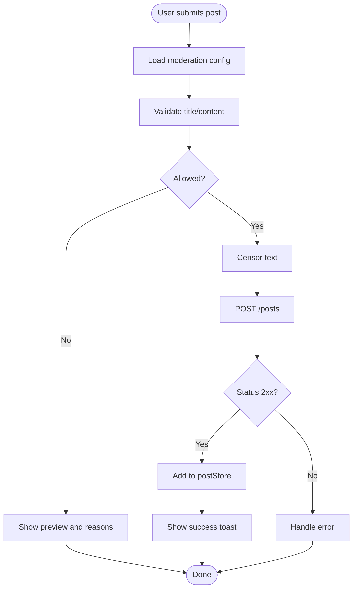

**Diagram sources**
- [web/src/components/general/CreatePost.tsx](file://web/src/components/general/CreatePost.tsx#L141-L219)
- [web/src/utils/moderation.ts](file://web/src/utils/moderation.ts#L430-L484)
- [web/src/services/api/post.ts](file://web/src/services/api/post.ts#L29-L38)
- [web/src/store/postStore.ts](file://web/src/store/postStore.ts#L15-L16)

**Section sources**
- [web/src/components/general/CreatePost.tsx](file://web/src/components/general/CreatePost.tsx#L141-L219)
- [web/src/utils/moderation.ts](file://web/src/utils/moderation.ts#L430-L484)
- [web/src/services/api/post.ts](file://web/src/services/api/post.ts#L29-L38)
- [web/src/store/postStore.ts](file://web/src/store/postStore.ts#L15-L16)

### Post Display and Engagement
- Post renders metadata (branch, college, author, topic, privacy)
- Engagement component shows counts and actions; supports optimistic voting
- Dropdown allows edit/delete/bookmark depending on ownership

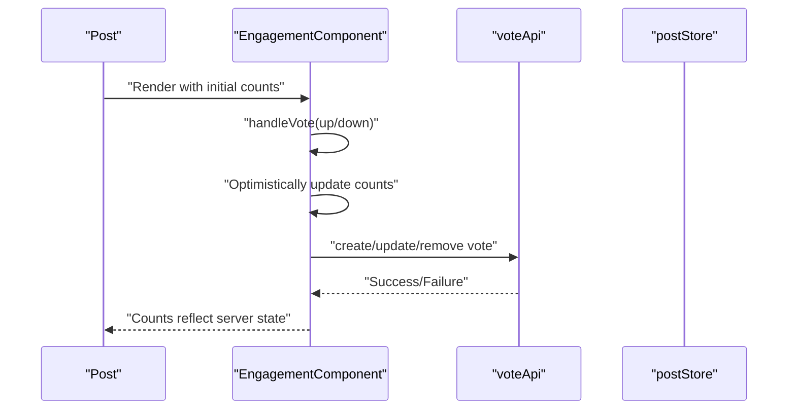

**Diagram sources**
- [web/src/components/general/Post.tsx](file://web/src/components/general/Post.tsx#L160-L172)
- [web/src/components/general/EngagementComponent.tsx](file://web/src/components/general/EngagementComponent.tsx#L86-L153)
- [web/src/services/api/vote.ts](file://web/src/services/api/vote.ts)

**Section sources**
- [web/src/components/general/Post.tsx](file://web/src/components/general/Post.tsx#L160-L172)
- [web/src/components/general/EngagementComponent.tsx](file://web/src/components/general/EngagementComponent.tsx#L86-L153)

### Comment System: Creation, Replies, and Moderation
- Nested comments supported via parent-child relationship
- Reply flow: pass parentCommentId to CreateComment; store manages flat list with children arrays
- Moderation preview and censored submission mirror post creation
- Edit/update toggles based on ownership

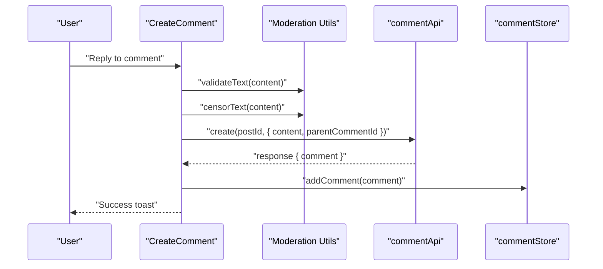

**Diagram sources**
- [web/src/components/general/CreateComment.tsx](file://web/src/components/general/CreateComment.tsx#L107-L165)
- [web/src/utils/moderation.ts](file://web/src/utils/moderation.ts#L592-L670)
- [web/src/services/api/comment.ts](file://web/src/services/api/comment.ts#L7-L14)
- [web/src/store/commentStore.ts](file://web/src/store/commentStore.ts#L21-L24)

**Section sources**
- [web/src/components/general/CreateComment.tsx](file://web/src/components/general/CreateComment.tsx#L107-L165)
- [web/src/utils/moderation.ts](file://web/src/utils/moderation.ts#L592-L670)
- [web/src/services/api/comment.ts](file://web/src/services/api/comment.ts#L7-L14)
- [web/src/store/commentStore.ts](file://web/src/store/commentStore.ts#L21-L24)

### Nested Comments Rendering and Interaction
- Comment component recursively renders children
- Expand/collapse toggles for replies beyond a depth threshold
- Engagement component shows reply counts and voting

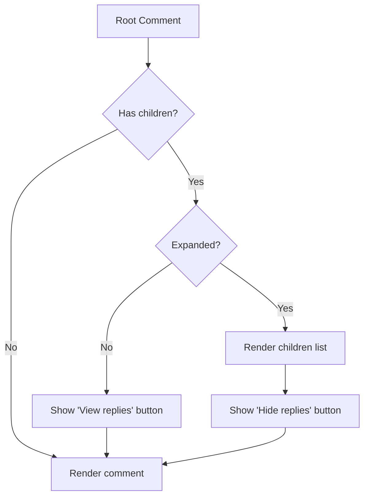

**Diagram sources**
- [web/src/components/general/Comment.tsx](file://web/src/components/general/Comment.tsx#L118-L149)

**Section sources**
- [web/src/components/general/Comment.tsx](file://web/src/components/general/Comment.tsx#L118-L149)

### Trending Posts Section and Content Discovery
- Fetches top posts sorted by views
- Renders cards with rank, category, time, and view count
- Skeleton loading during fetch

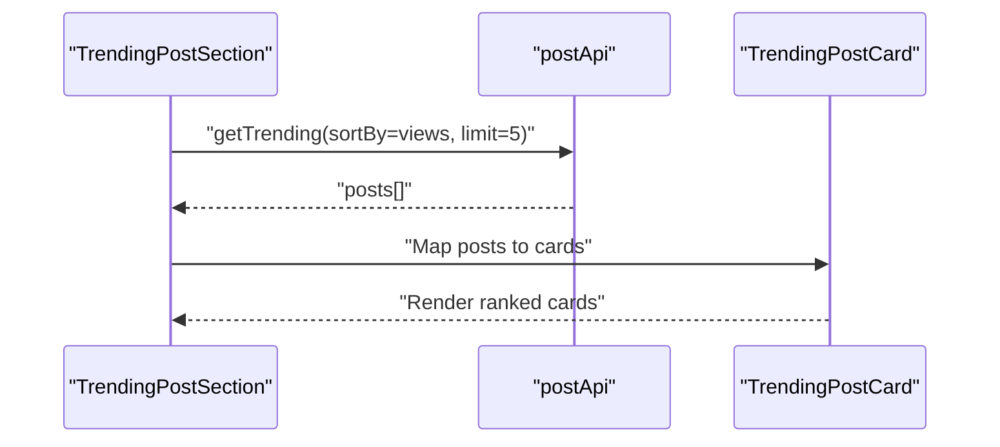

**Diagram sources**
- [web/src/components/general/TrendingPostSection.tsx](file://web/src/components/general/TrendingPostSection.tsx#L18-L44)
- [web/src/services/api/post.ts](file://web/src/services/api/post.ts#L55-L63)
- [web/src/components/general/TrendingPostCard.tsx](file://web/src/components/general/TrendingPostCard.tsx#L9-L42)

**Section sources**
- [web/src/components/general/TrendingPostSection.tsx](file://web/src/components/general/TrendingPostSection.tsx#L18-L44)
- [web/src/services/api/post.ts](file://web/src/services/api/post.ts#L55-L63)
- [web/src/components/general/TrendingPostCard.tsx](file://web/src/components/general/TrendingPostCard.tsx#L9-L42)

### State Management with Zustand
- Post store: set, add, remove, update posts
- Comment store: set, add, remove, update comments; reset support
- Both stores maintain immutable updates and simple selectors

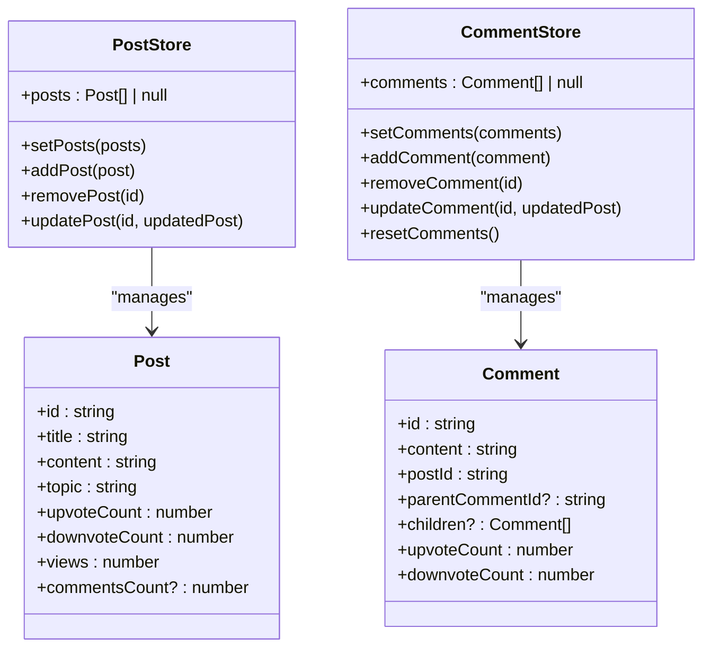

**Diagram sources**
- [web/src/store/postStore.ts](file://web/src/store/postStore.ts#L4-L27)
- [web/src/store/commentStore.ts](file://web/src/store/commentStore.ts#L4-L31)
- [web/src/types/Post.ts](file://web/src/types/Post.ts#L4-L22)
- [web/src/types/Comment.ts](file://web/src/types/Comment.ts#L4-L17)

**Section sources**
- [web/src/store/postStore.ts](file://web/src/store/postStore.ts#L4-L27)
- [web/src/store/commentStore.ts](file://web/src/store/commentStore.ts#L4-L31)
- [web/src/types/Post.ts](file://web/src/types/Post.ts#L4-L22)
- [web/src/types/Comment.ts](file://web/src/types/Comment.ts#L4-L17)

### API Integration Patterns
- Post API: CRUD, trending, search, and view increment
- Comment API: CRUD and retrieval by post
- Vote API: upvote/downvote lifecycle
- HTTP client centralizes headers and base URL

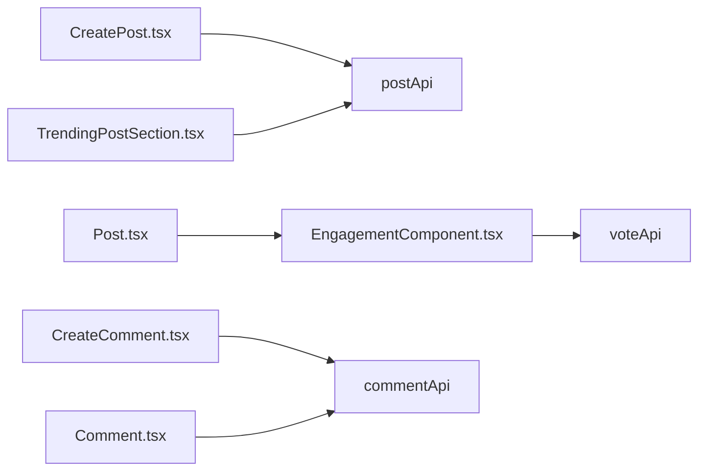

**Diagram sources**
- [web/src/services/api/post.ts](file://web/src/services/api/post.ts#L1-L68)
- [web/src/services/api/comment.ts](file://web/src/services/api/comment.ts#L1-L24)
- [web/src/components/general/EngagementComponent.tsx](file://web/src/components/general/EngagementComponent.tsx#L11-L12)

**Section sources**
- [web/src/services/api/post.ts](file://web/src/services/api/post.ts#L1-L68)
- [web/src/services/api/comment.ts](file://web/src/services/api/comment.ts#L1-L24)
- [web/src/components/general/EngagementComponent.tsx](file://web/src/components/general/EngagementComponent.tsx#L11-L12)

### Real-Time Updates and Moderation Integration
- Moderation config caching with version-aware recompile
- Real-time validation and preview in forms
- Censorship applied before submission
- Optimistic UI updates with rollback on failure

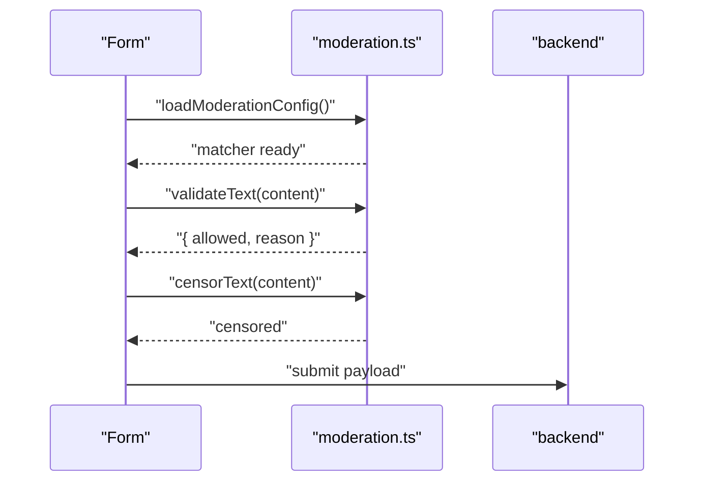

**Diagram sources**
- [web/src/utils/moderation.ts](file://web/src/utils/moderation.ts#L430-L484)
- [web/src/utils/moderation.ts](file://web/src/utils/moderation.ts#L592-L670)
- [web/src/components/general/CreatePost.tsx](file://web/src/components/general/CreatePost.tsx#L170-L175)
- [web/src/components/general/CreateComment.tsx](file://web/src/components/general/CreateComment.tsx#L111-L115)

**Section sources**
- [web/src/utils/moderation.ts](file://web/src/utils/moderation.ts#L430-L484)
- [web/src/utils/moderation.ts](file://web/src/utils/moderation.ts#L592-L670)
- [web/src/components/general/CreatePost.tsx](file://web/src/components/general/CreatePost.tsx#L170-L175)
- [web/src/components/general/CreateComment.tsx](file://web/src/components/general/CreateComment.tsx#L111-L115)

## Dependency Analysis
- Components depend on services for network calls and stores for local state
- Stores depend on types for shape validation
- Moderation utilities are consumed by both post and comment forms
- Engagement component depends on vote API and profile store for auth gating

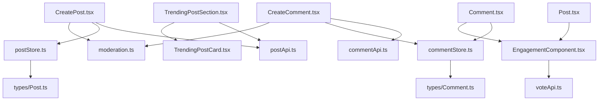

**Diagram sources**
- [web/src/components/general/CreatePost.tsx](file://web/src/components/general/CreatePost.tsx#L45-L46)
- [web/src/components/general/CreateComment.tsx](file://web/src/components/general/CreateComment.tsx#L37-L38)
- [web/src/components/general/Post.tsx](file://web/src/components/general/Post.tsx#L12-L13)
- [web/src/components/general/EngagementComponent.tsx](file://web/src/components/general/EngagementComponent.tsx#L11-L12)
- [web/src/components/general/TrendingPostSection.tsx](file://web/src/components/general/TrendingPostSection.tsx#L9-L10)
- [web/src/store/postStore.ts](file://web/src/store/postStore.ts#L1-L2)
- [web/src/store/commentStore.ts](file://web/src/store/commentStore.ts#L1-L2)
- [web/src/types/Post.ts](file://web/src/types/Post.ts#L1-L2)
- [web/src/types/Comment.ts](file://web/src/types/Comment.ts#L1-L2)

**Section sources**
- [web/src/components/general/CreatePost.tsx](file://web/src/components/general/CreatePost.tsx#L45-L46)
- [web/src/components/general/CreateComment.tsx](file://web/src/components/general/CreateComment.tsx#L37-L38)
- [web/src/components/general/Post.tsx](file://web/src/components/general/Post.tsx#L12-L13)
- [web/src/components/general/EngagementComponent.tsx](file://web/src/components/general/EngagementComponent.tsx#L11-L12)
- [web/src/components/general/TrendingPostSection.tsx](file://web/src/components/general/TrendingPostSection.tsx#L9-L10)
- [web/src/store/postStore.ts](file://web/src/store/postStore.ts#L1-L2)
- [web/src/store/commentStore.ts](file://web/src/store/commentStore.ts#L1-L2)
- [web/src/types/Post.ts](file://web/src/types/Post.ts#L1-L2)
- [web/src/types/Comment.ts](file://web/src/types/Comment.ts#L1-L2)

## Performance Considerations
- Optimistic UI: immediate count updates reduce perceived latency; rollback on error
- Local caching: moderation config cached with TTL and version-aware recompile
- Minimal re-renders: Zustand selectors isolate updates to affected components
- Lazy loading: trending section skeleton improves perceived performance
- Flat list with children arrays: efficient rendering of nested comments without deep traversal costs

[No sources needed since this section provides general guidance]

## Troubleshooting Guide
- Validation errors: forms display inline messages; moderation previews highlight flagged text
- Terms acceptance: on 403 with specific code, show TermsForm and retry submission
- Network failures: centralized error handler displays user-friendly messages and retries
- Moderation config failures: fallback matcher ensures functionality even if API fails

**Section sources**
- [web/src/components/general/CreatePost.tsx](file://web/src/components/general/CreatePost.tsx#L198-L215)
- [web/src/components/general/CreateComment.tsx](file://web/src/components/general/CreateComment.tsx#L144-L161)
- [web/src/hooks/useErrorHandler.tsx](file://web/src/hooks/useErrorHandler.tsx)
- [web/src/utils/moderation.ts](file://web/src/utils/moderation.ts#L444-L483)

## Conclusion
The social features are structured around reusable components, clear API boundaries, and pragmatic state management. Moderation is integrated early in the UX to prevent bad content, while optimistic updates and local stores provide smooth interactivity. The trending section and engagement controls round out a cohesive social experience, with room to extend real-time updates and advanced discovery features.