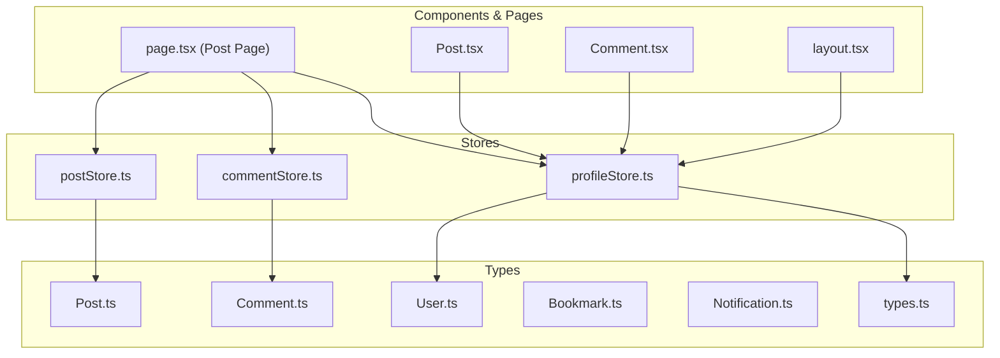
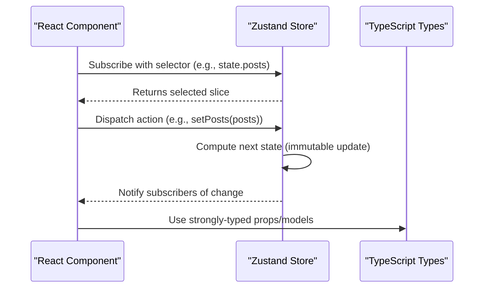
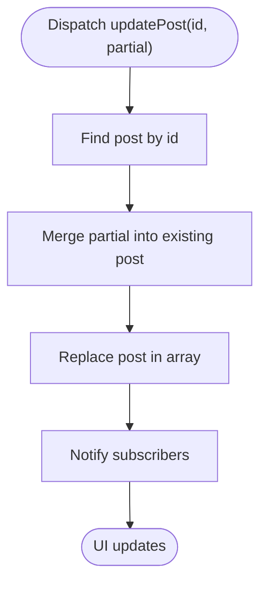
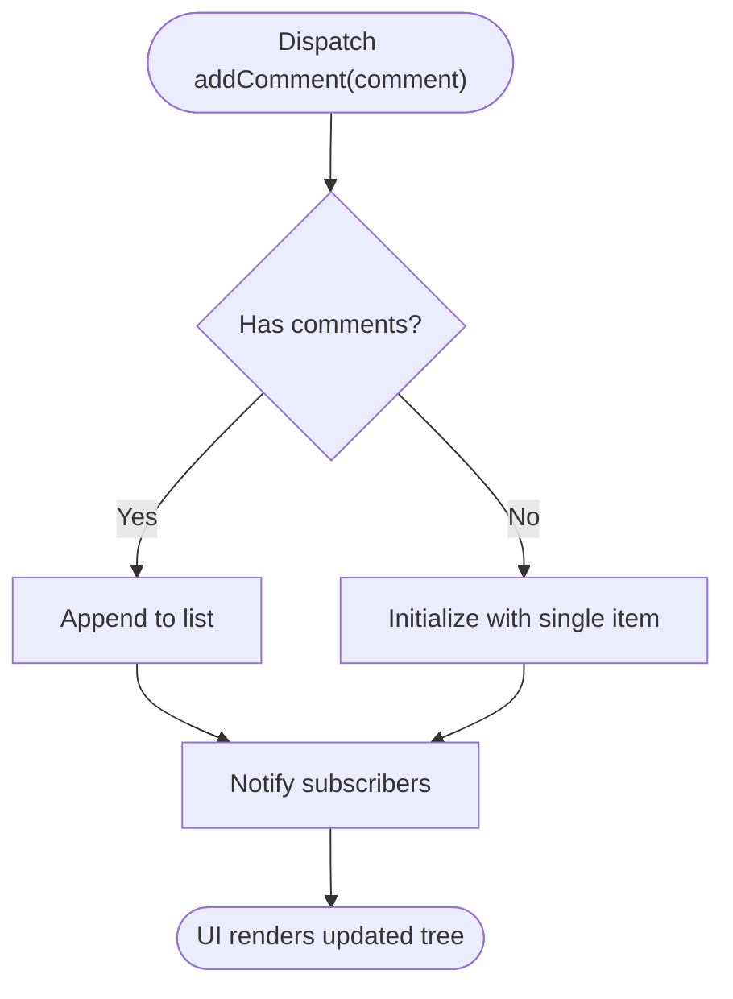
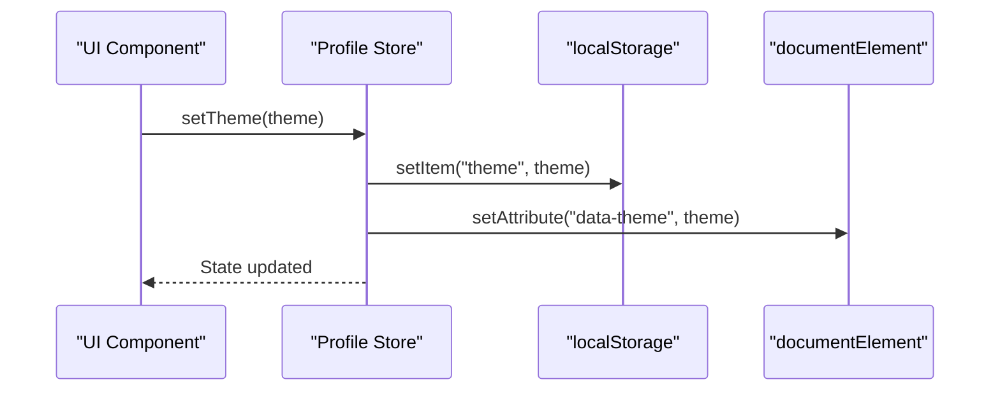
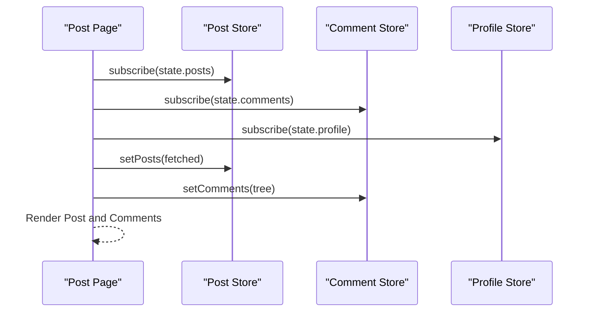
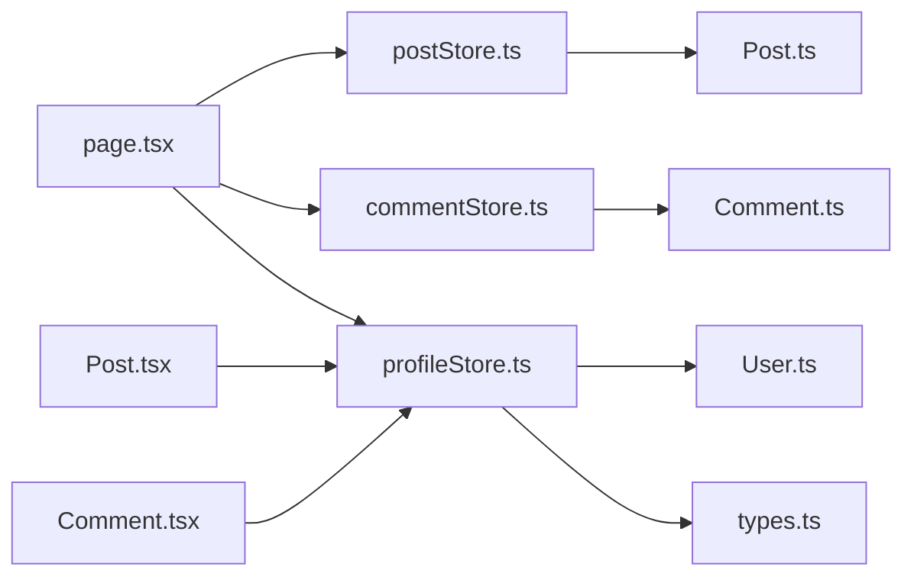

# State Management

<cite>
**Referenced Files in This Document**
- [postStore.ts](file://web/src/store/postStore.ts)
- [commentStore.ts](file://web/src/store/commentStore.ts)
- [profileStore.ts](file://web/src/store/profileStore.ts)
- [Post.ts](file://web/src/types/Post.ts)
- [Comment.ts](file://web/src/types/Comment.ts)
- [User.ts](file://web/src/types/User.ts)
- [Bookmark.ts](file://web/src/types/Bookmark.ts)
- [Notification.ts](file://web/src/types/Notification.ts)
- [types.ts](file://web/src/lib/types.ts)
- [layout.tsx](file://web/src/app/(root)/(app)/layout.tsx)
- [page.tsx](file://web/src/app/(root)/(app)/p/[id]/page.tsx)
- [Post.tsx](file://web/src/components/general/Post.tsx)
- [Comment.tsx](file://web/src/components/general/Comment.tsx)
</cite>

## Table of Contents
1. [Introduction](#introduction)
2. [Project Structure](#project-structure)
3. [Core Components](#core-components)
4. [Architecture Overview](#architecture-overview)
5. [Detailed Component Analysis](#detailed-component-analysis)
6. [Dependency Analysis](#dependency-analysis)
7. [Performance Considerations](#performance-considerations)
8. [Troubleshooting Guide](#troubleshooting-guide)
9. [Conclusion](#conclusion)
10. [Appendices](#appendices)

## Introduction
This document explains the state management architecture built with Zustand stores in the web application. It focuses on three primary stores:
- Post store for managing post entities and related actions
- Comments store for managing comment threads and actions
- Profile store for user profile and theme preferences

It also documents the TypeScript entity types used across the system, subscription patterns, store composition, middleware usage, and integration with React components. Best practices for state normalization, performance optimization, and debugging are included.

## Project Structure
The state management is organized around:
- Store definitions under web/src/store
- Strongly typed domain entities under web/src/types
- Shared type utilities under web/src/lib/types
- Component integrations under web/src/components and pages under web/src/app



**Diagram sources**
- [postStore.ts](file://web/src/store/postStore.ts#L1-L30)
- [commentStore.ts](file://web/src/store/commentStore.ts#L1-L34)
- [profileStore.ts](file://web/src/store/profileStore.ts#L1-L45)
- [Post.ts](file://web/src/types/Post.ts#L1-L23)
- [Comment.ts](file://web/src/types/Comment.ts#L1-L18)
- [User.ts](file://web/src/types/User.ts#L1-L13)
- [Bookmark.ts](file://web/src/types/Bookmark.ts#L1-L11)
- [Notification.ts](file://web/src/types/Notification.ts#L1-L22)
- [types.ts](file://web/src/lib/types.ts#L1-L6)
- [layout.tsx](file://web/src/app/(root)/(app)/layout.tsx#L50-L136)
- [page.tsx](file://web/src/app/(root)/(app)/p/[id]/page.tsx#L30-L229)
- [Post.tsx](file://web/src/components/general/Post.tsx#L1-L179)
- [Comment.tsx](file://web/src/components/general/Comment.tsx#L1-L156)

**Section sources**
- [postStore.ts](file://web/src/store/postStore.ts#L1-L30)
- [commentStore.ts](file://web/src/store/commentStore.ts#L1-L34)
- [profileStore.ts](file://web/src/store/profileStore.ts#L1-L45)
- [Post.ts](file://web/src/types/Post.ts#L1-L23)
- [Comment.ts](file://web/src/types/Comment.ts#L1-L18)
- [User.ts](file://web/src/types/User.ts#L1-L13)
- [Bookmark.ts](file://web/src/types/Bookmark.ts#L1-L11)
- [Notification.ts](file://web/src/types/Notification.ts#L1-L22)
- [types.ts](file://web/src/lib/types.ts#L1-L6)
- [layout.tsx](file://web/src/app/(root)/(app)/layout.tsx#L50-L136)
- [page.tsx](file://web/src/app/(root)/(app)/p/[id]/page.tsx#L30-L229)
- [Post.tsx](file://web/src/components/general/Post.tsx#L1-L179)
- [Comment.tsx](file://web/src/components/general/Comment.tsx#L1-L156)

## Core Components
This section documents the three Zustand stores and their responsibilities.

- Post Store
  - Purpose: Manage a list of posts, support CRUD-like operations, and keep the UI synchronized with post data.
  - Key actions: setPosts, addPost, removePost, updatePost.
  - Subscription pattern: Components subscribe to slices via selector functions (e.g., state.posts).

- Comments Store
  - Purpose: Manage comment lists and trees, with actions to set, add, remove, update, and reset comments.
  - Subscription pattern: Components subscribe to comments and setters.

- Profile Store
  - Purpose: Manage user profile and theme selection. Persists theme preference to localStorage and applies it to the document element.
  - Key actions: setProfile, updateProfile, removeProfile, setTheme.
  - Subscription pattern: Components subscribe to theme and profile slices.

**Section sources**
- [postStore.ts](file://web/src/store/postStore.ts#L4-L10)
- [postStore.ts](file://web/src/store/postStore.ts#L12-L27)
- [commentStore.ts](file://web/src/store/commentStore.ts#L4-L11)
- [commentStore.ts](file://web/src/store/commentStore.ts#L13-L31)
- [profileStore.ts](file://web/src/store/profileStore.ts#L5-L12)
- [profileStore.ts](file://web/src/store/profileStore.ts#L14-L42)

## Architecture Overview
Zustand enables small, focused stores with minimal boilerplate. Stores expose actions that update internal state immutably. React components subscribe to specific slices using selectors, ensuring fine-grained reactivity.



**Diagram sources**
- [postStore.ts](file://web/src/store/postStore.ts#L12-L27)
- [commentStore.ts](file://web/src/store/commentStore.ts#L13-L31)
- [profileStore.ts](file://web/src/store/profileStore.ts#L14-L42)
- [Post.ts](file://web/src/types/Post.ts#L4-L22)
- [Comment.ts](file://web/src/types/Comment.ts#L4-L17)
- [User.ts](file://web/src/types/User.ts#L3-L12)

## Detailed Component Analysis

### Post Store Analysis
- Responsibilities
  - Maintain a list of posts
  - Provide actions to set, add, remove, and update posts
- State shape
  - posts: Post[] | null
- Actions
  - setPosts(posts: Post[]): replaces the entire list
  - addPost(post: Post): appends a post
  - removePost(id: string): filters out a post by id
  - updatePost(id: string, partial: Partial<Post>): merges partial updates
- Subscription patterns
  - Components select posts and setters via selectors
  - Example usage in Post Page and layout for profile avatar fallback



**Diagram sources**
- [postStore.ts](file://web/src/store/postStore.ts#L21-L26)

**Section sources**
- [postStore.ts](file://web/src/store/postStore.ts#L4-L10)
- [postStore.ts](file://web/src/store/postStore.ts#L12-L27)
- [Post.ts](file://web/src/types/Post.ts#L4-L22)
- [page.tsx](file://web/src/app/(root)/(app)/p/[id]/page.tsx#L42-L43)
- [layout.tsx](file://web/src/app/(root)/(app)/layout.tsx#L124-L126)

### Comments Store Analysis
- Responsibilities
  - Maintain a list of comments (including nested trees)
  - Provide actions to set, add, remove, update, and reset comments
- State shape
  - comments: Comment[] | null
- Actions
  - setComments(comments: Comment[]): replaces the list
  - addComment(comment: Comment): appends a comment
  - removeComment(id: string): filters by id
  - updateComment(id: string, partial: Partial<Comment>): merges partial updates
  - resetComments(): clears the list
- Subscription patterns
  - Components subscribe to comments and setters
  - Used in Post Page to render comment trees



**Diagram sources**
- [commentStore.ts](file://web/src/store/commentStore.ts#L21-L24)

**Section sources**
- [commentStore.ts](file://web/src/store/commentStore.ts#L4-L11)
- [commentStore.ts](file://web/src/store/commentStore.ts#L13-L31)
- [Comment.ts](file://web/src/types/Comment.ts#L4-L17)
- [page.tsx](file://web/src/app/(root)/(app)/p/[id]/page.tsx#L35-L37)

### Profile Store Analysis
- Responsibilities
  - Manage user profile and theme
  - Persist theme to localStorage and apply to document element
- State shape
  - theme: themeType ("light" | "dark")
  - profile: User with defaults for id, branch, username, and optional college
- Actions
  - setProfile(profile: User): replaces profile
  - updateProfile(partial: Partial<User>): merges partial updates
  - removeProfile(): resets profile to defaults
  - setTheme(theme: themeType): persists and applies theme
- Subscription patterns
  - Components subscribe to theme and profile slices
  - Used in layout for mobile navigation and avatar fallback



**Diagram sources**
- [profileStore.ts](file://web/src/store/profileStore.ts#L37-L41)
- [types.ts](file://web/src/lib/types.ts#L1)

**Section sources**
- [profileStore.ts](file://web/src/store/profileStore.ts#L5-L12)
- [profileStore.ts](file://web/src/store/profileStore.ts#L14-L42)
- [User.ts](file://web/src/types/User.ts#L3-L12)
- [types.ts](file://web/src/lib/types.ts#L1)
- [layout.tsx](file://web/src/app/(root)/(app)/layout.tsx#L59-L60)
- [layout.tsx](file://web/src/app/(root)/(app)/layout.tsx#L124-L126)

### Entity Types Overview
- Post
  - Fields include identifiers, metadata, engagement metrics, and timestamps
  - Supports lazy relations via string or object fields
- Comment
  - Supports hierarchical nesting via children arrays and parent references
  - Engagement metrics and timestamps
- User
  - Basic identity fields and optional relations (e.g., college)
- Bookmark
  - Association between user and post
- Notification
  - Typed notifications with seen state and optional post linkage

```mermaid
erDiagram
USER {
string id
string username
string branch
string|null collegeId
}
POST {
string id
string title
string content
string|object postedBy
number karma
number upvoteCount
number downvoteCount
number views
string topic
string createdAt
string updatedAt
}
COMMENT {
string id
string content
string|object postId
string|object commentedBy
number upvoteCount
number downvoteCount
string|undefined parentCommentId
}
BOOKMARK {
string id
string userId
string postId
}
NOTIFICATION {
string id
string type
boolean seen
string receiverId
string _redisId
}
USER ||--o{ POST : "writes"
USER ||--o{ COMMENT : "writes"
POST ||--o{ COMMENT : "contains"
USER ||--o{ BOOKMARK : "creates"
POST ||--o{ BOOKMARK : "bookmarked"
USER ||--o{ NOTIFICATION : "receives"
```

**Diagram sources**
- [Post.ts](file://web/src/types/Post.ts#L4-L22)
- [Comment.ts](file://web/src/types/Comment.ts#L4-L17)
- [User.ts](file://web/src/types/User.ts#L3-L12)
- [Bookmark.ts](file://web/src/types/Bookmark.ts#L4-L8)
- [Notification.ts](file://web/src/types/Notification.ts#L10-L21)

**Section sources**
- [Post.ts](file://web/src/types/Post.ts#L1-L23)
- [Comment.ts](file://web/src/types/Comment.ts#L1-L18)
- [User.ts](file://web/src/types/User.ts#L1-L13)
- [Bookmark.ts](file://web/src/types/Bookmark.ts#L1-L11)
- [Notification.ts](file://web/src/types/Notification.ts#L1-L22)

### Store Composition and Middleware
- Composition
  - Stores are independent and composable; components subscribe to multiple stores when needed
  - Example: Post Page subscribes to Post, Comments, and Profile stores
- Middleware
  - No middleware is currently configured in the referenced stores
  - Consider adding logging or persistence middleware if needed

**Section sources**
- [page.tsx](file://web/src/app/(root)/(app)/p/[id]/page.tsx#L35-L43)
- [Post.tsx](file://web/src/components/general/Post.tsx#L15-L63)
- [Comment.tsx](file://web/src/components/general/Comment.tsx#L18-L34)

### Integration with React Components
- Layout
  - Subscribes to theme and profile id to render navigation and avatar fallback
- Post Page
  - Subscribes to posts and comments, dispatches actions to update state after API calls
- Post and Comment Components
  - Access profile for contextual UI (e.g., editability) and pass engagement props



**Diagram sources**
- [page.tsx](file://web/src/app/(root)/(app)/p/[id]/page.tsx#L35-L43)
- [postStore.ts](file://web/src/store/postStore.ts#L14-L16)
- [commentStore.ts](file://web/src/store/commentStore.ts#L16-L19)
- [profileStore.ts](file://web/src/store/profileStore.ts#L22-L26)

**Section sources**
- [layout.tsx](file://web/src/app/(root)/(app)/layout.tsx#L59-L60)
- [layout.tsx](file://web/src/app/(root)/(app)/layout.tsx#L124-L126)
- [page.tsx](file://web/src/app/(root)/(app)/p/[id]/page.tsx#L35-L43)
- [Post.tsx](file://web/src/components/general/Post.tsx#L63)
- [Comment.tsx](file://web/src/components/general/Comment.tsx#L30)

## Dependency Analysis
- Store-to-Type Dependencies
  - Post Store depends on Post type
  - Comments Store depends on Comment type
  - Profile Store depends on User type and themeType
- Component-to-Store Dependencies
  - Post Page depends on Post, Comments, and Profile stores
  - Post and Comment components depend on Profile store for contextual UI
- Coupling and Cohesion
  - Stores are cohesive around single responsibilities
  - Components remain decoupled from store internals via selectors



**Diagram sources**
- [postStore.ts](file://web/src/store/postStore.ts#L1)
- [commentStore.ts](file://web/src/store/commentStore.ts#L1)
- [profileStore.ts](file://web/src/store/profileStore.ts#L1-L2)
- [Post.ts](file://web/src/types/Post.ts#L1)
- [Comment.ts](file://web/src/types/Comment.ts#L1)
- [User.ts](file://web/src/types/User.ts#L1)
- [types.ts](file://web/src/lib/types.ts#L1)
- [page.tsx](file://web/src/app/(root)/(app)/p/[id]/page.tsx#L30-L44)
- [Post.tsx](file://web/src/components/general/Post.tsx#L15)
- [Comment.tsx](file://web/src/components/general/Comment.tsx#L18)

**Section sources**
- [postStore.ts](file://web/src/store/postStore.ts#L1)
- [commentStore.ts](file://web/src/store/commentStore.ts#L1)
- [profileStore.ts](file://web/src/store/profileStore.ts#L1-L2)
- [page.tsx](file://web/src/app/(root)/(app)/p/[id]/page.tsx#L35-L43)
- [Post.tsx](file://web/src/components/general/Post.tsx#L15)
- [Comment.tsx](file://web/src/components/general/Comment.tsx#L18)

## Performance Considerations
- Prefer slice selectors to avoid unnecessary re-renders
- Normalize entities when possible to reduce duplication and enable efficient updates
- Batch updates when applying multiple changes to minimize re-renders
- Use shallow comparisons for primitive slices; memoize derived data when needed
- Avoid subscribing to large slices if only a small part is used
- Debounce or throttle frequent updates (e.g., live counters) to reduce churn

## Troubleshooting Guide
- Symptom: UI does not reflect updates
  - Verify selectors are targeting the correct slice
  - Ensure actions are invoked with immutable updates
- Symptom: Theme changes not persisting
  - Confirm setTheme is called and localStorage.setItem is executed
  - Ensure document element attribute is applied
- Symptom: Comment tree not rendering
  - Verify comments are structured as a tree before setting
  - Confirm setComments is invoked with the correct data

**Section sources**
- [profileStore.ts](file://web/src/store/profileStore.ts#L37-L41)
- [commentStore.ts](file://web/src/store/commentStore.ts#L16-L19)

## Conclusion
The Zustand-based state management is modular, explicit, and easy to integrate. By keeping stores focused, using strong types, and subscribing to precise slices, the system remains maintainable and performant. Extending stores and integrating with components follows predictable patterns demonstrated by the Post, Comments, and Profile stores.

## Appendices
- Best Practices
  - Keep actions pure and deterministic
  - Use Partial<T> for granular updates
  - Persist critical user preferences (e.g., theme) to storage
  - Normalize complex entities to simplify updates and reduce memory footprint
- Debugging Tips
  - Add console logs in actions for quick visibility
  - Use React DevTools to inspect component subscriptions
  - Validate type correctness during development