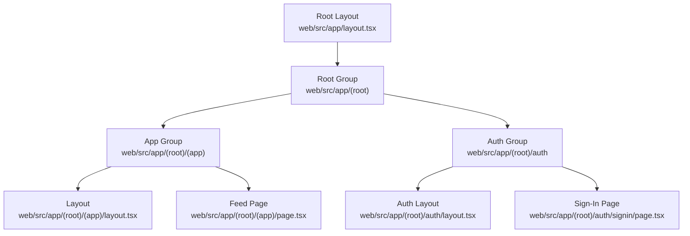
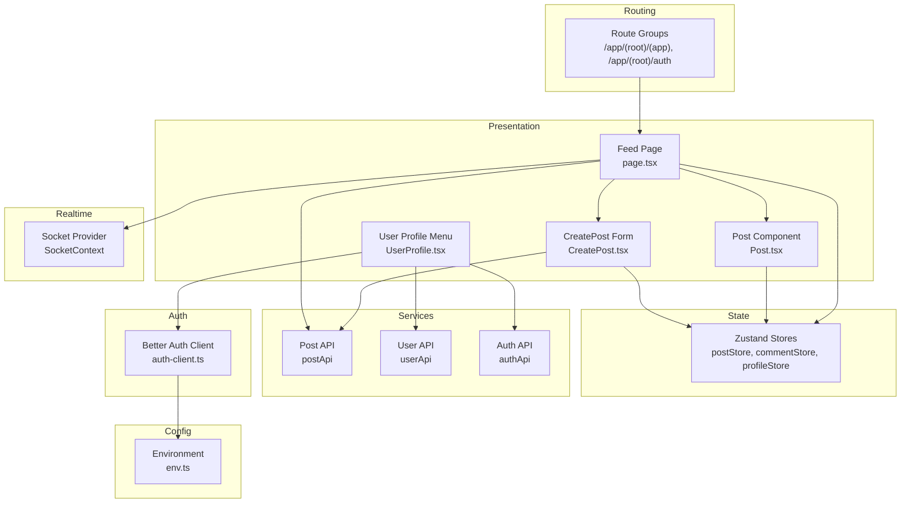
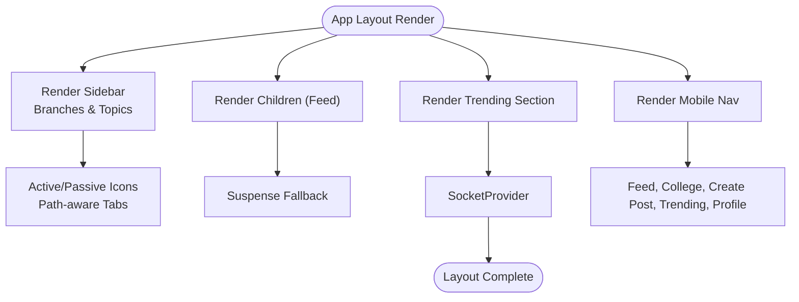
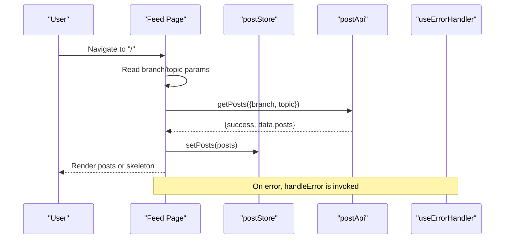
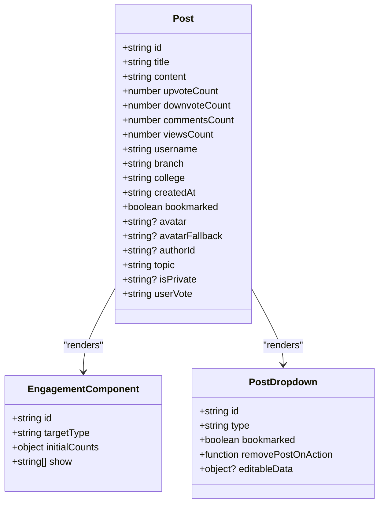
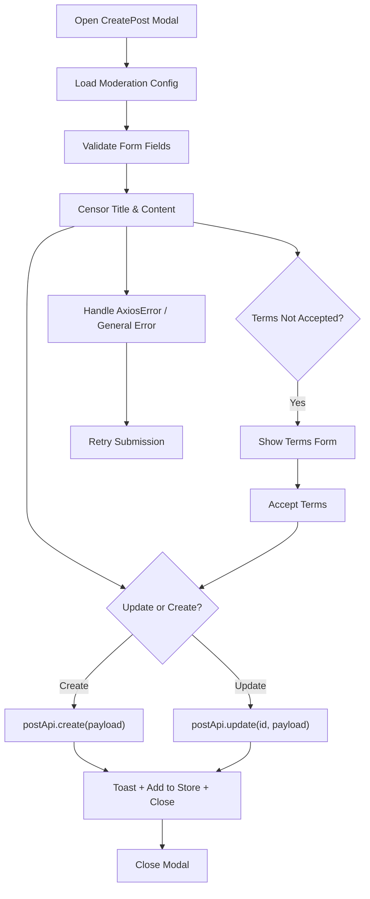
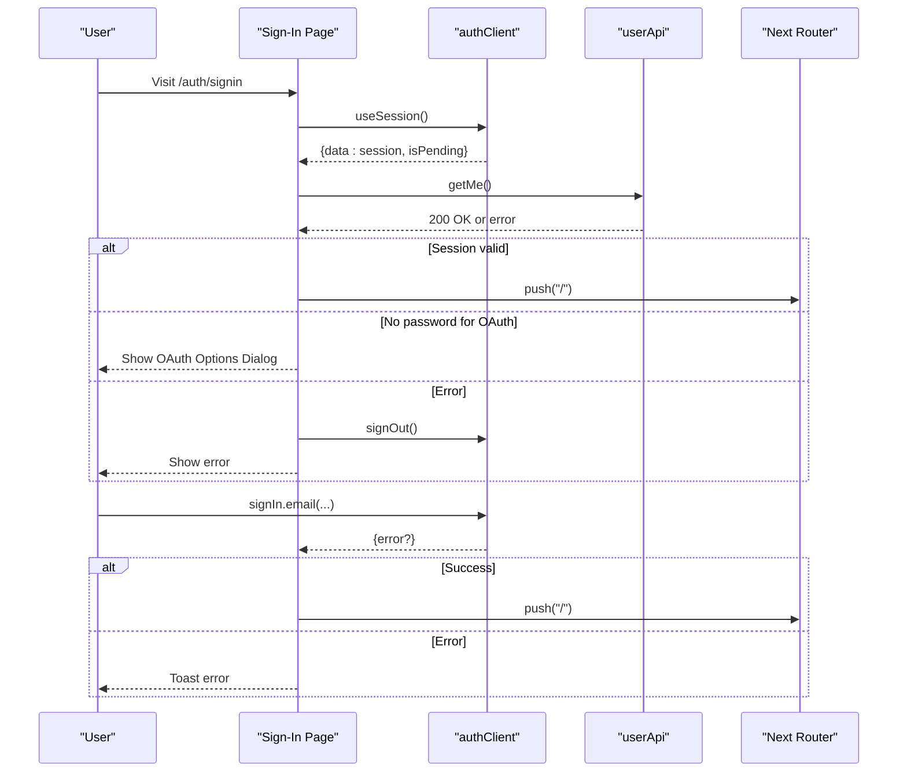
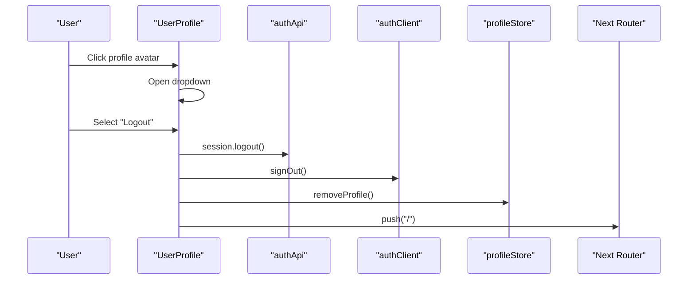
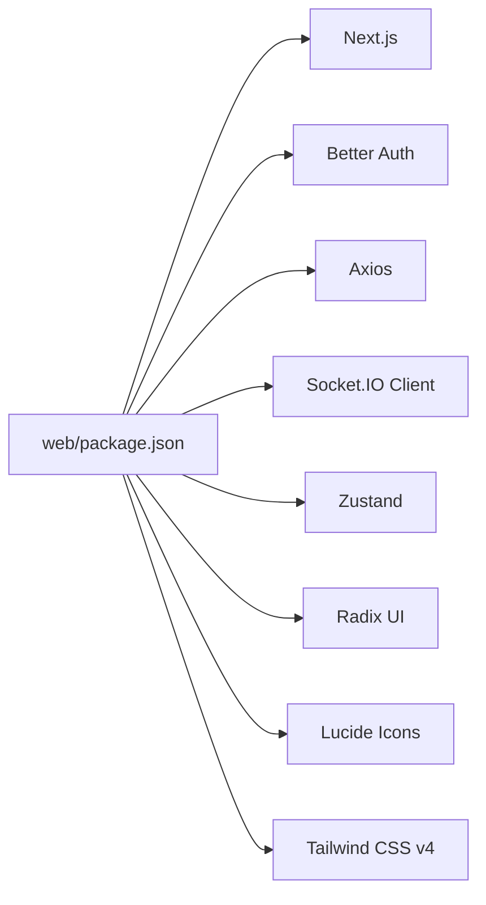

# Web Application

<cite>
**Referenced Files in This Document**
- [layout.tsx](file://web/src/app/layout.tsx)
- [layout.tsx](file://web/src/app/(root)/(app)/layout.tsx)
- [page.tsx](file://web/src/app/(root)/(app)/page.tsx)
- [layout.tsx](file://web/src/app/(root)/auth/layout.tsx)
- [page.tsx](file://web/src/app/(root)/auth/signin/page.tsx)
- [UserProfile.tsx](file://web/src/components/general/UserProfile.tsx)
- [CreatePost.tsx](file://web/src/components/general/CreatePost.tsx)
- [Post.tsx](file://web/src/components/general/Post.tsx)
- [env.ts](file://web/src/config/env.ts)
- [auth-client.ts](file://web/src/lib/auth-client.ts)
- [package.json](file://web/package.json)
- [next.config.ts](file://web/next.config.ts)
</cite>

## Table of Contents
1. [Introduction](#introduction)
2. [Project Structure](#project-structure)
3. [Core Components](#core-components)
4. [Architecture Overview](#architecture-overview)
5. [Detailed Component Analysis](#detailed-component-analysis)
6. [Dependency Analysis](#dependency-analysis)
7. [Performance Considerations](#performance-considerations)
8. [Troubleshooting Guide](#troubleshooting-guide)
9. [Conclusion](#conclusion)

## Introduction
This document describes the main web application frontend built with Next.js App Router. It covers the nested route groups, layout hierarchy, page components, social platform UI (post creation, display, commenting, engagement), state management with Zustand stores, API integration patterns, real-time communication via Socket.IO, component library usage, Tailwind CSS styling, responsive design, authentication state management, routing configuration, and backend service integration.

## Project Structure
The frontend is organized under the Next.js App Router with route groups that separate the main application from authentication pages and define a root group for the primary feed and navigation. Key areas:
- Root application group: contains the main feed, trending, college-specific views, user profile, and settings.
- Authentication group: dedicated pages for sign-in, sign-up, OTP, OAuth callbacks, and password recovery.
- Shared UI components: general social components (Post, CreatePost, UserProfile), UI primitives, and utilities.
- Configuration: environment variables, client-side auth client, and Next.js compiler settings.

**Diagram sources**
- [layout.tsx](file://web/src/app/layout.tsx#L1-L21)
- [layout.tsx](file://web/src/app/(root)/(app)/layout.tsx#L1-L290)
- [page.tsx](file://web/src/app/(root)/(app)/page.tsx#L1-L210)
- [layout.tsx](file://web/src/app/(root)/auth/layout.tsx#L1-L19)
- [page.tsx](file://web/src/app/(root)/auth/signin/page.tsx#L1-L293)

**Section sources**
- [layout.tsx](file://web/src/app/layout.tsx#L1-L21)
- [layout.tsx](file://web/src/app/(root)/(app)/layout.tsx#L1-L290)
- [page.tsx](file://web/src/app/(root)/(app)/page.tsx#L1-L210)
- [layout.tsx](file://web/src/app/(root)/auth/layout.tsx#L1-L19)
- [page.tsx](file://web/src/app/(root)/auth/signin/page.tsx#L1-L293)

## Core Components
- Social feed rendering and filtering by branch/topic.
- Post creation with moderation preview and term acceptance flow.
- Post display with engagement metrics and actions.
- User profile menu with logout and navigation.
- Authentication flow with Better Auth client and Google OAuth.
- Environment-driven configuration for API endpoints and base URLs.
- Zustand stores for posts, comments, and profile state.
- Socket.IO integration for real-time updates.

**Section sources**
- [page.tsx](file://web/src/app/(root)/(app)/page.tsx#L23-L191)
- [CreatePost.tsx](file://web/src/components/general/CreatePost.tsx#L104-L406)
- [Post.tsx](file://web/src/components/general/Post.tsx#L42-L176)
- [UserProfile.tsx](file://web/src/components/general/UserProfile.tsx#L30-L106)
- [env.ts](file://web/src/config/env.ts#L4-L28)
- [auth-client.ts](file://web/src/lib/auth-client.ts#L9-L19)

## Architecture Overview
The application follows a layered architecture:
- Routing layer: Next.js App Router with nested route groups and dynamic segments.
- Presentation layer: React components (general social UI, UI primitives).
- State layer: Zustand stores for posts, comments, and profile.
- Services layer: API clients for posts, users, authentication, and notifications.
- Real-time layer: Socket.IO provider and hooks for live updates.
- Authentication layer: Better Auth client with email/password and Google OAuth.

**Diagram sources**
- [layout.tsx](file://web/src/app/(root)/(app)/layout.tsx#L39-L55)
- [page.tsx](file://web/src/app/(root)/(app)/page.tsx#L23-L68)
- [Post.tsx](file://web/src/components/general/Post.tsx#L42-L176)
- [CreatePost.tsx](file://web/src/components/general/CreatePost.tsx#L104-L406)
- [UserProfile.tsx](file://web/src/components/general/UserProfile.tsx#L30-L106)
- [auth-client.ts](file://web/src/lib/auth-client.ts#L9-L19)
- [env.ts](file://web/src/config/env.ts#L4-L28)

## Detailed Component Analysis

### App Layout and Navigation
The App Layout composes the sidebar, mobile navigation, trending section, and Socket.IO provider. It renders the main content area and handles responsive behavior. The sidebar provides quick links to Feed, My College, Trending, branches, and topics. Mobile navigation offers a bottom bar for core actions.

**Diagram sources**
- [layout.tsx](file://web/src/app/(root)/(app)/layout.tsx#L39-L55)
- [layout.tsx](file://web/src/app/(root)/(app)/layout.tsx#L138-L256)

**Section sources**
- [layout.tsx](file://web/src/app/(root)/(app)/layout.tsx#L1-L290)

### Feed Page and Post Rendering
The Feed page fetches posts filtered by branch and topic query parameters, displays a skeleton loader while loading, and renders either empty state UI or a list of Post components. It integrates with the post store and error handling hook.

**Diagram sources**
- [page.tsx](file://web/src/app/(root)/(app)/page.tsx#L33-L63)
- [page.tsx](file://web/src/app/(root)/(app)/page.tsx#L23-L68)

**Section sources**
- [page.tsx](file://web/src/app/(root)/(app)/page.tsx#L1-L210)

### Post Component and Engagement
Each Post displays metadata (branch, date, college, username, topic), optional private indicator, and an EngagementComponent for voting, comments, sharing, and views. A PostDropdown allows editing/deleting for authorized users.

**Diagram sources**
- [Post.tsx](file://web/src/components/general/Post.tsx#L20-L40)
- [Post.tsx](file://web/src/components/general/Post.tsx#L160-L172)

**Section sources**
- [Post.tsx](file://web/src/components/general/Post.tsx#L1-L179)

### Create Post Form and Moderation
The CreatePost component wraps a modal form that validates title/content/topic/isPrivate, censors text via moderation utilities, and submits to the post API. It supports updating existing posts and handles term acceptance flow.

**Diagram sources**
- [CreatePost.tsx](file://web/src/components/general/CreatePost.tsx#L163-L219)
- [CreatePost.tsx](file://web/src/components/general/CreatePost.tsx#L221-L230)

**Section sources**
- [CreatePost.tsx](file://web/src/components/general/CreatePost.tsx#L1-L409)

### Authentication and Session Management
The sign-in page uses Better Auth client to validate sessions, handle OAuth redirects, and manage sign-in with email/password or Google. It also handles accounts created via OAuth without passwords.

**Diagram sources**
- [page.tsx](file://web/src/app/(root)/auth/signin/page.tsx#L44-L93)
- [page.tsx](file://web/src/app/(root)/auth/signin/page.tsx#L104-L133)

**Section sources**
- [page.tsx](file://web/src/app/(root)/auth/signin/page.tsx#L1-L293)
- [auth-client.ts](file://web/src/lib/auth-client.ts#L9-L19)

### User Profile and Logout
The UserProfile component shows a dropdown with profile, bookmarks, feedback, settings, and logout. Logout triggers both auth API and client sign-out, clears local profile, and navigates to home.

**Diagram sources**
- [UserProfile.tsx](file://web/src/components/general/UserProfile.tsx#L35-L45)

**Section sources**
- [UserProfile.tsx](file://web/src/components/general/UserProfile.tsx#L1-L109)

## Dependency Analysis
Key dependencies and integrations:
- Next.js App Router with React Compiler enabled.
- Better Auth for authentication and Google OAuth.
- Axios for HTTP requests.
- Socket.IO client for real-time features.
- Zustand for state management.
- Radix UI and Lucide icons for UI primitives.
- Tailwind CSS v4 for styling.

**Diagram sources**
- [package.json](file://web/package.json#L13-L52)

**Section sources**
- [package.json](file://web/package.json#L1-L67)
- [next.config.ts](file://web/next.config.ts#L1-L9)

## Performance Considerations
- Use of React Compiler in Next.js improves render performance.
- Suspense boundaries reduce blocking during data fetching.
- Zustand stores minimize re-renders by selecting only necessary slices.
- Conditional rendering of heavy lists (posts) with skeletons improves perceived performance.
- Lazy loading of images and avoiding unnecessary re-renders in components.

[No sources needed since this section provides general guidance]

## Troubleshooting Guide
Common issues and remedies:
- Environment variables not loaded: verify NEXT_PUBLIC_* variables and server runtime environment mapping.
- Authentication failures: check Better Auth baseURL and Google OAuth client ID; ensure redirect URIs match.
- Socket connection errors: confirm Socket.IO server availability and CORS configuration.
- Post moderation errors: ensure moderation config loads before submission; handle 403 TERMS_NOT_ACCEPTED by prompting term acceptance.
- Session validation errors: onboarding errors should trigger sign-out and prompt re-authentication.

**Section sources**
- [env.ts](file://web/src/config/env.ts#L4-L28)
- [auth-client.ts](file://web/src/lib/auth-client.ts#L9-L19)
- [CreatePost.tsx](file://web/src/components/general/CreatePost.tsx#L163-L219)
- [page.tsx](file://web/src/app/(root)/auth/signin/page.tsx#L56-L93)

## Conclusion
The web application frontend leverages Next.js App Router with nested route groups, a robust UI built from general social components and UI primitives, and a cohesive state management strategy using Zustand. Authentication is powered by Better Auth with Google OAuth, while real-time features integrate via Socket.IO. The design is responsive, styled with Tailwind CSS, and structured for maintainability and scalability.