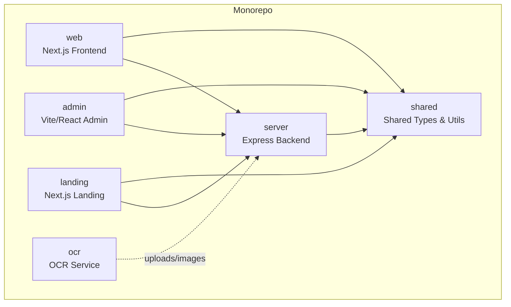
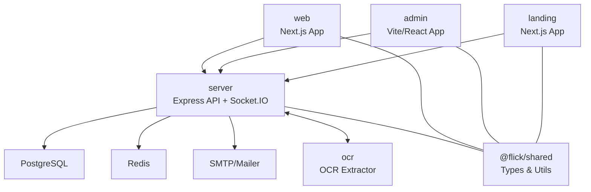
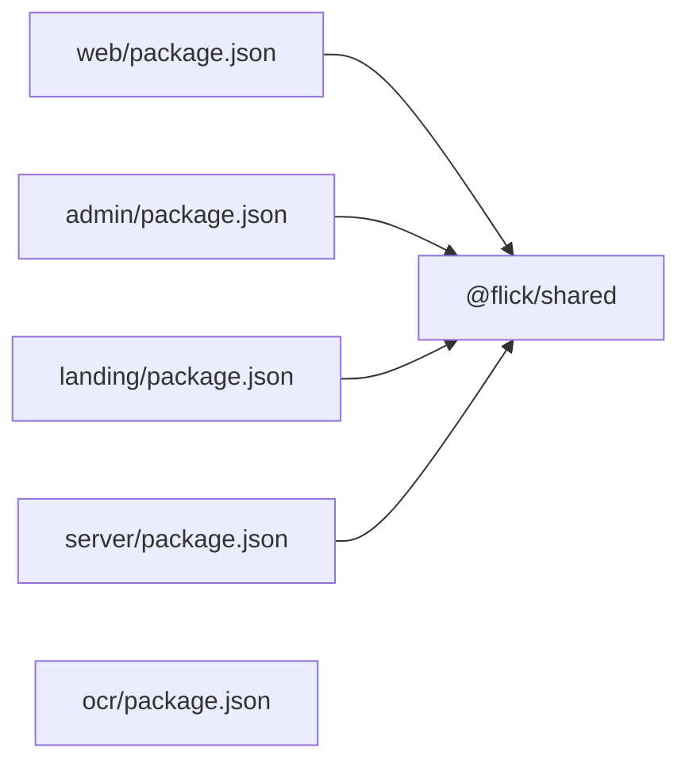

# Project Overview

<cite>
**Referenced Files in This Document**
- [README.md](file://README.md)
- [package.json](file://package.json)
- [turbo.json](file://turbo.json)
- [pnpm-workspace.yaml](file://pnpm-workspace.yaml)
- [shared/package.json](file://shared/package.json)
- [shared/src/index.ts](file://shared/src/index.ts)
- [server/package.json](file://server/package.json)
- [server/src/app.ts](file://server/src/app.ts)
- [server/src/modules/post/post.controller.ts](file://server/src/modules/post/post.controller.ts)
- [server/src/modules/moderation/content/content-moderation.service.ts](file://server/src/modules/moderation/content/content-moderation.service.ts)
- [server/src/infra/services/moderator/index.ts](file://server/src/infra/services/moderator/index.ts)
- [web/package.json](file://web/package.json)
- [web/src/app/layout.tsx](file://web/src/app/layout.tsx)
- [web/src/hooks/useErrorHandler.tsx](file://web/src/hooks/useErrorHandler.tsx)
- [web/src/services/api/moderation.ts](file://web/src/services/api/moderation.ts)
- [admin/package.json](file://admin/package.json)
- [admin/src/main.tsx](file://admin/src/main.tsx)
- [landing/package.json](file://landing/package.json)
- [ocr/package.json](file://ocr/package.json)
</cite>

## Table of Contents
1. [Introduction](#introduction)
2. [Project Structure](#project-structure)
3. [Core Components](#core-components)
4. [Architecture Overview](#architecture-overview)
5. [Detailed Component Analysis](#detailed-component-analysis)
6. [Dependency Analysis](#dependency-analysis)
7. [Performance Considerations](#performance-considerations)
8. [Troubleshooting Guide](#troubleshooting-guide)
9. [Conclusion](#conclusion)

## Introduction
Flick is an anonymous campus social platform designed for college students to share experiences, ask questions, and engage in discussions without revealing their identities. Its core value proposition lies in enabling open dialogue while maintaining safety and trust through robust content moderation, real-time engagement, and administrative oversight. Key differentiators include:
- Anonymous posting with optional privacy controls
- Integrated content moderation powered by configurable policies and banned-word filters
- Real-time notifications and live updates via WebSocket connections
- Administrative dashboards for monitoring, reporting, and enforcing community standards
- OCR-enabled identity verification pipeline for onboarding and compliance

Target audience: College students seeking a safe, anonymous space for campus life conversations, along with administrators who manage content and user safety.

## Project Structure
Flick follows a monorepo architecture managed with pnpm workspaces and Turborepo. It comprises five distinct applications plus a shared package:
- web: Next.js frontend for student-facing interactions (posts, comments, notifications)
- server: Express-based backend API with authentication, moderation, caching, and real-time services
- admin: Vite/React admin dashboard for moderation, analytics, and administrative controls
- landing: Next.js marketing site showcasing features and onboarding
- ocr: Standalone service for extracting text from uploaded images (student identity documents)
- shared: TypeScript library for cross-package types and utilities

**Diagram sources**
- [pnpm-workspace.yaml](file://pnpm-workspace.yaml#L1-L15)
- [turbo.json](file://turbo.json#L1-L27)
- [server/src/app.ts](file://server/src/app.ts#L1-L33)

**Section sources**
- [pnpm-workspace.yaml](file://pnpm-workspace.yaml#L1-L15)
- [turbo.json](file://turbo.json#L1-L27)
- [package.json](file://package.json#L10-L16)

## Core Components
- Anonymous social feed: Students can create posts with topics and optional privacy flags; posts are filtered by college and branch.
- Content moderation: Automated checks for policy violations and banned words; supports banning/unbanning and shadow-banning for posts.
- Real-time notifications: WebSocket-powered live updates for likes, replies, and moderation actions.
- Administrative controls: Dashboards for reviewing reported content, managing colleges/branches, configuring banned words, and viewing logs.
- Identity verification: OCR pipeline extracts text from uploaded images to support identity checks during onboarding.

Practical examples:
- A student creates an anonymous post about campus housing; the system runs moderation checks and publishes it if approved.
- An administrator reviews a reported post, decides to ban it, and applies the moderation action; the student receives a notification.
- A new user uploads an identity image; the OCR service extracts text, which the backend uses to verify eligibility.

**Section sources**
- [server/src/modules/post/post.controller.ts](file://server/src/modules/post/post.controller.ts#L8-L22)
- [server/src/modules/moderation/content/content-moderation.service.ts](file://server/src/modules/moderation/content/content-moderation.service.ts#L211-L248)
- [web/src/hooks/useErrorHandler.tsx](file://web/src/hooks/useErrorHandler.tsx#L46-L72)
- [web/src/services/api/moderation.ts](file://web/src/services/api/moderation.ts#L1-L7)
- [admin/src/main.tsx](file://admin/src/main.tsx#L19-L89)

## Architecture Overview
Flick’s architecture centers on a client-server model with real-time capabilities and modular backend services:
- Frontends (web, admin, landing) communicate with the server via REST and WebSocket connections.
- The server orchestrates authentication, authorization, database operations, caching, and moderation.
- Shared types and utilities are reused across packages to maintain consistency.
- The OCR service handles image-to-text extraction and integrates with the main backend for identity-related workflows.

**Diagram sources**
- [server/src/app.ts](file://server/src/app.ts#L1-L33)
- [server/package.json](file://server/package.json#L26-L59)
- [web/package.json](file://web/package.json#L13-L52)
- [admin/package.json](file://admin/package.json#L13-L57)
- [landing/package.json](file://landing/package.json#L12-L25)
- [ocr/package.json](file://ocr/package.json#L15-L21)
- [shared/src/index.ts](file://shared/src/index.ts#L1-L8)

## Detailed Component Analysis

### Web Application
- Purpose: Student-facing interface for browsing posts, creating content, engaging with others, and receiving notifications.
- Key features: Anonymous posting, topic filtering, real-time updates, moderation messaging, and onboarding flows.
- Technology highlights: Next.js, Radix UI, Tailwind CSS, Zustand for state, Socket.IO client, Axios for HTTP.

Common use cases:
- Create a post anonymously and filter by branch/topic
- Receive moderation feedback and adjust content accordingly
- View trending posts and navigate via breadcrumbs

**Section sources**
- [web/package.json](file://web/package.json#L13-L52)
- [web/src/app/layout.tsx](file://web/src/app/layout.tsx#L1-L21)
- [web/src/hooks/useErrorHandler.tsx](file://web/src/hooks/useErrorHandler.tsx#L46-L72)

### Server Application
- Purpose: Centralized backend providing REST APIs, authentication, moderation, caching, and real-time communication.
- Key features: Post CRUD, user management, content moderation, rate limiting, audit logging, and WebSocket integration.
- Technology highlights: Express, Drizzle ORM, PostgreSQL, Redis, Better Auth, Helmet, Morgan, Socket.IO.

Example flows:
- Create a post: Parse request body, enforce schema, persist to DB, broadcast updates via WebSocket.
- Moderate content: Evaluate against policy and banned words; apply ban/shadow-ban/unban as configured.

**Section sources**
- [server/src/app.ts](file://server/src/app.ts#L1-L33)
- [server/src/modules/post/post.controller.ts](file://server/src/modules/post/post.controller.ts#L8-L22)
- [server/src/modules/moderation/content/content-moderation.service.ts](file://server/src/modules/moderation/content/content-moderation.service.ts#L211-L248)

### Admin Application
- Purpose: Administrative dashboard for monitoring, reviewing reports, managing colleges/branches, configuring banned words, and inspecting logs.
- Key features: Authenticated routing, data tables, charts, and real-time updates.
- Technology highlights: Vite, React Router, Radix UI, Recharts, Socket.IO client.

Common use cases:
- Approve or reject reported posts
- Add/remove banned words
- View analytics and logs

**Section sources**
- [admin/package.json](file://admin/package.json#L13-L57)
- [admin/src/main.tsx](file://admin/src/main.tsx#L19-L89)

### Landing Application
- Purpose: Marketing site introducing Flick’s features and guiding prospective users to sign in.
- Technology highlights: Next.js, Radix UI, Tailwind CSS, motion animations.

**Section sources**
- [landing/package.json](file://landing/package.json#L12-L25)

### OCR Application
- Purpose: Extract text from uploaded images to support identity verification and onboarding workflows.
- Technology highlights: Express, Multer, Tesseract.js, CORS middleware.

**Section sources**
- [ocr/package.json](file://ocr/package.json#L15-L21)

### Shared Package
- Purpose: Provide shared TypeScript types and utilities across web, server, admin, landing, and OCR packages.
- Example exports: Utility functions and type definitions for cross-package compatibility.

**Section sources**
- [shared/package.json](file://shared/package.json#L14-L17)
- [shared/src/index.ts](file://shared/src/index.ts#L1-L8)

## Dependency Analysis
- Workspaces: Defined in pnpm-workspace.yaml; includes web, server, admin, landing, ocr, and shared.
- Build orchestration: Turborepo tasks define build order and caching behavior.
- Cross-package dependencies: web, admin, landing depend on @flick/shared; server also depends on @flick/shared.
- External libraries: server integrates PostgreSQL, Redis, Socket.IO, Better Auth; web/admin use Radix UI, Tailwind, Zustand; ocr uses Tesseract.js.

**Diagram sources**
- [pnpm-workspace.yaml](file://pnpm-workspace.yaml#L1-L15)
- [web/package.json](file://web/package.json#L14)
- [admin/package.json](file://admin/package.json#L14)
- [landing/package.json](file://landing/package.json#L12)
- [server/package.json](file://server/package.json#L27)
- [shared/src/index.ts](file://shared/src/index.ts#L1-L8)

**Section sources**
- [pnpm-workspace.yaml](file://pnpm-workspace.yaml#L1-L15)
- [turbo.json](file://turbo.json#L1-L27)
- [web/package.json](file://web/package.json#L14)
- [admin/package.json](file://admin/package.json#L14)
- [landing/package.json](file://landing/package.json#L12)
- [server/package.json](file://server/package.json#L27)
- [shared/src/index.ts](file://shared/src/index.ts#L1-L8)

## Performance Considerations
- Caching: Use Redis for session storage, rate limiting, and frequently accessed data to reduce DB load.
- Database: Normalize schema with appropriate indexes on user, post, and moderation tables; paginate queries for feeds.
- Real-time: Limit event payload sizes and throttle frequent updates; batch notifications where possible.
- Build and deployment: Leverage Turborepo caching and incremental builds to speed up CI/CD.

## Troubleshooting Guide
- Content moderation errors: The frontend surfaces moderation messages based on backend error codes and reasons. Adjust content per policy or reach out to support.
- Authentication issues: Verify cookies and tokens; ensure proper redirect flows for OAuth providers.
- Real-time connectivity: Confirm WebSocket initialization and reconnection logic; check server logs for connection drops.
- Admin access: Ensure role-based permissions and correct routing to protected admin pages.

**Section sources**
- [web/src/hooks/useErrorHandler.tsx](file://web/src/hooks/useErrorHandler.tsx#L46-L72)
- [web/src/services/api/moderation.ts](file://web/src/services/api/moderation.ts#L1-L7)
- [admin/src/main.tsx](file://admin/src/main.tsx#L19-L89)

## Conclusion
Flick delivers a secure, scalable, and developer-friendly monorepo solution for anonymous campus social networking. Its layered architecture, strong moderation capabilities, and real-time features enable vibrant communities while keeping administration and compliance straightforward. The shared package and Turborepo setup streamline development and deployment across the five applications.