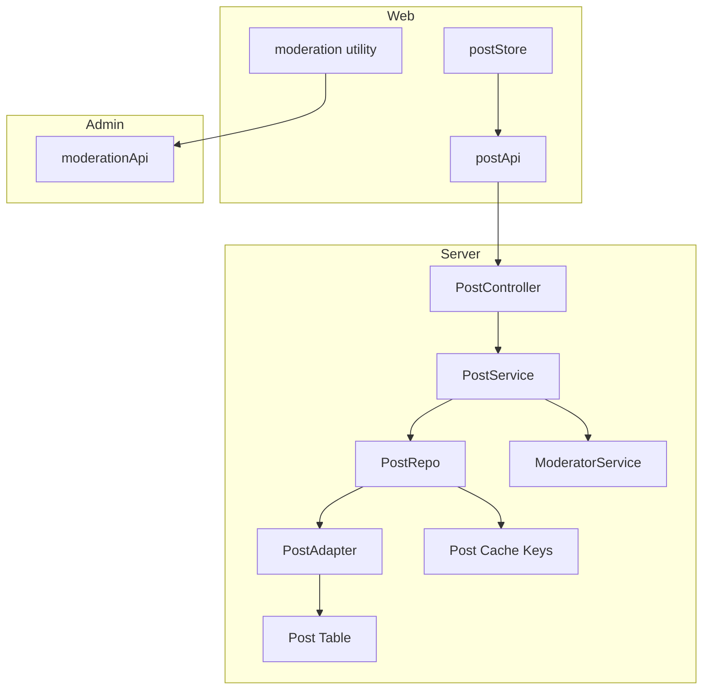
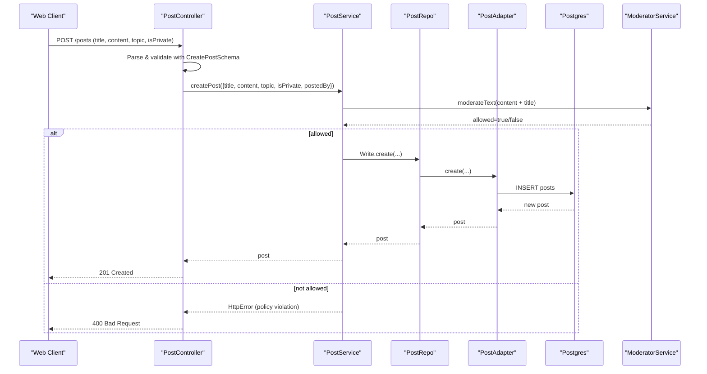
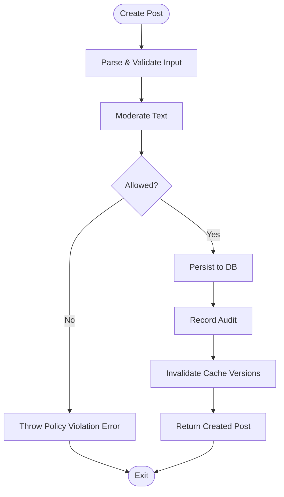
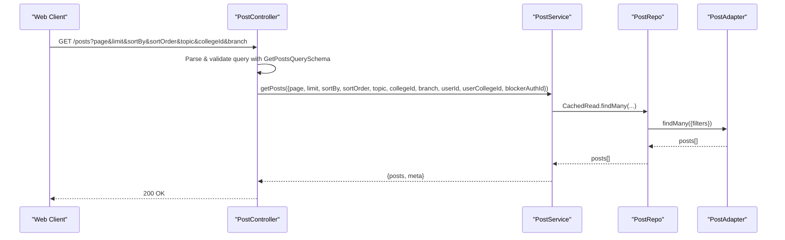
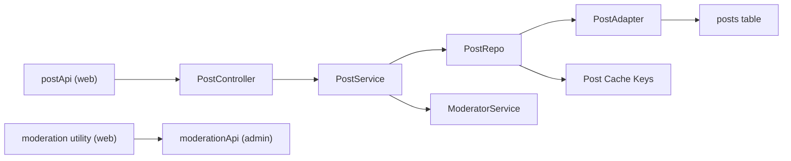

# Anonymous Posting System

<cite>
**Referenced Files in This Document**
- [post.controller.ts](file://server/src/modules/post/post.controller.ts)
- [post.service.ts](file://server/src/modules/post/post.service.ts)
- [post.schema.ts](file://server/src/modules/post/post.schema.ts)
- [post.repo.ts](file://server/src/modules/post/post.repo.ts)
- [post.adapter.ts](file://server/src/infra/db/adapters/post.adapter.ts)
- [post.table.ts](file://server/src/infra/db/tables/post.table.ts)
- [moderator.service.ts](file://server/src/infra/services/moderator/moderator.service.ts)
- [post.cache-keys.ts](file://server/src/modules/post/post.cache-keys.ts)
- [post.ts](file://web/src/services/api/post.ts)
- [moderation.ts](file://web/src/utils/moderation.ts)
- [moderation.ts (admin)](file://admin/src/services/api/moderation.ts)
- [postStore.ts](file://web/src/store/postStore.ts)
- [useSocket.ts](file://web/src/socket/useSocket.ts)
- [notification.service.ts](file://server/src/modules/notification/notification.service.ts)
</cite>

## Table of Contents
1. [Introduction](#introduction)
2. [Project Structure](#project-structure)
3. [Core Components](#core-components)
4. [Architecture Overview](#architecture-overview)
5. [Detailed Component Analysis](#detailed-component-analysis)
6. [Dependency Analysis](#dependency-analysis)
7. [Performance Considerations](#performance-considerations)
8. [Troubleshooting Guide](#troubleshooting-guide)
9. [Conclusion](#conclusion)
10. [Appendices](#appendices)

## Introduction
This document explains Flick’s anonymous posting system end-to-end. It covers the post creation workflow, content validation, topic assignment, privacy controls, anonymous posting mechanics, user identity obfuscation, content moderation integration, post lifecycle (creation to deletion), editing permissions and ownership verification, schema validation and request/response formats, error handling, real-time updates, trending algorithms, content discovery, filtering by topic/college/branch, and notification integration patterns.

## Project Structure
The anonymous posting system spans three layers:
- Backend API and domain logic (server)
- Frontend API clients and UI stores (web)
- Admin moderation configuration (admin)



**Diagram sources**
- [post.controller.ts](file://server/src/modules/post/post.controller.ts#L1-L162)
- [post.service.ts](file://server/src/modules/post/post.service.ts#L1-L408)
- [post.repo.ts](file://server/src/modules/post/post.repo.ts#L1-L133)
- [post.adapter.ts](file://server/src/infra/db/adapters/post.adapter.ts#L1-L497)
- [post.table.ts](file://server/src/infra/db/tables/post.table.ts#L1-L39)
- [moderator.service.ts](file://server/src/infra/services/moderator/moderator.service.ts#L1-L642)
- [post.cache-keys.ts](file://server/src/modules/post/post.cache-keys.ts#L1-L48)
- [post.ts](file://web/src/services/api/post.ts#L1-L65)
- [postStore.ts](file://web/src/store/postStore.ts#L1-L30)
- [moderation.ts](file://web/src/utils/moderation.ts#L1-L671)
- [moderation.ts (admin)](file://admin/src/services/api/moderation.ts#L1-L49)

**Section sources**
- [post.controller.ts](file://server/src/modules/post/post.controller.ts#L1-L162)
- [post.service.ts](file://server/src/modules/post/post.service.ts#L1-L408)
- [post.schema.ts](file://server/src/modules/post/post.schema.ts#L1-L107)
- [post.repo.ts](file://server/src/modules/post/post.repo.ts#L1-L133)
- [post.adapter.ts](file://server/src/infra/db/adapters/post.adapter.ts#L1-L497)
- [post.table.ts](file://server/src/infra/db/tables/post.table.ts#L1-L39)
- [moderator.service.ts](file://server/src/infra/services/moderator/moderator.service.ts#L1-L642)
- [post.cache-keys.ts](file://server/src/modules/post/post.cache-keys.ts#L1-L48)
- [post.ts](file://web/src/services/api/post.ts#L1-L65)
- [postStore.ts](file://web/src/store/postStore.ts#L1-L30)
- [moderation.ts](file://web/src/utils/moderation.ts#L1-L671)
- [moderation.ts (admin)](file://admin/src/services/api/moderation.ts#L1-L49)

## Core Components
- PostController: Exposes REST endpoints for creating, retrieving, updating, deleting posts, and filtering by topic/college/branch. It parses and validates requests using Zod schemas and delegates to PostService.
- PostService: Implements business logic including moderation checks, ownership verification, privacy enforcement, caching invalidation, and audit recording.
- PostRepo and PostAdapter: Encapsulate read/write operations to the database with caching and complex joins for enriched post data.
- ModeratorService: Integrates banned-word detection and Perspective API-based toxicity validation to enforce content policies.
- Web API and Utilities: Provide typed API clients and client-side moderation utilities for pre-submission validation and UI feedback.
- Admin Moderation API: Allows administrators to manage banned-word configurations consumed by the backend.

**Section sources**
- [post.controller.ts](file://server/src/modules/post/post.controller.ts#L1-L162)
- [post.service.ts](file://server/src/modules/post/post.service.ts#L1-L408)
- [post.schema.ts](file://server/src/modules/post/post.schema.ts#L1-L107)
- [post.repo.ts](file://server/src/modules/post/post.repo.ts#L1-L133)
- [post.adapter.ts](file://server/src/infra/db/adapters/post.adapter.ts#L1-L497)
- [moderator.service.ts](file://server/src/infra/services/moderator/moderator.service.ts#L1-L642)
- [post.ts](file://web/src/services/api/post.ts#L1-L65)
- [moderation.ts](file://web/src/utils/moderation.ts#L1-L671)
- [moderation.ts (admin)](file://admin/src/services/api/moderation.ts#L1-L49)

## Architecture Overview
The system follows a layered architecture:
- Presentation: Web API clients and UI stores
- Application: Controllers and Services
- Persistence: Repositories and Adapters backed by PostgreSQL
- Moderation: Dynamic banned-word matcher and external validator



**Diagram sources**
- [post.controller.ts](file://server/src/modules/post/post.controller.ts#L8-L22)
- [post.service.ts](file://server/src/modules/post/post.service.ts#L40-L94)
- [post.schema.ts](file://server/src/modules/post/post.schema.ts#L17-L27)
- [post.repo.ts](file://server/src/modules/post/post.repo.ts#L124-L129)
- [post.adapter.ts](file://server/src/infra/db/adapters/post.adapter.ts#L456-L463)
- [moderator.service.ts](file://server/src/infra/services/moderator/moderator.service.ts#L583-L636)

## Detailed Component Analysis

### Post Creation Workflow
- Validation: Zod schemas enforce length limits and topic enumeration for create/update operations.
- Moderation: Content is checked against banned words and contextual toxicity thresholds before persisting.
- Persistence: Post is inserted with metadata and ownership linked to the authenticated user.
- Caching: Post and list version keys are bumped to invalidate caches.



**Diagram sources**
- [post.schema.ts](file://server/src/modules/post/post.schema.ts#L17-L47)
- [post.service.ts](file://server/src/modules/post/post.service.ts#L40-L94)
- [post.adapter.ts](file://server/src/infra/db/adapters/post.adapter.ts#L456-L463)
- [post.cache-keys.ts](file://server/src/modules/post/post.cache-keys.ts#L6-L7)

**Section sources**
- [post.controller.ts](file://server/src/modules/post/post.controller.ts#L8-L22)
- [post.service.ts](file://server/src/modules/post/post.service.ts#L40-L94)
- [post.schema.ts](file://server/src/modules/post/post.schema.ts#L17-L47)
- [post.adapter.ts](file://server/src/infra/db/adapters/post.adapter.ts#L456-L463)
- [post.cache-keys.ts](file://server/src/modules/post/post.cache-keys.ts#L6-L7)

### Content Validation and Topic Assignment
- Title/content length limits and topic enumeration are enforced by Zod schemas.
- Topic normalization supports exact match, case-insensitive match, and URL-decoded match for flexible client inputs.
- Privacy control: isPrivate toggles visibility rules based on user authentication and college association.

**Section sources**
- [post.schema.ts](file://server/src/modules/post/post.schema.ts#L3-L15)
- [post.schema.ts](file://server/src/modules/post/post.schema.ts#L53-L98)
- [post.service.ts](file://server/src/modules/post/post.service.ts#L96-L143)

### Privacy Controls and Identity Obfuscation
- Private posts are visible only to authenticated users within the same college as the author.
- Unauthenticated users see only public posts.
- The system does not expose author identity beyond the author’s username, branch, and college metadata in enriched queries.

**Section sources**
- [post.adapter.ts](file://server/src/infra/db/adapters/post.adapter.ts#L242-L255)
- [post.service.ts](file://server/src/modules/post/post.service.ts#L109-L128)

### Ownership Verification and Editing Permissions
- Update/Delete operations require the requesting user ID to match the post’s author ID.
- Unauthorized attempts are rejected with appropriate HTTP errors.

**Section sources**
- [post.service.ts](file://server/src/modules/post/post.service.ts#L211-L239)
- [post.service.ts](file://server/src/modules/post/post.service.ts#L302-L325)

### Post Lifecycle: Retrieval, Filtering, and Discovery
- Retrieval: Fetch by ID with privacy checks, paginated lists with sorting and filtering, and counts for pagination metadata.
- Filtering: By topic, college, branch, author, and user context (including blocking relations).
- Discovery: Trending posts by view count.



**Diagram sources**
- [post.controller.ts](file://server/src/modules/post/post.controller.ts#L24-L46)
- [post.schema.ts](file://server/src/modules/post/post.schema.ts#L53-L98)
- [post.service.ts](file://server/src/modules/post/post.service.ts#L145-L193)
- [post.repo.ts](file://server/src/modules/post/post.repo.ts#L19-L62)
- [post.adapter.ts](file://server/src/infra/db/adapters/post.adapter.ts#L167-L373)

**Section sources**
- [post.controller.ts](file://server/src/modules/post/post.controller.ts#L24-L132)
- [post.service.ts](file://server/src/modules/post/post.service.ts#L145-L193)
- [post.adapter.ts](file://server/src/infra/db/adapters/post.adapter.ts#L167-L373)

### Content Moderation Integration
- Dynamic banned-word matching powered by Aho-Corasick automata with strict and normal modes, plus wildcard support.
- Perspective API-based toxicity scoring with configurable thresholds and span-level detection.
- Fail-closed behavior on moderation service errors.

```mermaid
classDiagram
class ModeratorService {
+moderateText(input) IntegratedModerationResult
-ensureCompiled()
-validateContent(text) {allowed, reasons}
}
class CompiledModerationSet {
+strictMatcher : AhoCorasick
+normalMatcher : AhoCorasick
+normalVariantsMatcher : AhoCorasick
+wildcardPatterns
}
ModeratorService --> CompiledModerationSet : "builds/uses"
```

**Diagram sources**
- [moderator.service.ts](file://server/src/infra/services/moderator/moderator.service.ts#L420-L636)

**Section sources**
- [moderator.service.ts](file://server/src/infra/services/moderator/moderator.service.ts#L420-L636)

### Real-Time Updates and Notifications
- Real-time notifications are currently commented out in the backend notification service module.
- The frontend exposes a socket hook and a Zustand store for managing posts locally, but live updates are not wired to the backend in the current codebase snapshot.

**Section sources**
- [notification.service.ts](file://server/src/modules/notification/notification.service.ts#L1-L211)
- [useSocket.ts](file://web/src/socket/useSocket.ts#L1-L9)
- [postStore.ts](file://web/src/store/postStore.ts#L1-L30)

### Trending Algorithms and Content Discovery
- Trending posts are fetched by sorting by view count descending with a small fixed limit.
- The UI can integrate this endpoint to surface popular content.

**Section sources**
- [post.ts](file://web/src/services/api/post.ts#L52-L60)

## Dependency Analysis
The following diagram shows key dependencies among components involved in anonymous posting:



**Diagram sources**
- [post.controller.ts](file://server/src/modules/post/post.controller.ts#L1-L162)
- [post.service.ts](file://server/src/modules/post/post.service.ts#L1-L408)
- [post.repo.ts](file://server/src/modules/post/post.repo.ts#L1-L133)
- [post.adapter.ts](file://server/src/infra/db/adapters/post.adapter.ts#L1-L497)
- [post.table.ts](file://server/src/infra/db/tables/post.table.ts#L1-L39)
- [moderator.service.ts](file://server/src/infra/services/moderator/moderator.service.ts#L1-L642)
- [post.cache-keys.ts](file://server/src/modules/post/post.cache-keys.ts#L1-L48)
- [post.ts](file://web/src/services/api/post.ts#L1-L65)
- [moderation.ts](file://web/src/utils/moderation.ts#L1-L671)
- [moderation.ts (admin)](file://admin/src/services/api/moderation.ts#L1-L49)

**Section sources**
- [post.controller.ts](file://server/src/modules/post/post.controller.ts#L1-L162)
- [post.service.ts](file://server/src/modules/post/post.service.ts#L1-L408)
- [post.repo.ts](file://server/src/modules/post/post.repo.ts#L1-L133)
- [post.adapter.ts](file://server/src/infra/db/adapters/post.adapter.ts#L1-L497)
- [post.table.ts](file://server/src/infra/db/tables/post.table.ts#L1-L39)
- [moderator.service.ts](file://server/src/infra/services/moderator/moderator.service.ts#L1-L642)
- [post.cache-keys.ts](file://server/src/modules/post/post.cache-keys.ts#L1-L48)
- [post.ts](file://web/src/services/api/post.ts#L1-L65)
- [moderation.ts](file://web/src/utils/moderation.ts#L1-L671)
- [moderation.ts (admin)](file://admin/src/services/api/moderation.ts#L1-L49)

## Performance Considerations
- Caching: Post retrieval and counts are cached using versioned keys; mutations bump versions to invalidate caches.
- Database indexing: Visibility and sort indexes are defined on the posts table to optimize filtering and ordering.
- Moderation caching: Results are cached to reduce repeated moderation calls.

Recommendations:
- Monitor cache hit rates and tune TTLs for moderation and post lists.
- Add pagination-aware caching for trending endpoints.
- Consider precomputing trending aggregates if traffic grows.

**Section sources**
- [post.cache-keys.ts](file://server/src/modules/post/post.cache-keys.ts#L1-L48)
- [post.adapter.ts](file://server/src/infra/db/adapters/post.adapter.ts#L32-L37)
- [moderator.service.ts](file://server/src/infra/services/moderator/moderator.service.ts#L59-L63)

## Troubleshooting Guide
Common issues and resolutions:
- Content policy violation during creation or update:
  - The moderation service returns violations with reasons and matched words; adjust content accordingly.
- Unauthorized access to private posts:
  - Ensure the user is authenticated and belongs to the same college as the post author.
- Not found errors:
  - Verify post IDs and that the post is not shadow/banned.
- Rate limiting or spam detection:
  - The validator flags excessive links or repeated characters; rewrite content respectfully.

**Section sources**
- [post.service.ts](file://server/src/modules/post/post.service.ts#L12-L38)
- [post.service.ts](file://server/src/modules/post/post.service.ts#L96-L143)
- [moderator.service.ts](file://server/src/infra/services/moderator/moderator.service.ts#L476-L478)
- [moderator.service.ts](file://server/src/infra/services/moderator/moderator.service.ts#L486-L576)

## Conclusion
Flick’s anonymous posting system enforces strong content moderation, preserves user privacy, and provides robust filtering and discovery. The backend ensures ownership verification and privacy boundaries, while the frontend offers convenient APIs and client-side moderation utilities. Real-time updates and notifications are present in concept but not fully wired in the current snapshot.

## Appendices

### API Definitions and Examples
- Create a post:
  - Method: POST
  - Path: /posts
  - Body: { title, content, topic, isPrivate? }
  - Response: { post }

- Retrieve posts with filters:
  - Method: GET
  - Path: /posts
  - Query: { page?, limit?, sortBy?, sortOrder?, topic?, collegeId?, branch? }
  - Response: { posts[], meta }

- Retrieve trending posts:
  - Method: GET
  - Path: /posts
  - Query: { sortBy=views, sortOrder=desc, limit=5 }
  - Response: { posts[], meta }

- Update a post:
  - Method: PATCH
  - Path: /posts/{id}
  - Body: { title?, content?, topic?, isPrivate? }
  - Response: { post }

- Delete a post:
  - Method: DELETE
  - Path: /posts/{id}
  - Response: { message }

- Increment views:
  - Method: POST
  - Path: /posts/{id}/view
  - Response: { message }

- Filter by college:
  - Method: GET
  - Path: /posts/college/{collegeId}
  - Query: { page?, limit?, sortBy?, sortOrder? }

- Filter by branch:
  - Method: GET
  - Path: /posts/branch/{branch}
  - Query: { page?, limit?, sortBy?, sortOrder? }

- Filter by author:
  - Method: GET
  - Path: /posts/user/{userId}
  - Query: { page?, limit?, sortBy?, sortOrder? }

**Section sources**
- [post.ts](file://web/src/services/api/post.ts#L13-L64)
- [post.controller.ts](file://server/src/modules/post/post.controller.ts#L8-L158)
- [post.schema.ts](file://server/src/modules/post/post.schema.ts#L53-L106)

### Schema Validation Reference
- CreatePostSchema: Enforces title/content length limits, topic enumeration, optional isPrivate.
- UpdatePostSchema: Same as create with optional fields.
- GetPostsQuerySchema: Validates pagination, sorting, and topic normalization.
- PostIdSchema, CollegeIdSchema, BranchSchema: UUID and branch validations.

**Section sources**
- [post.schema.ts](file://server/src/modules/post/post.schema.ts#L17-L106)

### Moderation Configuration (Admin)
- List banned words and manage strict/normal modes and severities.
- Client-side moderation utility compiles and caches configuration for fast local checks.

**Section sources**
- [moderation.ts (admin)](file://admin/src/services/api/moderation.ts#L23-L48)
- [moderation.ts](file://web/src/utils/moderation.ts#L430-L484)