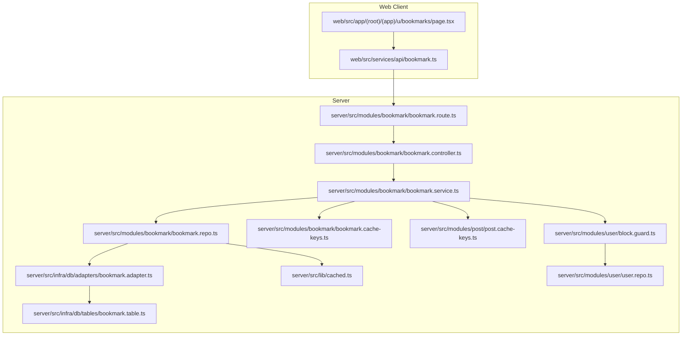
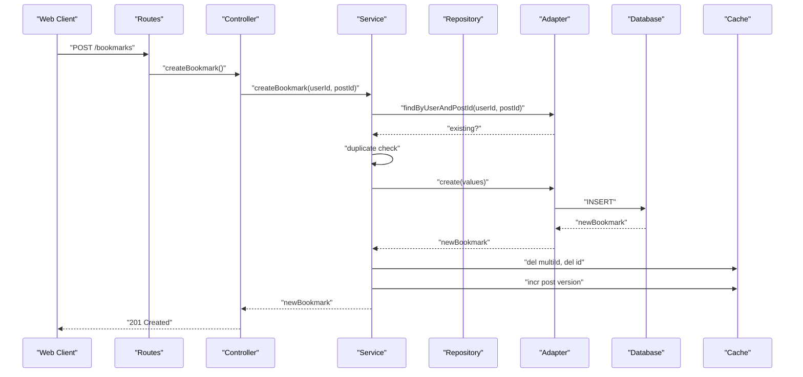
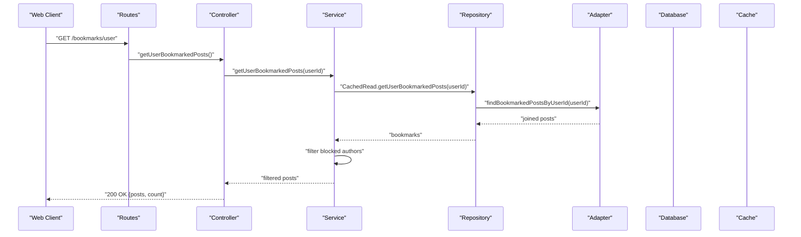
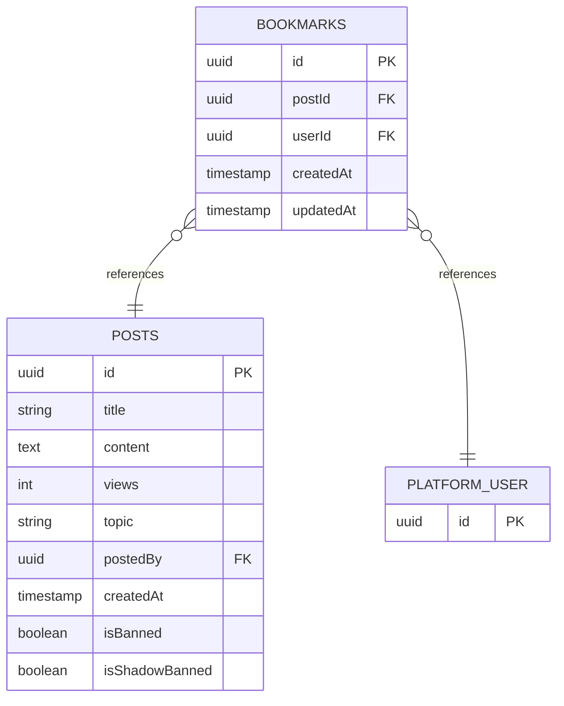
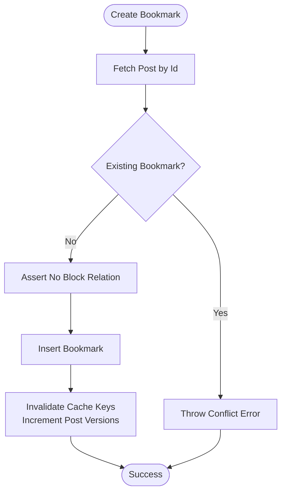
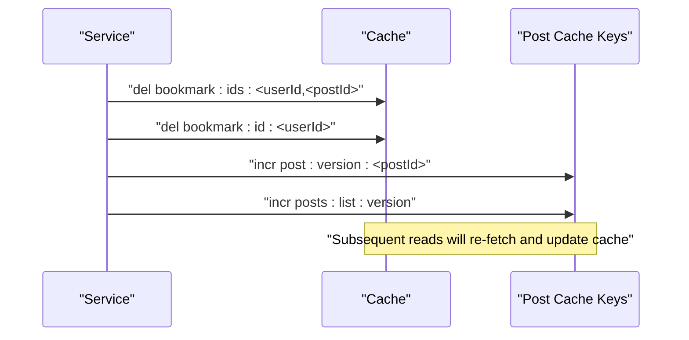
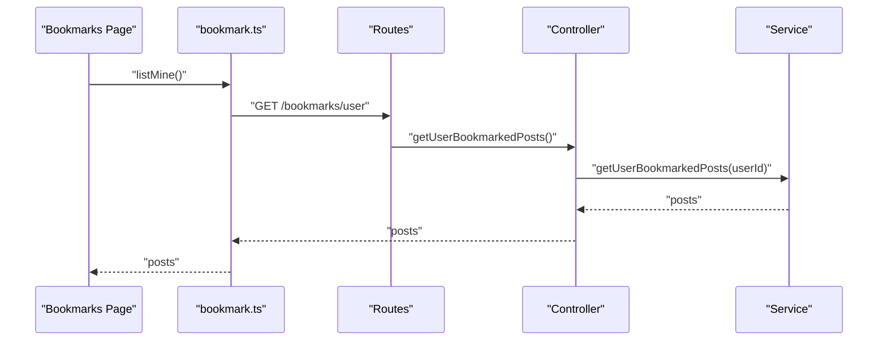
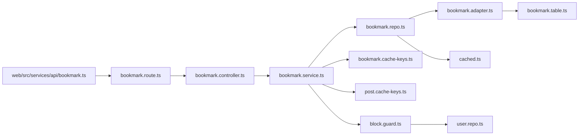

# Bookmark/Save System

<cite>
**Referenced Files in This Document**
- [bookmark.controller.ts](file://server/src/modules/bookmark/bookmark.controller.ts)
- [bookmark.service.ts](file://server/src/modules/bookmark/bookmark.service.ts)
- [bookmark.repo.ts](file://server/src/modules/bookmark/bookmark.repo.ts)
- [bookmark.route.ts](file://server/src/modules/bookmark/bookmark.route.ts)
- [bookmark.schema.ts](file://server/src/modules/bookmark/bookmark.schema.ts)
- [bookmark.cache-keys.ts](file://server/src/modules/bookmark/bookmark.cache-keys.ts)
- [bookmark.adapter.ts](file://server/src/infra/db/adapters/bookmark.adapter.ts)
- [bookmark.table.ts](file://server/src/infra/db/tables/bookmark.table.ts)
- [post.cache-keys.ts](file://server/src/modules/post/post.cache-keys.ts)
- [cached.ts](file://server/src/lib/cached.ts)
- [bookmark.ts](file://web/src/services/api/bookmark.ts)
- [page.tsx](file://web/src/app/(root)/(app)/u/bookmarks/page.tsx)
- [block.guard.ts](file://server/src/modules/user/block.guard.ts)
- [user.repo.ts](file://server/src/modules/user/user.repo.ts)
</cite>

## Table of Contents
1. [Introduction](#introduction)
2. [Project Structure](#project-structure)
3. [Core Components](#core-components)
4. [Architecture Overview](#architecture-overview)
5. [Detailed Component Analysis](#detailed-component-analysis)
6. [Dependency Analysis](#dependency-analysis)
7. [Performance Considerations](#performance-considerations)
8. [Troubleshooting Guide](#troubleshooting-guide)
9. [Conclusion](#conclusion)
10. [Appendices](#appendices)

## Introduction
This document describes Flick’s bookmark/save system. It covers how bookmarks are created, retrieved, and removed; user privacy controls; persistence and caching; user-specific bookmark lists; cross-device consistency via cache versioning; schema validation and duplicate prevention; and integration with user profiles and blocking. It also outlines current limitations (no explicit categorization, search, or export) and provides API endpoint references and diagrams for key workflows.

## Project Structure
The bookmark system spans the server-side modules and the web client:
- Server routes expose bookmark endpoints and enforce rate limits and user context.
- Controllers delegate to services for business logic.
- Services coordinate repositories, caches, and external validations (e.g., blocking).
- Repositories encapsulate database reads/writes and cached reads.
- Adapters define SQL queries for bookmark persistence and joins with related entities.
- Tables define the bookmark schema and indices.
- Web client provides bookmark API bindings and a bookmarks page.

**Diagram sources**
- [bookmark.route.ts](file://server/src/modules/bookmark/bookmark.route.ts#L1-L19)
- [bookmark.controller.ts](file://server/src/modules/bookmark/bookmark.controller.ts#L1-L48)
- [bookmark.service.ts](file://server/src/modules/bookmark/bookmark.service.ts#L1-L158)
- [bookmark.repo.ts](file://server/src/modules/bookmark/bookmark.repo.ts#L1-L42)
- [bookmark.adapter.ts](file://server/src/infra/db/adapters/bookmark.adapter.ts#L1-L172)
- [bookmark.table.ts](file://server/src/infra/db/tables/bookmark.table.ts#L1-L19)
- [bookmark.cache-keys.ts](file://server/src/modules/bookmark/bookmark.cache-keys.ts#L1-L7)
- [post.cache-keys.ts](file://server/src/modules/post/post.cache-keys.ts#L1-L48)
- [block.guard.ts](file://server/src/modules/user/block.guard.ts#L1-L41)
- [user.repo.ts](file://server/src/modules/user/user.repo.ts#L1-L67)
- [cached.ts](file://server/src/lib/cached.ts#L1-L41)
- [bookmark.ts](file://web/src/services/api/bookmark.ts#L1-L14)
- [page.tsx](file://web/src/app/(root)/(app)/u/bookmarks/page.tsx#L1-L87)

**Section sources**
- [bookmark.route.ts](file://server/src/modules/bookmark/bookmark.route.ts#L1-L19)
- [bookmark.controller.ts](file://server/src/modules/bookmark/bookmark.controller.ts#L1-L48)
- [bookmark.service.ts](file://server/src/modules/bookmark/bookmark.service.ts#L1-L158)
- [bookmark.repo.ts](file://server/src/modules/bookmark/bookmark.repo.ts#L1-L42)
- [bookmark.adapter.ts](file://server/src/infra/db/adapters/bookmark.adapter.ts#L1-L172)
- [bookmark.table.ts](file://server/src/infra/db/tables/bookmark.table.ts#L1-L19)
- [bookmark.cache-keys.ts](file://server/src/modules/bookmark/bookmark.cache-keys.ts#L1-L7)
- [post.cache-keys.ts](file://server/src/modules/post/post.cache-keys.ts#L1-L48)
- [cached.ts](file://server/src/lib/cached.ts#L1-L41)
- [bookmark.ts](file://web/src/services/api/bookmark.ts#L1-L14)
- [page.tsx](file://web/src/app/(root)/(app)/u/bookmarks/page.tsx#L1-L87)

## Core Components
- Routes: Define endpoints for creating, retrieving, listing, and deleting bookmarks; apply rate limiting and require user context.
- Controller: Parses inputs, extracts user context, and delegates to service methods.
- Service: Implements business logic including validation, duplicate prevention, privacy checks, and cache invalidation.
- Repository: Provides cached and uncached read/write operations for bookmarks.
- Adapter: Encapsulates SQL queries for bookmark CRUD and user-bookmarked posts aggregation.
- Schema: Validates request bodies and params.
- Cache Keys: Defines cache keys for single and multi-ID lookups.
- Post Cache Keys: Version keys used to invalidate dependent caches on updates.
- Blocking Guard: Enforces privacy by preventing interactions with blocked users.
- Web API: Exposes client-facing bookmark endpoints.

**Section sources**
- [bookmark.route.ts](file://server/src/modules/bookmark/bookmark.route.ts#L1-L19)
- [bookmark.controller.ts](file://server/src/modules/bookmark/bookmark.controller.ts#L1-L48)
- [bookmark.service.ts](file://server/src/modules/bookmark/bookmark.service.ts#L1-L158)
- [bookmark.repo.ts](file://server/src/modules/bookmark/bookmark.repo.ts#L1-L42)
- [bookmark.adapter.ts](file://server/src/infra/db/adapters/bookmark.adapter.ts#L1-L172)
- [bookmark.schema.ts](file://server/src/modules/bookmark/bookmark.schema.ts#L1-L6)
- [bookmark.cache-keys.ts](file://server/src/modules/bookmark/bookmark.cache-keys.ts#L1-L7)
- [post.cache-keys.ts](file://server/src/modules/post/post.cache-keys.ts#L1-L48)
- [block.guard.ts](file://server/src/modules/user/block.guard.ts#L1-L41)
- [bookmark.ts](file://web/src/services/api/bookmark.ts#L1-L14)

## Architecture Overview
The bookmark system follows a layered architecture:
- Presentation: Web client calls bookmark endpoints.
- Routing: Express routes apply middleware and dispatch to controllers.
- Business: Controllers call services for validation and orchestration.
- Persistence: Services use repositories and adapters to interact with the database.
- Caching: Services invalidate cache keys; cached reads coalesce concurrent requests.

**Diagram sources**
- [bookmark.route.ts](file://server/src/modules/bookmark/bookmark.route.ts#L1-L19)
- [bookmark.controller.ts](file://server/src/modules/bookmark/bookmark.controller.ts#L1-L48)
- [bookmark.service.ts](file://server/src/modules/bookmark/bookmark.service.ts#L1-L158)
- [bookmark.repo.ts](file://server/src/modules/bookmark/bookmark.repo.ts#L1-L42)
- [bookmark.adapter.ts](file://server/src/infra/db/adapters/bookmark.adapter.ts#L1-L172)
- [cached.ts](file://server/src/lib/cached.ts#L1-L41)

## Detailed Component Analysis

### Endpoint Definitions and Workflows
- Create bookmark
  - Endpoint: POST /bookmarks
  - Validation: postId required
  - Behavior: Creates a bookmark for the authenticated user; prevents duplicates; invalidates caches; increments post and posts-list versions
- Get bookmark
  - Endpoint: GET /bookmarks/:postId
  - Behavior: Returns a bookmark with associated post; enforces privacy via blocking guard
- List user bookmarked posts
  - Endpoint: GET /bookmarks/user
  - Behavior: Returns paginated posts joined with votes and author details; filters out posts by blocked authors
- Delete bookmark
  - Endpoint: DELETE /bookmarks/delete/:postId
  - Behavior: Removes bookmark; invalidates caches; increments versions

**Diagram sources**
- [bookmark.route.ts](file://server/src/modules/bookmark/bookmark.route.ts#L1-L19)
- [bookmark.controller.ts](file://server/src/modules/bookmark/bookmark.controller.ts#L1-L48)
- [bookmark.service.ts](file://server/src/modules/bookmark/bookmark.service.ts#L1-L158)
- [bookmark.repo.ts](file://server/src/modules/bookmark/bookmark.repo.ts#L1-L42)
- [bookmark.adapter.ts](file://server/src/infra/db/adapters/bookmark.adapter.ts#L71-L172)

**Section sources**
- [bookmark.route.ts](file://server/src/modules/bookmark/bookmark.route.ts#L1-L19)
- [bookmark.controller.ts](file://server/src/modules/bookmark/bookmark.controller.ts#L1-L48)
- [bookmark.service.ts](file://server/src/modules/bookmark/bookmark.service.ts#L62-L90)
- [bookmark.adapter.ts](file://server/src/infra/db/adapters/bookmark.adapter.ts#L71-L172)

### Bookmark Schema and Validation
- Schema
  - postId is required for create and get operations
- Persistence
  - Table: bookmarks with foreign keys to posts and platform users
  - Index: composite index on userId and postId for fast lookups
- Adapter
  - Reads: find by user+post, with post included, or list by user
  - Writes: create, delete by user+post
  - Aggregation: join with posts, votes, users, and colleges for list queries

**Diagram sources**
- [bookmark.table.ts](file://server/src/infra/db/tables/bookmark.table.ts#L1-L19)
- [bookmark.adapter.ts](file://server/src/infra/db/adapters/bookmark.adapter.ts#L1-L172)

**Section sources**
- [bookmark.schema.ts](file://server/src/modules/bookmark/bookmark.schema.ts#L1-L6)
- [bookmark.table.ts](file://server/src/infra/db/tables/bookmark.table.ts#L1-L19)
- [bookmark.adapter.ts](file://server/src/infra/db/adapters/bookmark.adapter.ts#L1-L172)

### Privacy Controls and Duplicate Prevention
- Privacy
  - Blocking enforcement: service validates that the bookmark author is not blocked by the requester
  - List filtering: user bookmarked posts are filtered to exclude blocked authors
- Duplicate Prevention
  - Service checks for existing bookmark before creation and throws a conflict error if present

**Diagram sources**
- [bookmark.service.ts](file://server/src/modules/bookmark/bookmark.service.ts#L12-L60)
- [block.guard.ts](file://server/src/modules/user/block.guard.ts#L1-L41)

**Section sources**
- [bookmark.service.ts](file://server/src/modules/bookmark/bookmark.service.ts#L23-L44)
- [block.guard.ts](file://server/src/modules/user/block.guard.ts#L5-L40)

### Cross-Device Consistency and Caching
- Cache Keys
  - Single and multi-ID keys for bookmarks
- Cache Invalidation
  - On create/delete: delete single and user bookmark keys
  - Increment post and posts-list version keys to force cache refresh
- Cached Reads
  - Repository wraps reads with a coalescing cache utility to avoid thundering herd
- Versioning
  - Post and posts-list version keys ensure clients observe changes across devices after edits or deletions

**Diagram sources**
- [bookmark.service.ts](file://server/src/modules/bookmark/bookmark.service.ts#L50-L53)
- [bookmark.cache-keys.ts](file://server/src/modules/bookmark/bookmark.cache-keys.ts#L1-L7)
- [post.cache-keys.ts](file://server/src/modules/post/post.cache-keys.ts#L6-L7)
- [cached.ts](file://server/src/lib/cached.ts#L1-L41)

**Section sources**
- [bookmark.service.ts](file://server/src/modules/bookmark/bookmark.service.ts#L50-L53)
- [bookmark.cache-keys.ts](file://server/src/modules/bookmark/bookmark.cache-keys.ts#L1-L7)
- [post.cache-keys.ts](file://server/src/modules/post/post.cache-keys.ts#L1-L48)
- [cached.ts](file://server/src/lib/cached.ts#L1-L41)

### Client Integration
- Web API
  - listMine, create, remove map to server endpoints
- Bookmarks Page
  - Fetches user bookmarked posts and renders them as Post components

**Diagram sources**
- [bookmark.ts](file://web/src/services/api/bookmark.ts#L1-L14)
- [page.tsx](file://web/src/app/(root)/(app)/u/bookmarks/page.tsx#L17-L32)
- [bookmark.route.ts](file://server/src/modules/bookmark/bookmark.route.ts#L11-L12)
- [bookmark.controller.ts](file://server/src/modules/bookmark/bookmark.controller.ts#L19-L28)
- [bookmark.service.ts](file://server/src/modules/bookmark/bookmark.service.ts#L62-L90)

**Section sources**
- [bookmark.ts](file://web/src/services/api/bookmark.ts#L1-L14)
- [page.tsx](file://web/src/app/(root)/(app)/u/bookmarks/page.tsx#L17-L32)

### Current Limitations
- No explicit bookmark categorization or tagging
- No dedicated search endpoint for bookmarks
- No export capability for bookmarks
- Batch operations are not exposed in the current routes

**Section sources**
- [bookmark.route.ts](file://server/src/modules/bookmark/bookmark.route.ts#L1-L19)
- [bookmark.controller.ts](file://server/src/modules/bookmark/bookmark.controller.ts#L1-L48)

## Dependency Analysis
The system exhibits clear separation of concerns:
- Routes depend on controllers
- Controllers depend on services
- Services depend on repositories, adapters, cache keys, and guards
- Repositories depend on adapters and the caching utility
- Adapters depend on tables and Drizzle ORM
- UI depends on web API bindings

**Diagram sources**
- [bookmark.route.ts](file://server/src/modules/bookmark/bookmark.route.ts#L1-L19)
- [bookmark.controller.ts](file://server/src/modules/bookmark/bookmark.controller.ts#L1-L48)
- [bookmark.service.ts](file://server/src/modules/bookmark/bookmark.service.ts#L1-L158)
- [bookmark.repo.ts](file://server/src/modules/bookmark/bookmark.repo.ts#L1-L42)
- [bookmark.adapter.ts](file://server/src/infra/db/adapters/bookmark.adapter.ts#L1-L172)
- [bookmark.table.ts](file://server/src/infra/db/tables/bookmark.table.ts#L1-L19)
- [bookmark.cache-keys.ts](file://server/src/modules/bookmark/bookmark.cache-keys.ts#L1-L7)
- [post.cache-keys.ts](file://server/src/modules/post/post.cache-keys.ts#L1-L48)
- [block.guard.ts](file://server/src/modules/user/block.guard.ts#L1-L41)
- [user.repo.ts](file://server/src/modules/user/user.repo.ts#L1-L67)
- [cached.ts](file://server/src/lib/cached.ts#L1-L41)
- [bookmark.ts](file://web/src/services/api/bookmark.ts#L1-L14)

**Section sources**
- [bookmark.service.ts](file://server/src/modules/bookmark/bookmark.service.ts#L1-L158)
- [bookmark.repo.ts](file://server/src/modules/bookmark/bookmark.repo.ts#L1-L42)
- [bookmark.adapter.ts](file://server/src/infra/db/adapters/bookmark.adapter.ts#L1-L172)
- [bookmark.table.ts](file://server/src/infra/db/tables/bookmark.table.ts#L1-L19)
- [bookmark.cache-keys.ts](file://server/src/modules/bookmark/bookmark.cache-keys.ts#L1-L7)
- [post.cache-keys.ts](file://server/src/modules/post/post.cache-keys.ts#L1-L48)
- [block.guard.ts](file://server/src/modules/user/block.guard.ts#L1-L41)
- [user.repo.ts](file://server/src/modules/user/user.repo.ts#L1-L67)
- [cached.ts](file://server/src/lib/cached.ts#L1-L41)
- [bookmark.ts](file://web/src/services/api/bookmark.ts#L1-L14)
- [page.tsx](file://web/src/app/(root)/(app)/u/bookmarks/page.tsx#L1-L87)

## Performance Considerations
- Coalescing Cache: Prevents redundant database loads during concurrent requests for the same key.
- Selective Join Aggregation: The adapter aggregates votes and author details in a single query for list retrieval.
- Composite Index: The bookmark table index supports efficient lookups by user and post.
- Cache Versioning: Incrementing post and posts-list versions ensures cache freshness across devices after edits or deletions.
- Filtering Early: Blocked authors are filtered in-memory after fetching to minimize DB overhead.

Recommendations:
- Consider adding pagination parameters to list endpoints to bound payload sizes.
- Introduce bookmark categories/tags in future iterations to enable indexed queries.
- Add search endpoints leveraging bookmark+post joins for topic or author filters.

**Section sources**
- [cached.ts](file://server/src/lib/cached.ts#L1-L41)
- [bookmark.adapter.ts](file://server/src/infra/db/adapters/bookmark.adapter.ts#L71-L172)
- [bookmark.table.ts](file://server/src/infra/db/tables/bookmark.table.ts#L17-L18)
- [post.cache-keys.ts](file://server/src/modules/post/post.cache-keys.ts#L6-L7)
- [bookmark.service.ts](file://server/src/modules/bookmark/bookmark.service.ts#L75-L82)

## Troubleshooting Guide
Common errors and causes:
- POST_NOT_FOUND: Occurs when attempting to bookmark a non-existent post.
- BOOKMARK_ALREADY_EXISTS: Attempting to create a duplicate bookmark.
- BOOKMARK_NOT_FOUND: Deleting or retrieving a bookmark that does not belong to the user.
- USER_NOT_FOUND: User context missing or invalid.
- USER_INTERACTION_BLOCKED: Attempting to interact with a user who has blocked the requester.

Resolution steps:
- Verify postId validity and existence before creating a bookmark.
- Ensure the requester is not blocked by the post author.
- Confirm user context is present and valid.
- Clear browser cache or wait for cache version increments to propagate.

**Section sources**
- [bookmark.service.ts](file://server/src/modules/bookmark/bookmark.service.ts#L17-L21)
- [bookmark.service.ts](file://server/src/modules/bookmark/bookmark.service.ts#L32-L44)
- [bookmark.service.ts](file://server/src/modules/bookmark/bookmark.service.ts#L98-L105)
- [bookmark.service.ts](file://server/src/modules/bookmark/bookmark.service.ts#L125-L132)
- [block.guard.ts](file://server/src/modules/user/block.guard.ts#L18-L39)

## Conclusion
Flick’s bookmark system provides a robust, privacy-aware mechanism for saving posts. It enforces user privacy via blocking, prevents duplicates, persists efficiently with composite indexing, and maintains consistency across devices using cache versioning. While current features focus on basic CRUD and list operations, the architecture supports future enhancements such as categorization, search, and export.

## Appendices

### API Endpoints
- POST /bookmarks
  - Body: { postId: string }
  - Response: Created bookmark
- GET /bookmarks/:postId
  - Response: Bookmark with post
- GET /bookmarks/user
  - Response: Array of bookmarked posts with aggregated metadata
- DELETE /bookmarks/delete/:postId
  - Response: Deletion confirmation

**Section sources**
- [bookmark.route.ts](file://server/src/modules/bookmark/bookmark.route.ts#L11-L16)
- [bookmark.controller.ts](file://server/src/modules/bookmark/bookmark.controller.ts#L8-L44)
- [bookmark.ts](file://web/src/services/api/bookmark.ts#L4-L12)