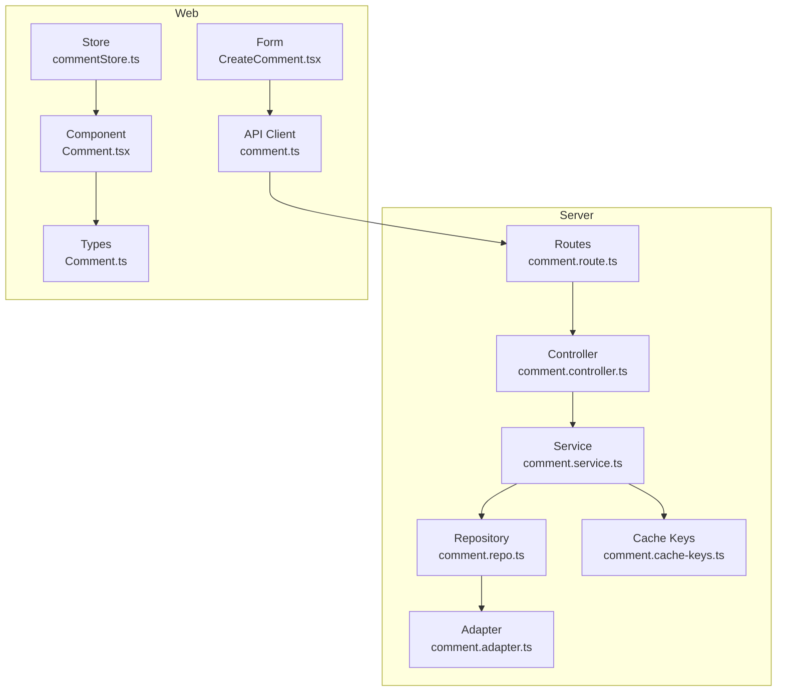
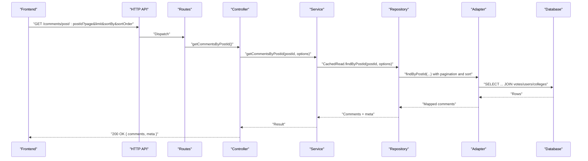
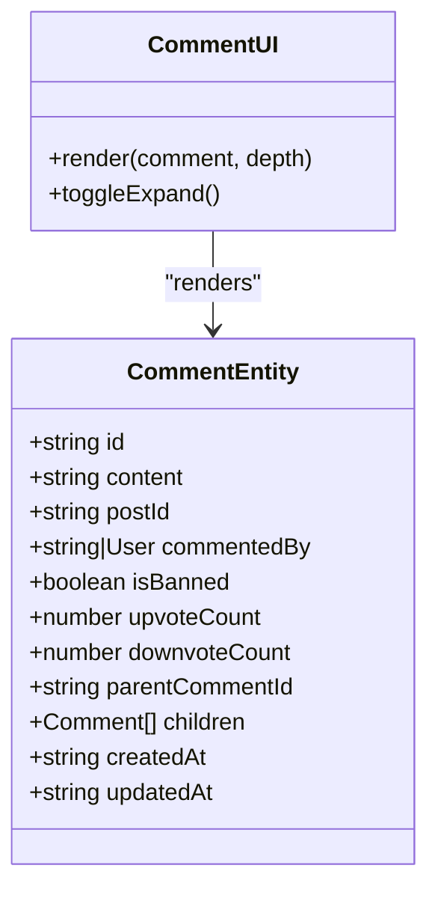
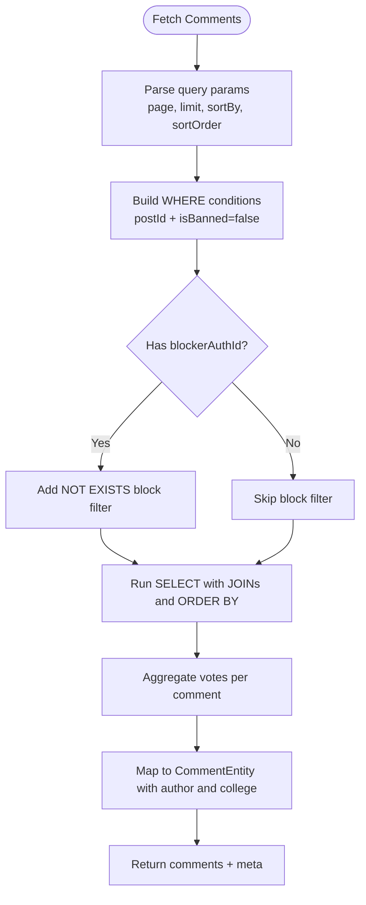
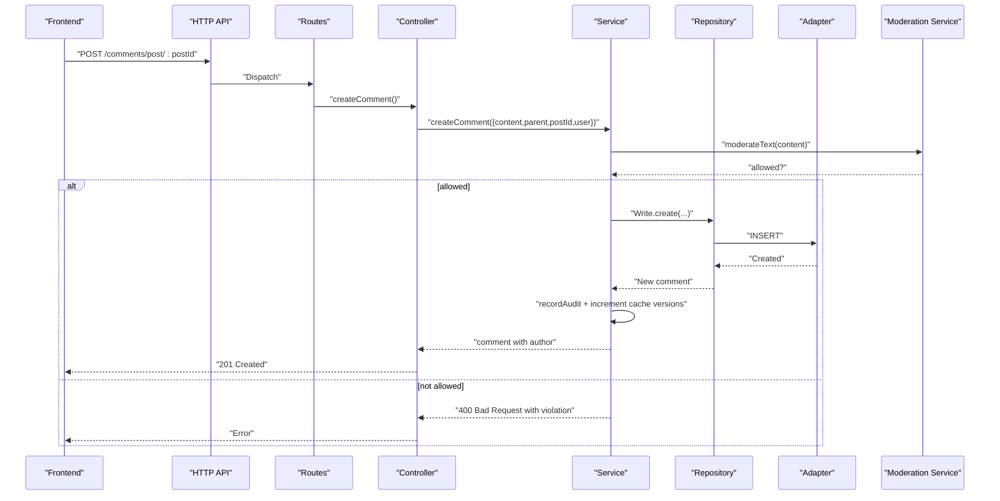
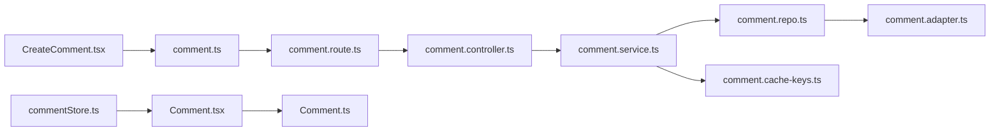

# Commenting System

<cite>
**Referenced Files in This Document**
- [comment.controller.ts](file://server/src/modules/comment/comment.controller.ts)
- [comment.service.ts](file://server/src/modules/comment/comment.service.ts)
- [comment.repo.ts](file://server/src/modules/comment/comment.repo.ts)
- [comment.schema.ts](file://server/src/modules/comment/comment.schema.ts)
- [comment.route.ts](file://server/src/modules/comment/comment.route.ts)
- [comment.adapter.ts](file://server/src/infra/db/adapters/comment.adapter.ts)
- [comment.cache-keys.ts](file://server/src/modules/comment/comment.cache-keys.ts)
- [comment.ts](file://web/src/types/Comment.ts)
- [comment.tsx](file://web/src/components/general/Comment.tsx)
- [CreateComment.tsx](file://web/src/components/general/CreateComment.tsx)
- [comment.ts](file://web/src/services/api/comment.ts)
- [commentStore.ts](file://web/src/store/commentStore.ts)
- [useSocket.ts](file://web/src/socket/useSocket.ts)
</cite>

## Table of Contents
1. [Introduction](#introduction)
2. [Project Structure](#project-structure)
3. [Core Components](#core-components)
4. [Architecture Overview](#architecture-overview)
5. [Detailed Component Analysis](#detailed-component-analysis)
6. [Dependency Analysis](#dependency-analysis)
7. [Performance Considerations](#performance-considerations)
8. [Troubleshooting Guide](#troubleshooting-guide)
9. [Conclusion](#conclusion)
10. [Appendices](#appendices)

## Introduction
This document describes Flick’s commenting system with a focus on nested comment architecture, reply threading, and hierarchical display. It explains comment lifecycle operations (create, edit, delete), moderation and permission enforcement, schema validation, pagination and sorting, caching and performance optimizations, and integration points with voting and bookmark systems. Real-time updates and notification triggers are discussed conceptually, along with practical examples of API endpoints and rendering patterns.

## Project Structure
The commenting system spans backend modules, database adapters, caching keys, and frontend components and stores:
- Backend: route, controller, service, repository, schema, and cache keys
- Database: Drizzle ORM adapter for comments and joins with users and colleges
- Frontend: typed comment model, rendering component, creation/editing form, and Zustand store

**Diagram sources**
- [comment.route.ts](file://server/src/modules/comment/comment.route.ts#L1-L32)
- [comment.controller.ts](file://server/src/modules/comment/comment.controller.ts#L1-L79)
- [comment.service.ts](file://server/src/modules/comment/comment.service.ts#L1-L377)
- [comment.repo.ts](file://server/src/modules/comment/comment.repo.ts#L1-L90)
- [comment.adapter.ts](file://server/src/infra/db/adapters/comment.adapter.ts#L1-L280)
- [comment.cache-keys.ts](file://server/src/modules/comment/comment.cache-keys.ts#L1-L39)
- [Comment.ts](file://web/src/types/Comment.ts#L1-L18)
- [Comment.tsx](file://web/src/components/general/Comment.tsx#L1-L156)
- [CreateComment.tsx](file://web/src/components/general/CreateComment.tsx#L1-L310)
- [comment.ts](file://web/src/services/api/comment.ts#L1-L24)
- [commentStore.ts](file://web/src/store/commentStore.ts#L1-L34)

**Section sources**
- [comment.route.ts](file://server/src/modules/comment/comment.route.ts#L1-L32)
- [comment.controller.ts](file://server/src/modules/comment/comment.controller.ts#L1-L79)
- [comment.service.ts](file://server/src/modules/comment/comment.service.ts#L1-L377)
- [comment.repo.ts](file://server/src/modules/comment/comment.repo.ts#L1-L90)
- [comment.adapter.ts](file://server/src/infra/db/adapters/comment.adapter.ts#L1-L280)
- [comment.cache-keys.ts](file://server/src/modules/comment/comment.cache-keys.ts#L1-L39)
- [Comment.ts](file://web/src/types/Comment.ts#L1-L18)
- [Comment.tsx](file://web/src/components/general/Comment.tsx#L1-L156)
- [CreateComment.tsx](file://web/src/components/general/CreateComment.tsx#L1-L310)
- [comment.ts](file://web/src/services/api/comment.ts#L1-L24)
- [commentStore.ts](file://web/src/store/commentStore.ts#L1-L34)

## Core Components
- Routes define endpoints for fetching comments by post, fetching a single comment, creating, updating, and deleting comments. Middleware ensures rate limiting, optional user context, and required user context for mutating operations.
- Controller parses validated inputs and delegates to the service.
- Service enforces permissions, validates posts/comments existence, applies moderation checks, and updates caches upon mutations.
- Repository abstracts reads/writes and integrates caching keys for efficient retrieval.
- Adapter performs SQL queries with sorting, pagination, and joins to include author and college metadata, plus aggregated voting counts.
- Frontend types define the comment entity shape, including nested children and engagement metrics.
- Rendering component supports hierarchical display with expandable replies and integrates with engagement controls.
- Creation/editing form handles local validation, moderation preview, and optimistic updates via the store.

**Section sources**
- [comment.route.ts](file://server/src/modules/comment/comment.route.ts#L1-L32)
- [comment.controller.ts](file://server/src/modules/comment/comment.controller.ts#L1-L79)
- [comment.service.ts](file://server/src/modules/comment/comment.service.ts#L1-L377)
- [comment.repo.ts](file://server/src/modules/comment/comment.repo.ts#L1-L90)
- [comment.adapter.ts](file://server/src/infra/db/adapters/comment.adapter.ts#L1-L280)
- [Comment.ts](file://web/src/types/Comment.ts#L1-L18)
- [Comment.tsx](file://web/src/components/general/Comment.tsx#L1-L156)
- [CreateComment.tsx](file://web/src/components/general/CreateComment.tsx#L1-L310)

## Architecture Overview
The backend follows a layered architecture: routes -> controller -> service -> repository -> adapter. The service orchestrates validation, moderation, permission checks, and cache invalidation. The adapter encapsulates SQL with joins and aggregations. On the frontend, components consume the API and manage state locally for immediate feedback.

**Diagram sources**
- [comment.route.ts](file://server/src/modules/comment/comment.route.ts#L1-L32)
- [comment.controller.ts](file://server/src/modules/comment/comment.controller.ts#L50-L65)
- [comment.service.ts](file://server/src/modules/comment/comment.service.ts#L13-L67)
- [comment.repo.ts](file://server/src/modules/comment/comment.repo.ts#L21-L51)
- [comment.adapter.ts](file://server/src/infra/db/adapters/comment.adapter.ts#L27-L168)

## Detailed Component Analysis

### Nested Comment Architecture and Reply Threading
- Schema supports optional parent comment UUID for threaded replies.
- Service validates parent-child relationships and cross-post replies.
- Adapter fetches top-level comments and aggregates child counts; rendering component recursively renders children with indentation and expand/collapse controls.
- Cache keys include a post-level version and per-comment replies version to invalidate stale threads.

**Diagram sources**
- [Comment.ts](file://web/src/types/Comment.ts#L4-L17)
- [Comment.tsx](file://web/src/components/general/Comment.tsx#L20-L156)

**Section sources**
- [comment.schema.ts](file://server/src/modules/comment/comment.schema.ts#L3-L9)
- [comment.service.ts](file://server/src/modules/comment/comment.service.ts#L101-L133)
- [comment.adapter.ts](file://server/src/infra/db/adapters/comment.adapter.ts#L27-L168)
- [Comment.tsx](file://web/src/components/general/Comment.tsx#L118-L149)
- [comment.cache-keys.ts](file://server/src/modules/comment/comment.cache-keys.ts#L13-L35)

### Hierarchical Comment Display
- Sorting options: createdAt or updatedAt with asc/desc.
- Pagination: page and limit parsed and applied in the adapter.
- Content filtering: blocked users are excluded from returned comments via a NOT EXISTS condition against user blocks.
- Voting aggregation: upvote/downvote counts and user-specific vote are included in the query.

**Diagram sources**
- [comment.adapter.ts](file://server/src/infra/db/adapters/comment.adapter.ts#L27-L168)
- [comment.service.ts](file://server/src/modules/comment/comment.service.ts#L13-L67)

**Section sources**
- [comment.adapter.ts](file://server/src/infra/db/adapters/comment.adapter.ts#L27-L168)
- [comment.service.ts](file://server/src/modules/comment/comment.service.ts#L13-L67)

### Comment Creation, Editing, Deletion, and Moderation Workflows
- Creation:
  - Validates post existence and bans, checks blocking relations, verifies parent comment if present, runs moderation, persists, records audit, increments cache versions.
- Update:
  - Enforces ownership, runs moderation, updates content, records audit, increments cache versions.
- Delete:
  - Enforces ownership, deletes, records audit, increments cache versions.
- Moderation:
  - Service calls a moderation service to validate content; violations return structured errors with reasons and matches.

**Diagram sources**
- [comment.route.ts](file://server/src/modules/comment/comment.route.ts#L23-L25)
- [comment.controller.ts](file://server/src/modules/comment/comment.controller.ts#L8-L24)
- [comment.service.ts](file://server/src/modules/comment/comment.service.ts#L69-L203)
- [comment.adapter.ts](file://server/src/infra/db/adapters/comment.adapter.ts#L180-L192)

**Section sources**
- [comment.controller.ts](file://server/src/modules/comment/comment.controller.ts#L8-L48)
- [comment.service.ts](file://server/src/modules/comment/comment.service.ts#L69-L203)
- [comment.adapter.ts](file://server/src/infra/db/adapters/comment.adapter.ts#L180-L192)

### Permissions and Content Filtering
- Ownership checks: update/delete require the current user to match the comment author.
- Blocking enforcement: comments exclude users who have blocked either the requester or the target author.
- Post visibility: comments are fetched only for non-banned posts.

**Section sources**
- [comment.service.ts](file://server/src/modules/comment/comment.service.ts#L246-L266)
- [comment.adapter.ts](file://server/src/infra/db/adapters/comment.adapter.ts#L81-L101)

### Real-Time Updates and Notifications
- Socket hook exists for frontend consumption, indicating potential integration points for real-time events.
- Conceptual guidance: emit comment-related events (create/update/delete) on the socket channel and update the local store accordingly.

**Section sources**
- [useSocket.ts](file://web/src/socket/useSocket.ts#L1-L9)

### Engagement Tracking Integration
- The rendering component passes engagement metrics (upvotes, downvotes, comment counts) and user-specific vote to the engagement component.
- Backend aggregates counts and user vote per comment to minimize client-side computation.

**Section sources**
- [Comment.tsx](file://web/src/components/general/Comment.tsx#L104-L116)
- [comment.adapter.ts](file://server/src/infra/db/adapters/comment.adapter.ts#L46-L70)

### API Endpoints
- GET /comments/post/:postId?page=&limit=&sortBy=&sortOrder=
- GET /comments/:commentId
- POST /comments/post/:postId (requires authenticated user context)
- PATCH /comments/:commentId (requires authenticated user context)
- DELETE /comments/:commentId (requires authenticated user context)

Notes:
- Rate limiting middleware is applied globally on comment routes.
- Optional user context is attached to requests; mutation routes enforce user context and additional guards.

**Section sources**
- [comment.route.ts](file://server/src/modules/comment/comment.route.ts#L15-L31)
- [comment.controller.ts](file://server/src/modules/comment/comment.controller.ts#L50-L75)

### Nested Comment Rendering Example
- The UI component accepts a comment object with optional children array and recursively renders nested replies with indentation and expand/collapse buttons.

**Section sources**
- [Comment.tsx](file://web/src/components/general/Comment.tsx#L118-L149)

### Integration with Voting and Bookmark Systems
- Voting: backend aggregates upvote/downvote counts and user-specific vote per comment; UI displays and manipulates these values.
- Bookmark: the dropdown component supports bookmark toggles for comments; the component passes appropriate props to enable/disable bookmark actions.

**Section sources**
- [comment.adapter.ts](file://server/src/infra/db/adapters/comment.adapter.ts#L46-L70)
- [Comment.tsx](file://web/src/components/general/Comment.tsx#L86-L97)

## Dependency Analysis
The backend modules depend on each other in a strict order: routes depend on controllers, controllers on services, services on repositories, and repositories on adapters. Caching keys are used by the service to invalidate versions after mutations. The frontend depends on typed models and consumes API endpoints.

**Diagram sources**
- [comment.route.ts](file://server/src/modules/comment/comment.route.ts#L1-L32)
- [comment.controller.ts](file://server/src/modules/comment/comment.controller.ts#L1-L79)
- [comment.service.ts](file://server/src/modules/comment/comment.service.ts#L1-L377)
- [comment.repo.ts](file://server/src/modules/comment/comment.repo.ts#L1-L90)
- [comment.adapter.ts](file://server/src/infra/db/adapters/comment.adapter.ts#L1-L280)
- [comment.cache-keys.ts](file://server/src/modules/comment/comment.cache-keys.ts#L1-L39)
- [Comment.ts](file://web/src/types/Comment.ts#L1-L18)
- [Comment.tsx](file://web/src/components/general/Comment.tsx#L1-L156)
- [CreateComment.tsx](file://web/src/components/general/CreateComment.tsx#L1-L310)
- [comment.ts](file://web/src/services/api/comment.ts#L1-L24)
- [commentStore.ts](file://web/src/store/commentStore.ts#L1-L34)

**Section sources**
- [comment.route.ts](file://server/src/modules/comment/comment.route.ts#L1-L32)
- [comment.controller.ts](file://server/src/modules/comment/comment.controller.ts#L1-L79)
- [comment.service.ts](file://server/src/modules/comment/comment.service.ts#L1-L377)
- [comment.repo.ts](file://server/src/modules/comment/comment.repo.ts#L1-L90)
- [comment.adapter.ts](file://server/src/infra/db/adapters/comment.adapter.ts#L1-L280)
- [comment.cache-keys.ts](file://server/src/modules/comment/comment.cache-keys.ts#L1-L39)
- [Comment.ts](file://web/src/types/Comment.ts#L1-L18)
- [Comment.tsx](file://web/src/components/general/Comment.tsx#L1-L156)
- [CreateComment.tsx](file://web/src/components/general/CreateComment.tsx#L1-L310)
- [comment.ts](file://web/src/services/api/comment.ts#L1-L24)
- [commentStore.ts](file://web/src/store/commentStore.ts#L1-L34)

## Performance Considerations
- Caching:
  - Post-level comments cache key includes pagination, sorting, user, and blocker context; versions are incremented on mutations to force refresh.
  - Replies version key is incremented per parent comment to refresh nested threads independently.
- Aggregation:
  - Vote counts and user vote are computed in a WITH clause and joined to avoid N+1 queries.
- Pagination:
  - LIMIT and OFFSET applied server-side; default page=1, default limit=10.
- Filtering:
  - NOT EXISTS subquery excludes blocked users efficiently.

Recommendations:
- Consider cursor-based pagination for deep paging.
- Preload author and college data via JOINs to reduce round trips.
- Cache warm-up strategies for hot posts.

**Section sources**
- [comment.cache-keys.ts](file://server/src/modules/comment/comment.cache-keys.ts#L6-L35)
- [comment.adapter.ts](file://server/src/infra/db/adapters/comment.adapter.ts#L46-L137)
- [comment.service.ts](file://server/src/modules/comment/comment.service.ts#L42-L66)

## Troubleshooting Guide
Common issues and resolutions:
- Parent comment not found or belongs to another post:
  - Ensure parentCommentId references a comment on the same post; otherwise, the service throws a bad request error.
- Unauthorized update/delete:
  - Only the original author can modify or remove a comment; otherwise, a forbidden error is returned.
- Content moderation violation:
  - If moderation fails, the service returns a structured error with reasons and matches; adjust content accordingly.
- Blocked users:
  - Comments are filtered out for users who have blocked either the requester or the author.

**Section sources**
- [comment.service.ts](file://server/src/modules/comment/comment.service.ts#L101-L133)
- [comment.service.ts](file://server/src/modules/comment/comment.service.ts#L246-L266)
- [comment.adapter.ts](file://server/src/infra/db/adapters/comment.adapter.ts#L81-L101)

## Conclusion
Flick’s commenting system provides robust nested threading, strong permission and moderation enforcement, efficient pagination and sorting, and integrated engagement metrics. The backend leverages caching and SQL aggregation for performance, while the frontend offers responsive rendering and optimistic updates. Real-time capabilities can be extended via sockets, and integrations with voting and bookmarks are straightforward.

## Appendices

### API Endpoint Reference
- GET /comments/post/:postId?page=&limit=&sortBy=&sortOrder=
- GET /comments/:commentId
- POST /comments/post/:postId (authenticated)
- PATCH /comments/:commentId (authenticated)
- DELETE /comments/:commentId (authenticated)

**Section sources**
- [comment.route.ts](file://server/src/modules/comment/comment.route.ts#L18-L29)
- [comment.controller.ts](file://server/src/modules/comment/comment.controller.ts#L50-L75)