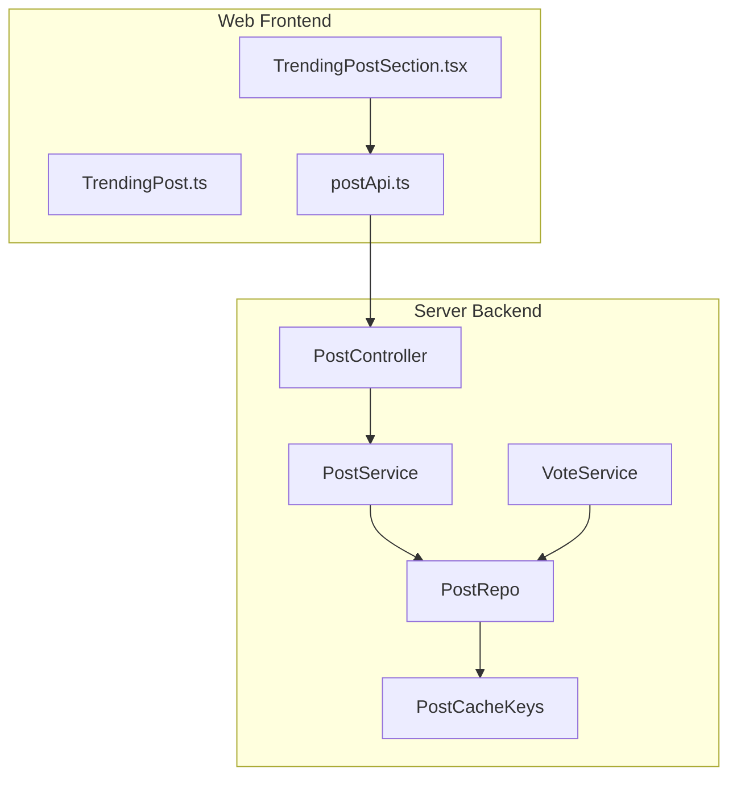
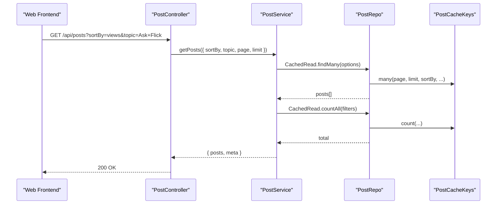
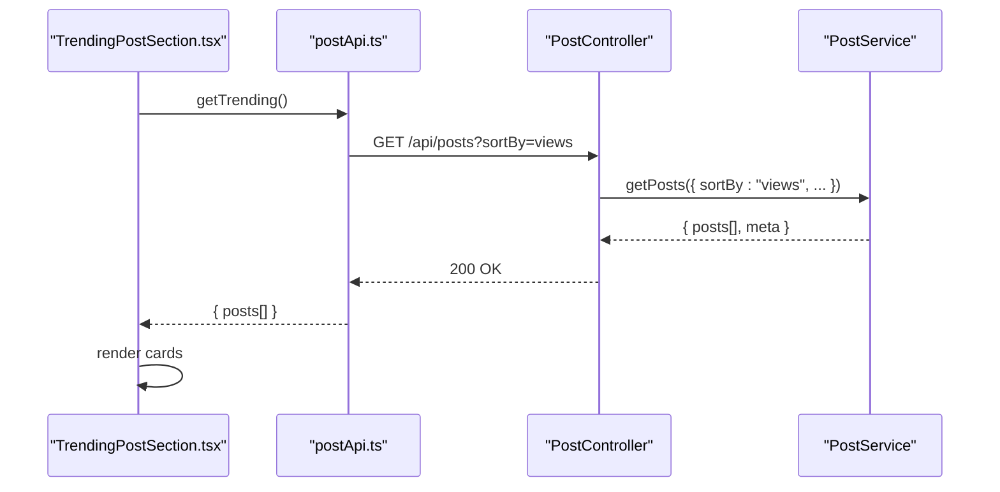
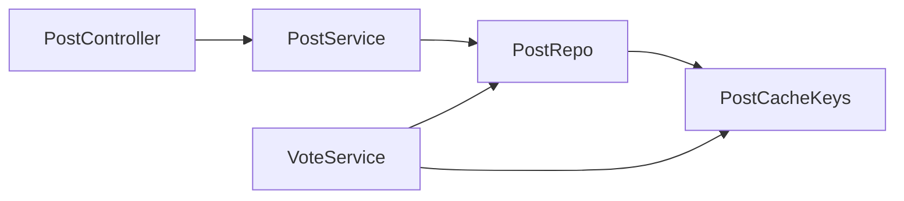

# Content Discovery & Trending

<cite>
**Referenced Files in This Document**
- [post.controller.ts](file://server/src/modules/post/post.controller.ts)
- [post.service.ts](file://server/src/modules/post/post.service.ts)
- [post.repo.ts](file://server/src/modules/post/post.repo.ts)
- [post.cache-keys.ts](file://server/src/modules/post/post.cache-keys.ts)
- [post.schema.ts](file://server/src/modules/post/post.schema.ts)
- [vote.service.ts](file://server/src/modules/vote/vote.service.ts)
- [vote.schema.ts](file://server/src/modules/vote/vote.schema.ts)
- [TrendingPostSection.tsx](file://web/src/components/general/TrendingPostSection.tsx)
- [TrendingPost.ts](file://web/src/types/TrendingPost.ts)
- [postApi.ts](file://web/src/services/api/post.ts)
</cite>

## Table of Contents
1. [Introduction](#introduction)
2. [Project Structure](#project-structure)
3. [Core Components](#core-components)
4. [Architecture Overview](#architecture-overview)
5. [Detailed Component Analysis](#detailed-component-analysis)
6. [Dependency Analysis](#dependency-analysis)
7. [Performance Considerations](#performance-considerations)
8. [Troubleshooting Guide](#troubleshooting-guide)
9. [Conclusion](#conclusion)
10. [Appendices](#appendices)

## Introduction
This document explains Flick’s content discovery and trending systems. It covers how posts are discovered via filters (topic, college, branch), how engagement influences ranking, and how time-sensitive freshness is handled. It also documents the trending feed endpoint, pagination, cache invalidation, and how votes impact content visibility. Recommendations are integrated implicitly through engagement signals and filters.

## Project Structure
The content discovery and trending logic spans the backend API controllers and services, caching keys, and the frontend trending widget.

**Diagram sources**
- [TrendingPostSection.tsx](file://web/src/components/general/TrendingPostSection.tsx#L1-L113)
- [TrendingPost.ts](file://web/src/types/TrendingPost.ts#L1-L6)
- [postApi.ts](file://web/src/services/api/post.ts)
- [post.controller.ts](file://server/src/modules/post/post.controller.ts#L1-L181)
- [post.service.ts](file://server/src/modules/post/post.service.ts#L1-L451)
- [post.repo.ts](file://server/src/modules/post/post.repo.ts#L1-L147)
- [post.cache-keys.ts](file://server/src/modules/post/post.cache-keys.ts#L1-L48)
- [vote.service.ts](file://server/src/modules/vote/vote.service.ts#L1-L315)

**Section sources**
- [post.controller.ts](file://server/src/modules/post/post.controller.ts#L1-L181)
- [post.service.ts](file://server/src/modules/post/post.service.ts#L1-L451)
- [post.repo.ts](file://server/src/modules/post/post.repo.ts#L1-L147)
- [post.cache-keys.ts](file://server/src/modules/post/post.cache-keys.ts#L1-L48)
- [TrendingPostSection.tsx](file://web/src/components/general/TrendingPostSection.tsx#L1-L113)
- [TrendingPost.ts](file://web/src/types/TrendingPost.ts#L1-L6)
- [postApi.ts](file://web/src/services/api/post.ts)

## Core Components
- PostController: Exposes endpoints for retrieving posts, filtering by topic/college/branch, and searching. It parses query parameters and forwards them to PostService.
- PostService: Implements business logic for retrieving posts, pagination metadata, and search. It coordinates caching and invalidation and integrates moderation checks.
- PostRepo: Provides cached and uncached reads/writes, search, and count operations. It composes cache keys for lists and counts.
- PostCacheKeys: Generates cache keys for individual posts, lists, counts, and versions to support cache invalidation.
- VoteService: Manages upvote/downvote operations, updates author karma, and invalidates caches for posts and related comments.
- Web Trending Widget: Fetches and renders a “Most Read” trending section using a dedicated API call.

**Section sources**
- [post.controller.ts](file://server/src/modules/post/post.controller.ts#L24-L177)
- [post.service.ts](file://server/src/modules/post/post.service.ts#L145-L236)
- [post.repo.ts](file://server/src/modules/post/post.repo.ts#L6-L147)
- [post.cache-keys.ts](file://server/src/modules/post/post.cache-keys.ts#L3-L45)
- [vote.service.ts](file://server/src/modules/vote/vote.service.ts#L29-L46)
- [TrendingPostSection.tsx](file://web/src/components/general/TrendingPostSection.tsx#L18-L44)

## Architecture Overview
The system separates concerns across controller, service, repository, and cache layers. Filtering and sorting are applied at the service level and propagated to the repository. Caching uses versioned keys so that writes invalidate caches atomically. Voting affects engagement and indirectly influences discoverability.

**Diagram sources**
- [post.controller.ts](file://server/src/modules/post/post.controller.ts#L24-L46)
- [post.service.ts](file://server/src/modules/post/post.service.ts#L145-L193)
- [post.repo.ts](file://server/src/modules/post/post.repo.ts#L19-L85)
- [post.cache-keys.ts](file://server/src/modules/post/post.cache-keys.ts#L15-L44)

## Detailed Component Analysis

### Content Discovery API Endpoints
- GET /api/posts
  - Purpose: Retrieve paginated posts with optional filters.
  - Query parameters:
    - page: integer ≥ 1
    - limit: integer between 1 and 50
    - sortBy: "createdAt" | "updatedAt" | "views"
    - sortOrder: "asc" | "desc"
    - topic: case-insensitive, URL-decoded topic match against predefined enum
    - collegeId: UUID
    - branch: string
  - Response: { posts[], meta: { total, page, limit, totalPages, hasMore } }

- GET /api/posts/college/:collegeId
  - Purpose: Filter posts by college with pagination and sorting.

- GET /api/posts/branch/:branch
  - Purpose: Filter posts by branch with pagination and sorting.

- GET /api/posts/search?q
  - Purpose: Full-text search with pagination.

- GET /api/posts/:id
  - Purpose: Retrieve a single post by ID with privacy checks.

- GET /api/posts/by-user/:userId
  - Purpose: Retrieve posts by a specific author with pagination and sorting.

**Section sources**
- [post.controller.ts](file://server/src/modules/post/post.controller.ts#L24-L177)
- [post.schema.ts](file://server/src/modules/post/post.schema.ts#L53-L118)

### Pagination Strategy
- Default page: 1
- Default limit: 10 (clamped to 50 max)
- Total pages computed as ceil(total / limit)
- hasMore flag indicates if more pages exist

**Section sources**
- [post.service.ts](file://server/src/modules/post/post.service.ts#L169-L181)
- [post.service.ts](file://server/src/modules/post/post.service.ts#L215-L235)

### Topic-Based Filtering
- topic query supports exact match, case-insensitive match, and URL-decoded match.
- Valid topics are constrained by an enumerated list.

**Section sources**
- [post.schema.ts](file://server/src/modules/post/post.schema.ts#L3-L15)
- [post.schema.ts](file://server/src/modules/post/post.schema.ts#L64-L95)

### College and Branch Filters
- collegeId: UUID filter applied to posts.
- branch: string filter applied to posts.

**Section sources**
- [post.schema.ts](file://server/src/modules/post/post.schema.ts#L96-L97)
- [post.controller.ts](file://server/src/modules/post/post.controller.ts#L90-L132)

### Sorting and Freshness
- sortBy supports "createdAt", "updatedAt", and "views".
- "views" sorting leverages the existing views counter; no explicit time-decayed score is implemented in the referenced code.

**Section sources**
- [post.schema.ts](file://server/src/modules/post/post.schema.ts#L62-L63)
- [post.service.ts](file://server/src/modules/post/post.service.ts#L145-L193)

### Real-Time Feed Updates
- Incrementing views is supported via a dedicated endpoint; however, no explicit real-time push mechanism is visible in the referenced code.
- Voting operations update author karma and invalidate caches for posts and comments.

**Section sources**
- [post.controller.ts](file://server/src/modules/post/post.controller.ts#L82-L88)
- [vote.service.ts](file://server/src/modules/vote/vote.service.ts#L29-L46)

### Cache Keys and Invalidation
- Post cache keys include:
  - post:id:{id}
  - post:version:{id}
  - posts:list:version
  - post:details:v{version}:{id}:{userId|anonymous}
  - post:many:v{version}:{...filters}
  - post:count:v{version}:{...filters}
- Invalidation strategy:
  - Writes to posts increment post:version:{id} and posts:list:version.
  - Voting increments post:version:{id}/posts:list:version and comment-related versions.

**Section sources**
- [post.cache-keys.ts](file://server/src/modules/post/post.cache-keys.ts#L3-L45)
- [post.service.ts](file://server/src/modules/post/post.service.ts#L85-L86)
- [post.service.ts](file://server/src/modules/post/post.service.ts#L339-L340)
- [vote.service.ts](file://server/src/modules/vote/vote.service.ts#L29-L46)

### Trending Feed Endpoint and Frontend Integration
- Frontend fetches trending posts via a dedicated call and displays a “Most Read” section.
- The frontend type for trending items includes title, category, time, and views.

**Diagram sources**
- [TrendingPostSection.tsx](file://web/src/components/general/TrendingPostSection.tsx#L18-L44)
- [post.controller.ts](file://server/src/modules/post/post.controller.ts#L24-L46)
- [post.service.ts](file://server/src/modules/post/post.service.ts#L145-L193)

**Section sources**
- [TrendingPostSection.tsx](file://web/src/components/general/TrendingPostSection.tsx#L18-L44)
- [TrendingPost.ts](file://web/src/types/TrendingPost.ts#L1-L6)

### Engagement Signals and Ranking
- Upvotes/downvotes update author karma and invalidate caches for affected targets.
- Ranking can leverage views sorting; no explicit time-decayed trending score is present in the referenced code.

**Section sources**
- [vote.service.ts](file://server/src/modules/vote/vote.service.ts#L100-L102)
- [vote.service.ts](file://server/src/modules/vote/vote.service.ts#L194-L203)
- [post.schema.ts](file://server/src/modules/post/post.schema.ts#L62-L63)

### Personalized Recommendations
- The codebase does not expose a dedicated recommendation endpoint. Personalization could be achieved by:
  - Using user filters (e.g., user’s college/branch/topic preferences) when calling discovery endpoints.
  - Leveraging engagement signals (upvotes/downvotes) to influence ranking via views sorting.

**Section sources**
- [post.controller.ts](file://server/src/modules/post/post.controller.ts#L24-L46)
- [post.schema.ts](file://server/src/modules/post/post.schema.ts#L62-L63)

### Moderation and Access Control
- Post creation/update validates content against moderation policies.
- Private posts require authentication and restrict access to users from the same college.

**Section sources**
- [post.service.ts](file://server/src/modules/post/post.service.ts#L13-L38)
- [post.service.ts](file://server/src/modules/post/post.service.ts#L96-L143)

## Dependency Analysis

**Diagram sources**
- [post.controller.ts](file://server/src/modules/post/post.controller.ts#L1-L181)
- [post.service.ts](file://server/src/modules/post/post.service.ts#L1-L451)
- [post.repo.ts](file://server/src/modules/post/post.repo.ts#L1-L147)
- [post.cache-keys.ts](file://server/src/modules/post/post.cache-keys.ts#L1-L48)
- [vote.service.ts](file://server/src/modules/vote/vote.service.ts#L1-L315)

**Section sources**
- [post.controller.ts](file://server/src/modules/post/post.controller.ts#L1-L181)
- [post.service.ts](file://server/src/modules/post/post.service.ts#L1-L451)
- [post.repo.ts](file://server/src/modules/post/post.repo.ts#L1-L147)
- [post.cache-keys.ts](file://server/src/modules/post/post.cache-keys.ts#L1-L48)
- [vote.service.ts](file://server/src/modules/vote/vote.service.ts#L1-L315)

## Performance Considerations
- Caching: Versioned cache keys ensure cache invalidation correctness after writes and votes.
- Pagination: Limits are enforced to cap payload sizes.
- Sorting: Sorting by views relies on counters; consider indexing views for efficient retrieval.
- Monitoring: Integrate observability around cache hits/misses and slow queries.

[No sources needed since this section provides general guidance]

## Troubleshooting Guide
- 404 Not Found when retrieving a post by ID: Verify the post exists and user permissions.
- 403 Forbidden for private posts: Ensure the requesting user belongs to the same college as the post author.
- 401 Unauthorized for private posts: Authenticate to access college-only posts.
- Vote errors: Ensure the target exists and the user is not blocked by the target author.

**Section sources**
- [post.service.ts](file://server/src/modules/post/post.service.ts#L96-L143)
- [vote.service.ts](file://server/src/modules/vote/vote.service.ts#L59-L78)

## Conclusion
Flick’s content discovery relies on flexible filtering (topic, college, branch), pagination, and engagement-aware sorting (views). The trending feed is driven by a simple views-based sort and a dedicated frontend widget. Cache invalidation is robust via versioned keys, and voting impacts engagement and author metrics. While explicit time-decayed trending scores are not present, future enhancements can incorporate temporal factors into ranking while preserving the existing caching and filtering infrastructure.

## Appendices

### API Definitions
- GET /api/posts
  - Query: page, limit, sortBy, sortOrder, topic, collegeId, branch
  - Response: { posts[], meta }

- GET /api/posts/college/:collegeId
  - Path: collegeId
  - Query: page, limit, sortBy, sortOrder
  - Response: { posts[], meta }

- GET /api/posts/branch/:branch
  - Path: branch
  - Query: page, limit, sortBy, sortOrder
  - Response: { posts[], meta }

- GET /api/posts/search?q
  - Query: q, page, limit
  - Response: { posts[], meta }

- GET /api/posts/:id
  - Path: id
  - Response: { post }

- GET /api/posts/by-user/:userId
  - Path: userId
  - Query: page, limit, sortBy, sortOrder
  - Response: { posts[], meta }

**Section sources**
- [post.controller.ts](file://server/src/modules/post/post.controller.ts#L24-L177)
- [post.schema.ts](file://server/src/modules/post/post.schema.ts#L53-L118)

### Example Trending API Response
- Structure: { posts: [{ title: string, category: string, time: string, views: string }] }
- Frontend type: [TrendingPost.ts](file://web/src/types/TrendingPost.ts#L1-L6)

**Section sources**
- [TrendingPostSection.tsx](file://web/src/components/general/TrendingPostSection.tsx#L18-L44)
- [TrendingPost.ts](file://web/src/types/TrendingPost.ts#L1-L6)

### Filter Parameters Reference
- topic: Enumerated list with tolerant parsing (case-insensitive, URL-decoded).
- collegeId: UUID.
- branch: String.
- sortBy: "createdAt" | "updatedAt" | "views".
- sortOrder: "asc" | "desc".

**Section sources**
- [post.schema.ts](file://server/src/modules/post/post.schema.ts#L3-L15)
- [post.schema.ts](file://server/src/modules/post/post.schema.ts#L62-L97)

### Implementation Notes
- Trending metrics: Views sorting is used; no explicit decay function is implemented.
- Cache invalidation: Increment post:version:* and posts:list:version on write and vote operations.
- Recommendations: Use filters and engagement signals; no dedicated recommendation endpoint exists.

**Section sources**
- [post.schema.ts](file://server/src/modules/post/post.schema.ts#L62-L63)
- [post.cache-keys.ts](file://server/src/modules/post/post.cache-keys.ts#L6-L7)
- [post.service.ts](file://server/src/modules/post/post.service.ts#L85-L86)
- [post.service.ts](file://server/src/modules/post/post.service.ts#L339-L340)
- [vote.service.ts](file://server/src/modules/vote/vote.service.ts#L29-L46)