# Social Features

<cite>
**Referenced Files in This Document**
- [web/src/components/general/CreatePost.tsx](file://web/src/components/general/CreatePost.tsx)
- [web/src/services/api/post.ts](file://web/src/services/api/post.ts)
- [server/src/modules/post/post.controller.ts](file://server/src/modules/post/post.controller.ts)
- [server/src/modules/post/post.service.ts](file://server/src/modules/post/post.service.ts)
- [web/src/components/general/CreateComment.tsx](file://web/src/components/general/CreateComment.tsx)
- [web/src/services/api/comment.ts](file://web/src/services/api/comment.ts)
- [server/src/modules/comment/comment.controller.ts](file://server/src/modules/comment/comment.controller.ts)
- [server/src/modules/comment/comment.service.ts](file://server/src/modules/comment/comment.service.ts)
- [web/src/components/general/EngagementComponent.tsx](file://web/src/components/general/EngagementComponent.tsx)
- [web/src/services/api/vote.ts](file://web/src/services/api/vote.ts)
- [server/src/modules/vote/vote.controller.ts](file://server/src/modules/vote/vote.controller.ts)
- [server/src/modules/vote/vote.service.ts](file://server/src/modules/vote/vote.service.ts)
- [web/src/services/api/bookmark.ts](file://web/src/services/api/bookmark.ts)
- [server/src/modules/bookmark/bookmark.controller.ts](file://server/src/modules/bookmark/bookmark.controller.ts)
- [server/src/modules/bookmark/bookmark.service.ts](file://server/src/modules/bookmark/bookmark.service.ts)
- [web/src/components/general/Post.tsx](file://web/src/components/general/Post.tsx)
- [web/src/types/Comment.ts](file://web/src/types/Comment.ts)
- [admin/src/types/Post.ts](file://admin/src/types/Post.ts)
- [admin/src/types/Comment.ts](file://admin/src/types/Comment.ts)
- [web/src/services/api/notification.ts](file://web/src/services/api/notification.ts)
- [web/src/types/Notification.ts](file://web/src/types/Notification.ts)
- [server/src/infra/db/adapters/notification.adapter.ts](file://server/src/infra/db/adapters/notification.adapter.ts)
- [web/src/hooks/useNotificationSocket.tsx](file://web/src/hooks/useNotificationSocket.tsx)
- [web/src/socket/useSocket.ts](file://web/src/socket/useSocket.ts)
- [admin/src/socket/useSocket.ts](file://admin/src/socket/useSocket.ts)
- [web/src/app/(root)/(app)/page.tsx](file://web/src/app/(root)/(app)/page.tsx)
- [web/src/app/(root)/(app)/college/page.tsx](file://web/src/app/(root)/(app)/college/page.tsx)
- [web/src/app/(root)/(app)/u/profile/page.tsx](file://web/src/app/(root)/(app)/u/profile/page.tsx)
- [web/src/types/postTopics.ts](file://web/src/types/postTopics.ts)
- [web/src/utils/parse-topic.ts](file://web/src/utils/parse-topic.ts)
- [web/src/utils/unparse-topic.ts](file://web/src/utils/unparse-topic.ts)
- [web/src/utils/formatTime.ts](file://web/src/utils/formatTime.ts)
- [web/src/components/general/TrendingPostSection.tsx](file://web/src/components/general/TrendingPostSection.tsx)
- [web/src/types/TrendingPost.ts](file://web/src/types/TrendingPost.ts)
</cite>

## Table of Contents
1. [Introduction](#introduction)
2. [Project Structure](#project-structure)
3. [Core Components](#core-components)
4. [Architecture Overview](#architecture-overview)
5. [Detailed Component Analysis](#detailed-component-analysis)
6. [Dependency Analysis](#dependency-analysis)
7. [Performance Considerations](#performance-considerations)
8. [Troubleshooting Guide](#troubleshooting-guide)
9. [Conclusion](#conclusion)
10. [Appendices](#appendices)

## Introduction
This document explains Flick’s social features with a focus on content creation, anonymous posting, moderation, comments and nested replies, voting/upvoting/downvoting, bookmarking, topic-based organization, trending discovery, user interactions, privacy controls, real-time updates, notifications, and content filtering. It synthesizes backend services and frontend components to present a complete picture of how these features work together.

## Project Structure
Flick’s social features span three layers:
- Frontend (Next.js app and admin app) with UI components, stores, and API clients
- Backend (Express server) with controllers, services, repositories, and database adapters
- Shared utilities for topics, formatting, and socket-based real-time updates

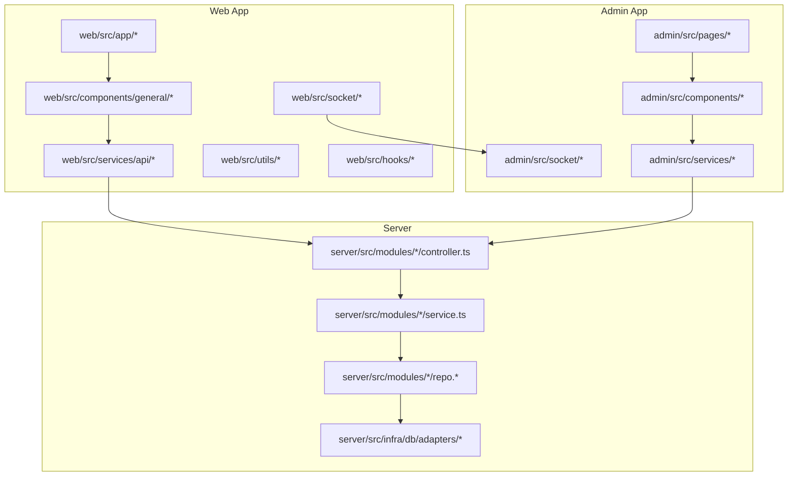

**Diagram sources**
- [web/src/app/(root)/(app)/page.tsx](file://web/src/app/(root)/(app)/page.tsx#L91-L115)
- [web/src/components/general/CreatePost.tsx](file://web/src/components/general/CreatePost.tsx#L1-L409)
- [web/src/services/api/post.ts](file://web/src/services/api/post.ts#L1-L65)
- [server/src/modules/post/post.controller.ts](file://server/src/modules/post/post.controller.ts#L1-L162)
- [server/src/modules/post/post.service.ts](file://server/src/modules/post/post.service.ts#L1-L408)
- [web/src/socket/useSocket.ts](file://web/src/socket/useSocket.ts)
- [admin/src/socket/useSocket.ts](file://admin/src/socket/useSocket.ts)

**Section sources**
- [web/src/app/(root)/(app)/page.tsx](file://web/src/app/(root)/(app)/page.tsx#L91-L115)
- [web/src/components/general/CreatePost.tsx](file://web/src/components/general/CreatePost.tsx#L1-L409)
- [web/src/services/api/post.ts](file://web/src/services/api/post.ts#L1-L65)
- [server/src/modules/post/post.controller.ts](file://server/src/modules/post/post.controller.ts#L1-L162)
- [server/src/modules/post/post.service.ts](file://server/src/modules/post/post.service.ts#L1-L408)

## Core Components
- Content creation: CreatePost form with moderation preview and topic selection
- Comments and nested replies: CreateComment with optional parentCommentId
- Voting: Upvote/downvote toggling with optimistic UI and server sync
- Bookmarking: Save posts for later viewing
- Topic-based organization: Topics enum and parsing utilities
- Trending discovery: Sorting by views with dedicated endpoint
- Notifications: Listing and marking as seen with sockets for real-time updates
- Privacy controls: “College-only” posts gated by user verification

**Section sources**
- [web/src/components/general/CreatePost.tsx](file://web/src/components/general/CreatePost.tsx#L49-L60)
- [web/src/components/general/CreateComment.tsx](file://web/src/components/general/CreateComment.tsx#L41-L46)
- [web/src/components/general/EngagementComponent.tsx](file://web/src/components/general/EngagementComponent.tsx#L14-L31)
- [web/src/services/api/bookmark.ts](file://web/src/services/api/bookmark.ts#L1-L13)
- [web/src/services/api/post.ts](file://web/src/services/api/post.ts#L52-L60)
- [web/src/services/api/notification.ts](file://web/src/services/api/notification.ts#L1-L10)
- [server/src/modules/post/post.service.ts](file://server/src/modules/post/post.service.ts#L96-L143)

## Architecture Overview
The frontend interacts with backend APIs via typed services. Controllers validate requests and delegate to services. Services enforce policies (moderation, privacy, blocking), perform transactions, and invalidate caches. Real-time updates leverage sockets; notifications are persisted and retrievable.

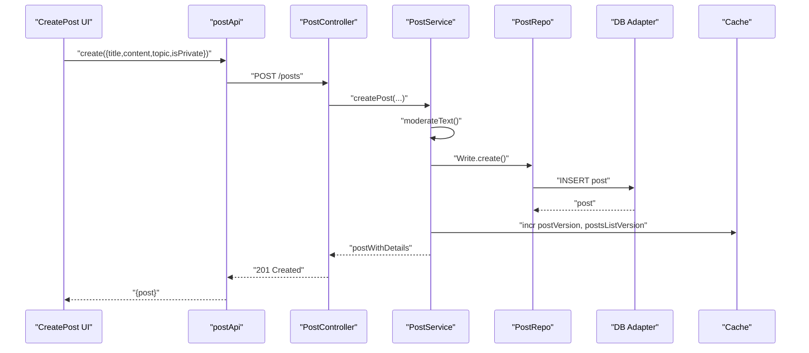

**Diagram sources**
- [web/src/components/general/CreatePost.tsx](file://web/src/components/general/CreatePost.tsx#L163-L219)
- [web/src/services/api/post.ts](file://web/src/services/api/post.ts#L26-L35)
- [server/src/modules/post/post.controller.ts](file://server/src/modules/post/post.controller.ts#L8-L22)
- [server/src/modules/post/post.service.ts](file://server/src/modules/post/post.service.ts#L40-L94)

## Detailed Component Analysis

### Anonymous Posting and Privacy Controls
- Anonymous posting is not explicitly implemented in the analyzed code. Users must be authenticated to create posts and interact.
- Privacy: “College-only” posts require verified college affiliation; access is enforced in the service layer by checking user’s college and post ownership.
- Moderation: All posts/comments are moderated server-side before acceptance.

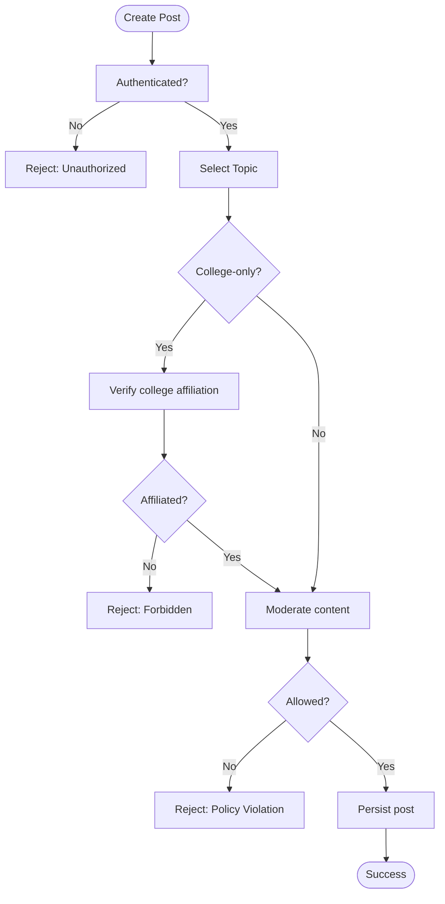

**Diagram sources**
- [server/src/modules/post/post.service.ts](file://server/src/modules/post/post.service.ts#L96-L143)
- [server/src/modules/post/post.service.ts](file://server/src/modules/post/post.service.ts#L40-L94)

**Section sources**
- [server/src/modules/post/post.service.ts](file://server/src/modules/post/post.service.ts#L96-L143)
- [server/src/modules/post/post.service.ts](file://server/src/modules/post/post.service.ts#L40-L94)

### Content Creation Workflow
- Frontend form validates length and topic, censors content, and submits via postApi.
- Backend controller parses and forwards to service.
- Service enforces moderation and privacy rules, records audit, invalidates caches, and returns enriched post.

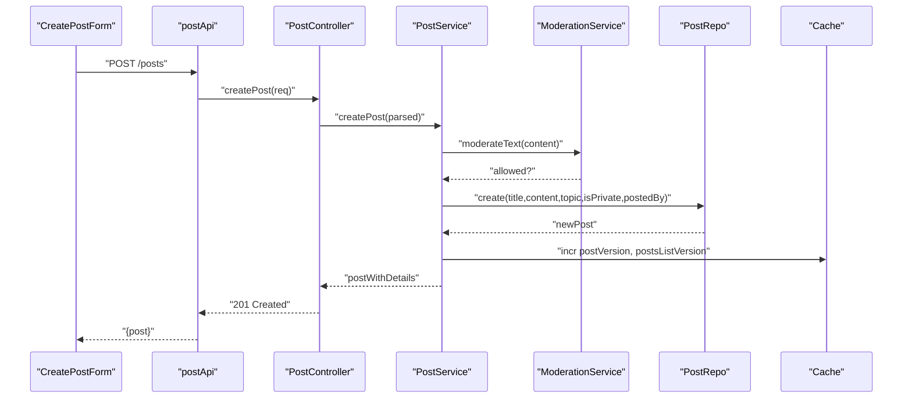

**Diagram sources**
- [web/src/components/general/CreatePost.tsx](file://web/src/components/general/CreatePost.tsx#L163-L219)
- [web/src/services/api/post.ts](file://web/src/services/api/post.ts#L26-L35)
- [server/src/modules/post/post.controller.ts](file://server/src/modules/post/post.controller.ts#L8-L22)
- [server/src/modules/post/post.service.ts](file://server/src/modules/post/post.service.ts#L40-L94)

**Section sources**
- [web/src/components/general/CreatePost.tsx](file://web/src/components/general/CreatePost.tsx#L163-L219)
- [web/src/services/api/post.ts](file://web/src/services/api/post.ts#L26-L35)
- [server/src/modules/post/post.controller.ts](file://server/src/modules/post/post.controller.ts#L8-L22)
- [server/src/modules/post/post.service.ts](file://server/src/modules/post/post.service.ts#L40-L94)

### Moderation Workflow
- Both posts and comments run through a moderation pipeline. If flagged, the request is rejected with policy violations and reasons.
- Moderation errors propagate with structured metadata for client-side previews.

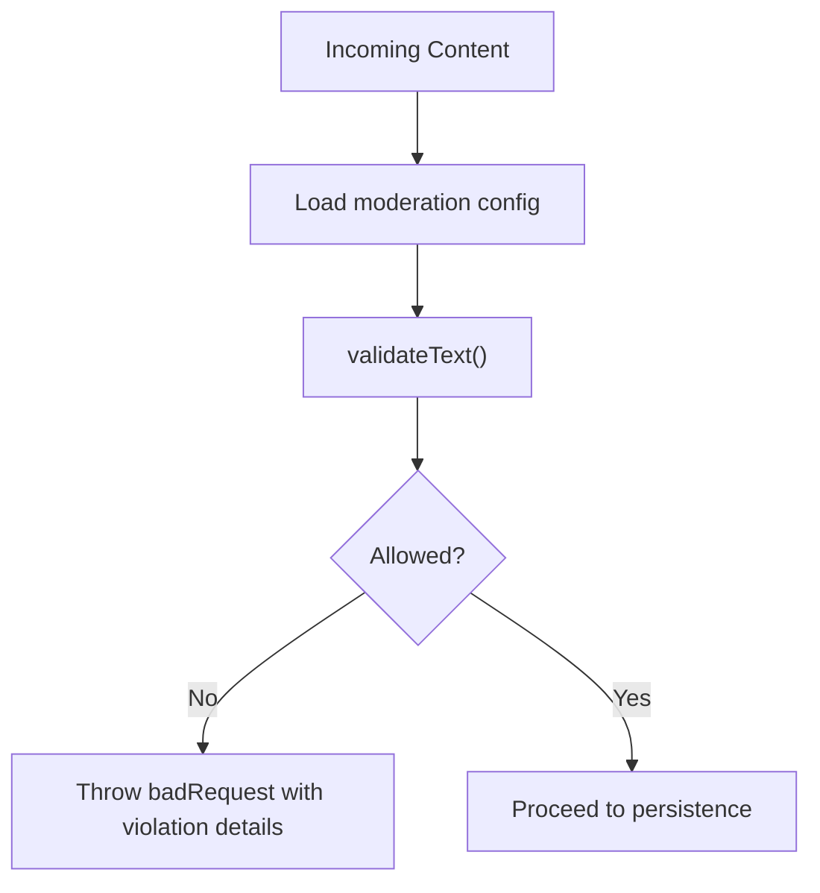

**Diagram sources**
- [web/src/components/general/CreatePost.tsx](file://web/src/components/general/CreatePost.tsx#L141-L143)
- [web/src/components/general/CreatePost.tsx](file://web/src/components/general/CreatePost.tsx#L170-L175)
- [server/src/modules/post/post.service.ts](file://server/src/modules/post/post.service.ts#L13-L38)
- [server/src/modules/comment/comment.service.ts](file://server/src/modules/comment/comment.service.ts#L135-L160)

**Section sources**
- [web/src/components/general/CreatePost.tsx](file://web/src/components/general/CreatePost.tsx#L141-L143)
- [web/src/components/general/CreatePost.tsx](file://web/src/components/general/CreatePost.tsx#L170-L175)
- [server/src/modules/post/post.service.ts](file://server/src/modules/post/post.service.ts#L13-L38)
- [server/src/modules/comment/comment.service.ts](file://server/src/modules/comment/comment.service.ts#L135-L160)

### Commenting Mechanism with Nested Replies
- CreateComment supports optional parentCommentId to nest replies.
- Backend validates post existence, bans, and parent-child relationships; enforces blocking rules.
- Moderation runs on comment content; caches invalidated per post/comment hierarchy.

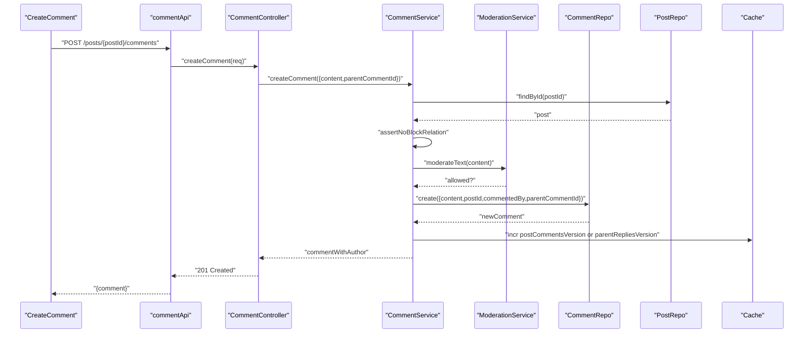

**Diagram sources**
- [web/src/components/general/CreateComment.tsx](file://web/src/components/general/CreateComment.tsx#L107-L165)
- [web/src/services/api/comment.ts](file://web/src/services/api/comment.ts)
- [server/src/modules/comment/comment.controller.ts](file://server/src/modules/comment/comment.controller.ts#L8-L24)
- [server/src/modules/comment/comment.service.ts](file://server/src/modules/comment/comment.service.ts#L69-L203)

**Section sources**
- [web/src/components/general/CreateComment.tsx](file://web/src/components/general/CreateComment.tsx#L107-L165)
- [web/src/services/api/comment.ts](file://web/src/services/api/comment.ts)
- [server/src/modules/comment/comment.controller.ts](file://server/src/modules/comment/comment.controller.ts#L8-L24)
- [server/src/modules/comment/comment.service.ts](file://server/src/modules/comment/comment.service.ts#L69-L203)

### Voting/Upvoting/Downvoting
- Optimistic UI updates counts immediately upon user action.
- Supports three actions: create, delete, and patch votes.
- Backend ensures target exists, resolves owner, enforces blocking, updates karma atomically, and invalidates caches.

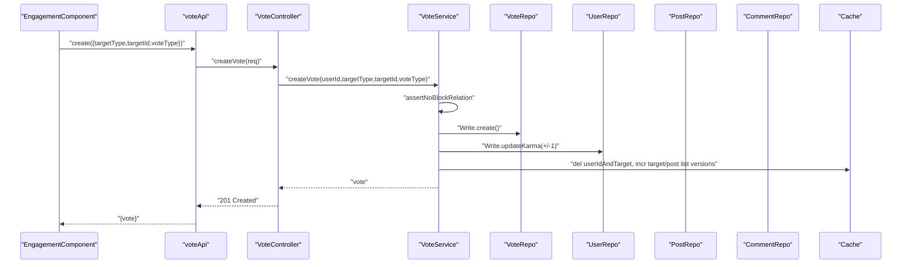

**Diagram sources**
- [web/src/components/general/EngagementComponent.tsx](file://web/src/components/general/EngagementComponent.tsx#L86-L153)
- [web/src/services/api/vote.ts](file://web/src/services/api/vote.ts)
- [server/src/modules/vote/vote.controller.ts](file://server/src/modules/vote/vote.controller.ts#L10-L22)
- [server/src/modules/vote/vote.service.ts](file://server/src/modules/vote/vote.service.ts#L48-L131)

**Section sources**
- [web/src/components/general/EngagementComponent.tsx](file://web/src/components/general/EngagementComponent.tsx#L86-L153)
- [web/src/services/api/vote.ts](file://web/src/services/api/vote.ts)
- [server/src/modules/vote/vote.controller.ts](file://server/src/modules/vote/vote.controller.ts#L10-L22)
- [server/src/modules/vote/vote.service.ts](file://server/src/modules/vote/vote.service.ts#L48-L131)

### Bookmark/Save System
- Users can save posts; duplicates are prevented.
- Retrieval filters out posts by blocked authors.
- Cache keys are invalidated on create/delete to keep lists fresh.

```mermaid
sequenceDiagram
participant UI as "PostDropdown"
participant API as "bookmarkApi"
participant BCtrl as "BookmarkController"
participant BSvc as "BookmarkService"
participant BRepo as "BookmarkRepo"
participant PRepo as "PostRepo"
participant Cache as "Cache"
UI->>API : "create({postId})"
API->>BCtrl : "createBookmark(req)"
BCtrl->>BSvc : "createBookmark(userId,postId)"
BSvc->>PRepo : "findById(postId)"
PRepo-->>BSvc : "post"
BSvc->>BRepo : "findBookmark(userId,postId)"
BRepo-->>BSvc : "existing?"
BSvc->>BRepo : "Write.createBookmark()"
BSvc->>Cache : "del multiId, del id, incr postVersion"
BSvc-->>BCtrl : "bookmark"
BCtrl-->>API : "201 Created"
API-->>UI : "{bookmark}"
```

**Diagram sources**
- [web/src/services/api/bookmark.ts](file://web/src/services/api/bookmark.ts#L7-L12)
- [server/src/modules/bookmark/bookmark.controller.ts](file://server/src/modules/bookmark/bookmark.controller.ts#L8-L17)
- [server/src/modules/bookmark/bookmark.service.ts](file://server/src/modules/bookmark/bookmark.service.ts#L12-L60)

**Section sources**
- [web/src/services/api/bookmark.ts](file://web/src/services/api/bookmark.ts#L1-L13)
- [server/src/modules/bookmark/bookmark.controller.ts](file://server/src/modules/bookmark/bookmark.controller.ts#L8-L17)
- [server/src/modules/bookmark/bookmark.service.ts](file://server/src/modules/bookmark/bookmark.service.ts#L12-L60)

### Topic-Based Organization and Content Discovery
- Topics are selected from a predefined enum; parsing/unparsing utilities support URL and display consistency.
- Discovery:
  - Feed by topic, branch, or college
  - Trending by views via a dedicated endpoint sorting by views descending

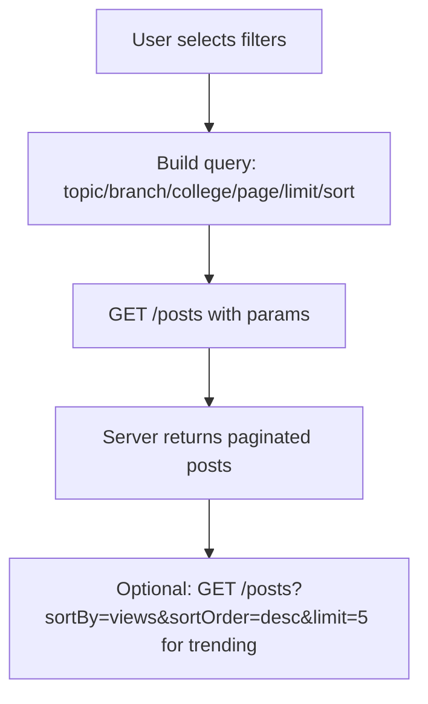

**Diagram sources**
- [web/src/services/api/post.ts](file://web/src/services/api/post.ts#L14-L60)
- [web/src/types/postTopics.ts](file://web/src/types/postTopics.ts)
- [web/src/utils/parse-topic.ts](file://web/src/utils/parse-topic.ts)
- [web/src/utils/unparse-topic.ts](file://web/src/utils/unparse-topic.ts)

**Section sources**
- [web/src/services/api/post.ts](file://web/src/services/api/post.ts#L14-L60)
- [web/src/types/postTopics.ts](file://web/src/types/postTopics.ts)
- [web/src/utils/parse-topic.ts](file://web/src/utils/parse-topic.ts)
- [web/src/utils/unparse-topic.ts](file://web/src/utils/unparse-topic.ts)

### Real-Time Updates and Notifications
- Real-time: Socket contexts are provided in both web and admin apps.
- Notifications: List recent notifications and mark as seen; server adapter queries joined posts and notifications.

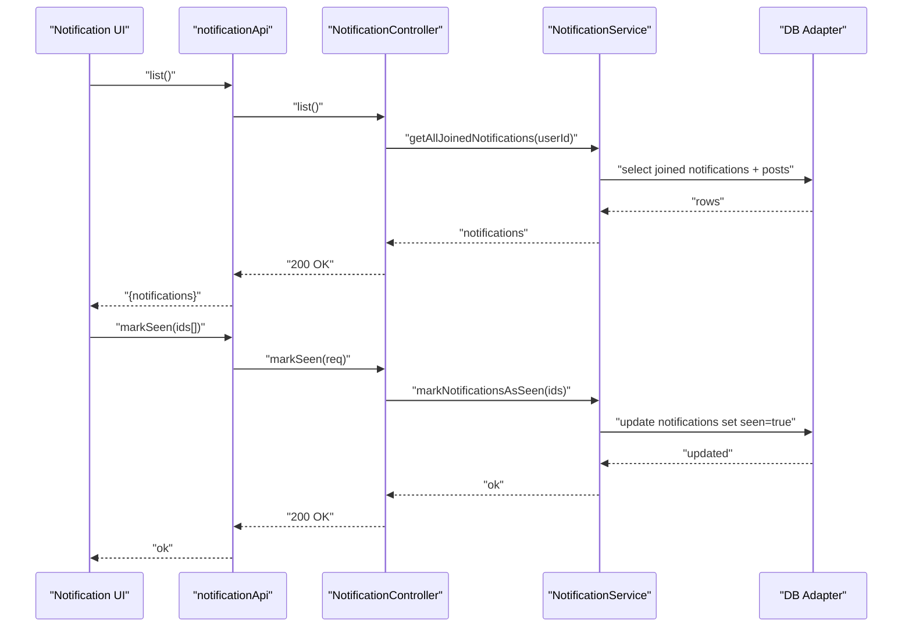

**Diagram sources**
- [web/src/services/api/notification.ts](file://web/src/services/api/notification.ts#L3-L9)
- [web/src/types/Notification.ts](file://web/src/types/Notification.ts#L10-L21)
- [server/src/infra/db/adapters/notification.adapter.ts](file://server/src/infra/db/adapters/notification.adapter.ts#L18-L59)
- [web/src/hooks/useNotificationSocket.tsx](file://web/src/hooks/useNotificationSocket.tsx)
- [web/src/socket/useSocket.ts](file://web/src/socket/useSocket.ts)
- [admin/src/socket/useSocket.ts](file://admin/src/socket/useSocket.ts)

**Section sources**
- [web/src/services/api/notification.ts](file://web/src/services/api/notification.ts#L1-L10)
- [web/src/types/Notification.ts](file://web/src/types/Notification.ts#L1-L21)
- [server/src/infra/db/adapters/notification.adapter.ts](file://server/src/infra/db/adapters/notification.adapter.ts#L18-L59)
- [web/src/hooks/useNotificationSocket.tsx](file://web/src/hooks/useNotificationSocket.tsx)
- [web/src/socket/useSocket.ts](file://web/src/socket/useSocket.ts)
- [admin/src/socket/useSocket.ts](file://admin/src/socket/useSocket.ts)

### User Interaction Patterns and Engagement Metrics
- EngagementComponent displays counts and supports upvote/downvote toggling with optimistic updates.
- Metrics surfaced include upvotes, downvotes, comments count, and views.
- Sharing and commenting buttons integrate with the engagement bar.

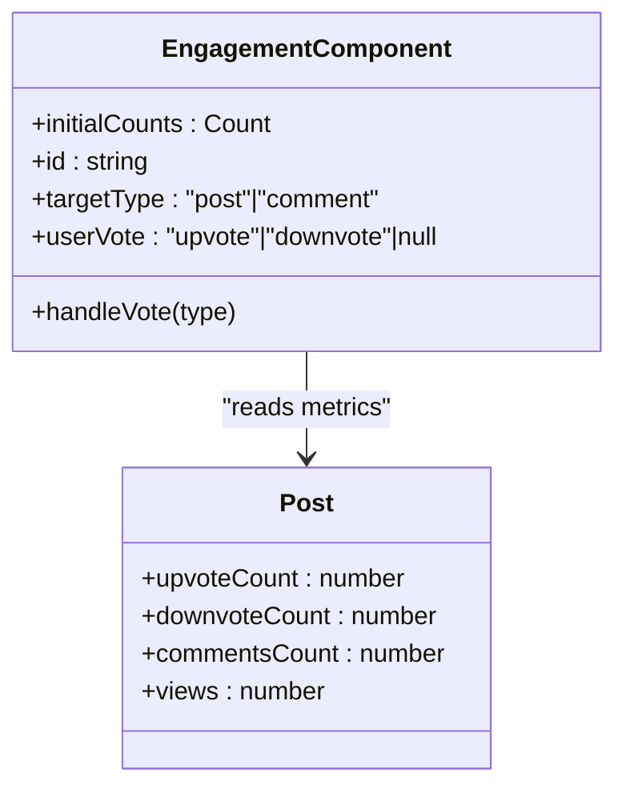

**Diagram sources**
- [web/src/components/general/EngagementComponent.tsx](file://web/src/components/general/EngagementComponent.tsx#L23-L67)
- [web/src/components/general/Post.tsx](file://web/src/components/general/Post.tsx#L159-L172)
- [admin/src/types/Post.ts](file://admin/src/types/Post.ts#L3-L17)

**Section sources**
- [web/src/components/general/EngagementComponent.tsx](file://web/src/components/general/EngagementComponent.tsx#L23-L67)
- [web/src/components/general/Post.tsx](file://web/src/components/general/Post.tsx#L159-L172)
- [admin/src/types/Post.ts](file://admin/src/types/Post.ts#L3-L17)

### Content Filtering Systems
- Blocking enforcement: Services assert no block relation between users before allowing actions.
- Privacy gating: “College-only” posts restrict visibility to users from the same college.
- Moderation filtering: Content rejected if flagged during create/update.

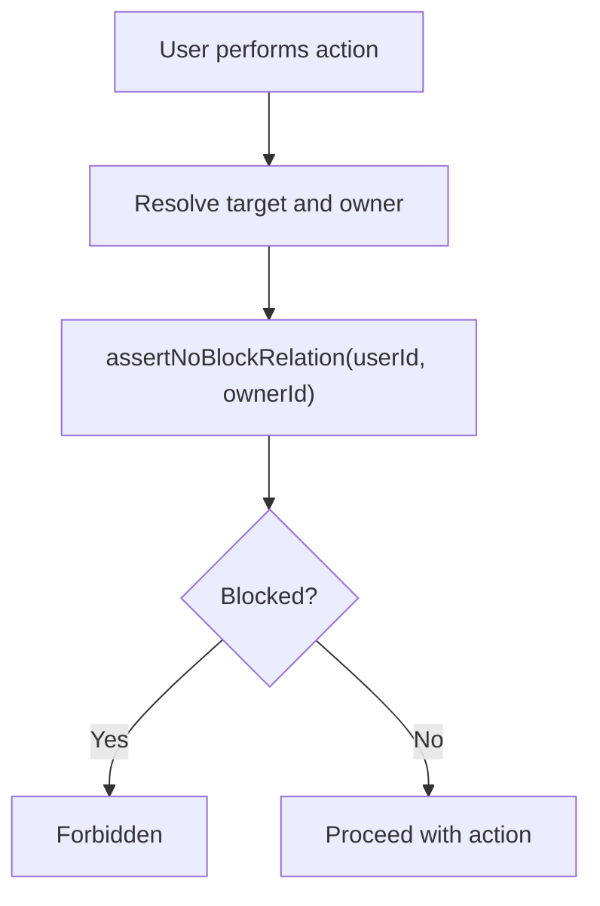

**Diagram sources**
- [server/src/modules/vote/vote.service.ts](file://server/src/modules/vote/vote.service.ts#L73-L78)
- [server/src/modules/comment/comment.service.ts](file://server/src/modules/comment/comment.service.ts#L95-L99)
- [server/src/modules/bookmark/bookmark.service.ts](file://server/src/modules/bookmark/bookmark.service.ts#L23-L27)
- [server/src/modules/post/post.service.ts](file://server/src/modules/post/post.service.ts#L130-L136)

**Section sources**
- [server/src/modules/vote/vote.service.ts](file://server/src/modules/vote/vote.service.ts#L73-L78)
- [server/src/modules/comment/comment.service.ts](file://server/src/modules/comment/comment.service.ts#L95-L99)
- [server/src/modules/bookmark/bookmark.service.ts](file://server/src/modules/bookmark/bookmark.service.ts#L23-L27)
- [server/src/modules/post/post.service.ts](file://server/src/modules/post/post.service.ts#L130-L136)

## Dependency Analysis
- Controllers depend on services; services depend on repos and cache; repos depend on DB adapters.
- Frontend services depend on backend endpoints; components depend on stores and API clients.
- Real-time sockets connect UI and admin to backend.

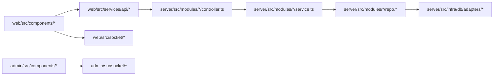

**Diagram sources**
- [web/src/components/general/CreatePost.tsx](file://web/src/components/general/CreatePost.tsx#L45-L46)
- [web/src/services/api/post.ts](file://web/src/services/api/post.ts#L1-L65)
- [server/src/modules/post/post.controller.ts](file://server/src/modules/post/post.controller.ts#L1-L162)
- [server/src/modules/post/post.service.ts](file://server/src/modules/post/post.service.ts#L1-L408)
- [web/src/socket/useSocket.ts](file://web/src/socket/useSocket.ts)
- [admin/src/socket/useSocket.ts](file://admin/src/socket/useSocket.ts)

**Section sources**
- [web/src/components/general/CreatePost.tsx](file://web/src/components/general/CreatePost.tsx#L45-L46)
- [web/src/services/api/post.ts](file://web/src/services/api/post.ts#L1-L65)
- [server/src/modules/post/post.controller.ts](file://server/src/modules/post/post.controller.ts#L1-L162)
- [server/src/modules/post/post.service.ts](file://server/src/modules/post/post.service.ts#L1-L408)
- [web/src/socket/useSocket.ts](file://web/src/socket/useSocket.ts)
- [admin/src/socket/useSocket.ts](file://admin/src/socket/useSocket.ts)

## Performance Considerations
- Caching: Increment version keys after mutations to invalidate caches and refresh lists efficiently.
- Transactions: Vote operations wrap updates to karma and vote records in a single transaction to maintain consistency.
- Pagination: Controllers and services return paginated results with total pages and hasMore flags.
- Moderation: Pre-validate and moderate content early to fail fast and reduce downstream work.

[No sources needed since this section provides general guidance]

## Troubleshooting Guide
- Authentication/Authorization errors:
  - Unauthorized or forbidden responses when accessing restricted content (e.g., private posts).
- Moderation violations:
  - Requests rejected with structured policy violation details; review moderation warnings and adjust content.
- Blocking:
  - Actions may be denied if users are blocked; unblock or adjust privacy settings.
- Not found:
  - Deleting or updating posts/comments requires correct IDs; ensure correct entity IDs are used.

**Section sources**
- [server/src/modules/post/post.service.ts](file://server/src/modules/post/post.service.ts#L102-L106)
- [server/src/modules/post/post.service.ts](file://server/src/modules/post/post.service.ts#L214-L219)
- [server/src/modules/comment/comment.service.ts](file://server/src/modules/comment/comment.service.ts#L237-L244)
- [server/src/modules/vote/vote.service.ts](file://server/src/modules/vote/vote.service.ts#L148-L155)

## Conclusion
Flick’s social features are built around robust moderation, privacy-aware content gating, efficient caching, and optimistic UI updates. The backend enforces strong policies (blocking, privacy, moderation) while the frontend delivers responsive interactions for posts, comments, votes, and bookmarks. Real-time notifications and sockets enable timely updates, and topic-based discovery with trending endpoints supports content exploration.

## Appendices
- Example pages consuming posts:
  - Home feed, college-specific feed, and user profile feed render Post components with fallbacks for missing user details.

**Section sources**
- [web/src/app/(root)/(app)/page.tsx](file://web/src/app/(root)/(app)/page.tsx#L91-L115)
- [web/src/app/(root)/(app)/college/page.tsx](file://web/src/app/(root)/(app)/college/page.tsx#L80-L104)
- [web/src/app/(root)/(app)/u/profile/page.tsx](file://web/src/app/(root)/(app)/u/profile/page.tsx#L213-L237)
- [web/src/types/Comment.ts](file://web/src/types/Comment.ts#L1-L17)
- [admin/src/types/Post.ts](file://admin/src/types/Post.ts#L1-L17)
- [admin/src/types/Comment.ts](file://admin/src/types/Comment.ts#L1-L16)
- [web/src/components/general/TrendingPostSection.tsx](file://web/src/components/general/TrendingPostSection.tsx)
- [web/src/types/TrendingPost.ts](file://web/src/types/TrendingPost.ts#L1-L6)