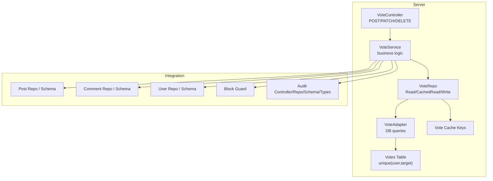
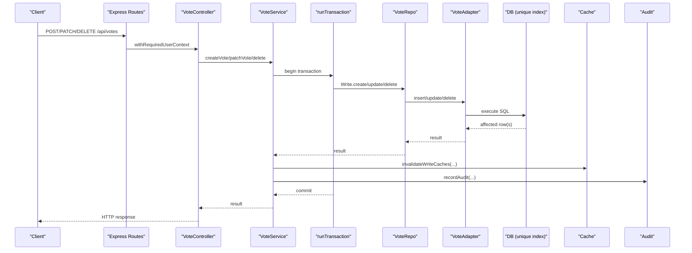
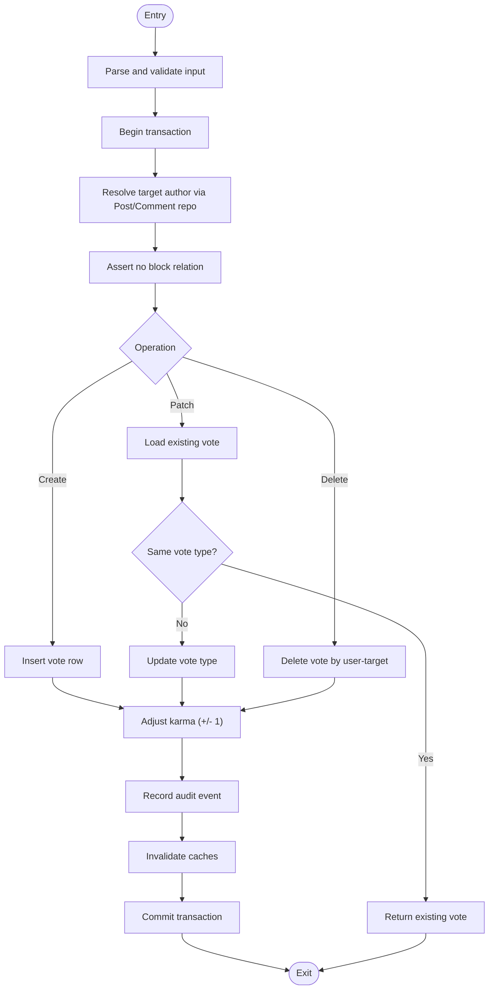
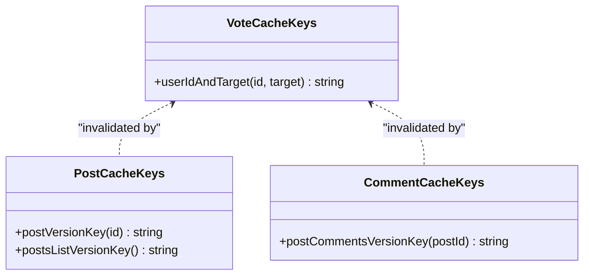
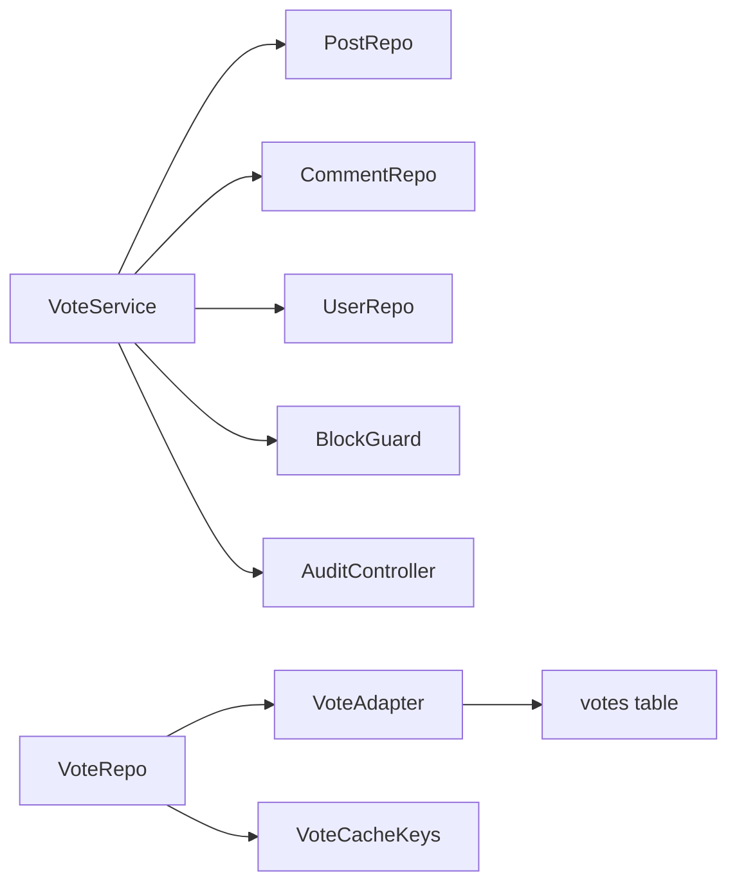

# Voting Mechanism

<cite>
**Referenced Files in This Document**
- [vote.schema.ts](file://server/src/modules/vote/vote.schema.ts)
- [vote.service.ts](file://server/src/modules/vote/vote.service.ts)
- [vote.controller.ts](file://server/src/modules/vote/vote.controller.ts)
- [vote.repo.ts](file://server/src/modules/vote/vote.repo.ts)
- [vote.adapter.ts](file://server/src/infra/db/adapters/vote.adapter.ts)
- [vote.table.ts](file://server/src/infra/db/tables/vote.table.ts)
- [vote.cache-keys.ts](file://server/src/modules/vote/vote.cache-keys.ts)
- [post.schema.ts](file://server/src/modules/post/post.schema.ts)
- [comment.schema.ts](file://server/src/modules/comment/comment.schema.ts)
- [user.schema.ts](file://server/src/modules/user/user.schema.ts)
- [user.repo.ts](file://server/src/modules/user/user.repo.ts)
- [block.guard.ts](file://server/src/modules/user/block.guard.ts)
- [audit.controller.ts](file://server/src/modules/audit/audit.controller.ts)
- [audit.repo.ts](file://server/src/modules/audit/audit.repo.ts)
- [audit.schema.ts](file://server/src/modules/audit/audit.schema.ts)
- [audit.types.ts](file://server/src/modules/audit/audit.types.ts)
- [audit-context.ts](file://server/src/modules/audit/audit-context.ts)
- [post.cache-keys.ts](file://server/src/modules/post/post.cache-keys.ts)
- [comment.cache-keys.ts](file://server/src/modules/comment/comment.cache-keys.ts)
- [transactions.ts](file://server/src/infra/db/transactions.ts)
- [env.ts](file://server/src/config/env.ts)
- [index.ts](file://server/src/routes/index.ts)
- [app.ts](file://server/src/app.ts)
</cite>

## Table of Contents
1. [Introduction](#introduction)
2. [Project Structure](#project-structure)
3. [Core Components](#core-components)
4. [Architecture Overview](#architecture-overview)
5. [Detailed Component Analysis](#detailed-component-analysis)
6. [Dependency Analysis](#dependency-analysis)
7. [Performance Considerations](#performance-considerations)
8. [Troubleshooting Guide](#troubleshooting-guide)
9. [Conclusion](#conclusion)
10. [Appendices](#appendices)

## Introduction
This document describes Flick’s voting/upvoting/downvoting system. It covers vote creation, modification, and removal workflows, user permission controls, score calculation, vote weight considerations, reputation impact, schema validation, duplicate vote prevention, rollback mechanisms, real-time updates, leaderboards, trending content calculations, caching strategies, performance optimizations, and conflict resolution. The goal is to provide a comprehensive yet accessible guide for developers and operators integrating or extending the voting system.

## Project Structure
The voting subsystem is implemented as a cohesive module under server/src/modules/vote, with supporting infrastructure in the database layer, caching, auditing, and user permission guards. The module integrates with Post and Comment modules to compute scores and maintain caches.

**Diagram sources**
- [vote.controller.ts](file://server/src/modules/vote/vote.controller.ts#L1-L52)
- [vote.service.ts](file://server/src/modules/vote/vote.service.ts#L1-L315)
- [vote.repo.ts](file://server/src/modules/vote/vote.repo.ts#L1-L29)
- [vote.adapter.ts](file://server/src/infra/db/adapters/vote.adapter.ts#L1-L83)
- [vote.table.ts](file://server/src/infra/db/tables/vote.table.ts#L1-L33)
- [vote.cache-keys.ts](file://server/src/modules/vote/vote.cache-keys.ts#L1-L7)
- [post.schema.ts](file://server/src/modules/post/post.schema.ts#L1-L107)
- [comment.schema.ts](file://server/src/modules/comment/comment.schema.ts#L1-L38)
- [user.schema.ts](file://server/src/modules/user/user.schema.ts)
- [user.repo.ts](file://server/src/modules/user/user.repo.ts)
- [block.guard.ts](file://server/src/modules/user/block.guard.ts)
- [audit.controller.ts](file://server/src/modules/audit/audit.controller.ts)
- [audit.repo.ts](file://server/src/modules/audit/audit.repo.ts)
- [audit.schema.ts](file://server/src/modules/audit/audit.schema.ts)
- [audit.types.ts](file://server/src/modules/audit/audit.types.ts)
- [audit-context.ts](file://server/src/modules/audit/audit-context.ts)

**Section sources**
- [vote.controller.ts](file://server/src/modules/vote/vote.controller.ts#L1-L52)
- [vote.service.ts](file://server/src/modules/vote/vote.service.ts#L1-L315)
- [vote.repo.ts](file://server/src/modules/vote/vote.repo.ts#L1-L29)
- [vote.adapter.ts](file://server/src/infra/db/adapters/vote.adapter.ts#L1-L83)
- [vote.table.ts](file://server/src/infra/db/tables/vote.table.ts#L1-L33)
- [vote.cache-keys.ts](file://server/src/modules/vote/vote.cache-keys.ts#L1-L7)
- [post.schema.ts](file://server/src/modules/post/post.schema.ts#L1-L107)
- [comment.schema.ts](file://server/src/modules/comment/comment.schema.ts#L1-L38)
- [user.schema.ts](file://server/src/modules/user/user.schema.ts)
- [user.repo.ts](file://server/src/modules/user/user.repo.ts)
- [block.guard.ts](file://server/src/modules/user/block.guard.ts)
- [audit.controller.ts](file://server/src/modules/audit/audit.controller.ts)
- [audit.repo.ts](file://server/src/modules/audit/audit.repo.ts)
- [audit.schema.ts](file://server/src/modules/audit/audit.schema.ts)
- [audit.types.ts](file://server/src/modules/audit/audit.types.ts)
- [audit-context.ts](file://server/src/modules/audit/audit-context.ts)

## Core Components
- Validation layer: Zod schemas define allowed vote types and target types, ensuring safe parsing of requests.
- Controller: Exposes REST endpoints for creating, updating, and deleting votes after enforcing user context middleware.
- Service: Orchestrates vote lifecycle, permissions, transactional writes, karma updates, audit logging, and cache invalidation.
- Repository: Provides read, cached read, and write operations backed by the adapter.
- Adapter and Table: Drizzle ORM mapping with a unique constraint preventing duplicate votes per user-target pair.
- Caching: Dedicated cache keys and invalidation to keep vote state and related lists fresh.
- Integration: Resolves target author, enforces block relations, updates user karma, and records audit events.

**Section sources**
- [vote.schema.ts](file://server/src/modules/vote/vote.schema.ts#L1-L14)
- [vote.controller.ts](file://server/src/modules/vote/vote.controller.ts#L1-L52)
- [vote.service.ts](file://server/src/modules/vote/vote.service.ts#L1-L315)
- [vote.repo.ts](file://server/src/modules/vote/vote.repo.ts#L1-L29)
- [vote.adapter.ts](file://server/src/infra/db/adapters/vote.adapter.ts#L1-L83)
- [vote.table.ts](file://server/src/infra/db/tables/vote.table.ts#L1-L33)
- [vote.cache-keys.ts](file://server/src/modules/vote/vote.cache-keys.ts#L1-L7)

## Architecture Overview
The voting system follows a layered architecture:
- HTTP layer: Express routes guarded by user context middleware.
- Controller: Parses validated input and delegates to service.
- Service: Performs business logic inside a transaction, updates dependent entities, and invalidates caches.
- Persistence: Drizzle ORM with a unique index on (userId, targetType, targetId) to prevent duplicates.
- Caching: Cache keys scoped to user-target combinations and list/version keys for posts/comments.
- Auditing: Centralized audit recording for all vote operations.

**Diagram sources**
- [vote.route.ts](file://server/src/modules/vote/vote.route.ts#L1-L18)
- [vote.controller.ts](file://server/src/modules/vote/vote.controller.ts#L1-L52)
- [vote.service.ts](file://server/src/modules/vote/vote.service.ts#L1-L315)
- [vote.repo.ts](file://server/src/modules/vote/vote.repo.ts#L1-L29)
- [vote.adapter.ts](file://server/src/infra/db/adapters/vote.adapter.ts#L1-L83)
- [transactions.ts](file://server/src/infra/db/transactions.ts)
- [audit.controller.ts](file://server/src/modules/audit/audit.controller.ts)
- [audit.repo.ts](file://server/src/modules/audit/audit.repo.ts)

## Detailed Component Analysis

### Vote Schema Validation
- Enforces vote type enum (upvote/downvote) and target type enum (post/comment).
- Provides separate schemas for insert and delete operations.
- Used by the controller to parse and validate incoming requests.

**Section sources**
- [vote.schema.ts](file://server/src/modules/vote/vote.schema.ts#L1-L14)
- [vote.controller.ts](file://server/src/modules/vote/vote.controller.ts#L10-L48)

### Vote Controller Endpoints
- POST /api/votes: Create a new vote for a post or comment.
- PATCH /api/votes: Change an existing vote from upvote to downvote or vice versa.
- DELETE /api/votes: Remove a vote.
- All endpoints require a valid user context via middleware.

Example endpoint usage:
- Create vote: POST /api/votes with body containing voteType, targetType, targetId.
- Modify vote: PATCH /api/votes with voteType, targetType, targetId.
- Remove vote: DELETE /api/votes with targetType, targetId.

**Section sources**
- [vote.route.ts](file://server/src/modules/vote/vote.route.ts#L1-L18)
- [vote.controller.ts](file://server/src/modules/vote/vote.controller.ts#L10-L48)

### Vote Service Workflows
- Create vote:
  - Resolve target author from Post/Comment repositories.
  - Enforce block relation between voter and target author.
  - Persist vote in a transaction.
  - Update target author’s karma (+1 for upvote, -1 for downvote).
  - Record audit event.
  - Invalidate caches for user-target and related lists.
- Patch vote:
  - Fetch existing vote by user-target.
  - If same type, short-circuit with message.
  - Otherwise, update vote type and adjust karma accordingly.
  - Record audit event.
  - Invalidate caches.
- Delete vote:
  - Remove vote by user-target.
  - Adjust karma in opposite direction of original vote.
  - Record audit event.
  - Invalidate caches.

**Diagram sources**
- [vote.service.ts](file://server/src/modules/vote/vote.service.ts#L48-L311)
- [vote.adapter.ts](file://server/src/infra/db/adapters/vote.adapter.ts#L31-L82)
- [user.repo.ts](file://server/src/modules/user/user.repo.ts)
- [audit.controller.ts](file://server/src/modules/audit/audit.controller.ts)

**Section sources**
- [vote.service.ts](file://server/src/modules/vote/vote.service.ts#L48-L311)

### Duplicate Vote Prevention
- Database-level unique index on (userId, targetType, targetId) prevents concurrent duplicate inserts.
- Service also performs a lookup before insert to provide clear errors and avoid unnecessary DB retries.

**Section sources**
- [vote.table.ts](file://server/src/infra/db/tables/vote.table.ts#L21-L28)
- [vote.adapter.ts](file://server/src/infra/db/adapters/vote.adapter.ts#L31-L45)
- [vote.service.ts](file://server/src/modules/vote/vote.service.ts#L59-L98)

### Rollback Mechanisms
- All vote operations run inside a transaction. Any failure during vote persistence, karma update, or audit recording aborts the entire operation.
- Transaction boundaries ensure atomicity across vote state and dependent counters.

**Section sources**
- [vote.service.ts](file://server/src/modules/vote/vote.service.ts#L59-L127)
- [transactions.ts](file://server/src/infra/db/transactions.ts)

### Score Calculation and Reputation Impact
- Karma adjustment:
  - Upvote adds 1 to target author’s karma.
  - Downvote subtracts 1 from target author’s karma.
  - Patch adjusts karma by twice the delta (e.g., switching from downvote to upvote adds 2).
- No explicit score aggregation is implemented in the voting module; downstream consumers (e.g., Post/Comment modules) can compute derived metrics using vote counts or external scoring algorithms.

**Section sources**
- [vote.service.ts](file://server/src/modules/vote/vote.service.ts#L100-L102)
- [vote.service.ts](file://server/src/modules/vote/vote.service.ts#L201)
- [vote.service.ts](file://server/src/modules/vote/vote.service.ts#L280)

### Real-Time Updates and Leaderboards
- Real-time updates:
  - Vote mutations trigger cache invalidation for user-target and related lists.
  - Consumers can subscribe to cache changes or poll invalidated keys to refresh UI.
- Leaderboards:
  - Not implemented in the voting module; implementers can derive top authors by querying karma and sorting via user repository APIs.

**Section sources**
- [vote.service.ts](file://server/src/modules/vote/vote.service.ts#L29-L46)
- [post.cache-keys.ts](file://server/src/modules/post/post.cache-keys.ts)
- [comment.cache-keys.ts](file://server/src/modules/comment/comment.cache-keys.ts)

### Trending Content Calculations
- Not implemented in the voting module; implementers can compute trending scores using vote counts, recency decay, and other signals from the Post/Comment modules.

**Section sources**
- [post.schema.ts](file://server/src/modules/post/post.schema.ts#L53-L98)
- [comment.schema.ts](file://server/src/modules/comment/comment.schema.ts#L26-L37)

### Vote Caching Strategies
- Cache keys:
  - vote:user:{userId}:target:{targetId} for per-user-per-target vote lookup.
  - Incremental version keys for posts and comments lists to detect changes efficiently.
- Invalidation:
  - After mutation, delete per-user-per-target cache and increment list/version keys.

**Diagram sources**
- [vote.cache-keys.ts](file://server/src/modules/vote/vote.cache-keys.ts#L1-L7)
- [post.cache-keys.ts](file://server/src/modules/post/post.cache-keys.ts)
- [comment.cache-keys.ts](file://server/src/modules/comment/comment.cache-keys.ts)

**Section sources**
- [vote.cache-keys.ts](file://server/src/modules/vote/vote.cache-keys.ts#L1-L7)
- [vote.service.ts](file://server/src/modules/vote/vote.service.ts#L29-L46)

### Permission Controls
- User context enforcement: All vote routes require a logged-in user.
- Block guard: Prevents users from voting on content authored by blocked users.
- Target existence checks: Ensures target exists before creating/modifying/deleting votes.

**Section sources**
- [vote.route.ts](file://server/src/modules/vote/vote.route.ts#L7-L15)
- [vote.service.ts](file://server/src/modules/vote/vote.service.ts#L73-L78)
- [block.guard.ts](file://server/src/modules/user/block.guard.ts)

### Audit Logging
- All vote operations record audit entries with metadata including targetId and targetType.
- Audit controller/repo/schema/types provide centralized audit handling.

**Section sources**
- [vote.service.ts](file://server/src/modules/vote/vote.service.ts#L113-L124)
- [vote.service.ts](file://server/src/modules/vote/vote.service.ts#L224-L236)
- [vote.service.ts](file://server/src/modules/vote/vote.service.ts#L298-L308)
- [audit.controller.ts](file://server/src/modules/audit/audit.controller.ts)
- [audit.repo.ts](file://server/src/modules/audit/audit.repo.ts)
- [audit.schema.ts](file://server/src/modules/audit/audit.schema.ts)
- [audit.types.ts](file://server/src/modules/audit/audit.types.ts)
- [audit-context.ts](file://server/src/modules/audit/audit-context.ts)

## Dependency Analysis
The voting module depends on:
- Post/Comment repositories for resolving target author IDs.
- User repository for karma updates.
- Audit module for logging.
- Cache for fast reads and invalidation.
- Database adapter/table for persistence with unique constraints.

**Diagram sources**
- [vote.service.ts](file://server/src/modules/vote/vote.service.ts#L1-L14)
- [vote.repo.ts](file://server/src/modules/vote/vote.repo.ts#L1-L29)
- [vote.adapter.ts](file://server/src/infra/db/adapters/vote.adapter.ts#L1-L83)
- [vote.table.ts](file://server/src/infra/db/tables/vote.table.ts#L1-L33)
- [vote.cache-keys.ts](file://server/src/modules/vote/vote.cache-keys.ts#L1-L7)
- [post.schema.ts](file://server/src/modules/post/post.schema.ts#L1-L107)
- [comment.schema.ts](file://server/src/modules/comment/comment.schema.ts#L1-L38)
- [user.schema.ts](file://server/src/modules/user/user.schema.ts)
- [user.repo.ts](file://server/src/modules/user/user.repo.ts)
- [block.guard.ts](file://server/src/modules/user/block.guard.ts)
- [audit.controller.ts](file://server/src/modules/audit/audit.controller.ts)

**Section sources**
- [vote.service.ts](file://server/src/modules/vote/vote.service.ts#L1-L14)
- [vote.repo.ts](file://server/src/modules/vote/vote.repo.ts#L1-L29)
- [vote.adapter.ts](file://server/src/infra/db/adapters/vote.adapter.ts#L1-L83)
- [vote.table.ts](file://server/src/infra/db/tables/vote.table.ts#L1-L33)
- [vote.cache-keys.ts](file://server/src/modules/vote/vote.cache-keys.ts#L1-L7)

## Performance Considerations
- Unique constraint on (userId, targetType, targetId) prevents duplicates and reduces contention.
- Cached reads for user-target votes minimize repeated DB lookups.
- Incremental cache versioning avoids full recomputation of lists.
- Transactions ensure consistency with minimal round trips.
- Recommendations:
  - Use cache warming for hot targets.
  - Monitor audit and cache hit rates.
  - Consider batching vote operations for bulk UI interactions.

[No sources needed since this section provides general guidance]

## Troubleshooting Guide
Common issues and resolutions:
- Vote not found for patch/delete: Ensure the user-target combination exists and matches targetType.
- Target not found: Verify targetId and targetType correctness.
- Unauthorized: Confirm user context middleware is applied and user is authenticated.
- Blocked user: Unblock the target author or operate from another account.
- Duplicate vote: Unique index prevents insertion; handle gracefully by informing clients to patch instead of re-insert.

**Section sources**
- [vote.service.ts](file://server/src/modules/vote/vote.service.ts#L141-L155)
- [vote.service.ts](file://server/src/modules/vote/vote.service.ts#L248-L263)
- [vote.adapter.ts](file://server/src/infra/db/adapters/vote.adapter.ts#L31-L45)
- [vote.table.ts](file://server/src/infra/db/tables/vote.table.ts#L21-L28)

## Conclusion
Flick’s voting system is designed around safety, consistency, and scalability. It prevents duplicates, enforces permissions, maintains author reputation, and keeps caches coherent. While the module itself focuses on vote lifecycle and audit, downstream modules can implement score aggregation, leaderboards, and trending calculations tailored to application needs.

[No sources needed since this section summarizes without analyzing specific files]

## Appendices

### API Endpoints Summary
- POST /api/votes
  - Body: voteType, targetType, targetId
  - Response: created vote
- PATCH /api/votes
  - Body: voteType, targetType, targetId
  - Response: success message and updated vote
- DELETE /api/votes
  - Body: targetType, targetId
  - Response: success message with deleted vote id

**Section sources**
- [vote.route.ts](file://server/src/modules/vote/vote.route.ts#L9-L15)
- [vote.controller.ts](file://server/src/modules/vote/vote.controller.ts#L10-L48)

### Database Schema Snapshot
- Table: votes
  - Columns: id, userId, targetType, targetId, voteType
  - Constraints: unique index on (userId, targetType, targetId); index on (targetType, targetId)

**Section sources**
- [vote.table.ts](file://server/src/infra/db/tables/vote.table.ts#L6-L29)