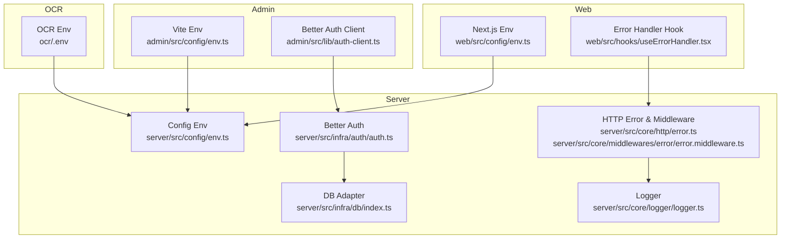
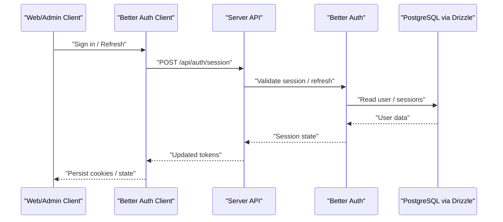
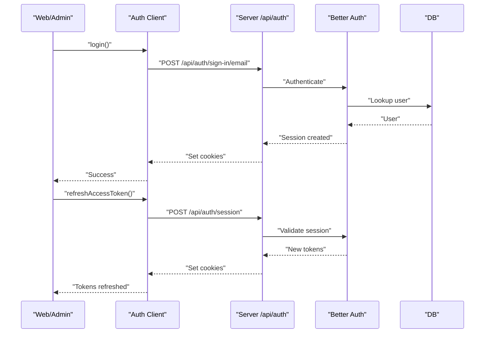
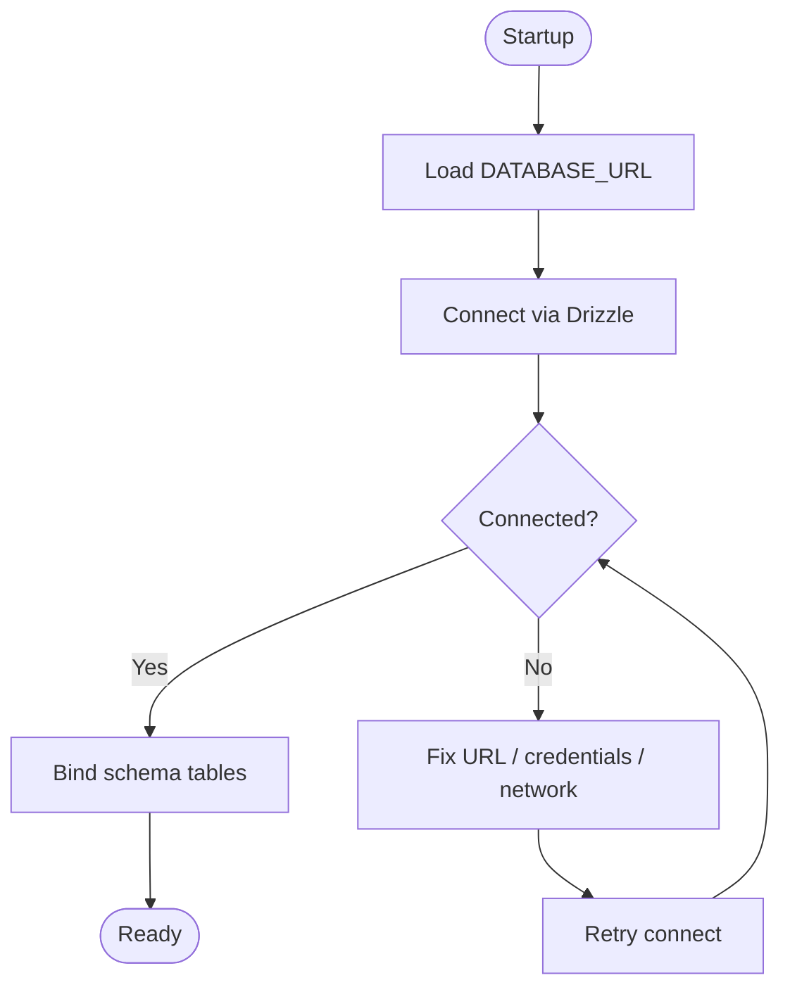
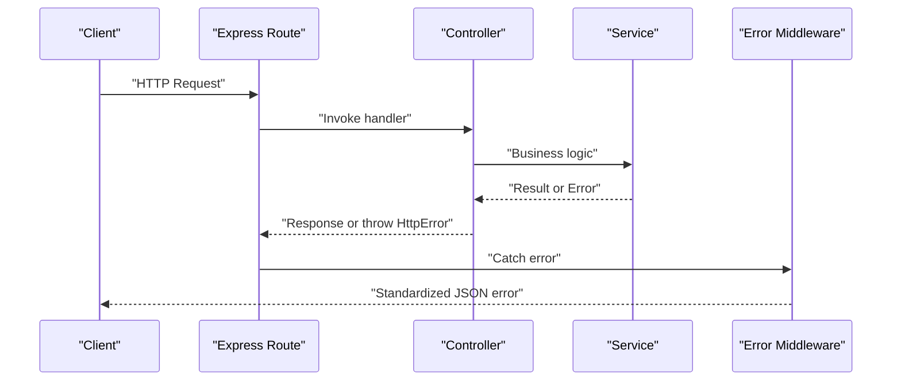
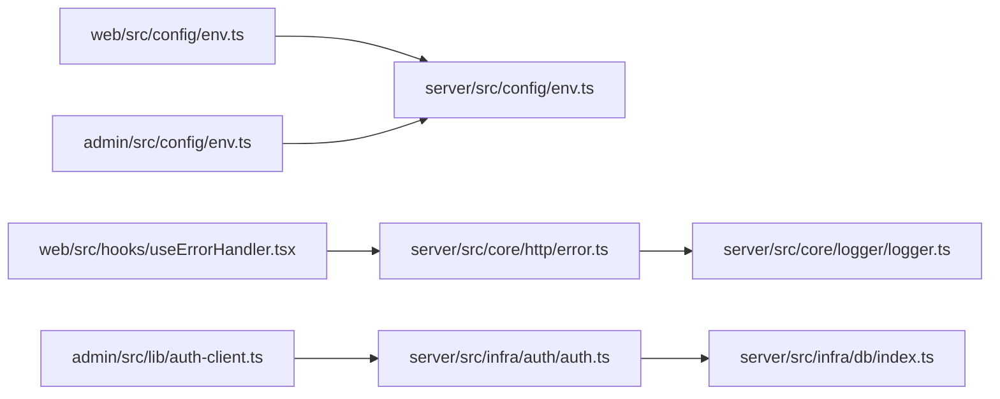

# Troubleshooting

<cite>
**Referenced Files in This Document**
- [server/.env](file://server/.env)
- [admin/.env](file://admin/.env)
- [web/.env.local](file://web/.env.local)
- [ocr/.env](file://ocr/.env)
- [server/src/config/env.ts](file://server/src/config/env.ts)
- [admin/src/config/env.ts](file://admin/src/config/env.ts)
- [web/src/config/env.ts](file://web/src/config/env.ts)
- [server/src/core/logger/logger.ts](file://server/src/core/logger/logger.ts)
- [server/src/core/http/error.ts](file://server/src/core/http/error.ts)
- [server/src/core/middlewares/error/error.middleware.ts](file://server/src/core/middlewares/error/error.middleware.ts)
- [server/src/infra/db/index.ts](file://server/src/infra/db/index.ts)
- [server/src/infra/auth/auth.ts](file://server/src/infra/auth/auth.ts)
- [server/src/modules/auth/auth.controller.ts](file://server/src/modules/auth/auth.controller.ts)
- [web/src/hooks/useErrorHandler.tsx](file://web/src/hooks/useErrorHandler.tsx)
- [admin/src/lib/auth-client.ts](file://admin/src/lib/auth-client.ts)
</cite>

## Table of Contents
1. [Introduction](#introduction)
2. [Project Structure](#project-structure)
3. [Core Components](#core-components)
4. [Architecture Overview](#architecture-overview)
5. [Detailed Component Analysis](#detailed-component-analysis)
6. [Dependency Analysis](#dependency-analysis)
7. [Performance Considerations](#performance-considerations)
8. [Troubleshooting Guide](#troubleshooting-guide)
9. [Conclusion](#conclusion)
10. [Appendices](#appendices)

## Introduction
This document provides a comprehensive troubleshooting guide for common Flick issues across authentication, database connectivity, real-time communication, API endpoint errors, environment configuration, dependency conflicts, and performance bottlenecks. It also outlines logging strategies, error monitoring approaches, and practical diagnostic steps for development and production environments.

## Project Structure
Flick comprises multiple packages:
- Server: Express-based backend with typed environment validation, structured HTTP error handling, logging, database integration via Drizzle, and Better Auth for authentication.
- Web: Next.js frontend that consumes the server API and handles session refresh and error messaging.
- Admin: React admin panel that integrates with Better Auth client.
- OCR: Standalone service for OCR extraction.
- Shared: Shared package used across workspaces.

**Diagram sources**
- [server/src/config/env.ts](file://server/src/config/env.ts#L1-L42)
- [server/src/infra/db/index.ts](file://server/src/infra/db/index.ts#L1-L38)
- [server/src/infra/auth/auth.ts](file://server/src/infra/auth/auth.ts#L1-L85)
- [server/src/core/http/error.ts](file://server/src/core/http/error.ts#L1-L131)
- [server/src/core/middlewares/error/error.middleware.ts](file://server/src/core/middlewares/error/error.middleware.ts#L1-L68)
- [server/src/core/logger/logger.ts](file://server/src/core/logger/logger.ts#L1-L25)
- [web/src/config/env.ts](file://web/src/config/env.ts#L1-L29)
- [web/src/hooks/useErrorHandler.tsx](file://web/src/hooks/useErrorHandler.tsx#L1-L170)
- [admin/src/config/env.ts](file://admin/src/config/env.ts#L1-L5)
- [admin/src/lib/auth-client.ts](file://admin/src/lib/auth-client.ts#L1-L11)
- [ocr/.env](file://ocr/.env#L1-L4)

**Section sources**
- [server/src/config/env.ts](file://server/src/config/env.ts#L1-L42)
- [web/src/config/env.ts](file://web/src/config/env.ts#L1-L29)
- [admin/src/config/env.ts](file://admin/src/config/env.ts#L1-L5)
- [ocr/.env](file://ocr/.env#L1-L4)

## Core Components
- Environment configuration and validation:
  - Server validates and parses environment variables using a strict schema, ensuring required keys and types are present.
  - Web and Admin expose client/server environment variables via typed configuration utilities.
- Logging:
  - Winston-based logger with dynamic level and colored output in development.
- Error handling:
  - Centralized HttpError class with standardized serialization and factory methods.
  - Express error middleware normalizes Zod and HttpError instances and logs appropriately.
- Authentication:
  - Better Auth configured with Drizzle adapter, email/password, Google OAuth, session caching, and admin plugin.
- Database:
  - Drizzle ORM connected to PostgreSQL with a comprehensive schema mapping.
- Frontend error handling:
  - React hook orchestrates token refresh on 401 and surfaces user-friendly messages.

**Section sources**
- [server/src/config/env.ts](file://server/src/config/env.ts#L1-L42)
- [server/src/core/logger/logger.ts](file://server/src/core/logger/logger.ts#L1-L25)
- [server/src/core/http/error.ts](file://server/src/core/http/error.ts#L1-L131)
- [server/src/core/middlewares/error/error.middleware.ts](file://server/src/core/middlewares/error/error.middleware.ts#L1-L68)
- [server/src/infra/auth/auth.ts](file://server/src/infra/auth/auth.ts#L1-L85)
- [server/src/infra/db/index.ts](file://server/src/infra/db/index.ts#L1-L38)
- [web/src/hooks/useErrorHandler.tsx](file://web/src/hooks/useErrorHandler.tsx#L1-L170)

## Architecture Overview
The system follows a layered architecture:
- Presentation: Web and Admin apps consume the server API and Better Auth client.
- Application: Controllers and services encapsulate business logic.
- Infrastructure: Database adapter, cache, and mail integrations.
- Cross-cutting concerns: Logging, error handling, and environment validation.

**Diagram sources**
- [admin/src/lib/auth-client.ts](file://admin/src/lib/auth-client.ts#L1-L11)
- [server/src/infra/auth/auth.ts](file://server/src/infra/auth/auth.ts#L1-L85)
- [server/src/infra/db/index.ts](file://server/src/infra/db/index.ts#L1-L38)

## Detailed Component Analysis

### Authentication Troubleshooting
Common symptoms:
- Login fails with 401/403.
- OAuth callback redirects to an unexpected origin.
- Session refresh returns 401.

Diagnostic steps:
- Verify Better Auth base URL and trusted origins match frontend base URLs.
- Confirm OAuth client credentials and redirect URIs.
- Ensure cookie domain and secure flags align with environment (development vs production).
- Check refresh token availability and TTL settings.

**Diagram sources**
- [admin/src/lib/auth-client.ts](file://admin/src/lib/auth-client.ts#L1-L11)
- [server/src/infra/auth/auth.ts](file://server/src/infra/auth/auth.ts#L1-L85)
- [server/src/modules/auth/auth.controller.ts](file://server/src/modules/auth/auth.controller.ts#L1-L228)
- [server/src/infra/db/index.ts](file://server/src/infra/db/index.ts#L1-L38)

**Section sources**
- [server/src/infra/auth/auth.ts](file://server/src/infra/auth/auth.ts#L1-L85)
- [admin/src/lib/auth-client.ts](file://admin/src/lib/auth-client.ts#L1-L11)
- [server/src/modules/auth/auth.controller.ts](file://server/src/modules/auth/auth.controller.ts#L1-L228)

### Database Connectivity Troubleshooting
Symptoms:
- Application fails to start with connection errors.
- Queries timeout or fail intermittently.

Diagnostic steps:
- Validate DATABASE_URL format and credentials.
- Confirm PostgreSQL is reachable from the host/port.
- Check schema mapping and migrations applied.
- Review connection pool limits and timeouts.

**Diagram sources**
- [server/src/infra/db/index.ts](file://server/src/infra/db/index.ts#L1-L38)
- [server/src/config/env.ts](file://server/src/config/env.ts#L1-L42)

**Section sources**
- [server/src/infra/db/index.ts](file://server/src/infra/db/index.ts#L1-L38)
- [server/src/config/env.ts](file://server/src/config/env.ts#L1-L42)

### Real-Time Communication Failures
Symptoms:
- Socket connections drop or do not establish.
- Notifications not received.

Diagnostic steps:
- Verify WebSocket/SSE endpoints and CORS configuration.
- Confirm Redis availability if used for pub/sub or session caching.
- Check client-side socket initialization and reconnection logic.

Note: The repository does not include a dedicated socket service file. Ensure the client initializes sockets against the correct base URI and that the server exposes the intended endpoints.

**Section sources**
- [web/src/config/env.ts](file://web/src/config/env.ts#L1-L29)
- [admin/src/config/env.ts](file://admin/src/config/env.ts#L1-L5)
- [server/.env](file://server/.env#L1-L49)

### API Endpoint Errors
Symptoms:
- Unexpected 4xx/5xx responses.
- Zod validation errors.
- Unhandled exceptions.

Diagnostic steps:
- Inspect standardized HttpError responses and error middleware behavior.
- Review request logging and stack traces in development mode.
- Validate client endpoints against server routes.

**Diagram sources**
- [server/src/core/http/error.ts](file://server/src/core/http/error.ts#L1-L131)
- [server/src/core/middlewares/error/error.middleware.ts](file://server/src/core/middlewares/error/error.middleware.ts#L1-L68)
- [server/src/modules/auth/auth.controller.ts](file://server/src/modules/auth/auth.controller.ts#L1-L228)

**Section sources**
- [server/src/core/http/error.ts](file://server/src/core/http/error.ts#L1-L131)
- [server/src/core/middlewares/error/error.middleware.ts](file://server/src/core/middlewares/error/error.middleware.ts#L1-L68)
- [server/src/modules/auth/auth.controller.ts](file://server/src/modules/auth/auth.controller.ts#L1-L228)

### Environment Configuration Problems
Symptoms:
- Runtime errors due to missing or invalid environment variables.
- Mismatched base URIs causing CORS or OAuth issues.

Diagnostic steps:
- Compare environment files across packages:
  - Server: PORT, HOST, NODE_ENV, DATABASE_URL, REDIS_URL, ACCESS_CONTROL_ORIGINS, BETTER_AUTH_URL, GOOGLE_OAUTH_*.
  - Web/Admin: NEXT_PUBLIC_* and VITE_* base URIs.
  - OCR: PORT and ACCESS_CONTROL_ORIGIN.
- Validate typed environment parsing in each package.

**Section sources**
- [server/.env](file://server/.env#L1-L49)
- [admin/.env](file://admin/.env#L1-L3)
- [web/.env.local](file://web/.env.local#L1-L8)
- [ocr/.env](file://ocr/.env#L1-L4)
- [server/src/config/env.ts](file://server/src/config/env.ts#L1-L42)
- [web/src/config/env.ts](file://web/src/config/env.ts#L1-L29)
- [admin/src/config/env.ts](file://admin/src/config/env.ts#L1-L5)

### Dependency Conflicts
Symptoms:
- Build failures or runtime module resolution errors.
- Version mismatches across workspaces.

Diagnostic steps:
- Ensure consistent Node.js and package manager versions across environments.
- Verify workspace configuration and lockfile integrity.
- Reinstall dependencies and rebuild affected packages.

[No sources needed since this section provides general guidance]

### Performance Bottlenecks
Symptoms:
- Slow API responses, high memory usage, or frequent timeouts.

Diagnostic steps:
- Profile API endpoints and identify slow queries.
- Monitor database query plans and indexes.
- Tune cache TTL and driver settings.
- Review frontend network requests and unnecessary re-renders.

**Section sources**
- [server/src/config/env.ts](file://server/src/config/env.ts#L1-L42)

## Dependency Analysis
Key cross-package dependencies:
- Web/Admin depend on server base URIs and Better Auth client.
- Server depends on environment variables for DB, cache, auth, and mail.
- Error handling and logging are centralized and consumed by controllers and middleware.

**Diagram sources**
- [web/src/config/env.ts](file://web/src/config/env.ts#L1-L29)
- [admin/src/config/env.ts](file://admin/src/config/env.ts#L1-L5)
- [server/src/config/env.ts](file://server/src/config/env.ts#L1-L42)
- [web/src/hooks/useErrorHandler.tsx](file://web/src/hooks/useErrorHandler.tsx#L1-L170)
- [admin/src/lib/auth-client.ts](file://admin/src/lib/auth-client.ts#L1-L11)
- [server/src/infra/auth/auth.ts](file://server/src/infra/auth/auth.ts#L1-L85)
- [server/src/infra/db/index.ts](file://server/src/infra/db/index.ts#L1-L38)
- [server/src/core/http/error.ts](file://server/src/core/http/error.ts#L1-L131)
- [server/src/core/logger/logger.ts](file://server/src/core/logger/logger.ts#L1-L25)

**Section sources**
- [web/src/config/env.ts](file://web/src/config/env.ts#L1-L29)
- [admin/src/config/env.ts](file://admin/src/config/env.ts#L1-L5)
- [server/src/config/env.ts](file://server/src/config/env.ts#L1-L42)
- [web/src/hooks/useErrorHandler.tsx](file://web/src/hooks/useErrorHandler.tsx#L1-L170)
- [admin/src/lib/auth-client.ts](file://admin/src/lib/auth-client.ts#L1-L11)
- [server/src/infra/auth/auth.ts](file://server/src/infra/auth/auth.ts#L1-L85)
- [server/src/infra/db/index.ts](file://server/src/infra/db/index.ts#L1-L38)
- [server/src/core/http/error.ts](file://server/src/core/http/error.ts#L1-L131)
- [server/src/core/logger/logger.ts](file://server/src/core/logger/logger.ts#L1-L25)

## Performance Considerations
- Database:
  - Use appropriate indexes for frequent filters and joins.
  - Batch writes and optimize transaction boundaries.
- Caching:
  - Tune CACHE_TTL and driver selection for hot paths.
  - Invalidate caches on write operations.
- Network:
  - Minimize payload sizes and enable compression.
  - Debounce or throttle frequent client requests.
- Logging:
  - Avoid excessive debug logs in production; rely on structured logs and sampling.

[No sources needed since this section provides general guidance]

## Troubleshooting Guide

### Authentication Problems
- Symptom: OAuth callback fails or redirects to wrong origin.
  - Action: Ensure ACCESS_CONTROL_ORIGINS includes frontend origins and BETTER_AUTH_URL matches server base URI.
- Symptom: Session refresh returns 401.
  - Action: Verify refresh token presence and validity; check cookie attributes and SameSite/Secure flags.

**Section sources**
- [server/src/infra/auth/auth.ts](file://server/src/infra/auth/auth.ts#L1-L85)
- [server/src/modules/auth/auth.controller.ts](file://server/src/modules/auth/auth.controller.ts#L1-L228)
- [web/src/hooks/useErrorHandler.tsx](file://web/src/hooks/useErrorHandler.tsx#L1-L170)

### Database Connectivity Issues
- Symptom: Startup/connection errors.
  - Action: Validate DATABASE_URL, network reachability, and PostgreSQL credentials.
- Symptom: Intermittent query failures.
  - Action: Review schema mapping and migrations; monitor connection pool saturation.

**Section sources**
- [server/src/infra/db/index.ts](file://server/src/infra/db/index.ts#L1-L38)
- [server/src/config/env.ts](file://server/src/config/env.ts#L1-L42)

### Real-Time Communication Failures
- Symptom: Socket disconnects or no notifications.
  - Action: Confirm client base URI and server endpoints; verify Redis availability if used.

**Section sources**
- [web/src/config/env.ts](file://web/src/config/env.ts#L1-L29)
- [admin/src/config/env.ts](file://admin/src/config/env.ts#L1-L5)
- [server/.env](file://server/.env#L1-L49)

### API Endpoint Errors
- Symptom: Validation errors or 500s.
  - Action: Inspect standardized error responses; review request logging and stack traces in development.

**Section sources**
- [server/src/core/http/error.ts](file://server/src/core/http/error.ts#L1-L131)
- [server/src/core/middlewares/error/error.middleware.ts](file://server/src/core/middlewares/error/error.middleware.ts#L1-L68)

### Environment Configuration Problems
- Symptom: CORS errors or OAuth mismatch.
  - Action: Align base URIs across server, Web, and Admin; confirm environment variable presence and types.

**Section sources**
- [server/.env](file://server/.env#L1-L49)
- [admin/.env](file://admin/.env#L1-L3)
- [web/.env.local](file://web/.env.local#L1-L8)
- [ocr/.env](file://ocr/.env#L1-L4)
- [server/src/config/env.ts](file://server/src/config/env.ts#L1-L42)
- [web/src/config/env.ts](file://web/src/config/env.ts#L1-L29)
- [admin/src/config/env.ts](file://admin/src/config/env.ts#L1-L5)

### Dependency Conflicts
- Symptom: Build/runtime errors across packages.
  - Action: Reinstall dependencies; reconcile workspace and lockfile; ensure consistent Node.js version.

[No sources needed since this section provides general guidance]

### Performance Bottlenecks
- Symptom: Slow responses or timeouts.
  - Action: Profile endpoints, optimize queries, tune cache settings, and reduce payload sizes.

**Section sources**
- [server/src/config/env.ts](file://server/src/config/env.ts#L1-L42)

### Logging Strategies and Error Monitoring
- Use Winston logger with development/production levels and colored output for local debugging.
- Standardize error responses via HttpError and error middleware to simplify monitoring and alerting.
- Capture stack traces in development and include metadata for operational insights.

**Section sources**
- [server/src/core/logger/logger.ts](file://server/src/core/logger/logger.ts#L1-L25)
- [server/src/core/http/error.ts](file://server/src/core/http/error.ts#L1-L131)
- [server/src/core/middlewares/error/error.middleware.ts](file://server/src/core/middlewares/error/error.middleware.ts#L1-L68)

### Development Environment Setup
- Start services in order: database, Redis (if used), server, Web, Admin, OCR.
- Set NODE_ENV=development and ensure ports are free.
- Confirm environment variables are loaded and validated.

**Section sources**
- [server/.env](file://server/.env#L1-L49)
- [web/.env.local](file://web/.env.local#L1-L8)
- [admin/.env](file://admin/.env#L1-L3)
- [ocr/.env](file://ocr/.env#L1-L4)
- [server/src/config/env.ts](file://server/src/config/env.ts#L1-L42)

### Production Deployment Issues
- Ensure NODE_ENV=production and HTTPS is enabled.
- Configure secure cookie attributes (SameSite=None, Secure=true) and matching trusted origins.
- Validate secrets and credentials are not exposed in client bundles.

**Section sources**
- [server/src/infra/auth/auth.ts](file://server/src/infra/auth/auth.ts#L1-L85)
- [server/src/config/env.ts](file://server/src/config/env.ts#L1-L42)

### Integration Problems
- Verify base URIs for server, Web, Admin, and OCR are consistent.
- Test Better Auth client endpoints and ensure proper cookie handling across subdomains.

**Section sources**
- [admin/src/lib/auth-client.ts](file://admin/src/lib/auth-client.ts#L1-L11)
- [web/src/config/env.ts](file://web/src/config/env.ts#L1-L29)
- [admin/src/config/env.ts](file://admin/src/config/env.ts#L1-L5)
- [ocr/.env](file://ocr/.env#L1-L4)

## Conclusion
By validating environment configuration, leveraging centralized error handling and logging, and following the diagnostic steps outlined above, most Flick issues can be quickly identified and resolved. Use the provided sequences and diagrams as a blueprint for isolating problems across authentication, database, real-time communication, and API layers.

## Appendices
- Common error patterns:
  - 401 Unauthorized during refresh: indicates invalid or expired refresh token; trigger sign-in flow.
  - 403 Forbidden: RBAC or session validation failure; inspect user permissions and session state.
  - 429 Too Many Requests: rate limiter triggered; adjust limits or retry after delay.
  - 500 Internal Server Error: unhandled exception; check server logs and stack traces.

**Section sources**
- [server/src/core/http/error.ts](file://server/src/core/http/error.ts#L1-L131)
- [server/src/core/middlewares/error/error.middleware.ts](file://server/src/core/middlewares/error/error.middleware.ts#L1-L68)
- [web/src/hooks/useErrorHandler.tsx](file://web/src/hooks/useErrorHandler.tsx#L1-L170)