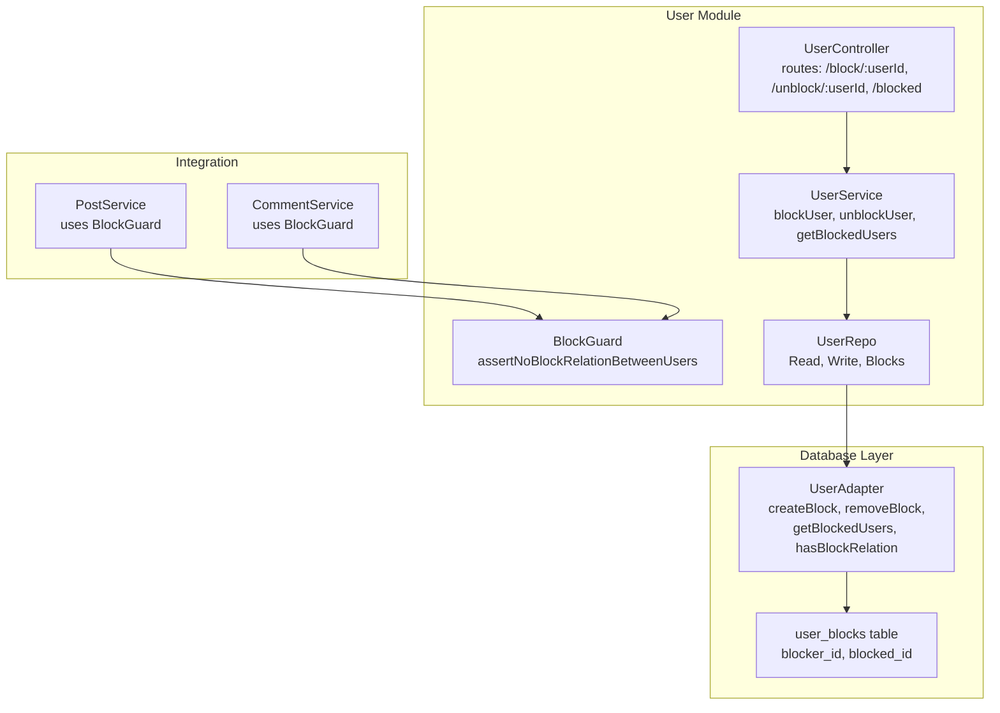
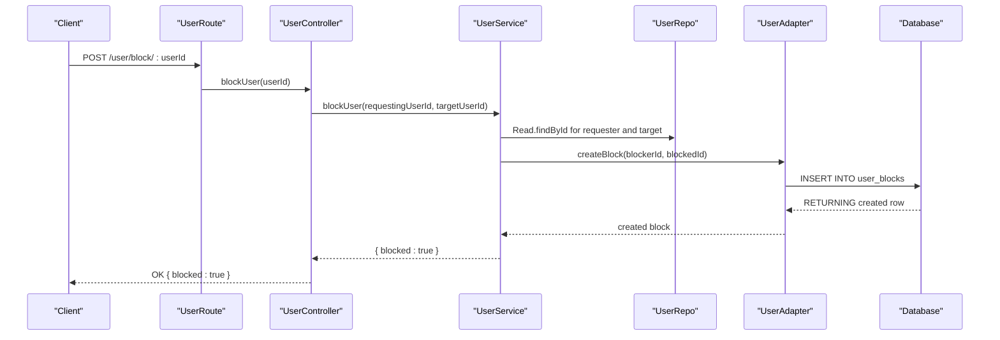
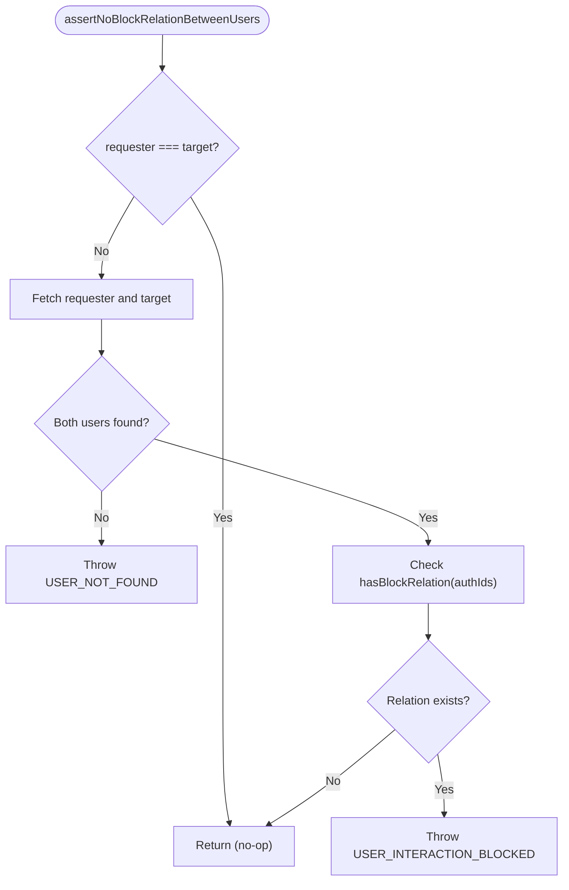
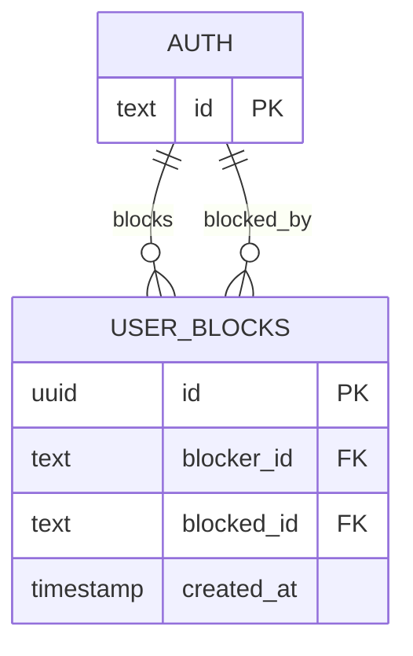
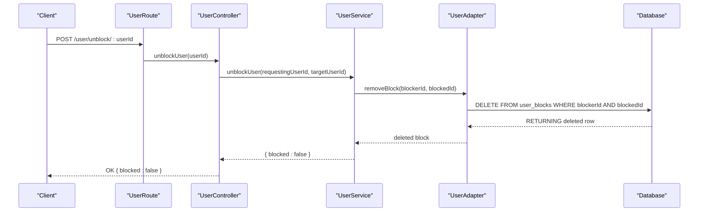
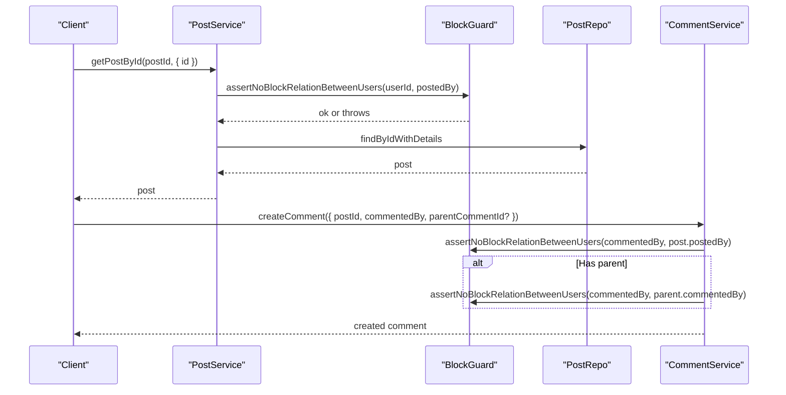
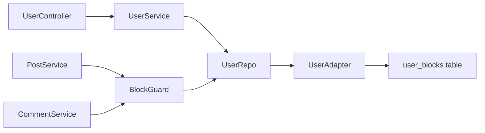

# Blocking System

<cite>
**Referenced Files in This Document**
- [block.guard.ts](file://server/src/modules/user/block.guard.ts)
- [user.service.ts](file://server/src/modules/user/user.service.ts)
- [user.controller.ts](file://server/src/modules/user/user.controller.ts)
- [user.route.ts](file://server/src/modules/user/user.route.ts)
- [user.schema.ts](file://server/src/modules/user/user.schema.ts)
- [user.repo.ts](file://server/src/modules/user/user.repo.ts)
- [user.adapter.ts](file://server/src/infra/db/adapters/user.adapter.ts)
- [user-block.table.ts](file://server/src/infra/db/tables/user-block.table.ts)
- [post.service.ts](file://server/src/modules/post/post.service.ts)
- [comment.service.ts](file://server/src/modules/comment/comment.service.ts)
- [0000_snapshot.json](file://server/drizzle/meta/0000_snapshot.json)
- [0001_snapshot.json](file://server/drizzle/meta/0001_snapshot.json)
- [0002_snapshot.json](file://server/drizzle/meta/0002_snapshot.json)
- [0003_snapshot.json](file://server/drizzle/meta/0003_snapshot.json)
- [0005_snapshot.json](file://server/drizzle/meta/0005_snapshot.json)
- [user-moderation.service.ts](file://server/src/modules/moderation/user/user-moderation.service.ts)
</cite>

## Table of Contents
1. [Introduction](#introduction)
2. [Project Structure](#project-structure)
3. [Core Components](#core-components)
4. [Architecture Overview](#architecture-overview)
5. [Detailed Component Analysis](#detailed-component-analysis)
6. [Dependency Analysis](#dependency-analysis)
7. [Performance Considerations](#performance-considerations)
8. [Troubleshooting Guide](#troubleshooting-guide)
9. [Conclusion](#conclusion)

## Introduction
This document explains the user blocking and unblocking system in the platform. It covers the block guard implementation, user blocking relationships, privacy enforcement mechanisms, block/unblock API endpoints, database schema for user blocks, real-time blocking updates, workflow, user experience implications, and integration with posts and comments. It also includes examples of blocking scenarios, permission checks, and blocking state management.

## Project Structure
The blocking system spans the user module (controller, service, guard, repo), database adapters and tables, and integrations with posts and comments services. The routing layer exposes endpoints for blocking, unblocking, and listing blocked users.

**Diagram sources**
- [user.controller.ts](file://server/src/modules/user/user.controller.ts#L53-L68)
- [user.service.ts](file://server/src/modules/user/user.service.ts#L91-L133)
- [block.guard.ts](file://server/src/modules/user/block.guard.ts#L5-L40)
- [user.repo.ts](file://server/src/modules/user/user.repo.ts#L6-L67)
- [user.adapter.ts](file://server/src/infra/db/adapters/user.adapter.ts#L426-L509)
- [user-block.table.ts](file://server/src/infra/db/tables/user-block.table.ts#L11-L26)
- [post.service.ts](file://server/src/modules/post/post.service.ts#L12-L136)
- [comment.service.ts](file://server/src/modules/comment/comment.service.ts#L12-L203)

**Section sources**
- [user.controller.ts](file://server/src/modules/user/user.controller.ts#L1-L72)
- [user.route.ts](file://server/src/modules/user/user.route.ts#L1-L32)
- [user.service.ts](file://server/src/modules/user/user.service.ts#L1-L137)
- [block.guard.ts](file://server/src/modules/user/block.guard.ts#L1-L41)
- [user.repo.ts](file://server/src/modules/user/user.repo.ts#L1-L67)
- [user.adapter.ts](file://server/src/infra/db/adapters/user.adapter.ts#L426-L509)
- [user-block.table.ts](file://server/src/infra/db/tables/user-block.table.ts#L1-L39)
- [post.service.ts](file://server/src/modules/post/post.service.ts#L12-L143)
- [comment.service.ts](file://server/src/modules/comment/comment.service.ts#L12-L67)

## Core Components
- Block Guard: Enforces privacy by preventing interactions between blocked users.
- User Controller: Exposes endpoints for blocking, unblocking, and listing blocked users.
- User Service: Implements business logic for block/unblock operations and retrieving blocked users.
- User Repo and Adapter: Provide read/write access to user data and block relationships.
- Database Schema: Defines the user_blocks table with foreign keys and uniqueness constraints.
- Integrations: PostService and CommentService use the block guard to enforce privacy during reads and writes.

**Section sources**
- [block.guard.ts](file://server/src/modules/user/block.guard.ts#L5-L40)
- [user.controller.ts](file://server/src/modules/user/user.controller.ts#L53-L68)
- [user.service.ts](file://server/src/modules/user/user.service.ts#L91-L133)
- [user.repo.ts](file://server/src/modules/user/user.repo.ts#L6-L67)
- [user.adapter.ts](file://server/src/infra/db/adapters/user.adapter.ts#L426-L509)
- [user-block.table.ts](file://server/src/infra/db/tables/user-block.table.ts#L11-L26)
- [post.service.ts](file://server/src/modules/post/post.service.ts#L129-L136)
- [comment.service.ts](file://server/src/modules/comment/comment.service.ts#L95-L99)

## Architecture Overview
The blocking system follows a layered architecture:
- Presentation: Routes define endpoints for blocking operations.
- Application: Controllers delegate to services.
- Domain: Services encapsulate business rules and call repository adapters.
- Persistence: Adapters interact with the database via Drizzle ORM.
- Integration: Post and comment services enforce block relationships during content operations.

**Diagram sources**
- [user.route.ts](file://server/src/modules/user/user.route.ts#L27-L29)
- [user.controller.ts](file://server/src/modules/user/user.controller.ts#L53-L57)
- [user.service.ts](file://server/src/modules/user/user.service.ts#L91-L109)
- [user.adapter.ts](file://server/src/infra/db/adapters/user.adapter.ts#L426-L441)

## Detailed Component Analysis

### Block Guard Implementation
The block guard enforces privacy by asserting that two users are not mutually blocking before allowing interactions. It performs:
- Self-check bypass (user cannot block themselves).
- Parallel lookup of requester and target users.
- Block relation check using the adapter’s hasBlockRelation.
- Throws appropriate errors when users are blocked or not found.

**Diagram sources**
- [block.guard.ts](file://server/src/modules/user/block.guard.ts#L5-L40)
- [user.adapter.ts](file://server/src/infra/db/adapters/user.adapter.ts#L483-L509)

**Section sources**
- [block.guard.ts](file://server/src/modules/user/block.guard.ts#L5-L40)
- [user.adapter.ts](file://server/src/infra/db/adapters/user.adapter.ts#L483-L509)

### User Blocking Relationships
The system stores blocking relationships in a dedicated table with:
- Unique constraint on (blocker_id, blocked_id) to prevent duplicates.
- Foreign keys referencing the auth table with cascade deletion.
- Convenience methods to fetch blocked users and check bidirectional relations.

**Diagram sources**
- [user-block.table.ts](file://server/src/infra/db/tables/user-block.table.ts#L11-L26)
- [0000_snapshot.json](file://server/drizzle/meta/0000_snapshot.json#L1492-L1522)
- [0001_snapshot.json](file://server/drizzle/meta/0001_snapshot.json#L1499-L1529)
- [0002_snapshot.json](file://server/drizzle/meta/0002_snapshot.json#L1576-L1606)
- [0003_snapshot.json](file://server/drizzle/meta/0003_snapshot.json#L1694-L1724)
- [0005_snapshot.json](file://server/drizzle/meta/0005_snapshot.json#L1872-L1897)

**Section sources**
- [user-block.table.ts](file://server/src/infra/db/tables/user-block.table.ts#L11-L26)
- [user.adapter.ts](file://server/src/infra/db/adapters/user.adapter.ts#L461-L509)
- [0000_snapshot.json](file://server/drizzle/meta/0000_snapshot.json#L1492-L1522)
- [0001_snapshot.json](file://server/drizzle/meta/0001_snapshot.json#L1499-L1529)
- [0005_snapshot.json](file://server/drizzle/meta/0005_snapshot.json#L1872-L1897)

### Privacy Enforcement Mechanisms
Privacy enforcement occurs at multiple layers:
- Block Guard prevents interactions between blocked users in posts and comments.
- PostService and CommentService invoke the block guard when fetching content or creating comments.
- Uniqueness in user_blocks ensures idempotent block operations.

**Section sources**
- [post.service.ts](file://server/src/modules/post/post.service.ts#L129-L136)
- [comment.service.ts](file://server/src/modules/comment/comment.service.ts#L95-L99)
- [user.adapter.ts](file://server/src/infra/db/adapters/user.adapter.ts#L426-L441)

### Block/Unblock API Endpoints
Endpoints exposed by the user route:
- POST /user/block/:userId — blocks the specified user
- POST /user/unblock/:userId — unblocks the specified user
- GET /user/blocked — lists users blocked by the current user

Middleware applied:
- Rate limiting
- Authentication
- User injection and onboarding requirement

Validation:
- userIdSchema validates presence of userId parameter.

**Section sources**
- [user.route.ts](file://server/src/modules/user/user.route.ts#L12-L29)
- [user.schema.ts](file://server/src/modules/user/user.schema.ts#L14-L16)
- [user.controller.ts](file://server/src/modules/user/user.controller.ts#L53-L68)

### Database Schema for User Blocks
The user_blocks table defines:
- Primary key id
- Non-null blocker_id and blocked_id
- Timestamp created_at with default now()
- Unique index on (blocker_id, blocked_id)
- Foreign keys referencing auth.id with cascade delete

Migrations show evolution of the schema and foreign key constraints.

**Section sources**
- [user-block.table.ts](file://server/src/infra/db/tables/user-block.table.ts#L11-L26)
- [0000_snapshot.json](file://server/drizzle/meta/0000_snapshot.json#L1492-L1522)
- [0001_snapshot.json](file://server/drizzle/meta/0001_snapshot.json#L1499-L1529)
- [0002_snapshot.json](file://server/drizzle/meta/0002_snapshot.json#L1576-L1606)
- [0003_snapshot.json](file://server/drizzle/meta/0003_snapshot.json#L1694-L1724)
- [0005_snapshot.json](file://server/drizzle/meta/0005_snapshot.json#L1872-L1897)

### Real-Time Blocking Updates
Real-time updates are not implemented in the blocking subsystem. Blocking state changes are reflected immediately upon subsequent requests after successful block/unblock operations. No WebSocket events or cache invalidation patterns are present for blocking in the analyzed code.

[No sources needed since this section provides general guidance]

### Blocking Workflow
End-to-end workflow for blocking:
1. Client sends POST /user/block/:userId.
2. Route applies middleware and authenticates the request.
3. Controller delegates to UserService.
4. Service validates self-blocking, looks up users, and persists the block via UserAdapter.
5. Adapter inserts into user_blocks with conflict handling.
6. Controller returns success with { blocked: true }.

Unblocking mirrors this with removal logic.

**Diagram sources**
- [user.route.ts](file://server/src/modules/user/user.route.ts#L27-L29)
- [user.controller.ts](file://server/src/modules/user/user.controller.ts#L59-L62)
- [user.service.ts](file://server/src/modules/user/user.service.ts#L111-L125)
- [user.adapter.ts](file://server/src/infra/db/adapters/user.adapter.ts#L443-L459)

**Section sources**
- [user.controller.ts](file://server/src/modules/user/user.controller.ts#L53-L68)
- [user.service.ts](file://server/src/modules/user/user.service.ts#L91-L133)
- [user.adapter.ts](file://server/src/infra/db/adapters/user.adapter.ts#L426-L459)

### User Experience Implications
- Blocking prevents the blocked user from initiating interactions (e.g., commenting on posts authored by the blocker).
- Blocked users are not visible in search results or lists that rely on the blocking guard.
- Unblocking restores normal interaction capabilities.

**Section sources**
- [block.guard.ts](file://server/src/modules/user/block.guard.ts#L31-L39)
- [comment.service.ts](file://server/src/modules/comment/comment.service.ts#L95-L99)
- [post.service.ts](file://server/src/modules/post/post.service.ts#L129-L136)

### Integration with Posts and Comments
- PostService: Invokes assertNoBlockRelationBetweenUsers when fetching a post by ID to ensure the requester cannot view content from a blocked author.
- CommentService: 
  - Enforces block guard when fetching comments by post ID and when creating comments (including replies).
  - Validates parent comment relationships while respecting block constraints.

**Diagram sources**
- [post.service.ts](file://server/src/modules/post/post.service.ts#L96-L143)
- [block.guard.ts](file://server/src/modules/user/block.guard.ts#L5-L40)
- [comment.service.ts](file://server/src/modules/comment/comment.service.ts#L69-L203)

**Section sources**
- [post.service.ts](file://server/src/modules/post/post.service.ts#L96-L143)
- [comment.service.ts](file://server/src/modules/comment/comment.service.ts#L69-L203)

### Examples of Blocking Scenarios
- Scenario 1: Alice blocks Bob
  - Alice cannot view Bob’s posts or comments.
  - Creating comments on posts authored by Bob fails if the block guard triggers.
- Scenario 2: Carol replies to a comment by Dave
  - If Carol is blocked by Dave, the reply creation is denied.
  - If Carol is blocked by the original post author, the reply creation is denied.
- Scenario 3: Eve attempts to block herself
  - The service rejects self-blocking with a bad request error.

**Section sources**
- [user.service.ts](file://server/src/modules/user/user.service.ts#L92-L94)
- [comment.service.ts](file://server/src/modules/comment/comment.service.ts#L95-L133)
- [post.service.ts](file://server/src/modules/post/post.service.ts#L129-L136)

### Permission Checks and Blocking State Management
- Permission checks:
  - Self-block prevention in UserService.
  - Not-found errors when users are missing.
  - Forbidden errors when a block relationship exists.
- Blocking state management:
  - Idempotent block creation via conflict handling.
  - Explicit removal of block records.
  - Bidirectional relation detection for privacy enforcement.

**Section sources**
- [user.service.ts](file://server/src/modules/user/user.service.ts#L91-L125)
- [user.adapter.ts](file://server/src/infra/db/adapters/user.adapter.ts#L426-L459)
- [user.adapter.ts](file://server/src/infra/db/adapters/user.adapter.ts#L483-L509)

### Moderation Integration
The moderation subsystem includes user blocking/unblocking operations separate from the user blocking system described here. These are administrative actions that operate on user accounts directly.

**Section sources**
- [user-moderation.service.ts](file://server/src/modules/moderation/user/user-moderation.service.ts#L7-L41)

## Dependency Analysis
The blocking system exhibits low coupling and high cohesion:
- Controllers depend on Services.
- Services depend on Repositories and Adapters.
- Adapters depend on the database schema and ORM.
- Post and Comment services depend on the BlockGuard for privacy enforcement.

**Diagram sources**
- [user.controller.ts](file://server/src/modules/user/user.controller.ts#L1-L72)
- [user.service.ts](file://server/src/modules/user/user.service.ts#L1-L137)
- [user.repo.ts](file://server/src/modules/user/user.repo.ts#L1-L67)
- [user.adapter.ts](file://server/src/infra/db/adapters/user.adapter.ts#L426-L509)
- [user-block.table.ts](file://server/src/infra/db/tables/user-block.table.ts#L11-L26)
- [post.service.ts](file://server/src/modules/post/post.service.ts#L12-L136)
- [comment.service.ts](file://server/src/modules/comment/comment.service.ts#L12-L203)
- [block.guard.ts](file://server/src/modules/user/block.guard.ts#L5-L40)

**Section sources**
- [user.controller.ts](file://server/src/modules/user/user.controller.ts#L1-L72)
- [user.service.ts](file://server/src/modules/user/user.service.ts#L1-L137)
- [user.repo.ts](file://server/src/modules/user/user.repo.ts#L1-L67)
- [user.adapter.ts](file://server/src/infra/db/adapters/user.adapter.ts#L426-L509)
- [user-block.table.ts](file://server/src/infra/db/tables/user-block.table.ts#L11-L26)
- [post.service.ts](file://server/src/modules/post/post.service.ts#L12-L136)
- [comment.service.ts](file://server/src/modules/comment/comment.service.ts#L12-L203)
- [block.guard.ts](file://server/src/modules/user/block.guard.ts#L5-L40)

## Performance Considerations
- Database-level uniqueness on (blocker_id, blocked_id) prevents duplicate entries and supports efficient lookups.
- hasBlockRelation uses OR conditions with AND subqueries; ensure appropriate indexing for authId columns.
- Caching layers in UserRepo and adapters reduce repeated lookups for user data.
- Parallel fetching of requester and target users minimizes latency in the block guard.

[No sources needed since this section provides general guidance]

## Troubleshooting Guide
Common issues and resolutions:
- User not found: Occurs when requester or target does not exist; verify user IDs and authentication state.
- Self-block attempted: The service explicitly rejects self-blocking; ensure clients prevent this scenario.
- Interaction blocked: When a forbidden error is returned, confirm that the block relationship exists and needs to be removed.
- Duplicate block operation: Block creation is idempotent; no error is thrown on duplicate attempts.

**Section sources**
- [user.service.ts](file://server/src/modules/user/user.service.ts#L92-L100)
- [user.adapter.ts](file://server/src/infra/db/adapters/user.adapter.ts#L426-L441)
- [block.guard.ts](file://server/src/modules/user/block.guard.ts#L18-L39)

## Conclusion
The blocking system provides robust privacy enforcement through a dedicated guard, a normalized database schema, and integration with posts and comments services. It prevents interactions between blocked users, supports idempotent block operations, and maintains clear separation of concerns across layers. Administrators can manage user account states separately via the moderation subsystem.