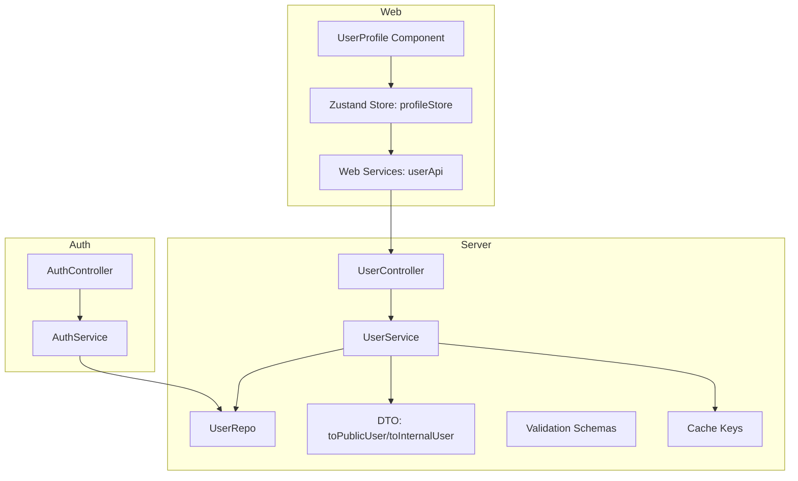
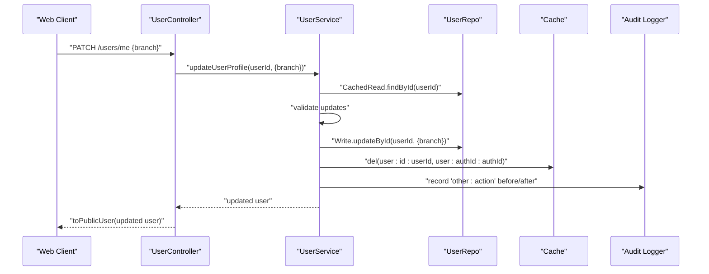
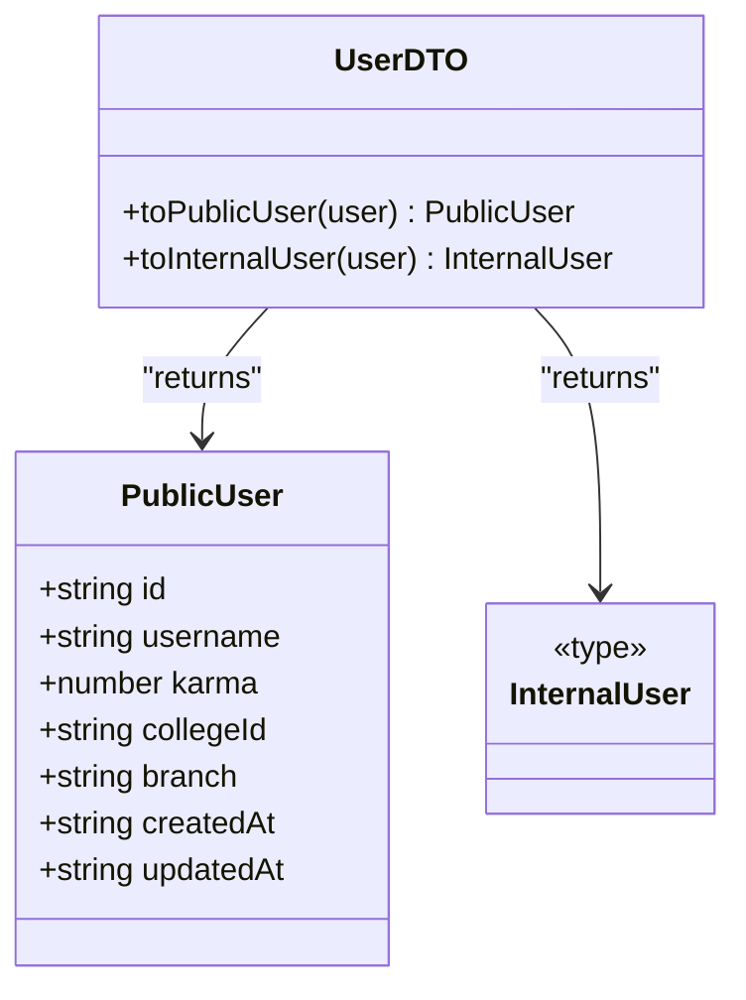
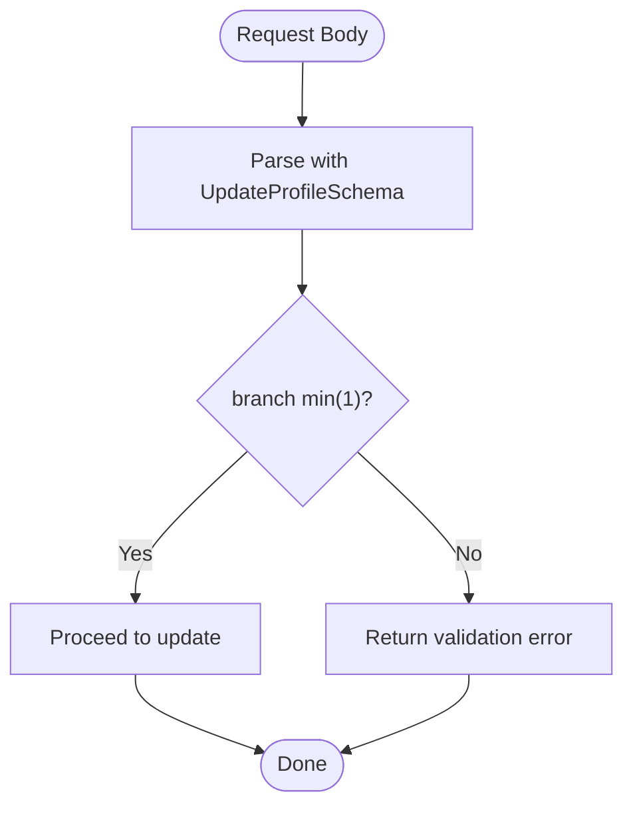
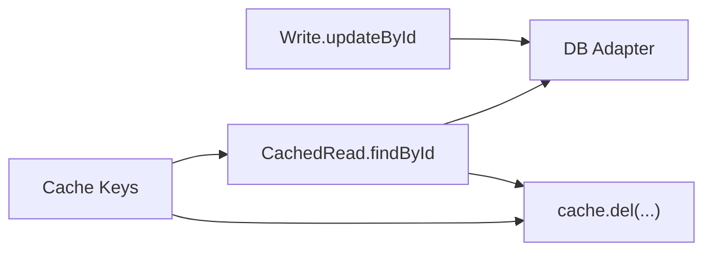
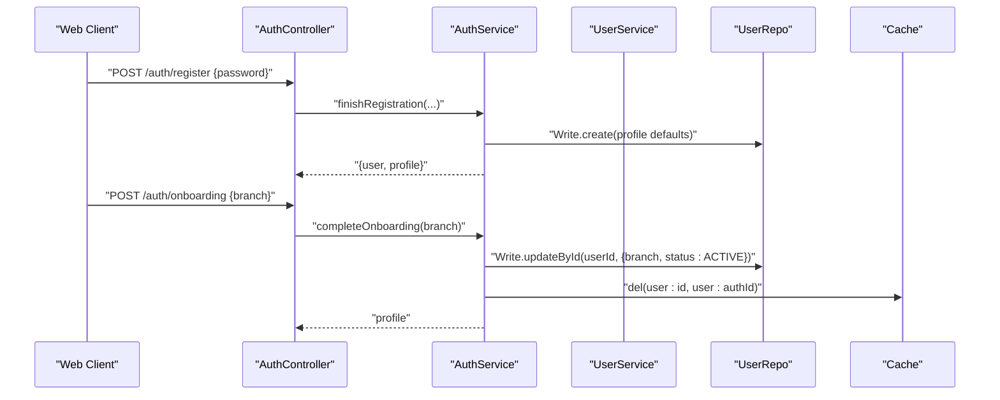
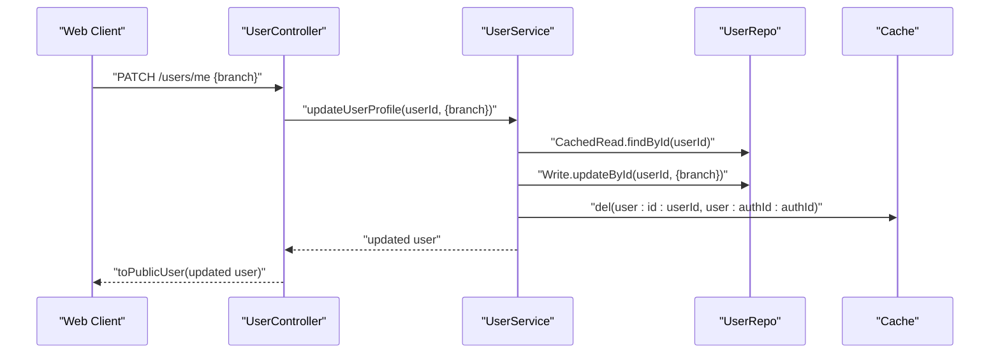
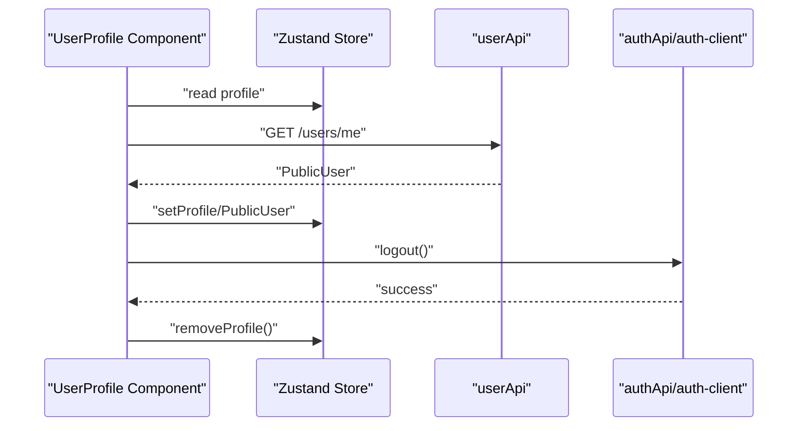
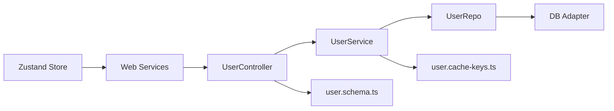

# Profile Management

<cite>
**Referenced Files in This Document**
- [user.dto.ts](file://server/src/modules/user/user.dto.ts)
- [user.schema.ts](file://server/src/modules/user/user.schema.ts)
- [user.service.ts](file://server/src/modules/user/user.service.ts)
- [user.controller.ts](file://server/src/modules/user/user.controller.ts)
- [user.repo.ts](file://server/src/modules/user/user.repo.ts)
- [user.cache-keys.ts](file://server/src/modules/user/user.cache-keys.ts)
- [auth.service.ts](file://server/src/modules/auth/auth.service.ts)
- [auth.controller.ts](file://server/src/modules/auth/auth.controller.ts)
- [User.ts](file://web/src/types/User.ts)
- [profileStore.ts (web)](file://web/src/store/profileStore.ts)
- [profileStore.ts (admin)](file://admin/src/store/profileStore.ts)
- [user.ts (web services)](file://web/src/services/api/user.ts)
- [UserProfile.tsx](file://web/src/components/general/UserProfile.tsx)
</cite>

## Table of Contents
1. [Introduction](#introduction)
2. [Project Structure](#project-structure)
3. [Core Components](#core-components)
4. [Architecture Overview](#architecture-overview)
5. [Detailed Component Analysis](#detailed-component-analysis)
6. [Dependency Analysis](#dependency-analysis)
7. [Performance Considerations](#performance-considerations)
8. [Troubleshooting Guide](#troubleshooting-guide)
9. [Conclusion](#conclusion)

## Introduction
This document describes the user profile management system, focusing on profile creation, editing, and viewing. It explains branch selection during onboarding, profile customization options, and privacy controls. It also documents user DTO transformations, validation schemas, data persistence mechanisms, and integration with the authentication system. Examples of profile update operations, field validation rules, and public user representation are included, along with data sanitization processes.

## Project Structure
The profile management system spans backend modules and frontend integrations:
- Backend: user module (controller, service, repo, DTOs, schemas, cache keys)
- Authentication: integrated with Better Auth for session and account lifecycle
- Frontend: stores and services for profile state and API interactions



**Diagram sources**
- [user.controller.ts](file://server/src/modules/user/user.controller.ts#L1-L72)
- [user.service.ts](file://server/src/modules/user/user.service.ts#L1-L137)
- [user.repo.ts](file://server/src/modules/user/user.repo.ts#L1-L67)
- [user.dto.ts](file://server/src/modules/user/user.dto.ts#L1-L17)
- [user.schema.ts](file://server/src/modules/user/user.schema.ts#L1-L40)
- [user.cache-keys.ts](file://server/src/modules/user/user.cache-keys.ts#L1-L10)
- [auth.controller.ts](file://server/src/modules/auth/auth.controller.ts#L1-L228)
- [auth.service.ts](file://server/src/modules/auth/auth.service.ts#L1-L782)
- [user.ts (web services)](file://web/src/services/api/user.ts#L1-L26)
- [profileStore.ts (web)](file://web/src/store/profileStore.ts#L1-L45)
- [UserProfile.tsx](file://web/src/components/general/UserProfile.tsx#L1-L109)

**Section sources**
- [user.controller.ts](file://server/src/modules/user/user.controller.ts#L1-L72)
- [user.service.ts](file://server/src/modules/user/user.service.ts#L1-L137)
- [user.repo.ts](file://server/src/modules/user/user.repo.ts#L1-L67)
- [user.dto.ts](file://server/src/modules/user/user.dto.ts#L1-L17)
- [user.schema.ts](file://server/src/modules/user/user.schema.ts#L1-L40)
- [user.cache-keys.ts](file://server/src/modules/user/user.cache-keys.ts#L1-L10)
- [auth.controller.ts](file://server/src/modules/auth/auth.controller.ts#L1-L228)
- [auth.service.ts](file://server/src/modules/auth/auth.service.ts#L1-L782)
- [user.ts (web services)](file://web/src/services/api/user.ts#L1-L26)
- [profileStore.ts (web)](file://web/src/store/profileStore.ts#L1-L45)
- [UserProfile.tsx](file://web/src/components/general/UserProfile.tsx#L1-L109)

## Core Components
- User controller: exposes endpoints for retrieving profiles, updating branch, blocking/unblocking users, and accepting terms.
- User service: orchestrates profile reads/writes, cache invalidation, and audit logging; validates inputs and ensures user existence.
- User repository: abstracts database reads/writes and cached reads; provides block relations and lookup helpers.
- DTOs: transforms internal user records into public or internal representations.
- Validation schemas: define shape and constraints for profile updates and other operations.
- Cache keys: standardized cache keys for user identity, authId, username, and search.
- Authentication integration: Better Auth handles sessions, sign-in/sign-out, and account provisioning; onboarding sets initial profile status and branch.

**Section sources**
- [user.controller.ts](file://server/src/modules/user/user.controller.ts#L1-L72)
- [user.service.ts](file://server/src/modules/user/user.service.ts#L1-L137)
- [user.repo.ts](file://server/src/modules/user/user.repo.ts#L1-L67)
- [user.dto.ts](file://server/src/modules/user/user.dto.ts#L1-L17)
- [user.schema.ts](file://server/src/modules/user/user.schema.ts#L1-L40)
- [user.cache-keys.ts](file://server/src/modules/user/user.cache-keys.ts#L1-L10)
- [auth.service.ts](file://server/src/modules/auth/auth.service.ts#L245-L286)

## Architecture Overview
The profile management flow integrates with authentication and caching:
- Onboarding initializes a user profile with status ONBOARDING and null branch.
- Users update branch via PATCH to /users/me; validation enforces minimum length.
- Public user representation excludes sensitive fields and exposes curated attributes.
- Cache keys are invalidated on updates to keep views consistent.



**Diagram sources**
- [user.controller.ts](file://server/src/modules/user/user.controller.ts#L41-L51)
- [user.service.ts](file://server/src/modules/user/user.service.ts#L64-L89)
- [user.repo.ts](file://server/src/modules/user/user.repo.ts#L49-L56)
- [user.cache-keys.ts](file://server/src/modules/user/user.cache-keys.ts#L1-L10)
- [user.dto.ts](file://server/src/modules/user/user.dto.ts#L3-L11)

## Detailed Component Analysis

### User DTO Transformations
- Public user: minimal representation for external consumption, including identifiers and display fields.
- Internal user: pass-through of internal fields for administrative or internal operations.



**Diagram sources**
- [user.dto.ts](file://server/src/modules/user/user.dto.ts#L3-L16)

**Section sources**
- [user.dto.ts](file://server/src/modules/user/user.dto.ts#L1-L17)

### Validation Schemas
- UpdateProfileSchema: enforces branch minimum length.
- Additional schemas support OAuth, registration, and search queries.



**Diagram sources**
- [user.schema.ts](file://server/src/modules/user/user.schema.ts#L37-L39)

**Section sources**
- [user.schema.ts](file://server/src/modules/user/user.schema.ts#L1-L40)

### Data Persistence Mechanisms
- Cached reads: userById and userByAuthId leverage cache keys for performance.
- Writes: branch updates are persisted via write adapter; cache invalidated per key.
- Blocks: separate block relation APIs manage user blocks.



**Diagram sources**
- [user.repo.ts](file://server/src/modules/user/user.repo.ts#L24-L56)
- [user.cache-keys.ts](file://server/src/modules/user/user.cache-keys.ts#L1-L7)

**Section sources**
- [user.repo.ts](file://server/src/modules/user/user.repo.ts#L1-L67)
- [user.cache-keys.ts](file://server/src/modules/user/user.cache-keys.ts#L1-L10)

### Authentication Integration
- Onboarding: upon successful registration, a profile is created with status ONBOARDING and branch null; completing onboarding sets branch and status ACTIVE.
- Session lifecycle: Better Auth manages sign-in, sign-out, and session cookies; profile retrieval includes college context.



**Diagram sources**
- [auth.controller.ts](file://server/src/modules/auth/auth.controller.ts#L100-L123)
- [auth.service.ts](file://server/src/modules/auth/auth.service.ts#L149-L243)
- [auth.service.ts](file://server/src/modules/auth/auth.service.ts#L245-L286)
- [user.service.ts](file://server/src/modules/user/user.service.ts#L64-L89)
- [user.cache-keys.ts](file://server/src/modules/user/user.cache-keys.ts#L1-L7)

**Section sources**
- [auth.controller.ts](file://server/src/modules/auth/auth.controller.ts#L1-L228)
- [auth.service.ts](file://server/src/modules/auth/auth.service.ts#L1-L782)
- [user.service.ts](file://server/src/modules/user/user.service.ts#L1-L137)

### Public User Representation and Privacy Controls
- Public representation excludes sensitive fields (e.g., password, tokens) and focuses on display-friendly attributes.
- Privacy is implicit through DTO filtering; explicit visibility settings are not present in the current schema.

```mermaid
classDiagram
class PublicUser {
+string id
+string username
+number karma
+string collegeId
+string branch
+string createdAt
+string updatedAt
}
class InternalUser {
<<type>>
}
UserDTO : : toPublicUser() --> PublicUser
UserDTO : : toInternalUser() --> InternalUser
```

**Diagram sources**
- [user.dto.ts](file://server/src/modules/user/user.dto.ts#L3-L16)

**Section sources**
- [user.dto.ts](file://server/src/modules/user/user.dto.ts#L1-L17)

### Profile Update Operations
- Endpoint: PATCH /users/me with branch.
- Validation: branch must be at least one character.
- Side effects: cache invalidation for user and authId; audit recorded.



**Diagram sources**
- [user.controller.ts](file://server/src/modules/user/user.controller.ts#L41-L51)
- [user.service.ts](file://server/src/modules/user/user.service.ts#L64-L89)
- [user.cache-keys.ts](file://server/src/modules/user/user.cache-keys.ts#L1-L7)

**Section sources**
- [user.controller.ts](file://server/src/modules/user/user.controller.ts#L41-L51)
- [user.service.ts](file://server/src/modules/user/user.service.ts#L64-L89)
- [user.schema.ts](file://server/src/modules/user/user.schema.ts#L37-L39)

### Field Validation Rules
- Branch: required, minimum length enforced by UpdateProfileSchema.
- Registration and initialization: enforce email presence and password minimum length.

**Section sources**
- [user.schema.ts](file://server/src/modules/user/user.schema.ts#L37-L39)
- [user.schema.ts](file://server/src/modules/user/user.schema.ts#L22-L27)

### Data Sanitization Processes
- Public DTO strips sensitive fields from internal records.
- Authentication responses exclude sensitive fields (e.g., password, refresh tokens) in controller responses.

**Section sources**
- [user.dto.ts](file://server/src/modules/user/user.dto.ts#L3-L11)
- [auth.controller.ts](file://server/src/modules/auth/auth.controller.ts#L8-L18)

### Frontend Integration
- Web services: userApi wraps GET /users/me, PATCH /users/me, and blocking endpoints.
- Zustand store: maintains profile state and theme preferences; updateProfile merges partial updates.
- UserProfile component: renders avatar menu and triggers logout via auth client.



**Diagram sources**
- [UserProfile.tsx](file://web/src/components/general/UserProfile.tsx#L30-L45)
- [profileStore.ts (web)](file://web/src/store/profileStore.ts#L14-L42)
- [user.ts (web services)](file://web/src/services/api/user.ts#L4-L24)

**Section sources**
- [user.ts (web services)](file://web/src/services/api/user.ts#L1-L26)
- [profileStore.ts (web)](file://web/src/store/profileStore.ts#L1-L45)
- [UserProfile.tsx](file://web/src/components/general/UserProfile.tsx#L1-L109)

## Dependency Analysis
- Controller depends on service and schemas.
- Service depends on repository, cache keys, and audit logging.
- Repository abstracts DB adapter and cached reads.
- Frontend depends on services and stores; stores depend on local storage for theme.



**Diagram sources**
- [user.controller.ts](file://server/src/modules/user/user.controller.ts#L1-L72)
- [user.service.ts](file://server/src/modules/user/user.service.ts#L1-L137)
- [user.repo.ts](file://server/src/modules/user/user.repo.ts#L1-L67)
- [user.cache-keys.ts](file://server/src/modules/user/user.cache-keys.ts#L1-L10)
- [user.ts (web services)](file://web/src/services/api/user.ts#L1-L26)
- [profileStore.ts (web)](file://web/src/store/profileStore.ts#L1-L45)

**Section sources**
- [user.controller.ts](file://server/src/modules/user/user.controller.ts#L1-L72)
- [user.service.ts](file://server/src/modules/user/user.service.ts#L1-L137)
- [user.repo.ts](file://server/src/modules/user/user.repo.ts#L1-L67)
- [user.cache-keys.ts](file://server/src/modules/user/user.cache-keys.ts#L1-L10)
- [user.ts (web services)](file://web/src/services/api/user.ts#L1-L26)
- [profileStore.ts (web)](file://web/src/store/profileStore.ts#L1-L45)

## Performance Considerations
- Cached reads reduce DB load for frequent profile lookups.
- Cache invalidation on updates ensures eventual consistency.
- Avoid unnecessary writes by validating inputs early in the controller.

## Troubleshooting Guide
- User not found during update: ensure the authenticated user ID matches an existing profile.
- Validation errors on branch: confirm branch is at least one character.
- Cache misses after updates: verify cache deletion for user:id and user:authId keys.
- Logout issues: ensure Better Auth cookies are cleared and local profile store is reset.

**Section sources**
- [user.service.ts](file://server/src/modules/user/user.service.ts#L64-L89)
- [user.schema.ts](file://server/src/modules/user/user.schema.ts#L37-L39)
- [auth.service.ts](file://server/src/modules/auth/auth.service.ts#L408-L422)
- [UserProfile.tsx](file://web/src/components/general/UserProfile.tsx#L35-L45)

## Conclusion
The profile management system provides a clear separation of concerns: controllers validate and route requests, services encapsulate business logic and persistence, and DTOs standardize public exposure. Authentication integrates tightly with profile provisioning and session management. Validation schemas and cache keys ensure robustness and performance. The frontend remains synchronized through stores and services, while public representations sanitize sensitive data.