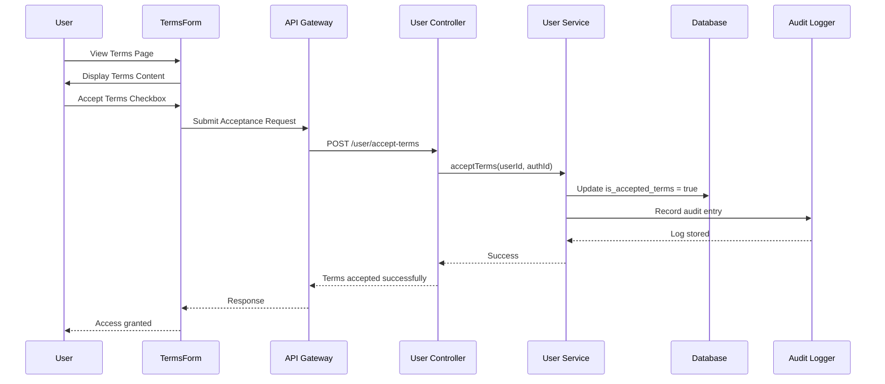
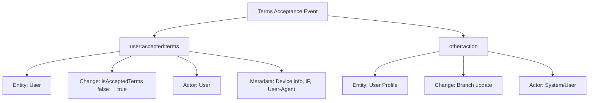
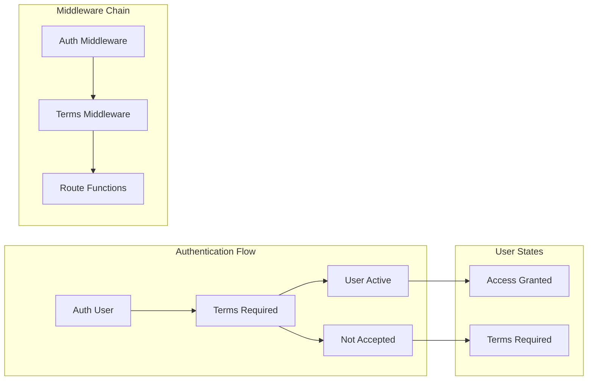
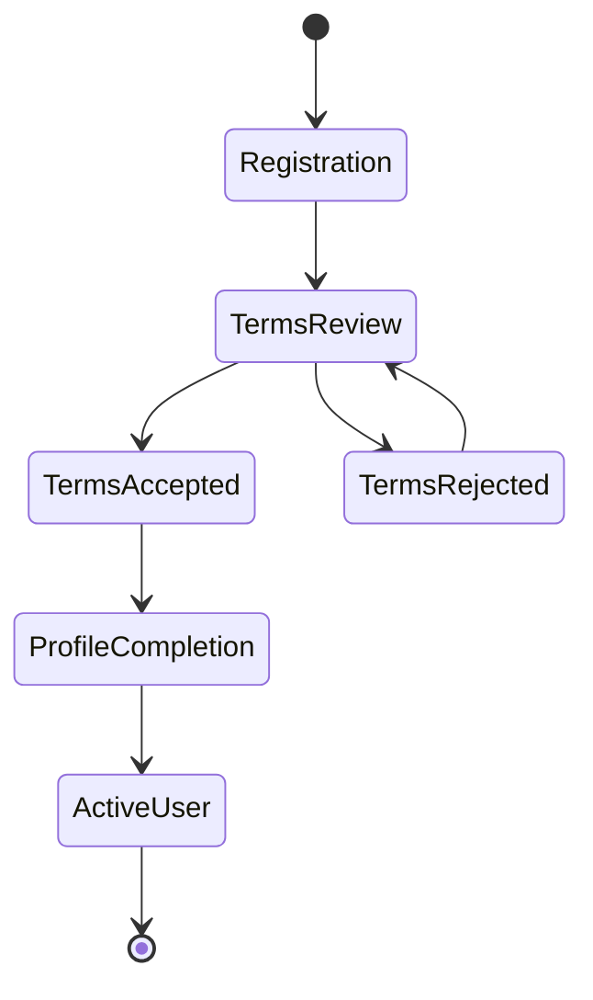
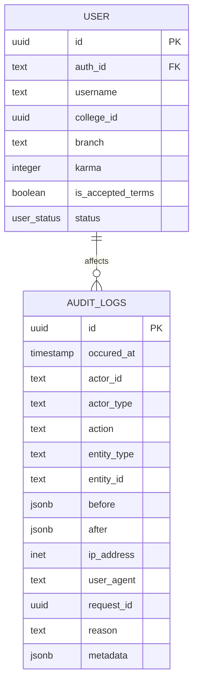

# Terms and Conditions Acceptance

<cite>
**Referenced Files in This Document**
- [require-terms.middleware.ts](file://server/src/core/middlewares/auth/require-terms.middleware.ts)
- [user.route.ts](file://server/src/modules/user/user.route.ts)
- [user.controller.ts](file://server/src/modules/user/user.controller.ts)
- [user.service.ts](file://server/src/modules/user/user.service.ts)
- [user.schema.ts](file://server/src/modules/user/user.schema.ts)
- [audit-log.table.ts](file://server/src/infra/db/tables/audit-log.table.ts)
- [audit.service.ts](file://server/src/modules/audit/audit.service.ts)
- [record-audit.ts](file://server/src/lib/record-audit.ts)
- [0005_snapshot.json](file://server/drizzle/meta/0005_snapshot.json)
- [TermsForm.tsx](file://web/src/components/general/TermsForm.tsx)
- [auth.controller.ts](file://server/src/modules/auth/auth.controller.ts)
- [auth.service.ts](file://server/src/modules/auth/auth.service.ts)
- [onboarding-error-handler.tsx](file://web/src/utils/onboarding-error-handler.tsx)
</cite>

## Table of Contents
1. [Introduction](#introduction)
2. [System Architecture](#system-architecture)
3. [Core Components](#core-components)
4. [Terms Acceptance Workflow](#terms-acceptance-workflow)
5. [Audit Logging Implementation](#audit-logging-implementation)
6. [Compliance Tracking](#compliance-tracking)
7. [Integration with Authentication System](#integration-with-authentication-system)
8. [User Onboarding Process](#user-onboarding-process)
9. [Terms Version Management](#terms-version-management)
10. [API Endpoints](#api-endpoints)
11. [Troubleshooting Guide](#troubleshooting-guide)
12. [Conclusion](#conclusion)

## Introduction

The Terms and Conditions Acceptance System is a critical compliance mechanism designed to ensure all users acknowledge and agree to the platform's terms before accessing core platform features. This system implements a multi-layered approach combining frontend user interface controls, backend enforcement mechanisms, comprehensive audit logging, and integration with the authentication and onboarding workflows.

The system operates on the principle that user engagement with platform features requires explicit consent to terms, creating a legally and technically enforceable acceptance record. This documentation provides comprehensive coverage of the implementation, workflows, and operational procedures.

## System Architecture

The Terms Acceptance System follows a distributed architecture pattern with clear separation of concerns across frontend, backend, and database layers:

```mermaid
graph TB
subgraph "Frontend Layer"
TF[TermsForm Component]
UE[User Experience]
end
subgraph "API Gateway"
AR[API Routes]
AM[Auth Middleware]
TM[Terms Middleware]
end
subgraph "Business Logic"
UC[User Controller]
US[User Service]
AS[Auth Service]
end
subgraph "Persistence Layer"
DB[(PostgreSQL Database)]
AL[Audit Logs Table)]
end
subgraph "Compliance Layer"
RS[Record Audit Service]
AC[Audit Context]
end
TF --> AR
UE --> AR
AR --> AM
AM --> TM
TM --> UC
UC --> US
US --> DB
US --> RS
RS --> AC
AC --> AL
AS --> DB
```

**Diagram sources**
- [user.route.ts](file://server/src/modules/user/user.route.ts#L1-L32)
- [require-terms.middleware.ts](file://server/src/core/middlewares/auth/require-terms.middleware.ts#L1-L18)
- [user.controller.ts](file://server/src/modules/user/user.controller.ts#L1-L72)
- [user.service.ts](file://server/src/modules/user/user.service.ts#L50-L97)
- [audit-log.table.ts](file://server/src/infra/db/tables/audit-log.table.ts#L1-L76)

## Core Components

### Frontend Terms Interface

The frontend implementation provides an intuitive user interface for terms acceptance through the TermsForm component, which presents users with platform terms and requires explicit consent before granting access to platform features.

### Backend Enforcement Layer

The system implements a multi-tier enforcement mechanism through middleware components that intercept requests and validate terms acceptance status before allowing access to protected resources.

### Audit and Compliance Engine

A comprehensive audit logging system captures all terms-related activities with detailed metadata for compliance reporting and legal requirements.

**Section sources**
- [TermsForm.tsx](file://web/src/components/general/TermsForm.tsx#L1-L55)
- [require-terms.middleware.ts](file://server/src/core/middlewares/auth/require-terms.middleware.ts#L1-L18)
- [audit-log.table.ts](file://server/src/infra/db/tables/audit-log.table.ts#L1-L76)

## Terms Acceptance Workflow

The terms acceptance workflow follows a structured process ensuring user consent while maintaining system integrity and compliance requirements.



**Diagram sources**
- [user.controller.ts](file://server/src/modules/user/user.controller.ts#L35-L39)
- [user.service.ts](file://server/src/modules/user/user.service.ts#L50-L62)
- [record-audit.ts](file://server/src/lib/record-audit.ts#L7-L20)

### Workflow Phases

1. **Terms Presentation Phase**: Users encounter the TermsForm component displaying platform terms
2. **Consent Collection Phase**: Users explicitly check the acceptance checkbox
3. **Validation Phase**: System validates user authentication and terms status
4. **Acceptance Processing Phase**: Database updates reflect terms acceptance
5. **Audit Recording Phase**: Comprehensive audit trail is generated
6. **Access Granting Phase**: User gains access to platform features

**Section sources**
- [TermsForm.tsx](file://web/src/components/general/TermsForm.tsx#L19-L50)
- [user.controller.ts](file://server/src/modules/user/user.controller.ts#L35-L39)
- [user.service.ts](file://server/src/modules/user/user.service.ts#L50-L62)

## Audit Logging Implementation

The audit logging system provides comprehensive tracking of all terms-related activities with detailed metadata for compliance and legal requirements.

### Audit Log Schema

The audit log table structure captures essential information for compliance reporting and legal discovery:

| Field | Type | Description | Required |
|-------|------|-------------|----------|
| id | UUID | Primary key with random default | Yes |
| occured_at | TIMESTAMP WITH TIME ZONE | Timestamp of event occurrence | Yes |
| actor_id | TEXT | Identifier of acting user/system | No |
| actor_type | ENUM | Role type (user, system, admin, service) | Yes |
| action | TEXT | Specific action performed | Yes |
| entity_type | ENUM | Type of affected entity | Yes |
| entity_id | TEXT | Identifier of affected entity | No |
| before | JSONB | State before change | No |
| after | JSONB | State after change | No |
| ip_address | INET | IP address of request origin | No |
| user_agent | TEXT | Browser/device information | No |
| request_id | UUID | Correlation identifier | No |
| reason | TEXT | Explanation for action | No |
| metadata | JSONB | Additional contextual data | No |

### Audit Event Types

The system generates specific audit events for terms acceptance activities:



**Diagram sources**
- [audit-log.table.ts](file://server/src/infra/db/tables/audit-log.table.ts#L12-L27)
- [record-audit.ts](file://server/src/lib/record-audit.ts#L11-L19)

**Section sources**
- [audit-log.table.ts](file://server/src/infra/db/tables/audit-log.table.ts#L40-L76)
- [audit.service.ts](file://server/src/modules/audit/audit.service.ts#L1-L12)
- [record-audit.ts](file://server/src/lib/record-audit.ts#L1-L23)

## Compliance Tracking

The compliance tracking system ensures regulatory adherence through comprehensive monitoring and reporting capabilities.

### Compliance Features

1. **Legal Discovery Support**: Complete audit trails enable legal discovery processes
2. **Regulatory Reporting**: Structured data export for compliance reporting
3. **Temporal Tracking**: Full history of user consent and changes
4. **Device Fingerprinting**: Comprehensive device and browser identification
5. **Geolocation Integration**: IP-based geographic tracking capabilities

### Compliance Indicators

The system maintains several key indicators for compliance monitoring:

- **Consent Verification**: Timestamped evidence of user acceptance
- **Change Auditing**: Complete modification history for sensitive fields
- **Access Control**: Real-time enforcement of terms requirements
- **Reporting Metrics**: Aggregate statistics for compliance reporting

**Section sources**
- [audit.service.ts](file://server/src/modules/audit/audit.service.ts#L1-L12)
- [record-audit.ts](file://server/src/lib/record-audit.ts#L1-L23)

## Integration with Authentication System

The terms acceptance system integrates seamlessly with the authentication framework, ensuring that user consent is required before granting access to authenticated features.

### Authentication Integration Points



**Diagram sources**
- [require-terms.middleware.ts](file://server/src/core/middlewares/auth/require-terms.middleware.ts#L4-L16)
- [auth.controller.ts](file://server/src/modules/auth/auth.controller.ts#L100-L128)

### Integration Benefits

1. **Seamless User Experience**: Terms acceptance occurs naturally within the authentication flow
2. **State Consistency**: User state reflects both authentication and terms acceptance
3. **Security Enhancement**: Prevents access to authenticated features without consent
4. **Compliance Automation**: Automatic enforcement of terms requirements

**Section sources**
- [require-terms.middleware.ts](file://server/src/core/middlewares/auth/require-terms.middleware.ts#L1-L18)
- [auth.controller.ts](file://server/src/modules/auth/auth.controller.ts#L100-L128)

## User Onboarding Process

The terms acceptance system integrates with the broader user onboarding process, creating a comprehensive user lifecycle management approach.

### Onboarding Workflow Integration



### Onboarding State Management

The system manages user states through distinct phases:

1. **Registration Phase**: Initial user creation with ONBOARDING status
2. **Terms Review Phase**: User presented with terms for acceptance
3. **Terms Accepted Phase**: User granted basic platform access
4. **Profile Completion Phase**: Additional user information collection
5. **Active User Phase**: Full platform access granted

**Section sources**
- [auth.service.ts](file://server/src/modules/auth/auth.service.ts#L253-L294)
- [0005_snapshot.json](file://server/drizzle/meta/0005_snapshot.json#L437-L444)

## Terms Version Management

The system supports terms version management through database schema evolution and audit trail maintenance.

### Database Schema Evolution

The user table includes explicit terms acceptance tracking through the `is_accepted_terms` field, enabling version-specific compliance tracking:



**Diagram sources**
- [0005_snapshot.json](file://server/drizzle/meta/0005_snapshot.json#L430-L444)
- [audit-log.table.ts](file://server/src/infra/db/tables/audit-log.table.ts#L40-L76)

### Version Control Implementation

The system maintains version control through:

1. **Schema Evolution**: Database migrations support terms field modifications
2. **Audit History**: Complete change history for terms acceptance
3. **Backward Compatibility**: Support for legacy terms versions
4. **Compliance Archival**: Historical records for legal requirements

**Section sources**
- [0005_snapshot.json](file://server/drizzle/meta/0005_snapshot.json#L430-L444)
- [audit-log.table.ts](file://server/src/infra/db/tables/audit-log.table.ts#L1-L76)

## API Endpoints

The system exposes dedicated API endpoints for terms management and acceptance workflows.

### Terms Management Endpoints

| Endpoint | Method | Description | Authentication | Response |
|----------|--------|-------------|----------------|----------|
| `/user/accept-terms` | POST | Accept platform terms and conditions | Required | Success/Failure |
| `/user/me` | GET | Get current user profile | Required | User data |
| `/user/me` | PATCH | Update user profile | Required | Updated user data |

### Request/Response Patterns

The API follows consistent patterns for terms-related operations:

**Accept Terms Request**
```json
{
  "headers": {
    "Authorization": "Bearer <token>",
    "Content-Type": "application/json"
  },
  "body": {}
}
```

**Accept Terms Response**
```json
{
  "status": "success",
  "message": "Terms accepted successfully",
  "data": null
}
```

**Section sources**
- [user.route.ts](file://server/src/modules/user/user.route.ts#L21-L26)
- [user.controller.ts](file://server/src/modules/user/user.controller.ts#L35-L39)

## Troubleshooting Guide

Common issues and resolution strategies for the terms acceptance system.

### Terms Not Accepted Errors

**Symptoms**: Users receive "Terms not accepted" errors when accessing platform features

**Causes**:
1. User has not yet accepted terms
2. Authentication session expired
3. Database synchronization issues

**Resolutions**:
1. Redirect users to terms acceptance page
2. Refresh authentication tokens
3. Clear application cache and retry

### Audit Logging Issues

**Symptoms**: Missing or incomplete audit records for terms acceptance

**Causes**:
1. Network connectivity issues during logging
2. Database write failures
3. Context extraction errors

**Resolutions**:
1. Implement retry mechanisms for audit logging
2. Monitor database connection health
3. Validate context extraction processes

### Frontend Integration Problems

**Symptoms**: Terms acceptance form not displaying properly

**Causes**:
1. JavaScript errors blocking form rendering
2. Missing dependencies
3. Authentication state inconsistencies

**Resolutions**:
1. Check browser console for JavaScript errors
2. Verify all required dependencies are loaded
3. Ensure user authentication state is properly established

**Section sources**
- [require-terms.middleware.ts](file://server/src/core/middlewares/auth/require-terms.middleware.ts#L9-L13)
- [onboarding-error-handler.tsx](file://web/src/utils/onboarding-error-handler.tsx#L1-L24)

## Conclusion

The Terms and Conditions Acceptance System provides a robust, compliant solution for managing user consent within the platform. Through its multi-layered architecture, comprehensive audit logging, and seamless integration with authentication and onboarding workflows, the system ensures legal compliance while maintaining excellent user experience.

Key strengths of the implementation include:

- **Comprehensive Audit Trail**: Complete tracking of all terms-related activities
- **Real-time Enforcement**: Immediate validation of terms acceptance requirements
- **Scalable Architecture**: Distributed design supporting high-volume operations
- **Compliance Ready**: Structured data capture meeting legal and regulatory requirements
- **User-Friendly Interface**: Intuitive terms acceptance process minimizing friction

The system's modular design enables future enhancements such as terms versioning, automated compliance reporting, and advanced analytics capabilities while maintaining backward compatibility and system stability.