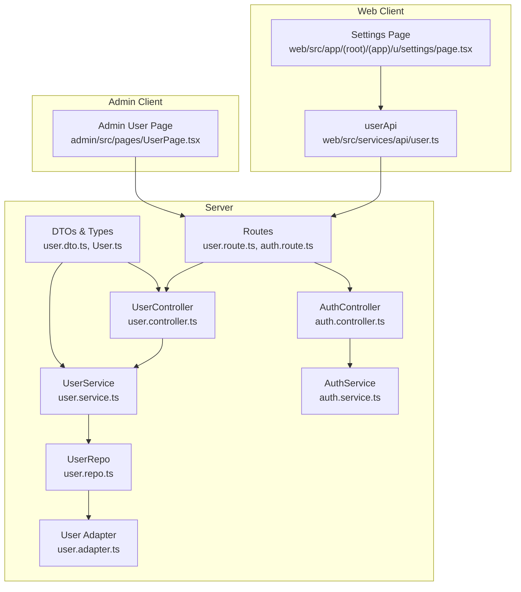
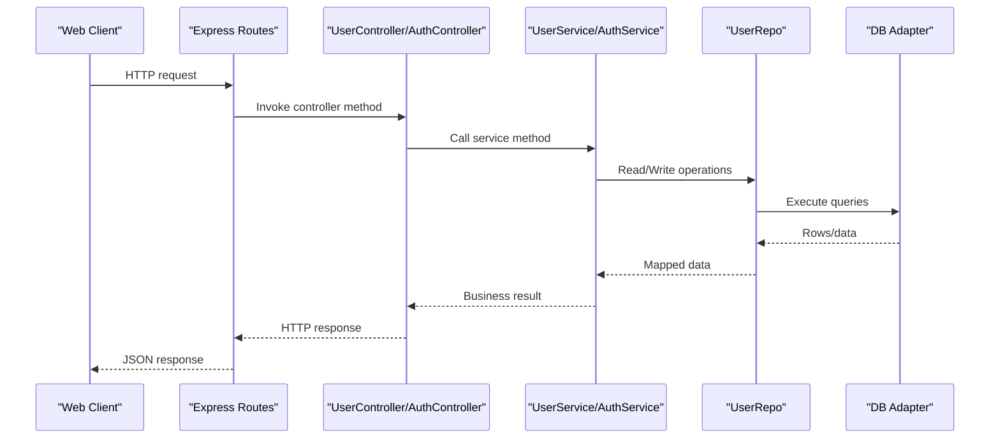
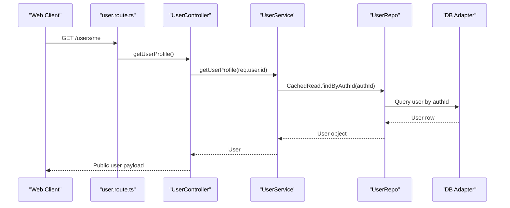
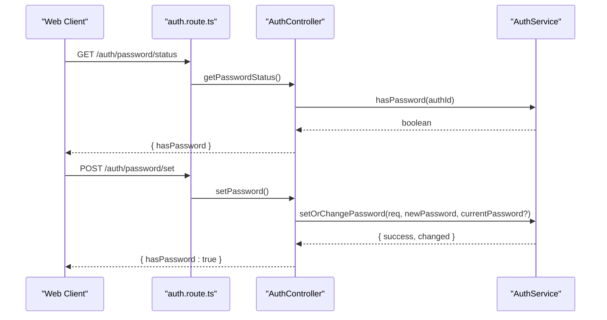
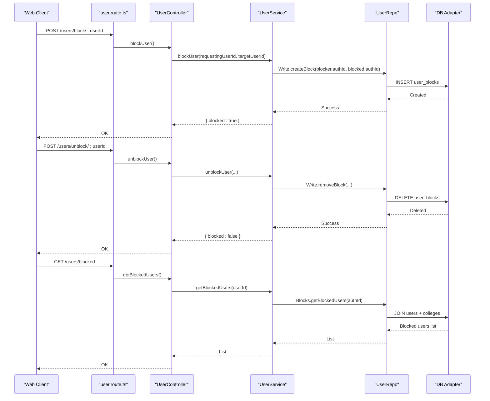
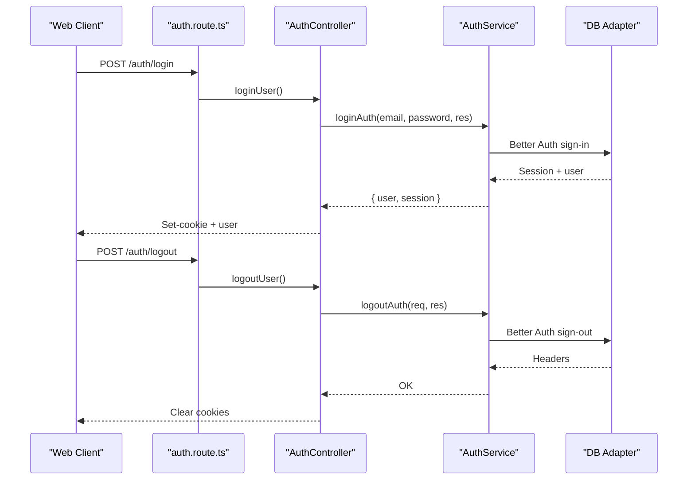
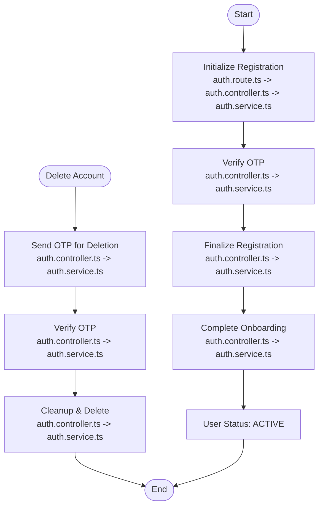
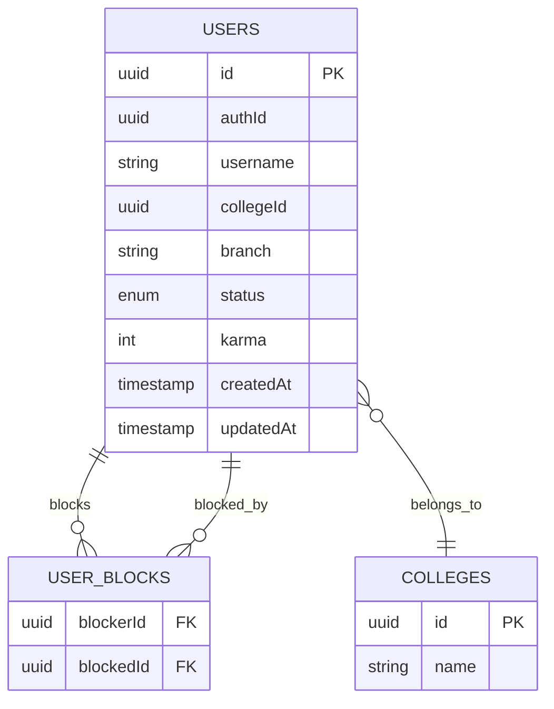
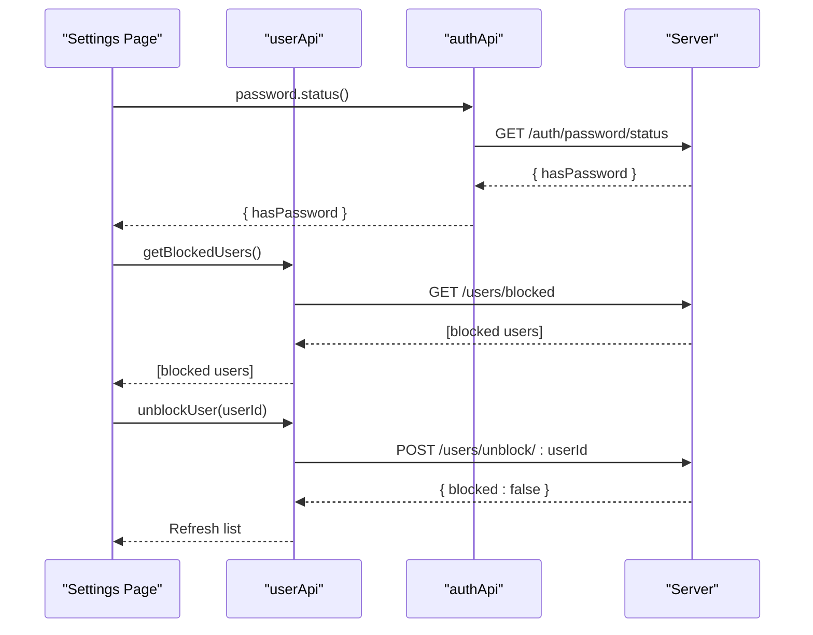
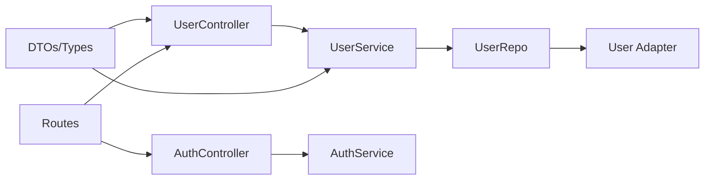

# User Management

<cite>
**Referenced Files in This Document**
- [user.controller.ts](file://server/src/modules/user/user.controller.ts)
- [user.service.ts](file://server/src/modules/user/user.service.ts)
- [user.repo.ts](file://server/src/modules/user/user.repo.ts)
- [user.schema.ts](file://server/src/modules/user/user.schema.ts)
- [user.dto.ts](file://server/src/modules/user/user.dto.ts)
- [user.route.ts](file://server/src/modules/user/user.route.ts)
- [auth.controller.ts](file://server/src/modules/auth/auth.controller.ts)
- [auth.service.ts](file://server/src/modules/auth/auth.service.ts)
- [auth.route.ts](file://server/src/modules/auth/auth.route.ts)
- [user.adapter.ts](file://server/src/infra/db/adapters/user.adapter.ts)
- [User.ts](file://server/src/shared/types/User.ts)
- [user.ts](file://web/src/services/api/user.ts)
- [page.tsx](file://web/src/app/(root)/(app)/u/settings/page.tsx)
- [UserPage.tsx](file://admin/src/pages/UserPage.tsx)
</cite>

## Table of Contents
1. [Introduction](#introduction)
2. [Project Structure](#project-structure)
3. [Core Components](#core-components)
4. [Architecture Overview](#architecture-overview)
5. [Detailed Component Analysis](#detailed-component-analysis)
6. [Dependency Analysis](#dependency-analysis)
7. [Performance Considerations](#performance-considerations)
8. [Troubleshooting Guide](#troubleshooting-guide)
9. [Conclusion](#conclusion)
10. [Appendices](#appendices)

## Introduction
This document explains the user management system across the backend server, frontend web application, and admin dashboard. It covers user profile management, account settings, blocking/unblocking functionality, permissions, authentication and session integration, user state persistence, lifecycle management, and client-side integration patterns. It also outlines the data models, customization options, privacy controls, and operational procedures such as account deletion.

## Project Structure
The user management system spans three primary areas:
- Backend server modules for user and authentication services, routes, repositories, and DTOs
- Frontend web application exposing user settings and integrating with user APIs
- Admin dashboard for user listing, filtering, and administrative oversight

**Diagram sources**
- [user.route.ts](file://server/src/modules/user/user.route.ts#L1-L32)
- [auth.route.ts](file://server/src/modules/auth/auth.route.ts#L1-L44)
- [user.controller.ts](file://server/src/modules/user/user.controller.ts#L1-L72)
- [user.service.ts](file://server/src/modules/user/user.service.ts#L1-L137)
- [auth.controller.ts](file://server/src/modules/auth/auth.controller.ts#L1-L228)
- [auth.service.ts](file://server/src/modules/auth/auth.service.ts#L1-L782)
- [user.repo.ts](file://server/src/modules/user/user.repo.ts#L1-L67)
- [user.adapter.ts](file://server/src/infra/db/adapters/user.adapter.ts#L423-L488)
- [user.dto.ts](file://server/src/modules/user/user.dto.ts#L1-L17)
- [User.ts](file://server/src/shared/types/User.ts#L1-L5)
- [user.ts](file://web/src/services/api/user.ts#L1-L26)
- [page.tsx](file://web/src/app/(root)/(app)/u/settings/page.tsx#L1-L571)
- [UserPage.tsx](file://admin/src/pages/UserPage.tsx#L1-L235)

**Section sources**
- [user.route.ts](file://server/src/modules/user/user.route.ts#L1-L32)
- [auth.route.ts](file://server/src/modules/auth/auth.route.ts#L1-L44)
- [user.controller.ts](file://server/src/modules/user/user.controller.ts#L1-L72)
- [user.service.ts](file://server/src/modules/user/user.service.ts#L1-L137)
- [auth.controller.ts](file://server/src/modules/auth/auth.controller.ts#L1-L228)
- [auth.service.ts](file://server/src/modules/auth/auth.service.ts#L1-L782)
- [user.repo.ts](file://server/src/modules/user/user.repo.ts#L1-L67)
- [user.adapter.ts](file://server/src/infra/db/adapters/user.adapter.ts#L423-L488)
- [user.dto.ts](file://server/src/modules/user/user.dto.ts#L1-L17)
- [User.ts](file://server/src/shared/types/User.ts#L1-L5)
- [user.ts](file://web/src/services/api/user.ts#L1-L26)
- [page.tsx](file://web/src/app/(root)/(app)/u/settings/page.tsx#L1-L571)
- [UserPage.tsx](file://admin/src/pages/UserPage.tsx#L1-L235)

## Core Components
- User module: Provides profile retrieval, search, profile updates, terms acceptance, and blocking/unblocking operations.
- Authentication module: Handles login, logout, session creation, password management, OTP flows, and account deletion.
- Repositories and adapters: Encapsulate database reads/writes and caching keys for user and block relations.
- DTOs and types: Define public/internal user representations and shared database types.
- Web and Admin clients: Expose user API endpoints and integrate with UI components for settings and administration.

Key responsibilities:
- Profile management: Retrieve and update user profile (branch), accept terms.
- Blocking/unblocking: Manage user-to-user block relationships.
- Authentication and sessions: Login/logout, session persistence, password set/change, OTP-based flows.
- Lifecycle: Onboarding completion, account deletion with cleanup.
- Admin: List users, filter/search, and display user statistics.

**Section sources**
- [user.controller.ts](file://server/src/modules/user/user.controller.ts#L9-L68)
- [user.service.ts](file://server/src/modules/user/user.service.ts#L9-L134)
- [auth.controller.ts](file://server/src/modules/auth/auth.controller.ts#L8-L224)
- [auth.service.ts](file://server/src/modules/auth/auth.service.ts#L340-L478)
- [user.repo.ts](file://server/src/modules/user/user.repo.ts#L6-L64)
- [user.adapter.ts](file://server/src/infra/db/adapters/user.adapter.ts#L423-L488)
- [user.dto.ts](file://server/src/modules/user/user.dto.ts#L3-L11)
- [User.ts](file://server/src/shared/types/User.ts#L3-L4)
- [user.ts](file://web/src/services/api/user.ts#L3-L25)
- [page.tsx](file://web/src/app/(root)/(app)/u/settings/page.tsx#L58-L106)
- [UserPage.tsx](file://admin/src/pages/UserPage.tsx#L22-L111)

## Architecture Overview
The system follows layered architecture:
- Routes define HTTP endpoints and apply middleware (authentication, rate limiting, onboarded user checks).
- Controllers orchestrate requests and delegate to services.
- Services encapsulate business logic, enforce validations, and coordinate repositories.
- Repositories abstract data access and caching.
- Adapters map to database tables and queries.
- DTOs normalize data for internal and external consumption.
- Clients (web/admin) call server endpoints and render UI.

**Diagram sources**
- [user.route.ts](file://server/src/modules/user/user.route.ts#L10-L29)
- [auth.route.ts](file://server/src/modules/auth/auth.route.ts#L6-L42)
- [user.controller.ts](file://server/src/modules/user/user.controller.ts#L1-L72)
- [auth.controller.ts](file://server/src/modules/auth/auth.controller.ts#L1-L228)
- [user.service.ts](file://server/src/modules/user/user.service.ts#L1-L137)
- [auth.service.ts](file://server/src/modules/auth/auth.service.ts#L1-L782)
- [user.repo.ts](file://server/src/modules/user/user.repo.ts#L1-L67)
- [user.adapter.ts](file://server/src/infra/db/adapters/user.adapter.ts#L423-L488)

## Detailed Component Analysis

### User Profile Management
- Retrieve profile by authenticated user ID and by arbitrary user ID for public display.
- Update profile branch; updates are cached and audited.
- Accept terms flag for compliance.

**Diagram sources**
- [user.route.ts](file://server/src/modules/user/user.route.ts#L21-L24)
- [user.controller.ts](file://server/src/modules/user/user.controller.ts#L28-L33)
- [user.service.ts](file://server/src/modules/user/user.service.ts#L43-L45)
- [user.repo.ts](file://server/src/modules/user/user.repo.ts#L11-L15)
- [user.adapter.ts](file://server/src/infra/db/adapters/user.adapter.ts#L423-L488)
- [user.dto.ts](file://server/src/modules/user/user.dto.ts#L3-L11)

**Section sources**
- [user.controller.ts](file://server/src/modules/user/user.controller.ts#L9-L33)
- [user.service.ts](file://server/src/modules/user/user.service.ts#L9-L89)
- [user.dto.ts](file://server/src/modules/user/user.dto.ts#L3-L11)
- [user.repo.ts](file://server/src/modules/user/user.repo.ts#L24-L46)
- [user.adapter.ts](file://server/src/infra/db/adapters/user.adapter.ts#L423-L488)

### Account Settings and Password Management
- Password status check determines whether a credential password exists.
- Set or change password depending on current state; supports OAuth-only users setting a password for the first time.
- Logout from all other devices revokes other sessions.

**Diagram sources**
- [auth.route.ts](file://server/src/modules/auth/auth.route.ts#L35-L36)
- [auth.controller.ts](file://server/src/modules/auth/auth.controller.ts#L203-L224)
- [auth.service.ts](file://server/src/modules/auth/auth.service.ts#L683-L749)

**Section sources**
- [auth.controller.ts](file://server/src/modules/auth/auth.controller.ts#L203-L224)
- [auth.service.ts](file://server/src/modules/auth/auth.service.ts#L683-L749)
- [page.tsx](file://web/src/app/(root)/(app)/u/settings/page.tsx#L72-L77)

### Blocking and Unblocking Users
- Block another user by user ID; self-blocking is prevented.
- Unblock a previously blocked user.
- Fetch list of blocked users with associated profile details.

**Diagram sources**
- [user.route.ts](file://server/src/modules/user/user.route.ts#L27-L29)
- [user.controller.ts](file://server/src/modules/user/user.controller.ts#L53-L68)
- [user.service.ts](file://server/src/modules/user/user.service.ts#L91-L134)
- [user.repo.ts](file://server/src/modules/user/user.repo.ts#L54-L63)
- [user.adapter.ts](file://server/src/infra/db/adapters/user.adapter.ts#L423-L488)

**Section sources**
- [user.controller.ts](file://server/src/modules/user/user.controller.ts#L53-L68)
- [user.service.ts](file://server/src/modules/user/user.service.ts#L91-L134)
- [user.adapter.ts](file://server/src/infra/db/adapters/user.adapter.ts#L423-L488)
- [page.tsx](file://web/src/app/(root)/(app)/u/settings/page.tsx#L79-L106)

### Authentication, Session Management, and User State Persistence
- Login via email/password or OTP; session cookie is set with expiration.
- Better Auth integration manages auth tokens and sessions.
- Onboarding completion sets user status to ACTIVE and caches invalidated.
- Logout clears cookies and records audit events.
- Password reset and forgot password flows supported.

**Diagram sources**
- [auth.route.ts](file://server/src/modules/auth/auth.route.ts#L10-L33)
- [auth.controller.ts](file://server/src/modules/auth/auth.controller.ts#L8-L24)
- [auth.service.ts](file://server/src/modules/auth/auth.service.ts#L340-L422)

**Section sources**
- [auth.controller.ts](file://server/src/modules/auth/auth.controller.ts#L8-L24)
- [auth.service.ts](file://server/src/modules/auth/auth.service.ts#L340-L422)
- [auth.service.ts](file://server/src/modules/auth/auth.service.ts#L756-L778)

### User Lifecycle Management and Account Deactivation
- Registration flow: Initialize with email, verify OTP, finalize registration, and complete onboarding.
- Account deletion: Requires OTP verification, clears notifications, invalidates caches, logs out, deletes auth record, and audits.

**Diagram sources**
- [auth.route.ts](file://server/src/modules/auth/auth.route.ts#L14-L31)
- [auth.controller.ts](file://server/src/modules/auth/auth.controller.ts#L100-L134)
- [auth.service.ts](file://server/src/modules/auth/auth.service.ts#L48-L286)
- [auth.service.ts](file://server/src/modules/auth/auth.service.ts#L424-L478)

**Section sources**
- [auth.controller.ts](file://server/src/modules/auth/auth.controller.ts#L100-L134)
- [auth.service.ts](file://server/src/modules/auth/auth.service.ts#L48-L286)
- [auth.service.ts](file://server/src/modules/auth/auth.service.ts#L424-L478)
- [page.tsx](file://web/src/app/(root)/(app)/u/settings/page.tsx#L108-L165)

### Data Models and Privacy Controls
- Public user representation excludes sensitive fields and includes profile metadata.
- Shared database types define insert/select shapes for user entities.
- Blocking creates a relation table linking blocker and blocked users.

**Diagram sources**
- [user.adapter.ts](file://server/src/infra/db/adapters/user.adapter.ts#L423-L488)
- [user.dto.ts](file://server/src/modules/user/user.dto.ts#L3-L11)
- [User.ts](file://server/src/shared/types/User.ts#L3-L4)

**Section sources**
- [user.dto.ts](file://server/src/modules/user/user.dto.ts#L3-L11)
- [User.ts](file://server/src/shared/types/User.ts#L3-L4)
- [user.adapter.ts](file://server/src/infra/db/adapters/user.adapter.ts#L423-L488)

### Client-Side Integration Patterns
- Web client exposes user API methods for profile, blocking, and settings.
- Settings page integrates with auth and user APIs to manage password, blocked users, and account deletion.
- Admin client lists users, applies filters, and displays statistics.

**Diagram sources**
- [user.ts](file://web/src/services/api/user.ts#L3-L25)
- [page.tsx](file://web/src/app/(root)/(app)/u/settings/page.tsx#L58-L106)
- [auth.controller.ts](file://server/src/modules/auth/auth.controller.ts#L203-L208)
- [user.controller.ts](file://server/src/modules/user/user.controller.ts#L65-L68)

**Section sources**
- [user.ts](file://web/src/services/api/user.ts#L3-L25)
- [page.tsx](file://web/src/app/(root)/(app)/u/settings/page.tsx#L58-L106)
- [UserPage.tsx](file://admin/src/pages/UserPage.tsx#L45-L111)

## Dependency Analysis
- Controllers depend on services for business logic.
- Services depend on repositories for data access and caching.
- Repositories depend on adapters for database operations.
- DTOs and shared types decouple internal and external representations.
- Routes apply middleware for authentication, rate limits, and role checks.

**Diagram sources**
- [user.controller.ts](file://server/src/modules/user/user.controller.ts#L1-L72)
- [user.service.ts](file://server/src/modules/user/user.service.ts#L1-L137)
- [user.repo.ts](file://server/src/modules/user/user.repo.ts#L1-L67)
- [user.adapter.ts](file://server/src/infra/db/adapters/user.adapter.ts#L423-L488)
- [user.dto.ts](file://server/src/modules/user/user.dto.ts#L1-L17)
- [User.ts](file://server/src/shared/types/User.ts#L1-L5)
- [user.route.ts](file://server/src/modules/user/user.route.ts#L1-L32)
- [auth.route.ts](file://server/src/modules/auth/auth.route.ts#L1-L44)

**Section sources**
- [user.controller.ts](file://server/src/modules/user/user.controller.ts#L1-L72)
- [user.service.ts](file://server/src/modules/user/user.service.ts#L1-L137)
- [user.repo.ts](file://server/src/modules/user/user.repo.ts#L1-L67)
- [user.adapter.ts](file://server/src/infra/db/adapters/user.adapter.ts#L423-L488)
- [user.dto.ts](file://server/src/modules/user/user.dto.ts#L1-L17)
- [User.ts](file://server/src/shared/types/User.ts#L1-L5)
- [user.route.ts](file://server/src/modules/user/user.route.ts#L1-L32)
- [auth.route.ts](file://server/src/modules/auth/auth.route.ts#L1-L44)

## Performance Considerations
- Caching: User reads are cached via repository wrappers to reduce database load.
- Rate limiting: Applied at route level for auth and API endpoints.
- Batch operations: Admin listing uses pagination and filtering to avoid large payloads.
- Audit logging: Minimal overhead; only enabled for significant actions.

Recommendations:
- Monitor cache hit rates for user profiles.
- Tune rate limit windows per endpoint.
- Add index coverage for user block relation queries if growth increases.

[No sources needed since this section provides general guidance]

## Troubleshooting Guide
Common issues and resolutions:
- Unauthorized access: Ensure authentication middleware is applied and session cookies are present.
- User not found: Validation throws not found; verify user IDs and onboarded status.
- Self-block prevention: Attempting to block yourself is rejected; validate target ID.
- OTP failures: Respect attempt limits and expiry; handle cooldowns and resend logic.
- Password operations: Require current password when changing; OAuth-only users can set password once.

**Section sources**
- [user.service.ts](file://server/src/modules/user/user.service.ts#L92-L108)
- [auth.service.ts](file://server/src/modules/auth/auth.service.ts#L110-L135)
- [auth.service.ts](file://server/src/modules/auth/auth.service.ts#L604-L659)
- [auth.controller.ts](file://server/src/modules/auth/auth.controller.ts#L203-L224)

## Conclusion
The user management system integrates authentication, user profiles, blocking/unblocking, and lifecycle operations with clear separation of concerns across server, web, and admin clients. It leverages caching, auditing, and robust middleware to maintain performance and security while offering flexible client integrations for settings and administration.

[No sources needed since this section summarizes without analyzing specific files]

## Appendices

### API Endpoints Summary
- User
  - GET /users/id/:userId
  - GET /users/search/:query
  - GET /users/me
  - PATCH /users/me
  - POST /users/accept-terms
  - POST /users/block/:userId
  - POST /users/unblock/:userId
  - GET /users/blocked
- Auth
  - POST /auth/login
  - POST /auth/logout
  - POST /auth/logout-all
  - POST /auth/registration/initialize
  - POST /auth/registration/verify-otp
  - POST /auth/registration/finalize
  - POST /auth/password/forgot
  - POST /auth/password/reset
  - POST /auth/password/set
  - GET /auth/password/status
  - GET /auth/me
  - GET /auth/admins
  - GET /auth/users

**Section sources**
- [user.route.ts](file://server/src/modules/user/user.route.ts#L15-L29)
- [auth.route.ts](file://server/src/modules/auth/auth.route.ts#L10-L42)
- [user.ts](file://web/src/services/api/user.ts#L4-L25)