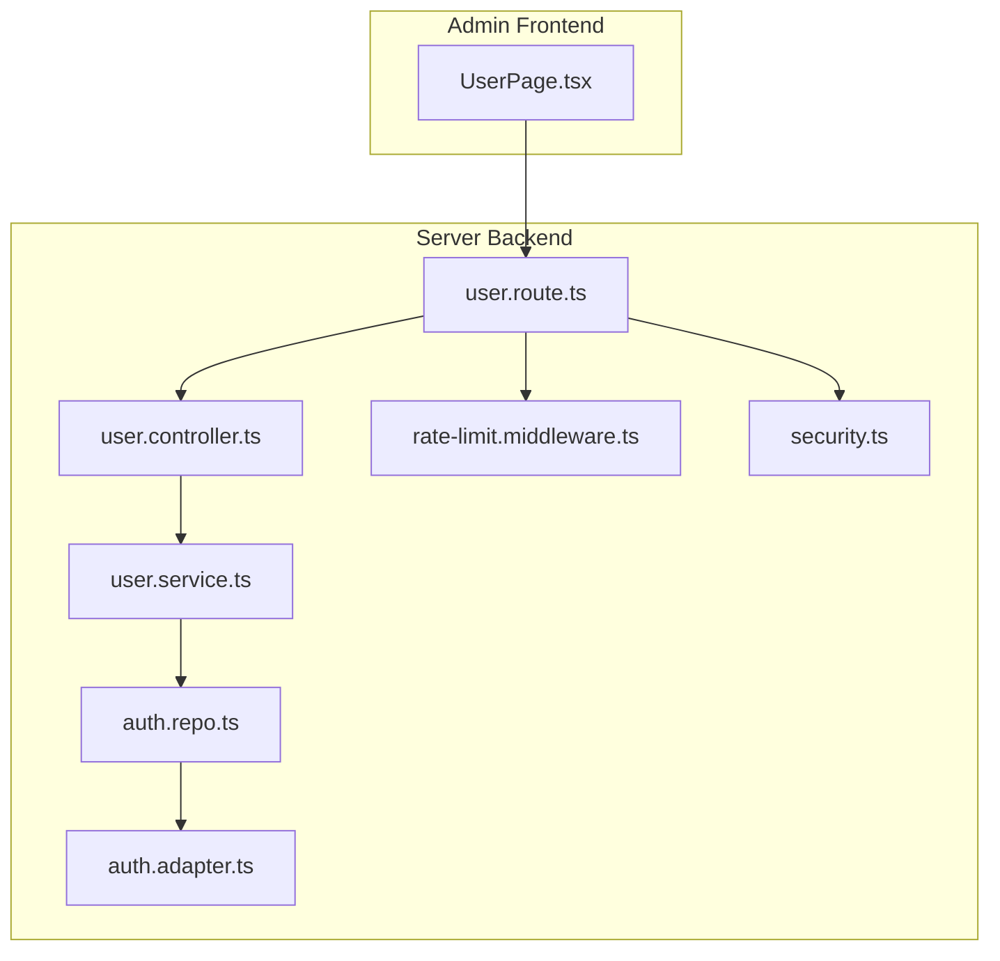
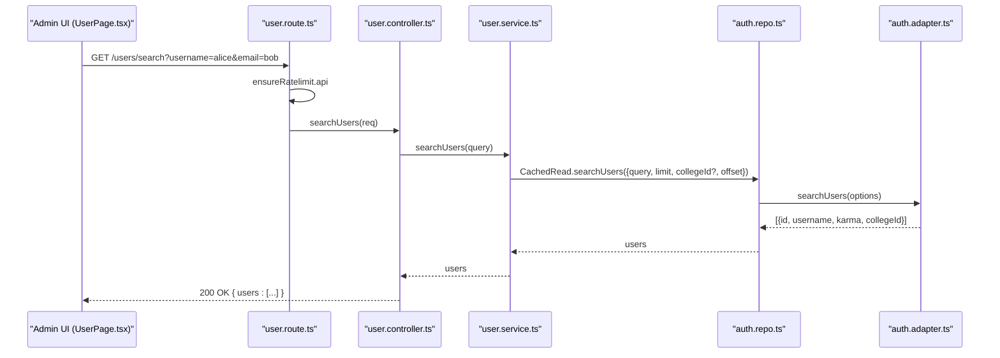
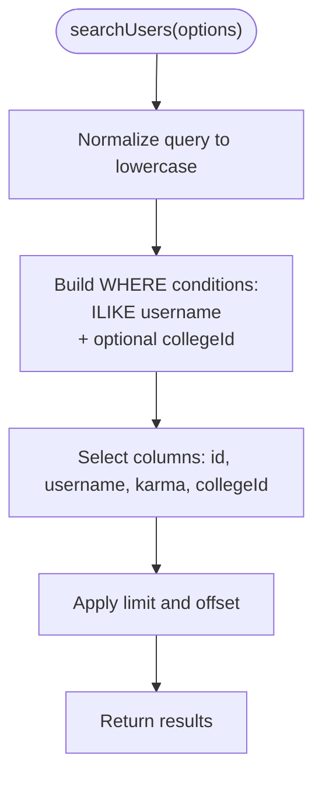
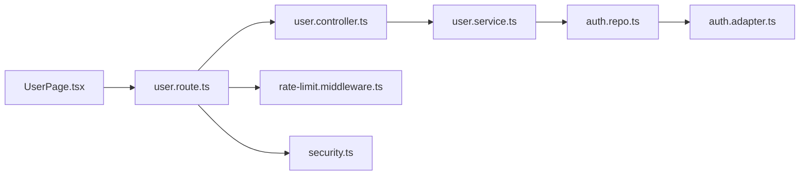

# User Search and Discovery

<cite>
**Referenced Files in This Document**
- [user.route.ts](file://server/src/modules/user/user.route.ts)
- [user.controller.ts](file://server/src/modules/user/user.controller.ts)
- [user.service.ts](file://server/src/modules/user/user.service.ts)
- [user.schema.ts](file://server/src/modules/user/user.schema.ts)
- [auth.repo.ts](file://server/src/modules/auth/auth.repo.ts)
- [auth.adapter.ts](file://server/src/infra/db/adapters/auth.adapter.ts)
- [rate-limit.middleware.ts](file://server/src/core/middlewares/rate-limit.middleware.ts)
- [rate-limiter.create-middleware.ts](file://server/src/infra/services/rate-limiter/rate-limiter.create-middleware.ts)
- [rate-limiter.module.ts](file://server/src/infra/services/rate-limiter/rate-limiter.module.ts)
- [security.ts](file://server/src/config/security.ts)
- [UserPage.tsx](file://admin/src/pages/UserPage.tsx)
- [user.dto.ts](file://server/src/modules/user/user.dto.ts)
</cite>

## Table of Contents
1. [Introduction](#introduction)
2. [Project Structure](#project-structure)
3. [Core Components](#core-components)
4. [Architecture Overview](#architecture-overview)
5. [Detailed Component Analysis](#detailed-component-analysis)
6. [Dependency Analysis](#dependency-analysis)
7. [Performance Considerations](#performance-considerations)
8. [Troubleshooting Guide](#troubleshooting-guide)
9. [Conclusion](#conclusion)

## Introduction
This document explains the user search and discovery functionality across the backend and admin frontend. It covers how search queries are processed, how filters are applied, how results are formatted, the underlying search algorithm and ranking criteria, performance optimizations, pagination, security measures, rate limiting, and privacy considerations. It also documents integration with the admin user discovery interface.

## Project Structure
The user search spans three layers:
- Backend HTTP layer: routes, controllers, and services
- Data access layer: repositories and database adapters
- Frontend admin interface: user discovery UI and pagination

**Diagram sources**
- [user.route.ts](file://server/src/modules/user/user.route.ts#L1-L32)
- [user.controller.ts](file://server/src/modules/user/user.controller.ts#L1-L72)
- [user.service.ts](file://server/src/modules/user/user.service.ts#L1-L137)
- [auth.repo.ts](file://server/src/modules/auth/auth.repo.ts#L1-L50)
- [auth.adapter.ts](file://server/src/infra/db/adapters/auth.adapter.ts#L1-L190)
- [rate-limit.middleware.ts](file://server/src/core/middlewares/rate-limit.middleware.ts#L1-L12)
- [security.ts](file://server/src/config/security.ts#L1-L14)

**Section sources**
- [user.route.ts](file://server/src/modules/user/user.route.ts#L1-L32)
- [user.controller.ts](file://server/src/modules/user/user.controller.ts#L1-L72)
- [user.service.ts](file://server/src/modules/user/user.service.ts#L1-L137)
- [auth.repo.ts](file://server/src/modules/auth/auth.repo.ts#L1-L50)
- [auth.adapter.ts](file://server/src/infra/db/adapters/auth.adapter.ts#L1-L190)
- [rate-limit.middleware.ts](file://server/src/core/middlewares/rate-limit.middleware.ts#L1-L12)
- [security.ts](file://server/src/config/security.ts#L1-L14)
- [UserPage.tsx](file://admin/src/pages/UserPage.tsx#L45-L234)

## Core Components
- Route: Defines the search endpoint and applies rate limiting and authentication.
- Controller: Parses the query parameter and delegates to the service.
- Service: Orchestrates the search with limits and optional filters.
- Repository: Provides cached and uncached read access to user data.
- Adapter: Implements the SQL search with ILIKE and optional college filter.
- Frontend: Presents filters, handles pagination, and displays results.

**Section sources**
- [user.route.ts](file://server/src/modules/user/user.route.ts#L12-L16)
- [user.controller.ts](file://server/src/modules/user/user.controller.ts#L17-L26)
- [user.service.ts](file://server/src/modules/user/user.service.ts#L29-L41)
- [auth.repo.ts](file://server/src/modules/auth/auth.repo.ts#L13-L39)
- [auth.adapter.ts](file://server/src/infra/db/adapters/auth.adapter.ts#L84-L115)
- [UserPage.tsx](file://admin/src/pages/UserPage.tsx#L73-L111)

## Architecture Overview
The search flow is straightforward: the admin UI sends a request to the backend, which validates the query, applies rate limits, and executes a database search against the users table. Results are returned to the UI for display and pagination.

**Diagram sources**
- [user.route.ts](file://server/src/modules/user/user.route.ts#L12-L16)
- [user.controller.ts](file://server/src/modules/user/user.controller.ts#L17-L26)
- [user.service.ts](file://server/src/modules/user/user.service.ts#L29-L41)
- [auth.repo.ts](file://server/src/modules/auth/auth.repo.ts#L13-L39)
- [auth.adapter.ts](file://server/src/infra/db/adapters/auth.adapter.ts#L84-L115)
- [UserPage.tsx](file://admin/src/pages/UserPage.tsx#L93-L95)

## Detailed Component Analysis

### Endpoint Definition and Rate Limiting
- The search endpoint is defined under the user routes and protected by rate limiting and authentication middleware.
- Authentication ensures only onboarded users can search.
- Rate limiting distinguishes between general API requests and authentication-heavy flows.

**Section sources**
- [user.route.ts](file://server/src/modules/user/user.route.ts#L12-L16)
- [rate-limit.middleware.ts](file://server/src/core/middlewares/rate-limit.middleware.ts#L6-L9)
- [security.ts](file://server/src/config/security.ts#L6-L11)

### Query Processing and Validation
- The controller parses the query parameter using a Zod schema.
- The service receives the validated query and sets fixed defaults for limit, offset, and optional college filter.

**Section sources**
- [user.controller.ts](file://server/src/modules/user/user.controller.ts#L17-L18)
- [user.schema.ts](file://server/src/modules/user/user.schema.ts#L33-L35)
- [user.service.ts](file://server/src/modules/user/user.service.ts#L29-L41)

### Search Algorithm and Ranking Criteria
- The adapter performs a case-insensitive substring match on usernames.
- Optional filter: if a college identifier is provided, results are scoped to that college.
- No explicit ranking is applied; results are returned as-is from the database query.
- The service currently hardcodes a small limit suitable for discovery UIs.

**Diagram sources**
- [auth.adapter.ts](file://server/src/infra/db/adapters/auth.adapter.ts#L84-L115)
- [user.service.ts](file://server/src/modules/user/user.service.ts#L29-L41)

**Section sources**
- [auth.adapter.ts](file://server/src/infra/db/adapters/auth.adapter.ts#L84-L115)
- [user.service.ts](file://server/src/modules/user/user.service.ts#L29-L41)

### Result Formatting
- The controller maps raw user records to a public DTO before responding.
- The admin UI expects an array of users for rendering.

**Section sources**
- [user.controller.ts](file://server/src/modules/user/user.controller.ts#L20-L25)
- [user.dto.ts](file://server/src/modules/user/user.dto.ts)

### Filtering Mechanisms
- The admin UI supports filtering by username and email.
- When filters are empty, the UI falls back to a paginated listing endpoint rather than invoking the search endpoint.
- The current backend search endpoint accepts a single query parameter; email filtering is not applied by the backend search endpoint itself.

**Section sources**
- [UserPage.tsx](file://admin/src/pages/UserPage.tsx#L73-L111)
- [user.route.ts](file://server/src/modules/user/user.route.ts#L16)

### Pagination
- The admin UI implements pagination with a fixed limit and computes total pages from a total count returned by the listing endpoint.
- The search endpoint does not expose pagination parameters; it returns a small fixed-size result set.

**Section sources**
- [UserPage.tsx](file://admin/src/pages/UserPage.tsx#L45-L71)
- [user.service.ts](file://server/src/modules/user/user.service.ts#L32-L37)

### Security Measures and Privacy
- Helmet and CORS are applied globally to improve transport security and cross-origin controls.
- Rate limiting is enforced per IP for both authentication and general API endpoints.
- Authentication middleware ensures only authenticated, onboarded users can access user endpoints.
- Privacy: search results include minimal fields; no sensitive personal data is exposed by the search endpoint.

**Section sources**
- [security.ts](file://server/src/config/security.ts#L6-L11)
- [rate-limit.middleware.ts](file://server/src/core/middlewares/rate-limit.middleware.ts#L6-L9)
- [user.route.ts](file://server/src/modules/user/user.route.ts#L12-L19)

## Dependency Analysis
The user search depends on the authentication adapter for database access and caches results at the repository level.

**Diagram sources**
- [user.route.ts](file://server/src/modules/user/user.route.ts#L1-L32)
- [user.controller.ts](file://server/src/modules/user/user.controller.ts#L1-L72)
- [user.service.ts](file://server/src/modules/user/user.service.ts#L1-L137)
- [auth.repo.ts](file://server/src/modules/auth/auth.repo.ts#L1-L50)
- [auth.adapter.ts](file://server/src/infra/db/adapters/auth.adapter.ts#L1-L190)
- [rate-limit.middleware.ts](file://server/src/core/middlewares/rate-limit.middleware.ts#L1-L12)
- [security.ts](file://server/src/config/security.ts#L1-L14)

**Section sources**
- [user.route.ts](file://server/src/modules/user/user.route.ts#L1-L32)
- [auth.repo.ts](file://server/src/modules/auth/auth.repo.ts#L1-L50)
- [auth.adapter.ts](file://server/src/infra/db/adapters/auth.adapter.ts#L1-L190)

## Performance Considerations
- Caching: Repository wrappers cache reads for users and search results, reducing repeated database load.
- Fixed small limit: The service uses a small default limit suitable for discovery UIs, minimizing payload sizes.
- Indexing: The adapter’s ILIKE-based search on username is case-insensitive; ensure appropriate indexing exists at the database level for optimal performance.
- Rate limiting: Prevents abuse and protects downstream systems.

[No sources needed since this section provides general guidance]

## Troubleshooting Guide
- 429 Too Many Requests: The rate limiter responds with retry-after guidance when thresholds are exceeded.
- 401/403 Unauthorized: Ensure the user is authenticated and onboarded.
- Empty results: Verify the query normalization and that the username matches the expected case-insensitive pattern.
- Pagination mismatch: The search endpoint does not expose pagination parameters; use the listing endpoint for pagination-aware results.

**Section sources**
- [rate-limiter.create-middleware.ts](file://server/src/infra/services/rate-limiter/rate-limiter.create-middleware.ts#L31-L40)
- [user.route.ts](file://server/src/modules/user/user.route.ts#L12-L19)
- [auth.adapter.ts](file://server/src/infra/db/adapters/auth.adapter.ts#L84-L115)
- [UserPage.tsx](file://admin/src/pages/UserPage.tsx#L45-L71)

## Conclusion
The user search and discovery pipeline is intentionally lightweight: a single endpoint with a small fixed result set, case-insensitive username matching, and caching. The admin UI augments this with filters and pagination via a separate listing endpoint. Security is enforced through authentication, rate limiting, and transport hardening. For production-scale discovery, consider adding indexed ILIKE patterns, configurable limits, and explicit ranking criteria.